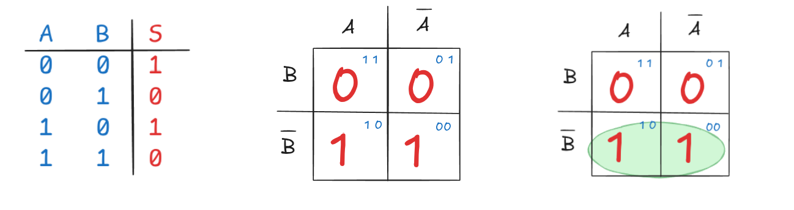

# 

# [Mapa de Karnaugh](../../slides/SDIG02-ExpressoesLogicas)

O Mapa de Karnaugh (ou Mapa K) simplifica expressões de **mintermos** — representadas na forma de **Soma de Produtos (SOP)** — através de um método gráfico que identifica padrões de adjacência lógica para eliminar variáveis redundantes. Enquanto a simplificação por álgebra booleana exige manipulações matemáticas complexas, o Mapa K permite visualizar essas reduções diretamente da tabela-verdade.

## 1. Organização por Adjacência Lógica (Código Gray)
O mapa é construído de forma que as células adjacentes (horizontal ou verticalmente) difiram por apenas um bit em suas variáveis de entrada. Essa organização segue o **Código Gray**, garantindo que, ao mover-se de uma célula para a vizinha, apenas o estado de uma variável mude (de 0 para 1 ou vice-versa).

## 2. Agrupamento de Mintermos (Looping)
O processo de simplificação baseia-se em identificar regiões onde a saída assume o valor lógico 1 e agrupá-los em laços (*loops*). As regras fundamentais para esses agrupamentos são:

*   **Tamanho dos Grupos:** Os grupos devem conter obrigatoriamente potências de 2 (1, 2, 4, 8 ou 16 elementos).
*   **Maximização:** Os laços devem ser o maior possível para garantir a máxima simplificação; quanto maior o laço, mais variáveis são eliminadas.
*   **Flexibilidade:** Os laços podem se sobrepor e também podem "dar a volta" pelas bordas do mapa (adjacência circular).

## 3. Eliminação de Variáveis
A simplificação ocorre quando uma variável aparece dentro de um mesmo laço tanto em sua forma **complementada** (0) quanto **não complementada** (1). Como essas formas se anulam logicamente ($A + \bar{A} = 1$), a variável "desaparece" da expressão resultante.

O impacto da simplificação depende do número de elementos no grupo:

*   **Par (2 células):** Elimina 1 variável da expressão do mintermo.
*   **Quadra (4 células):** Elimina 2 variáveis.
*   **Oitava (8 células):** Elimina 3 variáveis.

## 4. Construção da Expressão Simplificada
Após realizar todos os agrupamentos necessários para cobrir todos os 1s do mapa, a função final simplificada é obtida através da disjunção (operação OR) dos termos resultantes de cada laço. Se houver condições de **"não importa" (*don't care*)**, representadas por "X", elas podem ser tratadas como 1 para aumentar o tamanho dos laços e simplificar ainda mais a expressão, ou como 0 se não ajudarem no agrupamento.

## 5. Casos Irrelevantes 

As condições "don't care" (frequentemente denominadas como condições de "não importa" ou "casos irrelevantes") referem-se a combinações de variáveis de entrada que nunca ocorrerão em um projeto específico ou cujos resultados de saída não interferem no funcionamento do sistema,. Nos Mapas de Karnaugh (Mapa K) e nas tabelas-verdade, esses estados são representados graficamente pelo símbolo "X" ou por um hífen "-".

A utilização dessas condições no Mapa de Karnaugh segue critérios técnicos de otimização de hardware:

*   **Flexibilidade no Agrupamento:** Durante o processo de simplificação gráfica, o projetista pode tratar cada "X" individualmente como nível lógico 1 ou 0, dependendo do que for mais vantajoso para a redução do circuito.
*   **Maximização dos Laços (Looping):** Para obter a expressão booleana mais simples, deve-se considerar o "X" como valor 1 sempre que ele permitir a formação de grupos maiores — como quadras (4 células) ou oitavas (8 células) — já que grupos maiores eliminam um número maior de variáveis redundantes.
*   **Tratamento como Nível Zero:** Se uma condição "don't care" não auxiliar na expansão de um laço ou na cobertura de uma saída 1 que precise ser agrupada, ela deve ser tratada como 0 e, consequentemente, ignorada nas associações.
*   **Simplificação de Expressões:** O uso estratégico de "X" permite que funções complexas sejam reduzidas a formas canônicas muito mais simples, minimizando o número de portas lógicas e os atrasos de propagação no circuito final.

Essa técnica é amplamente aplicada em componentes onde certas combinações binárias são descartadas, como em decodificadores de BCD para sete segmentos ou em codificadores de prioridade, permitindo que a lógica resultante seja mais econômica em termos de área de silício e consumo de recursos.

---

# Referências e complementos

- **TOCCI, Ronald J.; WIDMER, Neal S.** _Sistemas Digitais: Princípios e Aplicações_. 8. ed. Pearson, 2015.
- **PALANIAPPAN, Ramaswamy.** _Digital Systems Design_. bookboon.com, 2011.
- **TRINDADE JUNIOR, Rosumiro; JULIÃO, Jodelson Moreira.** _Circuitos Digitais_. Manaus: Centro de Educação Tecnológica do Amazonas (CETAM), 2012.
- **D’AMORE, Roberto.** _VHDL: Descrição e Síntese de Circuitos Digitais_. LTC.

---

---
