# 

# Somadores e subtratores

Os circuitos somadores e subtratores são blocos fundamentais da eletrônica digital, pertencentes à categoria dos circuitos aritméticos. Eles são os componentes centrais da Unidade Lógica e Aritmética (ULA) de um computador, onde executam os cálculos matemáticos binários necessários para o processamento de dados.

## Circuitos Somadores
Os somadores realizam a adição de números binários e são divididos em dois tipos principais conforme a complexidade da operação:

*   **Meio Somador (*Half Adder*):** É o circuito mais simples, projetado para somar apenas um bit de cada entrada ($A$ e $B$). Ele possui duas saídas: **SOMA**, que corresponde a uma porta lógica XOR ($A \oplus B$), e **VAI-UM** (*Carry*), resultante de uma porta AND ($A \cdot B$) que sinaliza o transporte para a próxima casa decimal.
*   **Somador Completo (*Full Adder*):** Diferente do meio somador, este circuito possui uma terceira entrada para o transporte vindo de uma operação anterior (*Carry-in* ou "vem-um"). Isso permite que múltiplos somadores completos sejam interconectados em paralelo para realizar a soma de números com $n$ bits.

## Circuitos Subtratores
Os subtratores operam sob o conceito de "empresta-1" (*Borrow*), similar à subtração decimal.

*   **Meio Subtrator (*Half Subtractor*):** Realiza a subtração de um bit de informação. Suas saídas são a **DIFERENÇA** (uma porta XOR) e o **EMPRESTA-1**, que assume nível lógico 1 apenas quando a entrada $A$ é 0 e a entrada $B$ é 1.
*   **Subtrator Completo:** Assim como o somador completo, ele considera o bit emprestado de uma etapa anterior para permitir a subtração de múltiplos bits.

## Implementação e Integração
Na prática da arquitetura de computadores, é comum otimizar o hardware utilizando circuitos somadores para realizar também a subtração através da lógica de **complemento de dois**. Nesse processo, inverte-se o subtraendo e soma-se 1 (ajustando o bit de transporte de entrada para 1), o que permite que um somador paralelo execute a função de um subtrator. 

Existem ainda circuitos **Somadores/Subtratores Duais**, que utilizam portas XOR como inversores controlados: quando o sinal de controle é 1, o circuito atua como subtrator (complementando a entrada); quando é 0, atua como um simples somador. Esses circuitos integrados, como a série 74LS283, são amplamente utilizados para manipulação de dados em sistemas digitais.

---

# Laboratório 1: Meio somador

1) Criando um novo projeto no Quartus:

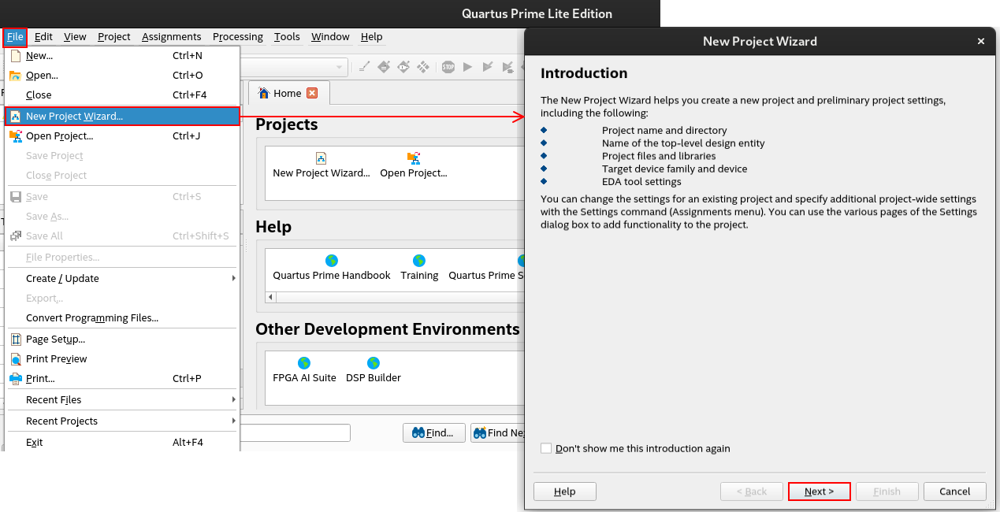

2) Criando e selecionando diretório e nome do projeto:

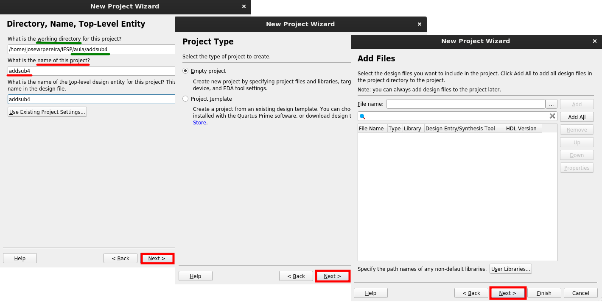

3) Selecionar placa de desenvolvimento e finalizar criação do projeto:

Selecione:

- aba `Board`
- Family: `Cyclone V`
- Development Kit: `DE1-SoC board`
- Selecione a única opção e em seguida `Next`

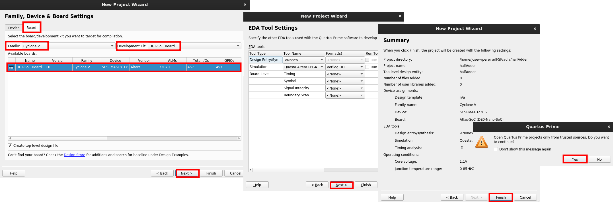

4) Projeto criado:

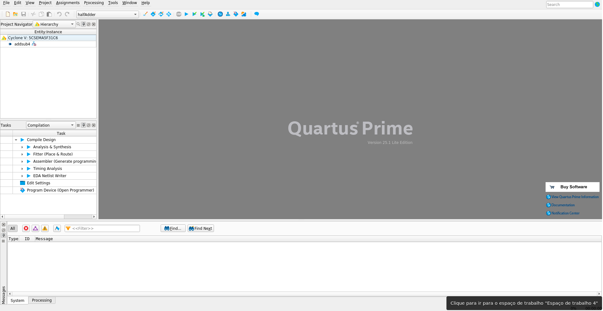

---

5) Criando um novo Diagrama de Blocos / Esquemático

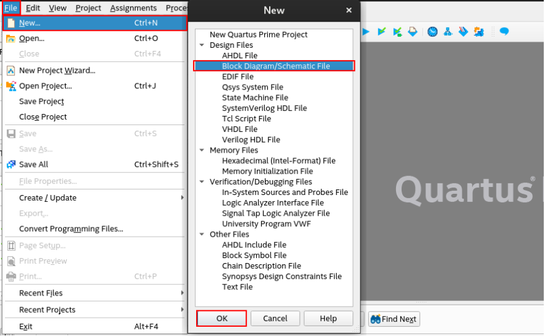

6) Área de criação de esquemático

Use as ferramentas indicadas para construir o circuito, incluindo as portas e os terminais. 

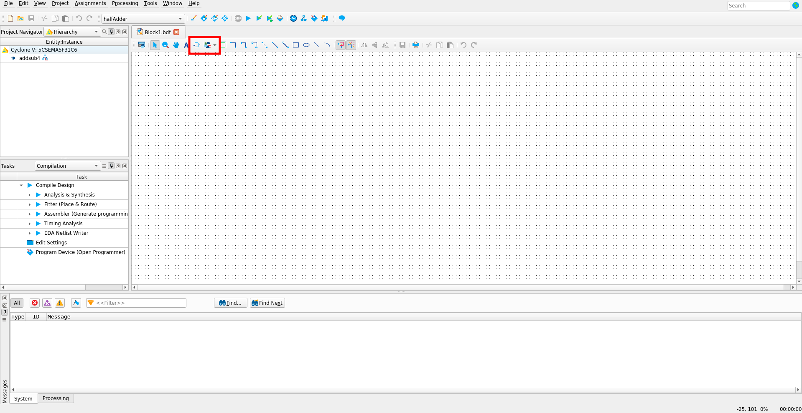

---

7) Criando circuito de teste para a Simulação

Note que portas como `and` e `or`, devem ser descritas com o número de terminais de entradas: `and2`, `and3`, `or2`, `or3`, etc.

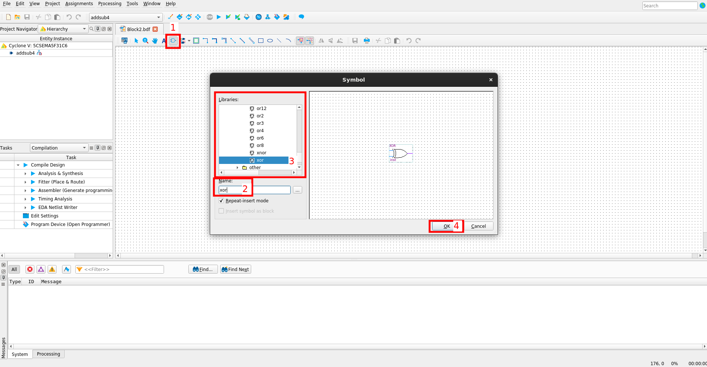

Para conectar os terminais, clique com o botão esquerdo no ponto de origem e arraste até o terminal ou nó de destino, soltando o clique do mouse. 

8) Após a criação de um circuito simples de teste, salvar o arquivo com o **mesmo nome do projeto**

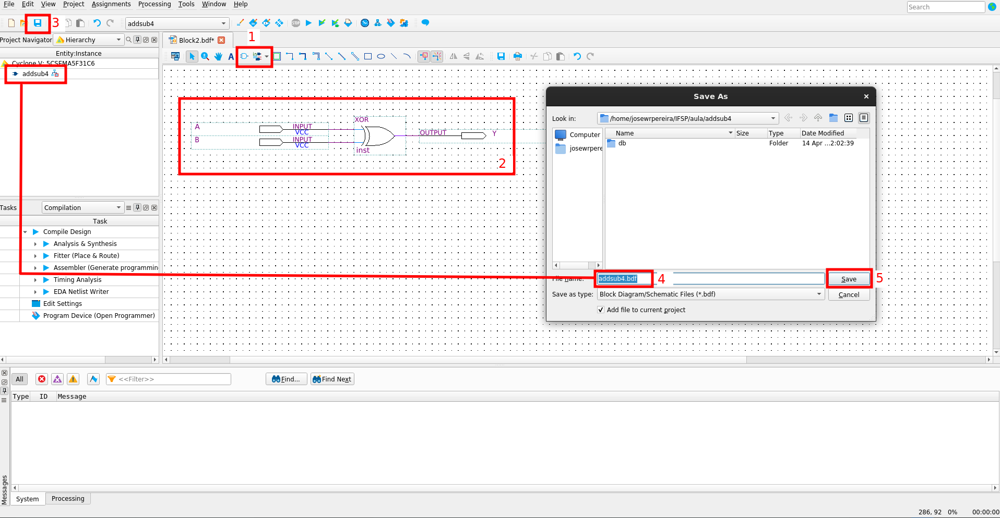

9) Compilar a montagem do esquemático clicando em `Analysis & Synthesis` e aguardar o fim da compilação.

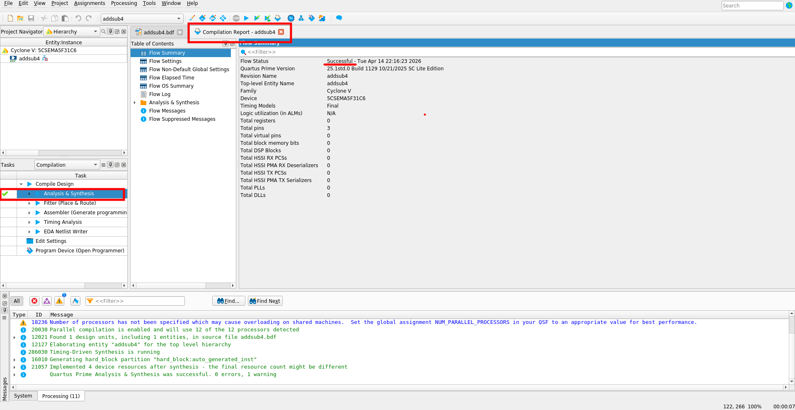

Havendo algum erro, **leia** a mensagem de erro gerada, pois é um bom indicativo para a sua correção.

10) Criando arquivo de simulação VWF (*Vector Waveform File*)

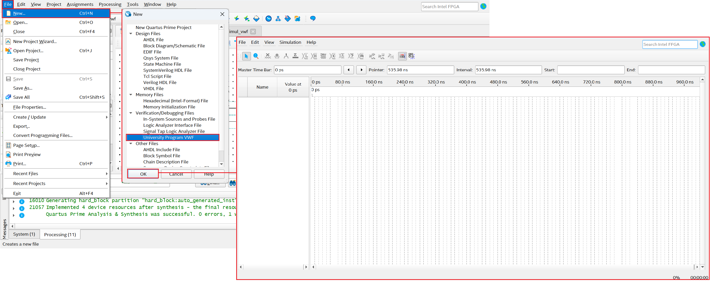

11) Definindo um valor de tempo final para a simulação

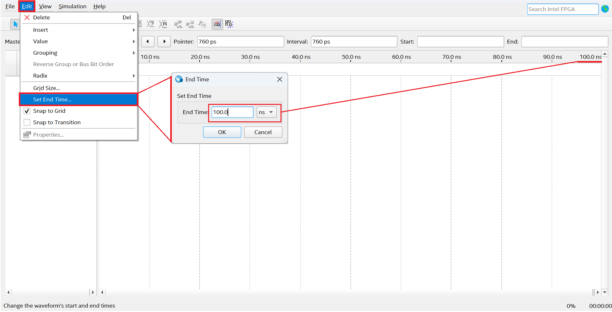

12) Incluindo os pontos de acesso ao circuito, entradas e saídas. 

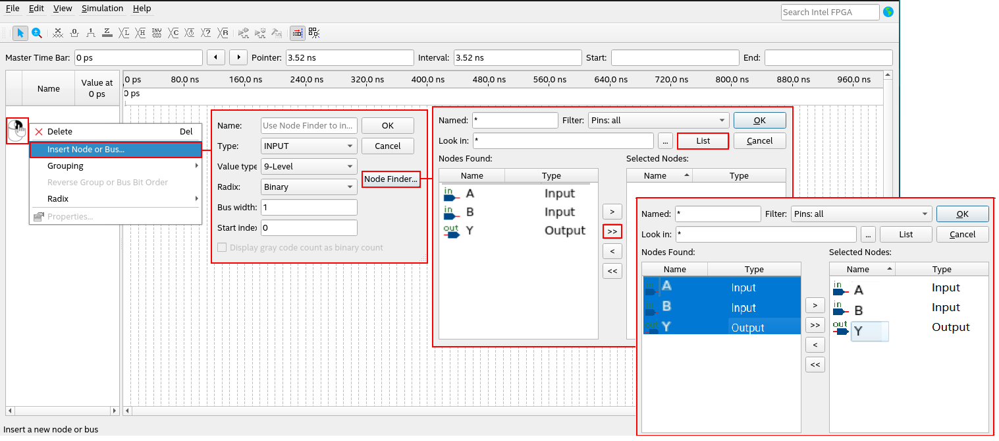

13) Configurar estímulos nos terminais de entrada. 

Para produzir um conjunto de combinações igual aos da tabela verdade, a primeira entrada é configurada como o bit menos significativo, e possui a menor base de tempo. A partir dela, as demais são ajustadas para o dobro do período em relação à entrada adjacente/anteior. 

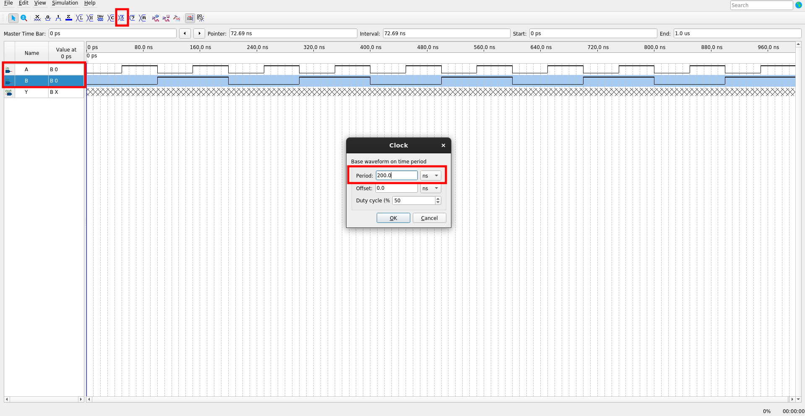

14) Ajustando diretiva de simulação

- Em `Simulation` selecione `Simulation Settings`
- Edite o ModelSim Script (Functional Simulation): trocando a diretiva `-novopt` por `-voptargs="+acc"`

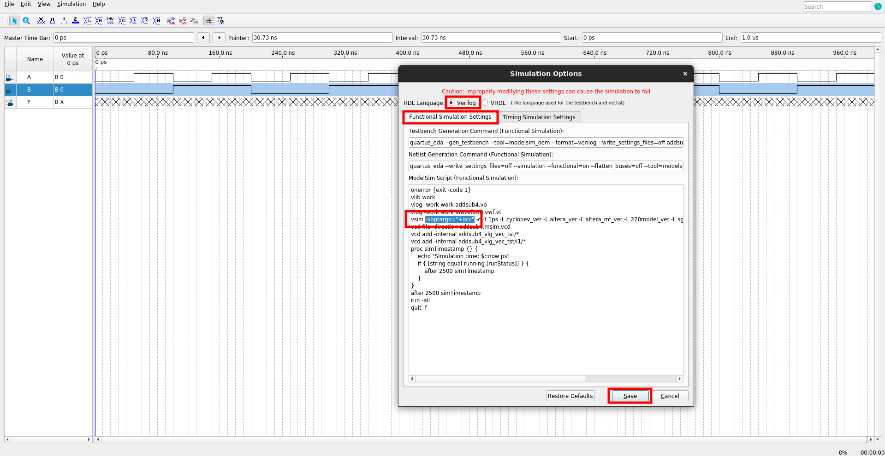

15) Salvando a simulação de forma de onda

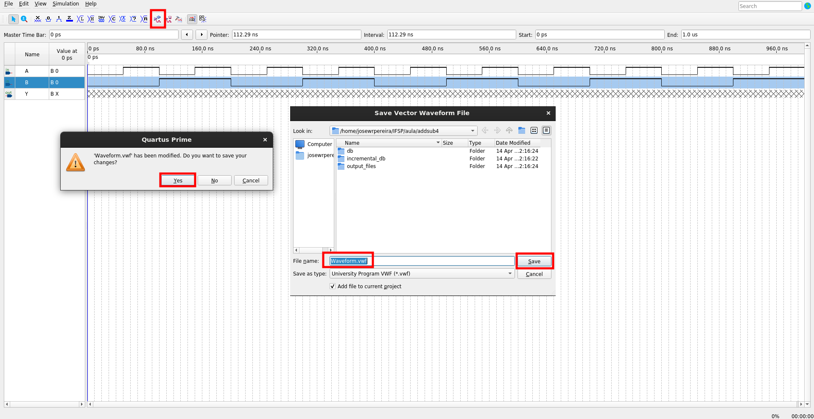

16) Resultado da simulação

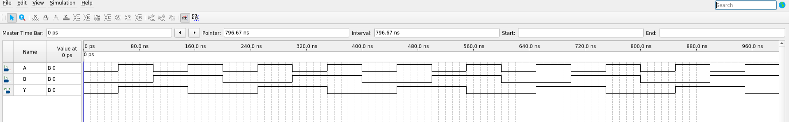

---

17) Crie um componente `halfadder.bdf`

- Crie um novo diagrama de blocos
- Construa o circuito do meio somador (*half adder*)
- Salve com o nome `halfadder.bdf`
- Compile em `Analysis & Synthesis`

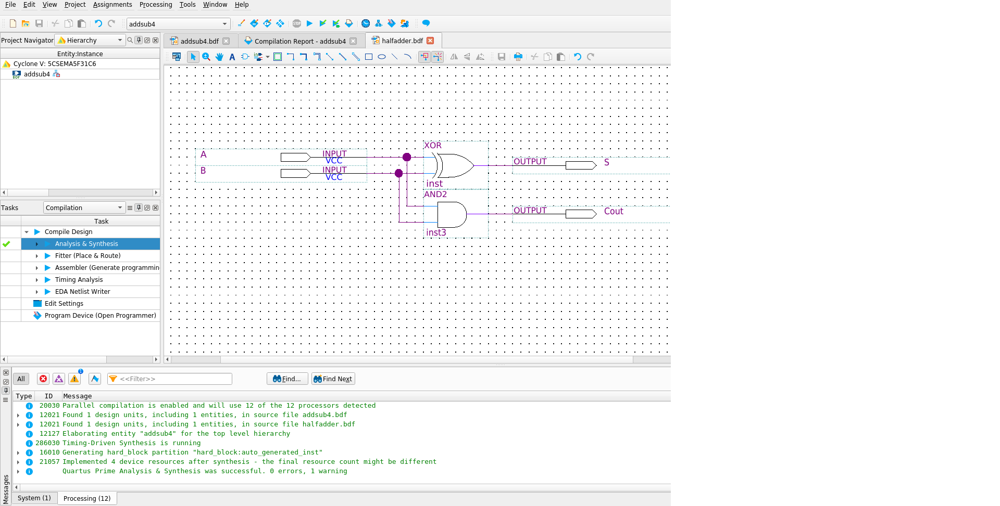

- Exporte o circuito como um componente clicando em: `File`, `Create / Update` e `Create Symbol Files for Current File`

18) Insira o novo componente `halfadder` no esquemático principal do projeto `addsub4.bdf`

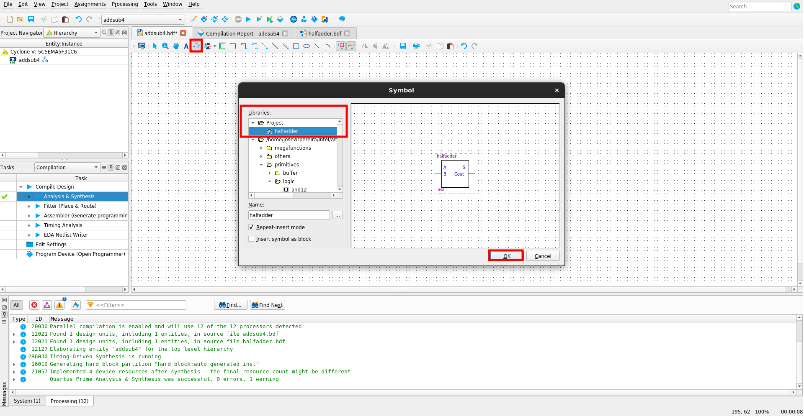

19) Circuito e forma de onda do `halfadder`

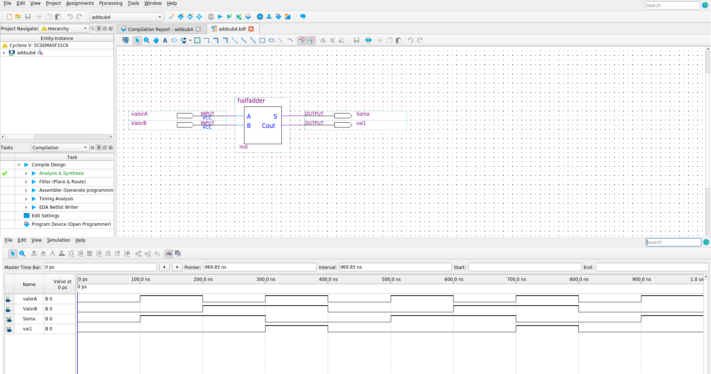

---

---

# Referências e complementos

- **TOCCI, Ronald J.; WIDMER, Neal S.** _Sistemas Digitais: Princípios e Aplicações_. 8. ed. Pearson, 2015.
- **PALANIAPPAN, Ramaswamy.** _Digital Systems Design_. bookboon.com, 2011.
- **TRINDADE JUNIOR, Rosumiro; JULIÃO, Jodelson Moreira.** _Circuitos Digitais_. Manaus: Centro de Educação Tecnológica do Amazonas (CETAM), 2012.
- **D’AMORE, Roberto.** _VHDL: Descrição e Síntese de Circuitos Digitais_. LTC.

---

---
