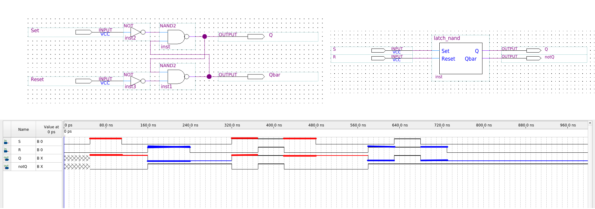
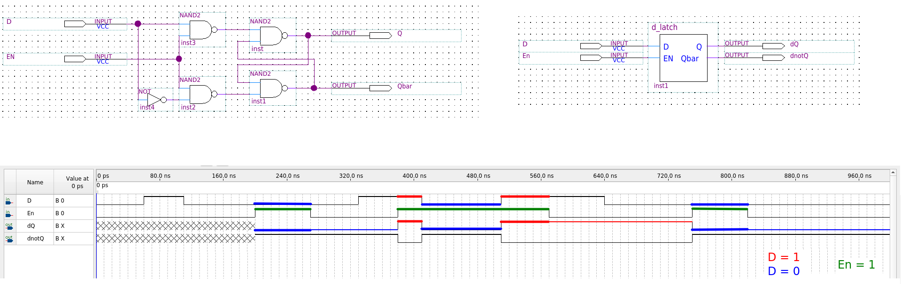
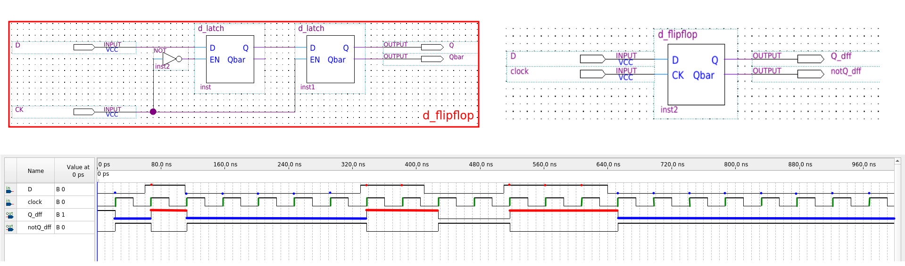
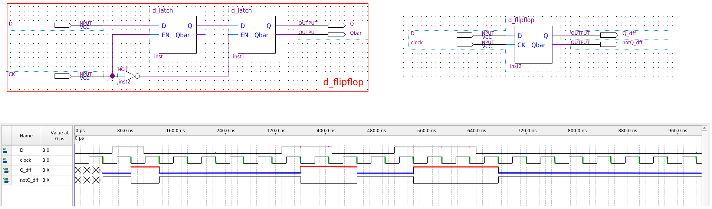

# 

# Flip-Flops  - Multivibrador Biestável

Flip-flops são os blocos elementares da lógica sequencial, atuando como células de memória fundamentais capazes de armazenar um bit de informação. Tecnicamente, eles são definidos como multivibradores bistáveis, o que significa que possuem dois estados de saída estáveis (0 ou 1) e permanecem em um desses estados mesmo após o término do pulso de entrada que provocou a mudança. Diferente dos circuitos combinacionais puros, o valor da saída de um flip-flop depende não apenas das combinações atuais de suas entradas, mas também do seu estado anterior armazenado.

O funcionamento desses dispositivos baseia-se na sincronização por meio de um sinal de controle chamado **clock**, que determina os instantes exatos em que as saídas podem mudar de nível lógico. A principal característica que distingue um flip-flop de um latch é o seu método de disparo: enquanto latches são sensíveis ao nível do sinal, os flip-flops são disparados por borda, respondendo apenas durante a transição positiva (borda de subida / *rising edge* / PGT - *Positive Going Transition*) ou negativa (borda de descida / *falling edge* / NGT - *Negative Going Transition* ) do clock. Para garantir uma operação confiável em sistemas síncronos, o projetista deve respeitar parâmetros rigorosos de temporização, como o tempo de setup ($t_s$), que exige estabilidade do dado antes da borda do clock, e o tempo de hold ($t_h$), que exige estabilidade após a borda.

Os principais tipos de flip-flops utilizados em sistemas digitais são:

*   **SR (Set-Reset):** Possui duas entradas síncronas que permitem estabelecer (set) a saída em 1 ou restaurá-la (reset) para 0; no entanto, apresenta um estado proibido ou ambíguo quando ambas as entradas são ativadas simultaneamente.
*   **JK:** Considerado um flip-flop universal, ele elimina o estado proibido do tipo SR ao permitir a função de comutação (*toggle*), onde a saída inverte seu estado anterior sempre que as entradas J e K são mantidas em nível lógico 1. O nome JK é uma homenagem ao inventor do circuito integrado, Jack Kilby.
*   **D (Data ou Delay):** Possui uma única entrada de controle síncrona e funciona como um armazenador de dados, onde a saída Q simplesmente assume o valor presente na entrada D no instante da transição ativa do clock.
*   **T (Toggle):** É um dispositivo que comuta seu estado de saída a cada pulso de clock se a entrada T estiver em nível alto, sendo frequentemente implementado a partir de um flip-flop JK com as entradas J e K interconectadas.

Além das entradas síncronas, a maioria dos flip-flops integra entradas assíncronas denominadas PRESET e CLEAR (ou RESET), que têm prioridade sobre o clock e as demais entradas para forçar a saída imediatamente para os estados 1 ou 0, respectivamente.

As aplicações dos flip-flops são vastas e essenciais na arquitetura de computadores:

1.  **Registradores:** Agrupamentos de flip-flops são usados para manipular e armazenar palavras binárias, permitindo a transferência de dados em formatos série ou paralelo.
2.  **Contadores:** Circuitos sequenciais que contam eventos ou pulsos de clock, podendo ser síncronos ou assíncronos (contadores de pulsação).
3.  **Divisores de Frequência:** Através da comutação sucessiva, flip-flops podem reduzir a frequência de um sinal de clock original para valores menores e estáveis.
4.  **Máquinas de Estados Finitos (FSM):** Flip-flops armazenam o "estado atual" de sistemas complexos, como controladores de tráfego ou processadores, regendo a transição para estados futuros baseada na lógica de Moore ou Mealy.
5.  **Memórias:** Constituem a unidade básica de armazenamento em memórias semicondutoras voláteis.

---

## Unidade de memória

Para compreender a evolução dos dispositivos de memória na eletrônica digital, é necessário partir do bloco mais simples de retenção de dados — o **latch** — e seguir o refinamento de sua lógica até o **flip-flop D**, amplamente utilizado em sistemas síncronos e FPGAs.

### 1. Latch

O ponto de partida é o **latch RS**, um dispositivo definido tecnicamente como um multivibrador biestável, o que significa que possui dois estados de saída estáveis (0 ou 1). Ele pode ser construído de duas formas principais:

*   **Latch com portas NAND:** É a versão mais comum, onde as entradas são ativas em nível baixo ($\bar{S}$ e $\bar{R}$).
*   **Latch com portas NOR:** Utiliza entradas ativas em nível alto ($S$ e $R$).

**Estados de Operação:**

1.  **SET (Ajustar):** Leva a saída $Q$ para 1.
2.  **RESET (Limpar):** Leva a saída $Q$ para 0.
3.  **HOLD (Retenção):** As entradas retornam ao estado de repouso e o latch "lembra" o último valor armazenado.
4.  **Proibido/Inválido:** Ocorre quando ambas as entradas são ativadas simultaneamente, forçando as saídas complementares ($Q$ e $\bar{Q}$) ao mesmo nível, o que viola a lógica do dispositivo.

### 2. O Latch D (Transparente)

O latch RS apresenta dois problemas: a existência de um estado proibido e a sensibilidade constante às entradas. Para resolver isso, criou-se o **latch D** (de *Data*), que utiliza um inversor para garantir que as entradas $S$ e $R$ nunca sejam ativadas ao mesmo tempo.

Este dispositivo introduz uma entrada de habilitação (**Enable - EN** ou $G$):

*   **Modo Transparente:** Quando $EN=1$, a saída $Q$ segue exatamente a entrada $D$.
*   **Modo de Retenção:** Quando $EN=0$, a saída é "congelada" e ignora qualquer mudança em $D$ até que $EN$ volte a ser 1.

### 3. A Transição para o Flip-Flop (Sensibilidade à Borda)
A principal limitação dos latches em sistemas complexos é que eles são **sensíveis ao nível**. Se o sinal de habilitação permanecer alto por muito tempo, qualquer ruído ou alteração indesejada na entrada será refletida na saída. 

Para garantir a sincronização precisa, evoluímos para os **flip-flops**, que são **disparados por borda** (*edge-triggered*). Eles só respondem à entrada durante a transição rápida do sinal de **clock (CLK)**, seja na borda de subida (*rising edge*) ou de descida (*falling edge*).

### 4. O Flip-Flop D

O **flip-flop D** consolidou-se como a célula de memória fundamental por sua simplicidade e eficácia. Sua operação é regida pela equação característica $Q_{próximo} = D$.

**Características Técnicas:**

*   **Armazenamento Síncrono:** O valor presente em $D$ no instante exato da borda do clock é transferido para $Q$ e ali permanece até a próxima borda ativa.
*   **Temporização Crítica:** Para funcionar corretamente, o dado em $D$ deve estar estável antes da borda (tempo de *setup* - $t_s$) e permanecer estável por um curto período após a borda (tempo de *hold* - $t_h$).
*   **Entradas Assíncronas:** Muitos flip-flops D comerciais incluem pinos de **PRESET** e **CLEAR** (ou RESET), que forçam a saída para 1 ou 0 imediatamente, independentemente do clock, sendo úteis para inicialização de sistemas.
*   **Implementação:** Pode ser construído a partir de um flip-flop JK interconectando as entradas $J$ e $K$ com um inversor ($J=D$ e $K=\bar{D}$).

Em suma, enquanto o latch básico provê a capacidade de retenção, o flip-flop D adiciona o **sincronismo temporal**, permitindo que computadores processem milhões de instruções por segundo com a garantia de que os dados só mudem nos momentos exatos permitidos pelo relógio do sistema.

---

# Referências e complementos

- **TOCCI, Ronald J.; WIDMER, Neal S.** _Sistemas Digitais: Princípios e Aplicações_. 8. ed. Pearson, 2015.
- **PALANIAPPAN, Ramaswamy.** _Digital Systems Design_. bookboon.com, 2011.
- **TRINDADE JUNIOR, Rosumiro; JULIÃO, Jodelson Moreira.** _Circuitos Digitais_. Manaus: Centro de Educação Tecnológica do Amazonas (CETAM), 2012.
- **D’AMORE, Roberto.** _VHDL: Descrição e Síntese de Circuitos Digitais_. LTC.

---

---
