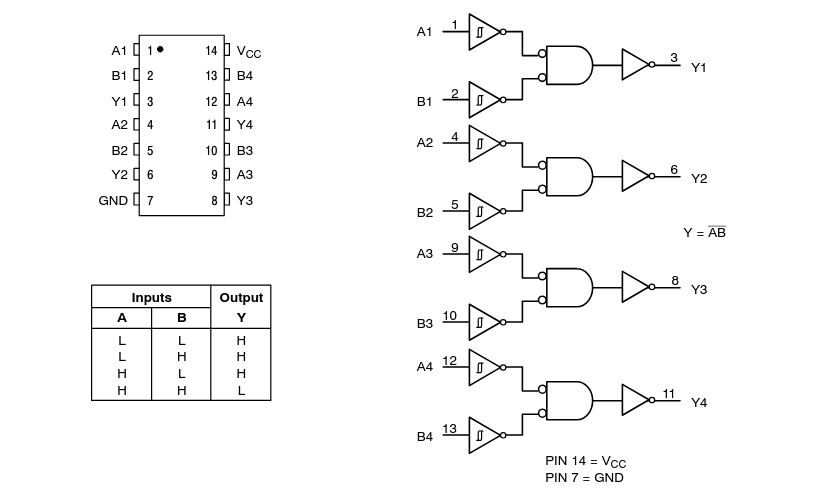
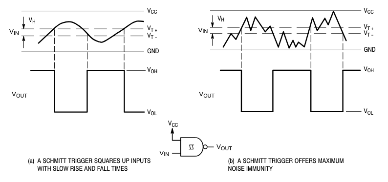
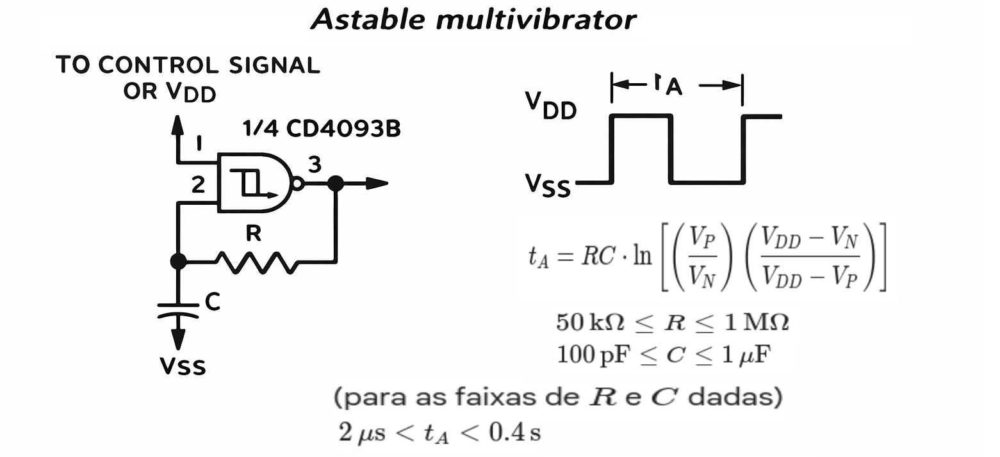

# 

# CI 74132 - Quad 2−Input NAND Gate with Schmitt−Trigger Inputs

## 74132

## Funcionamento

## Aplicação típica 

---

# Referências e complementos

- TEXAS INSTRUMENTS. **CD4093B CMOS Quad 2-Input NAND Schmitt Trigger**. Disponível em: https://www.ti.com/lit/ds/sdls047/sdls047.pdf
. Acesso em: 24 mar. 2026.

- NEXPERIA. 74HC132; **74HCT132 Quad 2-input NAND Schmitt trigger**. Disponível em: https://www.mouser.com/datasheet/2/308/74HC132-D-310410.pdf
. Acesso em: 24 mar. 2026.

- FRANK'S HOSPITAL WORKSHOP. **74132 Quad 2-input NAND Schmitt trigger datasheet**. Disponível em: http://www.frankshospitalworkshop.com/electronics/data_sheets/7400/74132.pdf
. Acesso em: 24 mar. 2026.

---

---
