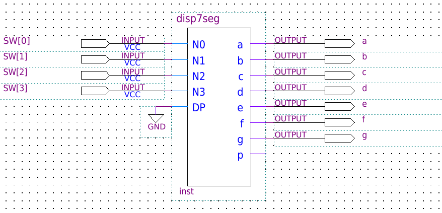
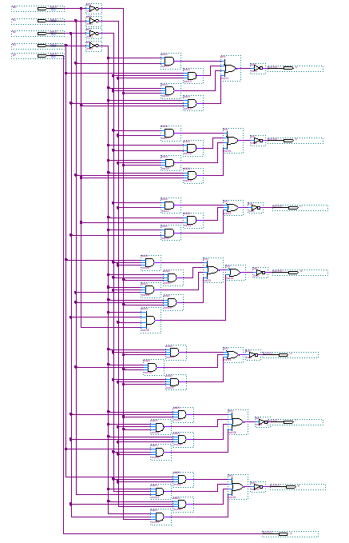
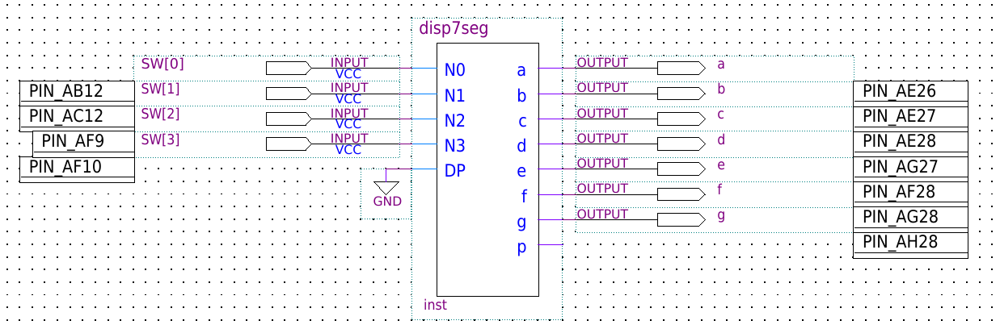
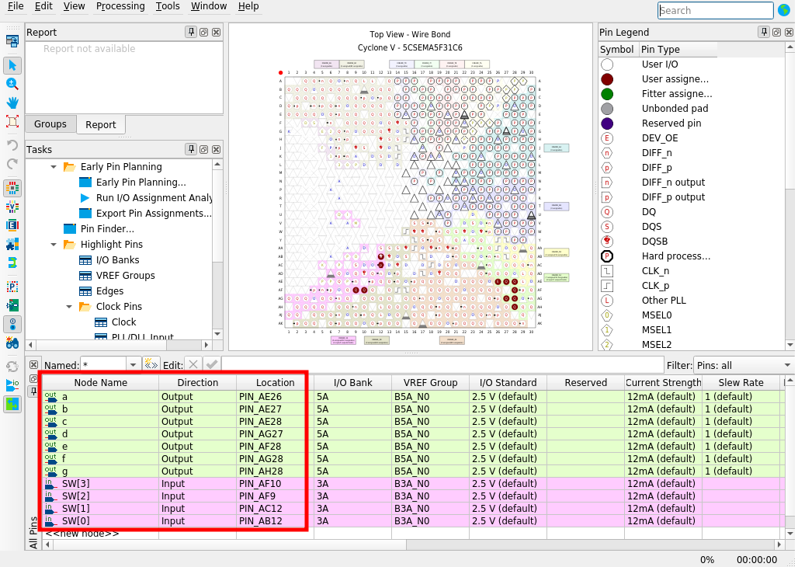
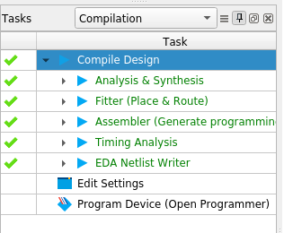
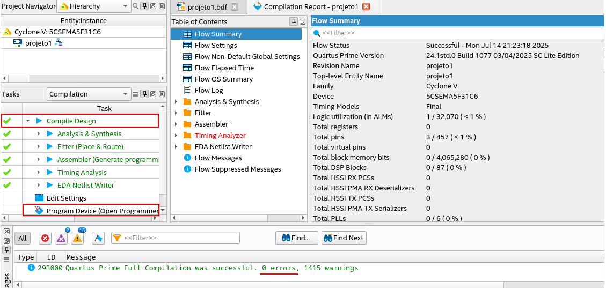
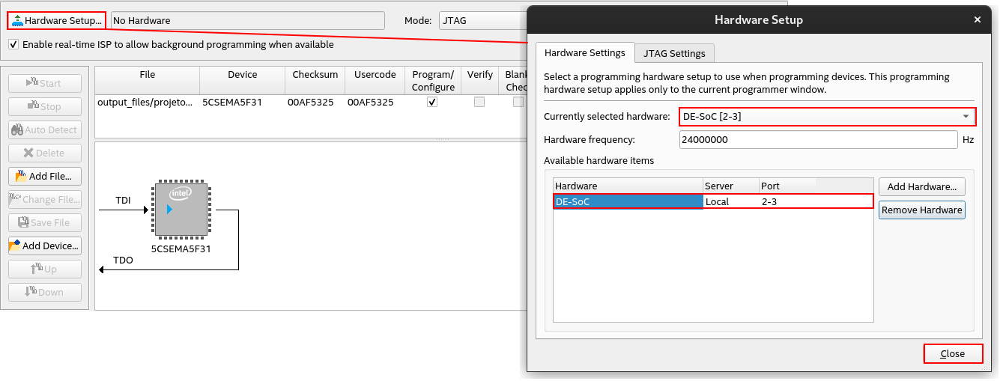
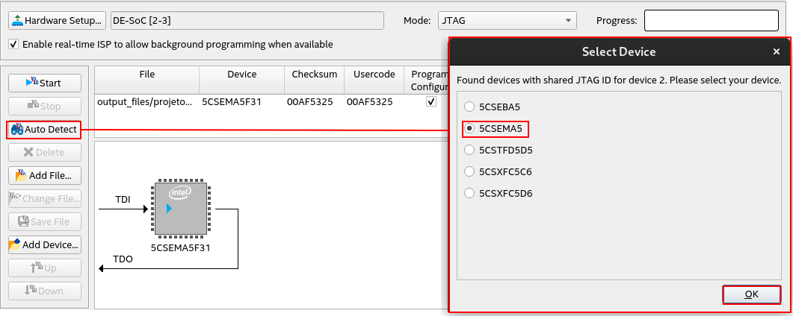
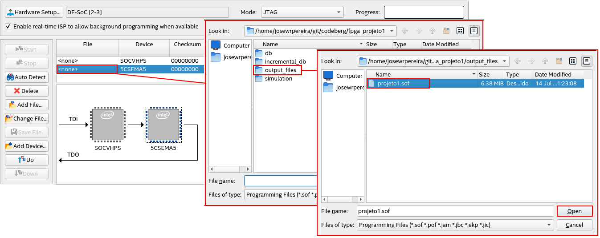
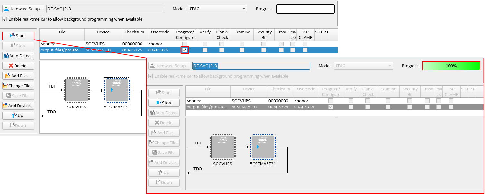

# 

# Laboratório 6: Decodificador BCD para Display 7 segmentos

1) Elabore um componente que faça a decodificação de um dígito BCD para um display de 7 segmentos conforme ilustração:

2) O circuito interno do conversor deve ser algo como ilustrado abaixo:

O circuito deve ser criado com o nome [disp7seg.bdf](../../fonte/disp7seg.bdf), que é o formato da elaboração do esquemático. Após a finalização do esquemático, incluindo seus testes, o arquivo [disp7seg.bsf](../../fonte/disp7seg.bsf) deve ser produzido. Este pode ser usado como um componente em outros projetos, sendo importado e reutilizado. 

3) Testando no kit de desenvolvimento

Para a realização do teste do conversor no kit de desenvolvimento, é necessário associar cada entrada e saída do bloco conversor ao seu respectivo pino físico na placa. 

A ilustração a seguir mostra a pinagem para cada uma das interfaces de entrada e saída do conversor BCD para dsiplay de 7 segmentos.

Todos os endereços dos pinos na placa DE1-SoC podem ser encontrados no [Manual do usuário DE1-SoC - rev.F/G](https://www.terasic.com.tw/cgi-bin/page/archive_download.pl?Language=English&No=836&FID=3a3708b0790bb9c721f94909c5ac96d6). A pinagem utilizada está descrita nos capítulos 3.6.1 e 3.6.2. 

4) Associando I/Os e pinos

Acesso o menu `Assignments` e em seguida `Pin Planner` e preencha a tabela na parte inferior conforme ilustração.

Obs.: O esquemático deve estar devidamente compilado (`Analysis & Synthesis`) para que a tabela com as entradas e saídas estejam disponíveis no `Pin Planner`.

5) Compile Design

Faça a compilação completa do projeto clicando em `Compile Design`.

Ao final, não devem haver erros no circuito.

6) Conectado Placa e Kit

Em seguida, com a placa conectada ao computador via USB, clique em *Program Device*.

7) Selecione *Hardware Setup*.

8) Selecionando o dispositivo alvo

Em seguida, clique em *Auto Detect*.

Selecione o dispositivo: `5CSEMA5`.

9) Carregando o arquivo de gravação

Clique em `<none>` do campo *File*, para abrir a janela de carregamento do arquivo compilado.

Abra o diretório `output_files` e selecione o seu projeto com extensão `.sof`. Clique em *Open*.

10) Gravando circuito

Na mesma linha ainda, marque a caixa de seleção do campo *Program/Configure* e clique em *Start*.

11) Teste

Realize o teste utilizando as chaves e verificando os valores correspondentes no display de 7 segmento do kit. 

Obs.: Ao desligar o kit, o arquivo carregado é perdido, necessitando regravá-lo novamente para sua execução.

---

# Referências e complementos

1. [Manual do usuário DE1-SoC - rev.F/G](https://www.terasic.com.tw/cgi-bin/page/archive_download.pl?Language=English&No=836&FID=3a3708b0790bb9c721f94909c5ac96d6)

---

---
