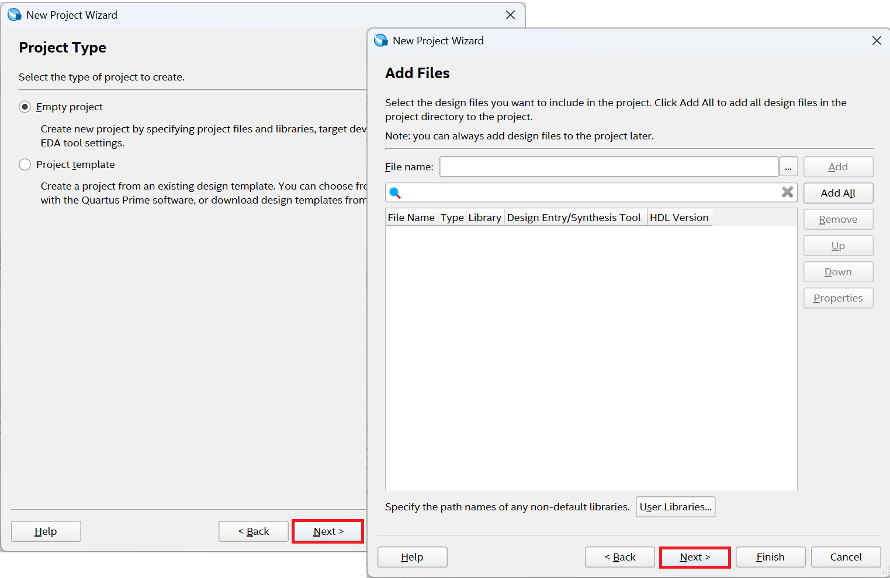
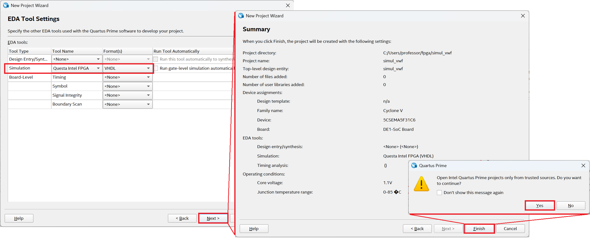
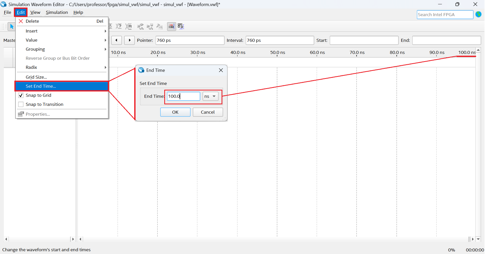

*Vector Waveform File*

---

| Figura 1: Criando um novo projeto com assistente |
|:------------------------------------------------:|
|                |
| Fonte: Autor                                     |

| Figura 2: Tipo de projeto e adição de arquivos   |
|:------------------------------------------------:|
|                |
| Fonte: Autor                                     |

| Figura 3: Família, Dispositivo e Configuração de placa  |
|:-------------------------------------------------------:|
|                       |
| Fonte: Autor                                            |

| Figura 4: Configuração da ferramenta EDA e Sumário  |
|:---------------------------------------------------:|
|                   |
| Fonte: Autor                                     |

| Figura 5: Novo projeto criado      |
|:----------------------------------:|
|  |
| Fonte: Autor                       |

| Figura 6: Criação do arquivo de esquemático |
|:-------------------------------------------:|
|  |
| Fonte: Autor                       |

| Figura 7: Ambiente de simulação vwf (*Vector Waveform File*)|
|:-------------------------------------------:|
|  |
| Fonte: Autor                       |

| Figura 8: Ajustando tempo final da simulação |
|:--------------------------------------------:|
|  |
| Fonte: Autor                       |

| Figura 9: Inserindo elementos de simulação |
|:------------------------------------------:|
|  |
| Fonte: Autor                       |

| Figura 10: Inserindo sinal de simulação em uma entrada |
|:------------------------------------------------------:|
|  |
| Fonte: Autor                       |

| Figura 10: Inserindo sinal de simulação em uma entrada |
|:------------------------------------------------------:|
|  |
| Fonte: Autor                       |

| Figura 11: Ajustando parâmetros de compilação |
|:---------------------------------------------:|
|  |
| Fonte: Autor                       |

| Figura 12: Salvando arquivo de simulação |
|:----------------------------------------:|
|  |
| Fonte: Autor                       |

| Figura 13: Resultado da simulação  |
|:----------------------------------:|
|  |
| Fonte: Autor                       |

---

**Erros**

| Figura 14: Erro 1 - Parâmetro *-novopt* deve ser retirado |
|:-------------------------------------:|
|  |
| Fonte: Autor                          |

---

| Figura 14: Erro 2 - Saída indefinida  |
|:-------------------------------------:|
|  |
| Fonte: Autor                          |

Correção:

No **Quartus Prime**, (Não no *Simulation Waveform Edition*), acesse:

1. *Tools* -> *Options...*
2. Em *Category*, clique em *EDA Tools Options*
3. No campo *ModelSim* insira o diretório correspondente a: `C:/intelFPGA/20.1/modelsim_ase/win32aloem` da instalação do ModelSim.
4. Se não houver o ModelSim instalado, faça o [Download](https://www.intel.com/content/www/us/en/software-kit/750666/modelsim-intel-fpgas-standard-edition-software-version-20-1-1.html) e instale-o.
5. Execute o passo 3 e em seguida execute a simulação novamente.

---
