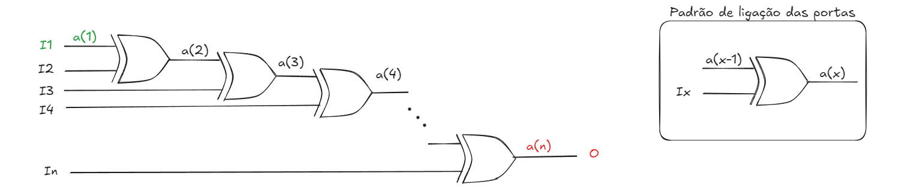

---

A estrutura da descrição de hardware em VHDL consistem basicamente de três declarações: 

- Bibliotecas e pacotes
- Entidade
- Arquitetura


As bibliotecas e pacotes são padrões definidos em norma para auxiliar na descrição de circuitos.

A entidade é a declaração de interface, onde são declaradas as entradas, saídas, buffers e constantes utilizadas pelo circuito descrito.

A arquitetura é a descrição comportamental do circuito, em que são utilizadas expressões lógicas, redes de ligação em comandos concorrentes ou ainda blocos de organização e processos sequenciais.


Segue a estrutura básica de uma descrição em VHDL.

```vhdl title="nome_da_entidade.vhdl"
-- --------------------------------------------------------
--     Cabeçalho de código em comentários de linha
-- Sistemas Digitais Programáveis - 2025-2
-- Código: Estrutura básica do código em VHDL
-- Autor: José W. R. Pereira
-- Data: 2025-09-08
-- --------------------------------------------------------

-- Bibliotecas e Pacotes

-- Entidade: interface de entradas e saídas
entity nome_da_entidade is
    port(
          -- variavel: direcao_de_dados tipo_de_dado;
          -- variavel: direcao_de_dados tipo_de_dado
        );
end entity nome_da_entidade;


-- Arquitetura: descrição de comportamento
architecture main of nome_da_entidade is
-- declaração de objetos
begin
    -- descrição do comportamento
end architecture main;
```

É uma boa prática a inserção de um cabeçalho contendo informações gerais sobre o código. 

Segue o código de uma porta lógica E.


```vhdl title="porta E"
-- --------------------------------------------------------
-- Sistemas Digitais Programáveis - 2025-2
-- Código: Porta lógica E (AND)
-- Autor: José W. R. Pereira
-- Data: 2025-09-08
-- --------------------------------------------------------

-- Bibliotecas e Pacotes

-- Entidade: interface de entradas e saídas
entity portaE is port( a, b: in bit; y: out bit );
end entity portaE;


-- Arquitetura: descrição de comportamento
architecture main of portaE is
begin
    y <= a and b;
end architecture main;
```

Segue outro exemplo, agora para um somador de 4 bits. Note uma forma de realizar a declaração do vetor de bits para as entradas e saída. 


```vhdl title="somador4bits"
-- --------------------------------------------------------
-- Sistemas Digitais Programáveis - 2025-2
-- Código: Somador de 4 bits
-- Autor: José W. R. Pereira
-- Data: 2025-09-08
-- --------------------------------------------------------

-- Bibliotecas e Pacotes

-- Entidade
entity somador4bits is
    port(
            a,b: in integer range 0 to 15;  -- declaração de entradas de 4 bits
            y: out integer range 0 to 15    -- declaração de saída de 4 bits
        );
end entity somador4bits;

-- Arquitetura
architecture main of somador4bits is
begin
    y <= a + b;
end architecture main;
```

---

## Interfaces

São quatro os tipos de declaração de direção de dados possíveis:

- Entrada
- Saída
- Buffer
- Entrada/Saída

Um estímulo, sinal, é recebido pelo circuito que se descreve através das entradas. 

A saída possui o sinal ou valor resultante do circuito descrito. Sendo que este sinal/valor não pode ser usado internamente.

O buffer por sua vez, permite a utilização do seu sinal, tanto para a saída quanto para utilização interna do bloco descrito. 

Quanto um pino de interface, pode em algum momento receber um sinal, e em outro momento produzir um sinal, deve ser declarado como Entrada/Saída (`inout`);

É possível a declaração, do que em outras linguagens são chamadas de constantes, como mostrado na seção `generic`, antes da declaração do `port` na entidade. 

```vhdl title="interfaces.vhdl"
entity interfaces is
  generic (
              n: tipo := valor -- constante
          );
  port    (
              a, b:     in      tipo1;  -- entradas
              y1,y2:    out     tipo2;  -- saídas (não podem ser lidas)
              w:        buffer  tipo3;  -- saída  (pode ser lida)
              z1, z2:   inout   tipo4   -- entrada/saída
          );
end entity interfaces;


architecture nome_arc of interfaces is

-- Declarações
-- Sinais
-- Componentes
-- Subprogramas
-- Novos tipos
-- outros

begin

-- Comandos concorrentes

end architecture nome_arc;
```

---

## Classes de objetos

VHDL possui quatro classes de objetos, que são elementos que armazenam valores.

```vhdl title="Classe de objetos"
-- CONSTANT - Valor fixo
constant nome_da_constante : tipo := valor;

-- SIGNAL - Meio físico onde os dados podem transitar
signal nome_do_signal : tipo := valor_inicial;

-- VARIABLE - Usado somente em código sequencial
variable nome_da_variable : tipo := valor_inicial;

-- FILE - Para a criação e leitura de arquivos
file nome_do_file : tipo;

```

---

**Exemplo** de uso de redes de ligação com a classe de objetos do tipo `signal`.

Segue ilustração de um diagrama de portas lógicas equivalente a um circuito do tipo Flip flop tipo D.

Estão destacados os pinos de entradas e saídas para declaração nos `PORTS`. 

As linhas de conexão internas são nomeadas como um vetor a com os índices de 0 a 1.


Segue código que descreve o circuito de Flip flop tipo D. 

```vhdl title="FF D"
-- --------------------------------------------------------
-- Sistemas Digitais Programáveis - 2025-2
-- Código: FF tipo D
-- Autor: José W. R. Pereira
-- Data: 2025-09-18
-- --------------------------------------------------------

-- Bibliotecas e Pacotes

-- Entidade
entity ffd is
    port(
            d, clk:     in      bit;
            q, q_bar:   buffer  bit
        );
end entity;

-- Arquitetura
architecture main of ffd is
    signal a: bit_vector(0 to 1);
begin
	a(0) <= d nand clk;
    a(1) <= not d nand clk;
    q    <= a(0) nand qbar;
    qbar <= a(1) nand q;
end architecture main;
```

Perceba que o paradigma que segue é completamente distinto aos programas tradicionais, inclusive porque aqui temos a descrição do circuito, e não um algoritmo sequencial de execução de uma máquina de estados.

Entre o `begin` e o `end` da arquitetura, os camandos são executados de forma concorrente. 

---

## Comandos concorrentes

**1. when else**

```vhdl title="Estrutura When Else"
architecture behavioral of ent is
begin
    signal_name <=  expression_1 when condition_1 else
                    expression_2 when condition_2 else
                    expression_3;
end architecture behavioral;
```


Exemplo de implementação de um mux de quatro entradas (D0..D3), duas seleções (S0,S1) e uma saída (Y). 


```vhdl title="MUX 4x1 com when else"
entity mux4x1 is 
    port(
            D0, D1, D2, D3: in  bit;
            S0, S1:         in  bit;
            Y:              out bit
        );
end entity mux4x1;


architecture main of mux4x1 is 
signal sel : bit_vector(1 downto 0) := "00";
begin
    sel <= S1 & S0; -- Concatenação de bits

    Y <=    D0 when sel = "00" else
            D1 when sel = "01" else
            D2 when sel = "10" else
            D3;
end architecture main;
```


---

**2. with select**

```vhdl title="Estrutura With Select"
architecture behavioral of ent is
begin
    with sel select
        signal_name <=  expression_1 when value_1,
                        expression_2 when value_2,
                        expression_N when value_N,
                        other_expression when others;
end architecture behavioral;
```


O mesmo exemplo anteriormente mostrado, de implementação de um mux de quatro entradas, duas seleções e uma saída. Note as diferenças entre as formas de descrição.


```vhdl title="MUX 4x1 com with select"
entity mux4x1 is 
    port(
            D0, D1, D2, D3: in  bit;
            S0, S1:         in  bit;
            Y:              out bit
        );
end entity mux4x1;

architecture main of mux4x1 is 
    signal sel : bit_vector(1 downto 0) := "00";
begin
    with sel select
        Y   <=      D0 when "00",
                    D1 when "01",
                    D2 when "10",
                    D3 when others;
end architecture;
```

---

**3. for generate**

A estrutura `for generate` tem como objetivo a replicação de circuitos e componentes. 


```vhdl title="for generate"
label: for parameter in range generate
    -- concurrent statements
end generate label;
```



```vhdl title="for generate"
library ieee;
use ieee.std_logic_1164.all;

entity xor_generate is
    generic( n: natural := 8 );
    port(   i: in std_logic_vector(1 to n); 
            o: out std_logic 
        );
end entity xor_generate;

architecture main of xor_generate is
    signal a : std_logic_vector(1 to n);
begin
    o <= n(n);
    a(1) <= i(1);
    g1: for x in 2 to n generate
        a(x) <= i(x) xor a(x - 1);
    end generate g1;
end architecture main;
```

---

**4. if generate**

O objetivo da estrutura `if generate` é a replicação de circuito de forma condicionada.

```vhdl title="if generate"
label: if condition generate
    -- concurrent statements
end generate label;
```


```vhdl title="if generate"
library ieee;
use ieee.std_logic_1164.all;

entity xor_generate_if is
    generic( n: natural := 8 );
    port(   i: in std_logic_vector(1 to n); 
            o: out std_logic 
        );
end entity xor_generate_if;

architecture main of xor_generate_if is
    signal a : std_logic_vector(1 to n);
begin
    g1: for x in 1 to n-1 generate

        -- Primeira porta
        g2: if x = 1 generate
            a(1) <= i(1) xor i(2);
        end generate g2;

        -- Última porta
        g3: if x = n-1 generate
            o <= i(x) xor a(n-2);
        end generate g3;

        -- Demais portas
        g4: if (x > 1) and (x < n -1 ) generate
            a(x) <= i(x+1) xor a(x-1);
        end generate g4;
    end generate g1;
end architecture main;
```

---

**5. Block**

A estrutura do tipo `block` tem a função básica de organizar o código, assim como usar expressões de guarda, e possui síntese limitada, tornando seu uso pouco frequente. 

---

**6. Process**

A estrutura do tipo `process` é responsável pela execução de código sequencial e síntese de circuitos sequenciais, bem como a produção de scripts de testes de bancada (testbenches). 


---

---

**Referências**

1. D'AMORE, Roberto. VHDL: descrição e síntese de circuitos digitais. 2. ed. Rio
de Janeiro: LTC, 2012.
1. [Curso VHDL - O Código da Eletrônica](https://youtube.com/playlist?list=PLYE3wKnWQbHDdnb3FsDkNx2tj8xoQAPtN&si=7aHA5SoGaX29JoGp)
