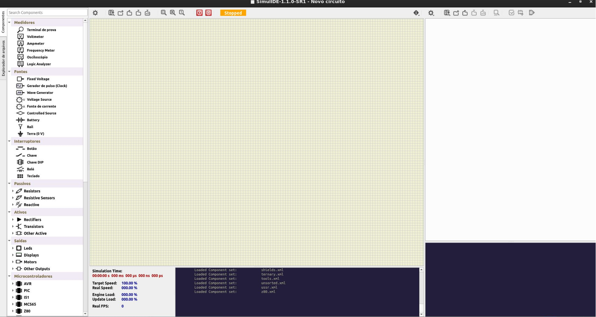

# SimulIDE

O [SimulIDE](https://simulide.com/p/) é um simulador de circuitos eletrônicos de tempo real, de código aberto e multiplataforma. Ele é focado principalmente na simulação de microcontroladores (como AVR, Arduino e PIC) e componentes periféricos. É uma alternativa leve a softwares profissionais, permitindo testar o código e o hardware virtualmente antes da montagem física.

---

# Referências

1. SimulIDE url: https://simulide.com/p/

---
