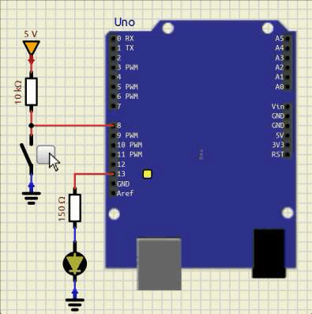

# Chave Táctil, Botão de Pressão ou *Push-Button*

É um dispositivo que realiza condução ou interrupção elétrica entre, ao menos, dois de seus terminais de forma momentânea. 

São usados para realizar um comando de forma mecânica para um dispositivo eletrônico ao pressionar o botão. 

São compostos de dois ou mais terminais, e contatos que fecham ou abrem ao se realizar o acionamento. Esses contatos retornam à posição original ao deixar de pressionar o botão. Sendo assim, temos botões de pressão cujos contatos estão abertos normalmente (NA ou NO) e são fechados quando o botão é acionado e botões de pressão cujos contatos estão fechados normalmente(NF ou NC) e são abertos quando o botão é acionado. 

*   **Necessidade de Resistor:** Um dispositivo digital necessita obrigatoriamente receber um nível de tensão bem estabelecido, geralmente +5V ou 0V, por exemplo. Um pino de microcontrolador que recebe este estímulo não pode ficam em aberto, configurando um estado indefinido de tensão. Para evitar esta condição, usa-se um ramo alimentado pela fonte e com resistor em série com a chave táctil, de modo a garantir um nível lógico bem definido quando os contatos da chave estiverem em aberto. 
*   **Valor do Resitor:** O objetivo é definir um nível de tensão que seja reconhecido como `1` ou `0` lógico, e não há necessidade de injeção de corrente no pico do microcontrolador, já que o estímulo é pela tensão. Assim, costuma-se usar um resistor de valor alto, para que o consumo de corrente seja baixo, reduzindo o consumo de energia do circuito. O valor mais comum é de **10 k$\Omega$**. Outros valores na mesma escala de resistência podem ser usados. 

As duas configurações possíves são mostradas na ilustração abaixo, em que o botão está conectado ao Vcc e a outra em que o botão está conectado ao terra.

| Ligação do resistor de *pull-down*      | Ligação do resistor de *pull-up*     |
|:---------------------------------------:|:------------------------------------:|
| |  |

Na configuração pull-down o resistor está conectado ao terra, o que garante, quando o botão estiver aberto, o nível lógico 0 (terra/GND) chegando no pino do uC.

Ao pressionar o botão, ele fecha e conecta o ponto de conexão com o pino ao Vcc, aplicando o nível lógico 1 a ele.

Na configuração pull-up o resistor está conectado ao positivo da fonte, Vcc. O botão na condição de não acionado está com contato aberto, assim a tensão sobre ele é a tensão da fonte, nesse caso 5V, conforme a 2ª lei de Kirchhoff, garantindo o nível lógico 1.

Ao pressionar o botão, ele fecha, ligando o ponto de conexão com o pino do uC ao GND, aplicando o nível lógico 0 a ele.

A configuração com o resistor de pull-down é a que proporciona uma lógica direta a entrada do dado: botão pressionado.

---
# Referências

1. LIMA, Charles Borges de; VILLAÇA, Marco V. M. **AVR e Arduino: técnicas de projeto**. 2. ed. Florianópolis: Edição dos Autores, 2012..
2. VALVANO, Jonathan W. **Embedded Systems: Introduction to ARM® Cortex™-M Microcontrollers**. 5. ed. [S.l.]: Jonathan Valvano, 2014. v. 1..
3. [**SAP-1**](https://www.google.com/url?sa=t&source=web&rct=j&opi=89978449&url=https://www.ic.unicamp.br/~ducatte/mc542/2012S2/sap-1.pdf&ved=2ahUKEwiDudPG_7OSAxXOK7kGHaWnASEQFnoECBIQAQ&usg=AOvVaw1vCyc0wwa3fZKVV3eVa875) (Simple-As-Possible Computer 1).

---
