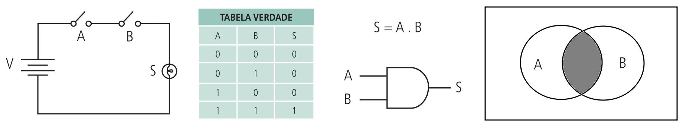
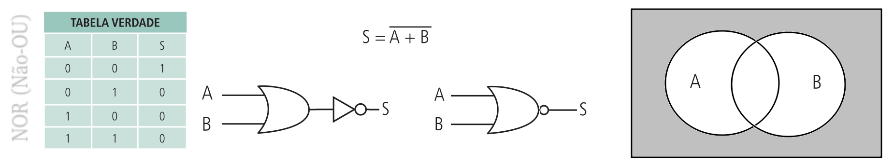

# Elementos lógicos

Elementos lógicos, ou ainda **portas lógicas**, constituem os **blocos fundamentais** para a implementação de circuitos e sistemas digitais. Esses elementos operam essencialmente sob os princípios da **lógica binária**, o que significa que suas entradas e saídas podem assumir apenas um de **dois estados discretos: 0 ou 1**. Em termos físicos e elétricos, o **nível lógico 0** representa a **ausência de tensão** ou um **estado de não-condução**, enquanto o **nível lógico 1** representa a **presença de tensão ou condução**.

As funções lógicas primárias que regem esses sistemas são **AND (E), OR (OU) e NOT (NÃO)**, sendo que todos os outros blocos lógicos complexos são derivações ou combinações dessas três funções básicas. Cada porta executa uma operação específica:

*   **AND (E):** Produz uma saída de nível lógico 1 apenas quando todas as suas entradas forem nível lógico 1.

*   **OR (OU):** Resulta em nível lógico alto se pelo menos uma de suas entradas apresentar nível lógico alto.

*   **NOT (NÃO):** Também conhecida como inversora, esta porta complementa o estado lógico da variável de entrada, transformando 0 em 1 e vice-versa.

Além das funções básicas, a eletrônica digital utiliza **portas derivadas**, como a **NAND (Não-E), NOR (Não-OU), XOR (OU-Exclusivo) e XNOR (Coincidência)**. Portas como NAND e NOR são tecnicamente classificadas como `portas universais`, pois são capazes de, sozinhas ou em combinação, implementar a funcionalidade de qualquer outra porta lógica ou circuito digital.

---

---

---

Na prática, esses elementos são fabricados sob a forma de **circuitos integrados (CI)**, que utilizam tecnologias como **TTL (Lógica Transistor-Transistor)** ou **CMOS (Semicondutor de Óxido Metálico Complementar)** para agrupar múltiplas portas lógicos em um único dispositivo físico. Quando essas **portas são interconectadas**, elas formam **circuitos combinacionais**, onde a **saída resultante é uma função direta das variáveis de entrada atuais**, podendo ser descrita matematicamente através de **expressões booleanas e tabelas-verdade**.

| Figura: Tecnologia de portas lógicas com Diodos, Resistores e Transistores |
|:--------------------------------------:|
|  |
| Fonte: [Controle E Automação Industrial III - Prof. Sinésio Gomes - 2012](https://controleeautomacaoindustrial3.blogspot.com/2012/)|

A tecnologia **CMOS** (*Complementary Metal-Oxide Semiconductor* ou Semicondutor de Óxido Metálico Complementar) é um dos pilares da eletrônica digital moderna, sendo amplamente utilizada na fabricação de circuitos integrados.

A tecnologia CMOS baseia-se no uso de transistores **MOS**, que permitem a implementação de funções lógicas complexas e estruturas específicas, como as **portas de passagem** (*transmission gates*). Essas portas operam de maneira bidirecional, funcionando como chaves eletrônicas que transmitem informações de forma eficiente em circuitos de tecnologia MOS.

Embora o CMOS seja a tecnologia predominante em larga escala, ele apresenta características distintas em relação ao seu principal concorrente histórico, o TTL (*Transistor-Transistor Logic*):

*   **Ruído Eletrostático:** Dispositivos CMOS tendem a ser menos robustos ao ruído eletrostático do que os dispositivos TTL, motivo pelo qual estes últimos ainda são muito comuns em ambientes educacionais e laboratoriais.

*   **Margem de Ruído:** O projeto de CIs digitais busca reduzir a interferência de ruído, e a diferença entre as faixas de tensão de entrada e saída (margem de ruído) é um parâmetro crítico que a tecnologia CMOS gerencia para garantir a integridade do sinal lógico.

Para que um circuito CMOS opere de forma confiável, ele deve respeitar parâmetros rigorosos de temporização, que variam conforme a subfamília:

*   **Tempo de Setup ($t_s$):** O intervalo mínimo que o dado deve estar estável antes da transição do clock.
*   **Tempo de Hold ($t_H$):** O intervalo que o dado deve permanecer estável após a transição do clock.
*   **Frequência Máxima ($f_{MAX}$):** A maior frequência de clock que pode ser aplicada mantendo o disparo confiável, variando de 5 MHz (em séries como 74C) até patamares superiores em séries de alta velocidade.

A tecnologia CMOS é fundamental para a implementação de unidades de memória **RAM** e **ROM**. Em dispositivos lógicos programáveis (como FPGAs), a existência de unidades de memória CMOS integradas permite economizar recursos de lógica combinacional e registradores, otimizando o custo e a área do chip. Além disso, o CMOS é essencial para o modelamento de estados de **alta impedância** (estado Z), facilitando a criação de barramentos de comunicação onde múltiplos controladores compartilham o mesmo nó.

---

# Referências e complementos

- **TOCCI, Ronald J.; WIDMER, Neal S.** _Sistemas Digitais: Princípios e Aplicações_. 8. ed. Pearson, 2015.
- **PALANIAPPAN, Ramaswamy.** _Digital Systems Design_. bookboon.com, 2011.
- **TRINDADE JUNIOR, Rosumiro; JULIÃO, Jodelson Moreira.** _Circuitos Digitais_. Manaus: Centro de Educação Tecnológica do Amazonas (CETAM), 2012.
- **D’AMORE, Roberto.** _VHDL: Descrição e Síntese de Circuitos Digitais_. LTC.

---

---
