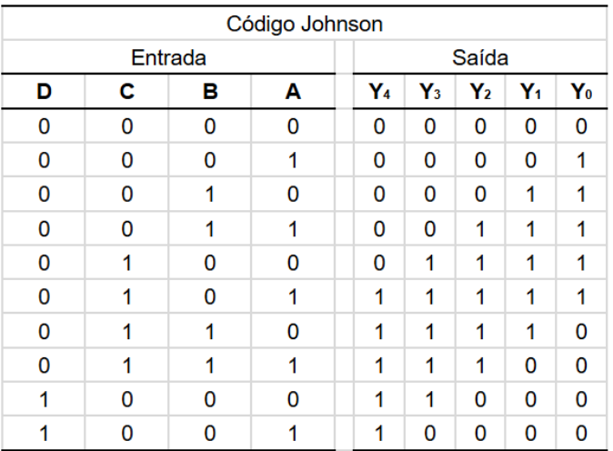

# [Form - Lista de Exercícios - Decodificadores](https://docs.google.com/forms/d/e/1FAIpQLScm4_KOlCniUa16sCyAL3u6lpLGXHaGEPTBr2CrAqWMw4y3AQ/viewform?usp=sharing&ouid=109600203603184728591)

---

1) Elabore, em VHDL, a descrição do circuito digital equivalente ao comportamento apresentado na tabela verdade.

| B | A | Y |
|:-:|:-:|:-:|
| 0 | 0 | 1 |
| 0 | 1 | 0 |
| 1 | 0 | 1 |
| 1 | 1 | 1 |

---

2) Elabore, em VHDL, a descrição do circuito digital equivalente ao comportamento apresentado na tabela verdade.

| C | B | A | Y |
|:-:|:-:|:-:|:-:|
| 0 | 0 | 0 | 0 |
| 0 | 0 | 1 | 1 |
| 0 | 1 | 0 | 1 |
| 0 | 1 | 1 | 0 |
| 1 | 0 | 0 | 1 |
| 1 | 0 | 1 | 1 |
| 1 | 1 | 0 | 0 |
| 1 | 1 | 1 | 0 |

---

3) Os display de 7 segmentos são dispositivos eletrônicos formados por LEDs organizados de modo a exibir os dígitos de 0 a 9 e em alguns casos também pode exibir caracteres alfanuméricos. 
São costumeiramente usados em mostradores de relógios, eletrodomésticos, elevadores, calculadoras, instrumentos de medição, etc. 
Existem diversos dispositivos que fazem a conversão de valores numéricos binários para os respectivos segmentos do display, podendo ser chip dedicado como o 7447 ou microcontroladores programados, convertendo assim o padrão Binary-Coded-Decimal (BCD-8421) para a sequencia dos segmentos do display. 

Elabore, em VHDL, a descrição do circuito digital equivalente ao conversor BCD-8421 para Display7Segmentos, conforme tabela. 

Complete a tabela de saída para valores entre 10 e 15, respectivamente 0xA e 0xF em hexadecimal. 

---

4) O código Johnson é um tipo de sequência de contagem que apresenta mudança de apenas um bit por vez na sua sequência de incremento, realizando a mínima transição de bits, prevenindo erros na transição dos valores da contagem, altamente recomendado para aplicações de alta velocidade. 

A tabela que segue apresenta a conversão entre a codificação BCD-8421 e seus respectivos valores no contador Johnson.

Elabore, em VHDL, a descrição do circuito digital equivalente ao comportamento apresentado na tabela verdade utilizando a estrutura when else.

---

5) A codificação Gray, da mesa forma que a contagem Johnson apresenta a mínima transição de bits, e é amplamente utilizada em encoders rotativos, mapa de Karnaugh e até em algoritmos genéticos, representando genes de indivíduos que sofrem mutações gradativas, evitando mudanças bruscas na representação das mutações. 

Na indústria, dispositivos rotativos que necessitam de velocidade e ausência de erros na representação tais como elevadores, portas automáticas, esteiras transportadoras e turbinas eólicas. 

Uma forma de converter o padrão BCD-8421 para Gray é:

- Realizar a operação XOR de cada posição atual com o bit adjacente mais significativo e o resultado fica na posição atual. 
- A única exceção é o MSB (Most Significant Bit) que permanece o mesmo, inclusive por não haver bit à sua esquerda. 

Elabore, em VHDL, a descrição do circuito digital equivalente ao comportamento apresentado na tabela verdade. 

---