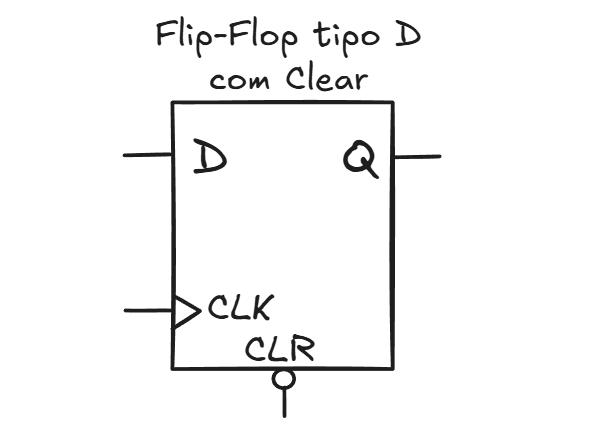

# Lista de Exercícios - flip-flop D

---

Algumas versões de flip-flop apresentam entradas assíncronas para ligar (preset) e desligar (reset) a saída, independente da entrada e do sinal de sincronismo (clk).
Utilizando os arquivos de descrição `latch_sr.vhdl`, `latch_d.vhdl` e `d_ff.vhdl`, apresentados em aula, faça:
 
1) Modifique o arquivo `d_ff.vhdl` de modo que a descrição seja equivalente ao flip-flop tipo D apresentado na Figura 1. 

| Figura 1: Flip-flop tipo D com Clear |
|:------------------------------------:|
|          |
| Fonte: Autor                         |

Note que para forçar a saída para zero, o sinal `CLR` deve estar zerado, pois há uma inversora na entrada do sinal. 

2) Modifique o arquivo `d_ff.vhdl` de modo que a descrição seja equivalente ao flip-flop tipo D apresentado na Figura 2. 

| Figura 2: Flip-flop tipo D com Preset e Clear |
|:------------------------------------:|
|          |
| Fonte: Autor                         |

Note que neste exercício, há inversoras nas entradas de *Preset*, *Clear* e *Clock*. 

---