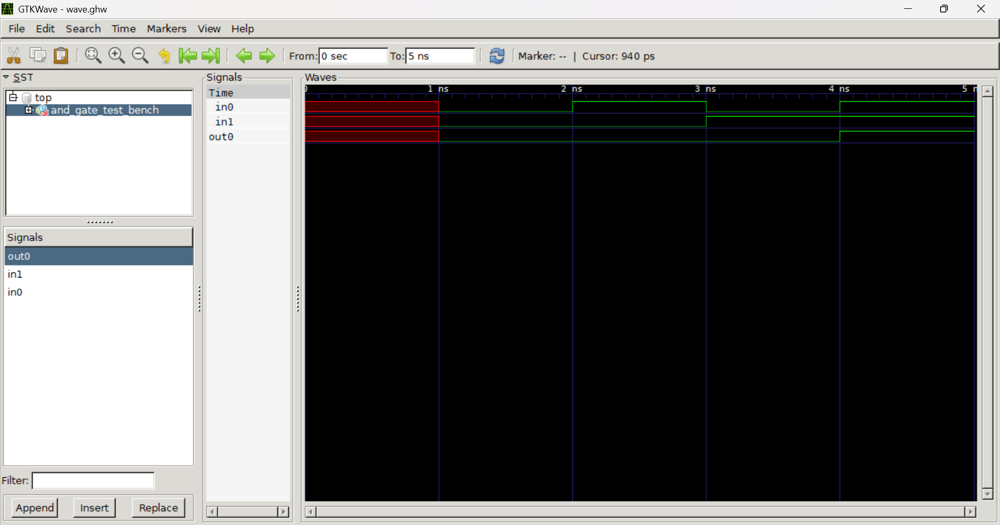

O GHDL é um compilador e simulador de código aberto para VHDL, mantido pela comunidade de desenvolvedores no [GitHub](https://github.com/ghdl/ghdl), regularmente atualizado e com novas versões. 

Pode ser executado em Windows, macOs e GNU/Linux e possui suporte para diversas plataformas entre elas x86, x86_64, armv6/armv7/aarch32, aarch64 e ppc64.

Possui suporte completo às versões de VHDL IEEE 1076 padrões 1987, 1993 e 2002 e suporte parcial às versões 2008 e 2019.

Possui a desvantagem de dar suporte apenas à linguagem VHDL, não suportando Verilog ou System Verilog. 

Necessita exportar seus arquivos para formatos de onda do tipo GHW, VCD or FST para visualizador como o GtkWave. 

---


O [GtkWave](https://gtkwave.sourceforge.net/) é uma ferramenta de análise para executar depuração em modelos de simulação paralog ou VHDL. 

Suporta vários formatos de despejo (*dump*) como:

- Value Change Dump (VCD);
- InterLaced eXtensible Trace (LXT).

---

**Instalação**

1. Download GHDL [V5.1.1](https://github.com/ghdl/ghdl/releases/download/v5.1.1/ghdl-mcode-5.1.1-mingw64.zip).
2. Download GtkWave [v3](https://github.com/gtkwave/gtkwave/releases/download/nightly/gtkwave_gtk3_mingw64_standalone.tgz).
3. Clique com o botão direito sobre os arquivos e `Extrair tudo`.
4. Renomeie os respectivos diretórios para `ghdl` e `gtkwave`.
5. Mova ambos para `C:\eda\`.
6. Edite as variáveis de ambiente do sistema:
      1. Variáveis de usuário
      2. Variável: `Path` -> Editar -> Novo
      3. Inclua: "C:\eda\ghdl\bin"
      4. Inclua: "C:\eda\gtkwave\bin"
      5. Clique em `Ok` -> `Ok` -> `Ok`
7. GHDL e GtkWave instalados.

---

**Primeiro programa**


Crie um arquivo de porta lógica básica do tipo `E` (And).


```vhdl title="and.vhdl"
library ieee;
use ieee.std_logic_1164.all;

entity and_gate is
    port(x0,x1: in std_logic; y:out std_logic );
end entity;

architecture main of and_gate is
begin
    y <= x0 and x1;
end architecture;
```

Crie um arquivo de `teste de bancada`.

```vhdl title="and_tb.vhdl"
library ieee;
use ieee.std_logic_1164.all;

entity and_gate_test_bench is
end and_gate_test_bench;


architecture test of and_gate_test_bench is
	component and_gate
		port(x0,x1: in std_logic; y: out std_logic);
	end component;
	signal in0, in1, out0 : std_logic;
begin
	gate_and: and_gate port map(x0 => in0, x1 => in1, y => out0);
	process begin
		in0 <= 'X';
		in1 <= 'X';
		wait for 1 ns;

		in0 <= '0';
		in1 <= '0';
		wait for 1 ns;

		in0 <= '1';
		in1 <= '0';
		wait for 1 ns;

		in0 <= '0';
		in1 <= '1';
		wait for 1 ns;

		in0 <= '1';
		in1 <= '1';
		wait for 1 ns;

		assert false report "Executed testbench";
		wait; 
	end process;
end architecture;
```

Crie um arquivo de Makefile.

```makefile title="makefile"
HDL=ghdl
FLAGS="--std=08"
SIM=gtkwave

all:
	@$(HDL) -a $(FLAGS) and.vhdl
	@$(HDL) -a $(FLAGS) and_tb.vhdl
	@$(HDL) -e $(FLAGS) and_gate_test_bench
	@$(HDL) -r $(FLAGS) and_gate_test_bench --wave=wave.ghw  --stop-time=5us

wave:
	$(SIM) wave.ghw
```

No Windows PowerShell, digite:

```PS
make
```

e para executar a simulação, digite:

```PS
make wave
```



