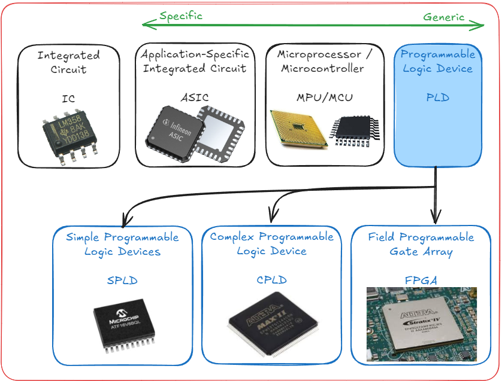
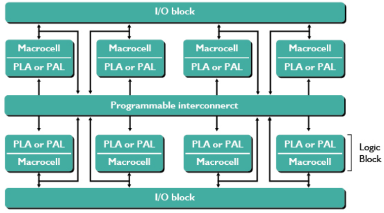
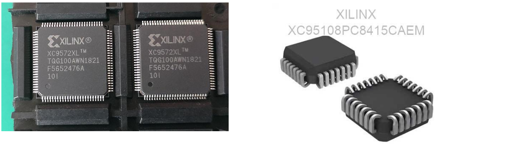
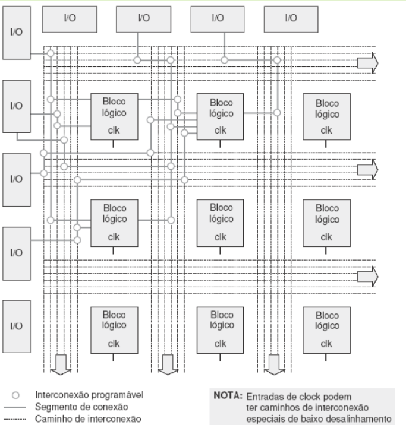

---

| Figura 1: Tecnologias digitais                |
|:---------------------------------------------:|
|  |
| Fonte: autor                                  |

| Grau de Integração | Característica |
|:------------------:|:--------------:|
| SSI (*Small Scale Integration*)        | Dezenas de dispositivos |
| MSI (*Medium Scale Integration*)       | Centenas de dispositivos |
| LSI (*Large Scale Integration*)        | Dezenas de milhares de dispositivos |
| VLSI (*Very Large Scale Integration*)  | Milhões de dispositivos |
| ULSI (*Ultra Large Scale Integration*) | Utiliza Nanotecnologia |

Dispositivos Lógicos Programáveis (PLDs)
➢Com a necessidade de criar um CI flexível, que pode implementar muitas
funções lógicas sem necessitar mudar o hardware (chip), foram desenvolvidos
os dispositivos lógicos programáveis (PLDs).
➢Os PLDs (programmable logic devices) começaram a ser introduzidos na
década de 1970, com o intuito de produzir circuitos de lógica combinacional
que pudessem ser programados.
➢O PLD é um chip no qual o hardware pode ser configurado para atender à
diversas especificações.

Um PLD é um CI que contém grande número de portas lógicas e unidades de
memória interconectadas dentro do chip.
➢A maioria dessas conexões é feita através de elos, tipo fusíveis, que podem
ser queimados ou mantidos intactos. O CI é considerado programável pelo
fato de podermos especificar a função ou as funções lógicas que ele deverá
implementar, através da queima seletiva dos elos fusíveis, interrompendo,
com isso, algumas conexões e deixando outras intactas.
12
➢O processo de "queima"
pode ser feito pelo
fabricante, de acordo com
as especificações do
cliente, ou pelo próprio
usuário, por meio de
equipamentos
programadores.

•Os primeiros PLDs foram desenvolvidos para construir apenas circuitos
combinacionais, chamados de PAL (programmable array logic) e PLA (programmable
logic array).
•Logo surgiu a necessidade de construir circuitos sequenciais e então foi criada a
estrutura GAL (generic array logic), que continha flip-flop, portas logicas e
multiplexadores.
➢Essas estruturas até aqui foram denominadas de SPLD (simple PLDs), que
utilizam tecnologia CMOS e disponibilizam elementos de memória do tipo
EPROM, EEPROM e FLASH.
➢Com a evolução foram criados os CPLDs (complex PLDs) e os FPGAs (field
programmable gate array).

Os PLDs são projetados de forma
que a queima de um fusível de
entrada das portas faça com que esta
entrada assuma o nível lógico 0, ou
seja, passam a não ser considerados
na porta lógica a qual o fusível é
entrada.
➢Por exemplo, se queimarmos os
fusíveis 1 e 4, na entrada da porta
OR-1, a saída O1 ficará como abaixo:

O_1 = 0 + AB' + A'B + 0 = AB' + A'B

➢Podem-se programar cada uma das
outras portas remanescentes de
maneira similar à descrita acima.
Uma vez que todas as saídas tenham
sido programadas, o dispositivo vai
gerar, permanentemente, em suas
saídas, cada uma das funções
selecionadas.

 Simbologia dos PLDs
➢Foi adotada uma simbologia simplificada para representar os circuitos internos
dos PLDs;
➢Exemplo: simbologia utilizada para uma porta AND de 4 entradas.
•Observe que, nas saídas dos buffers, estão representadas uma saída inversora e uma
não inversora;
•Uma única linha aparece como entrada da porta AND, representando as 4 entradas
existentes;
•As conexões das variáveis de entrada à porta AND são indicadas ora por um ponto,
ora por um X.
❖O X representa um fusível intacto, e o ponto representa uma ligação, ou seja, ambas
representações indicam que existe uma ligação física ou uma conexão.
❖A ausência do X ou do ponto indica ausência de conexão.
17

Na figura, as entradas A e B estão ligadas à
porta AND de maneira a gerar o produto 𝐴 𝐵'
A queima do fusível A iria produzir uma saída
igual a 𝐵'

Arquitetura dos PLD
➢Dentre os SPLD (simple PLDs), têm-se:
•PLA (arranjo lógico programável - programmable logic array);
❖Consiste em um arranjo de portas AND programável e um arranjo de portas OR
também programável.
•PAL (lógica de arranjo programável - programmable array logic);
❖Consiste em um arranjo de portas AND programável e um arranjo de portas OR
fixo.
•GAL (lógica de arranjo genérico - generic array logic).
❖Assim como a PAL, tem um arranjo AND programável e um arranjo OR fixo.
❖Adicionalmente, a GAL apresenta uma macrocélula de saída (OMLC) programável,
com capacidade de armazenamento de dados de saída.
➢ Uma vez programado, o PLD programável através da queima de fusíveis não pode ser
recomposto.
➢ Essa desvantagem foi eliminada pela maioria dos fabricantes de PLD ao desenvolverem
dispositivos que podem ser apagados e reprogramados quantas vezes forem
necessárias.
➢ Esses dispositivos são também chamados de dispositivos lógicos programáveis
apagáveis (EPLD - Erasable programmable logic device), sendo eles programados e
apagados de maneira semelhante às EEPROM

---

 Dispositivos Lógicos Programáveis Complexos (CPLDs)
➢Os Dispositivos Lógicos Programáveis Complexos (CPLDs) foram
introduzidos no mercado internacional pela empresa Altera Corp. em 1983,
inicialmente como Dispositivos Lógicos Programáveis Apagáveis (EPLDs) e,
posteriormente, como CPLDs.
➢Nessa arquitetura foram utilizados esquemas de roteamento sofisticado,
tecnologia de silício mais avançada, entre outras características.
➢Originalmente, os CPLDs podiam ser obtidos com a construção e associação
de inúmeros SPLDs no mesmo chip.

Arquitetura de um CPLD
➢A arquitetura de um CPLD é baseada em certo número de blocos lógicos,
cada um deles contendo uma macrocélula e um arranjo PLA ou PAL, alguns
blocos de E/S e todos estes blocos interligados por uma rede de interconexão
global programável.
➢Normalmente, incorporam blocos combinacionais e elementos de memória do
tipo flip-flop ou registros.
➢Os elementos programáveis são células do tipo EEPROM.
22
Estrutura padrão de um CPLD.
Esta arquitetura de dispositivo
permite tornar mais
aproveitável a área de
integração (área em silício)
permitindo um desempenho
melhor e redução de custo.
Um único CPLD pode substituir
centenas de componentes
74XX (portas lógicas).

As interconexões programáveis formam um espécie de barramento que roteia
(interliga) sinais das entradas ou saídas para as entradas de um bloco lógico,
ou das saídas de um bloco lógico para as entradas do mesmo ou outro bloco.
➢Cada bloco lógico é equivalente à um SPLD, contendo suas macro células
com suas interconexões.
➢Diferente das interconexões configuráveis da SPLD, as interconexões entre
os blocos lógicos da CPLD podem não ser totalmente conectáveis, ou seja,
algumas conexões entre um bloco e outro, teoricamente pode ser possível,
mas na prática não podem ser executadas.
➢Com isso, torna-se difícil utilizar 100% das macrocélulas.

 Encapsulamentos
➢Um Quad Flat Package (QFP ou
encapsulamento quadrado) é um
encapsulamento de circuito integrado
com terminais que se estendem de
cada um dos quatro lados.
•Acondicionamentos especiais incluem LQFP
(Low profile QFP) e TQFP (Thin QFP).
➢Um plastic leaded chip carrier (PLCC) é
um encapsulamento plástico de quatro
lados, com um terminal em "J" e
espaçamentos de pino de 0,05" (1,27
mm).

 [Alguns fabricantes de CPLD](https://br.mouser.com/c/semiconductors/programmable-logic-ics/cpld-complex-programmable-logic-devices/?q=CPLD)
A Intel comprou a Altera em 2015.

---

 Matriz de Portas Programáveis (FPGAs)
➢Ainda na década de 1980, lançadas pelas empresa Xilinx, surgiram as FPGAs
(Field Programmable Gate Arrays).
➢As FPGAs diferem dos CPLDs em arquitetura, tecnologia, características
embutidas, tamanho, desempenho e custo.
➢Elas são, de forma geral, uma matriz de blocos, ao invés de uma pilha como
nos CPLDs, que possuem um número de blocos maior, com blocos menores
porém mais sofisticados.

FPGAs são circuitos
programáveis que não
possuem planos AND e OR,
mas possuem um grande
número (da ordem de
milhares) de unidades
idênticas (blocos lógicos)
configuráveis.
➢As unidades lógicas podem
ser vistas como
componentes padrões que
podem ser configurados
independentemente e
interconectados a partir de
uma matriz de trilhas
condutoras e chaves
programáveis

Arquitetura de uma FPGA
➢ Arquitetura baseada em blocos lógicos configuráveis, chamados de CLB (Configuration
Logical Blocks).
➢ Os CLBs são formados por portas lógicas e flip-flops que implementam funções lógicas.
➢ Blocos de entrada e saída (IOB – In/Out Blocks), os quais são responsáveis pela
interface das saídas provenientes das combinações de CLBs.

Blocos Lógicos reconfiguráveis
➢Os bits de configuração são selecionados de acordo com a função lógica
desejada (combinacional ou sequencial).
➢A configuração é uma tabela verdade (LUT - look up table) da funcionalidade.

As LUTs podem ser programadas para qualquer tipo de porta necessária ao
projeto
➢Há um número finito de LUTs em uma FPGA.

Granularidade
➢É uma característica dos FPGAs relacionada com o grão.
➢O grão é a menor unidade configurável que compõe um FPGA.
➢A fim de classificar os FPGAs quanto ao bloco lógico, foram criadas algumas
categorias:
•(a) Grão Grande: Os FPGAs dessa categoria podem possuir como grão unidades
lógicas aritméticas, pequenos microprocessadores e memórias.
•(b) Grão Médio: Os FPGAs de grão médio frequentemente contêm dois ou mais LUTs
e dois ou mais flip-flops. A maioria das arquiteturas de FPGAs implementam a lógica
em LUTs de quatro entradas.
•(c) Grão Pequeno: Os FPGAs de grão pequeno contêm um grande número de blocos
lógicos simples. Os blocos lógicos normalmente contêm uma função lógica de duas
entradas ou multiplexadores 4x1 e um flip-flop.

 Atenção!
➢A configuração da LUT e da
interconexão é volátil, isto é, se perde
quando a alimentação é removida.
•São voláteis pois as células de
armazenamento são implementadas com
memórias SRAMs (memórias RAM
estáticas).
39
➢Existe uma memória não-volátil associada à FPGA de onde a sua configuração
é carregada quando o sistema é ligado.
•São necessárias PROMS ao lado de FPGAs (conteúdo atualizado ao serem
alimentadas).
•Geralmente utiliza-se uma pequena memória FLASH ou EEPROM, cuja função é
carregar automaticamente as células de armazenamento, toda vez que o FPGA for
energizado.
➢Já que a programação é feita pelo usuário depois da fabricação, ela é chamada
de programável no campo – field programmable.
➢FPGA = Field Programmable Gate Arrays.

Técnicas de Configuração da Interconexão
➢As chaves programáveis de roteamento apresentam algumas propriedades,
tais como tamanho, resistência, capacitância e tecnologia de fabricação, que
afetam principalmente a velocidade e o tempo de propagação dos sinais e
definem características como volatilidade e capacidade de reprogramação.
➢Na escolha de um dispositivo reconfigurável, esses fatores devem ser
avaliados.
➢Basicamente existem três tipos de tecnologia de programação das chaves de
roteamento:
•(a) SRAM;
•(b) Antifuse;
•(c) Gate Flutuante

Pág. 41

---
# Referências

1. [Integrated Circuits - Learn Sparkfun ](https://learn.sparkfun.com/tutorials/integrated-circuits/all)
