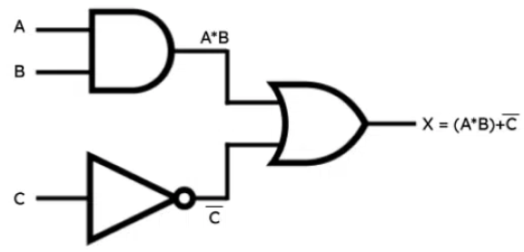

---

Uma linguagem de descrição de hardware (Hardware Description Language - HDL) é uma linguagem de computador especializada usada para descrever a estrutura e o comportamento de circuitos eletrônicos e, mais comumente, circuitos lógicos digitais.

Uma linguagem de descrição de hardware descreve o que um hardware faz e como:

- Modelar
- Representar
- Simular

Existem várias linguagens de descrição de hardware. As duas principais são:

- VHDL
- SystemVerilog


**VHDL**

O nome VHDL é um acrônimo de VHSIC Hardware Description Language. Já o termo VHSIC é o acrônimo de Very High Speed Integrated Circuit. Assim podemos traduzir livremente o nome VHDL como **"linguagem de descrição de hardware para circuitos integrados de velocidade muito alta"**.


A linguagem VHDL foi originalmente desenvolvida por empresas contratadas pelo governo americano e agora é um padrão requerido por todos os ASICs projetados para o exército americano.

1981: DoD (*Department of Defense*) patrocina o 1º encontro de especialistas com o objetivo de discutir métodos para a descrição de circuitos.

1983: DoD define os requisitos de uma linguagem padrão e firma contrato com IBM, Texas e Intermetrics com objetivo de desenvolvimento da linguagem e programas.

1985: Apresentação da versão 7.2 com direitos autorais do manual transferidos para o IEEE – Institute of Electrical and Electronic Engineer
- Incumbências do IEEE:
    - Definir um padrão para a linguagem
    - Manter futuros desenvolvimentos (novas versões etc.)

1987: Após revisões propostas por acadêmicos, representantes de indústrias e o governo dos Estados Unidos, foi definido o padrão IEEE 1076-1987.

As versões mais utilizadas são as definidas em 1993 e 2008, junto com seus pacotes.

Os pacotes tem o objetivo de adicionar facilidades à linguagem, como:

- IEEE 1164: Pacote std_logic_1164
- IEEE 1076.3: Pacotes numeric_bit e numeric_std


Todo arquivo VHDL requer ao menos duas estruturas:

- Entidade (*entity*)
    - Define os aspectos externos da função VHDL, isto é, os nomes das entradas e saídas e o nome da função.
- Arquitetura (*architecture*)
    - Define aspectos internos, funcionamento e relação entre os sinais internos e declarados na entidade.

---

**Exemplo**

Circuito combinacional simples:



```vhdl title='VHDL'
library IEEE;
use IEEE.std_logic_1164.all;

entity circuito is
    PORT( a,b,c: IN std_logic; s: OUT std_logic );
end circuito;

architecture main of circuito is
begin
    s <= (a and b) or c;
end main;

```

**Vantagem do VHDL em relação ao Esquemático**

- Projeto independente da tecnologia;
- Pode-se utilizar a descrição do projeto em vários tipos de plataforma, de um simulador para outro;
- Pode-se utilizar um projeto em VHDL em diferentes projetos;
- Permite, através de simulação, verificar o comportamento do sistema digital;
- Facilidade na atualização dos projetos;
- Reduz tempo de projeto e custo;
- O objetivo do projeto fica mais claro do que na representação por esquemáticos;
- O volume de documentação diminui, já que um código bem comentado em VHDL substitui com vantagens o esquemático e a descrição funcional do sistema;

---

**Aspectos da linguagem**

1. Suporta diversos níveis de hierarquia: uma descrição pode ser um conjunto de descrições interligadas.
2. Estilo de descrição:
   1. Diversas maneiras de descrever um circuito
   2. Níveis de abstração: comportamental, expressões lógicas, redes de ligação;
3. Linguagem concorrente
   1. Ordem dos comandos não importa;
   2. Mudança de valor em um sinal acarreta a execução de todos os comandos envolvidos.
4. Comandos sequenciais:
   1. Somente em regiões delimitadas no código, subprogramas e processos.


---
