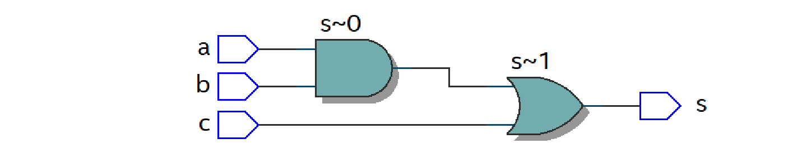

---

| Figura 1: Novo arquivo VHDL           |
|:-------------------------------------:|
| 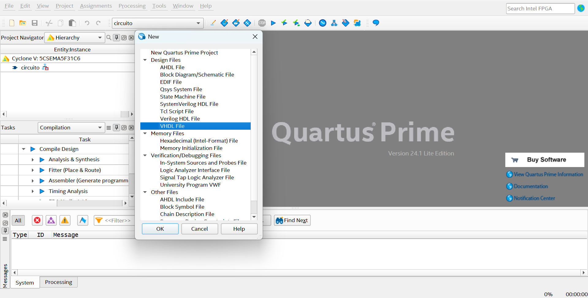  |
| Fonte: Autor                          |

| Figura 2: Edição do código, análise e sintese |
|:---------------------------------------------:|
| 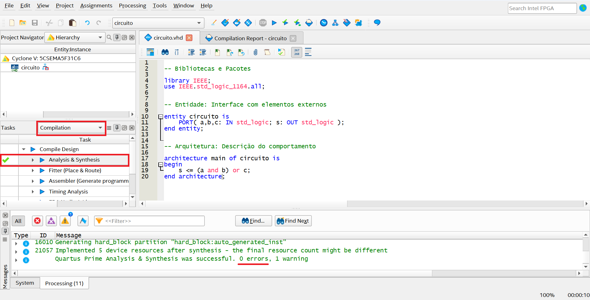          |
| Fonte: Autor                                  |

| Figura 3: Simulação do RTL            |
|:-------------------------------------:|
| 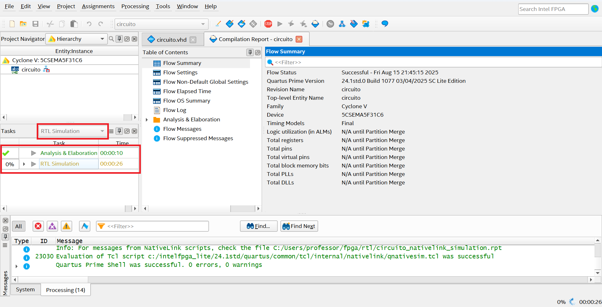  |
| Fonte: Autor                          |

| Figura 4: Simulação no Questa         |
|:-------------------------------------:|
| 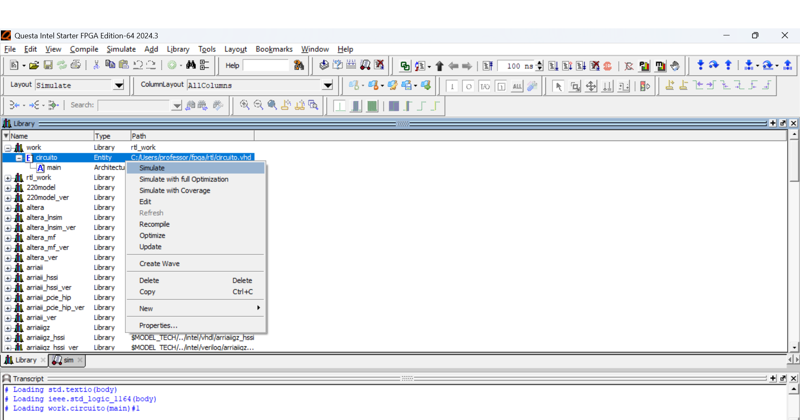  |
| Fonte: Autor                          |

| Figura 5: Adicionando formas de onda  |
|:-------------------------------------:|
| 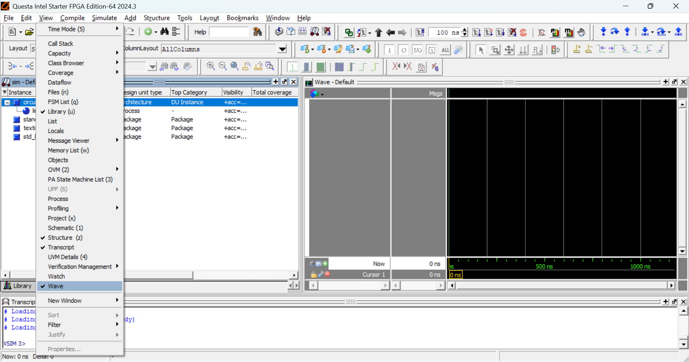  |
| Fonte: Autor                          |

| Figura 6: Abrindo objetos             |
|:-------------------------------------:|
| 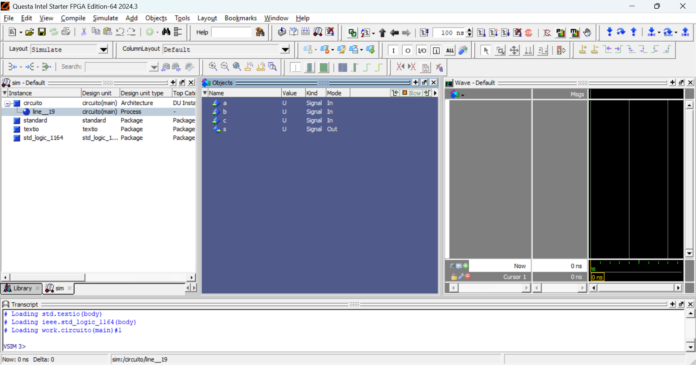  |
| Fonte: Autor                          |

| Figura 7: Modificando formas de onda das entradas |
|:-------------------------------------:|
| 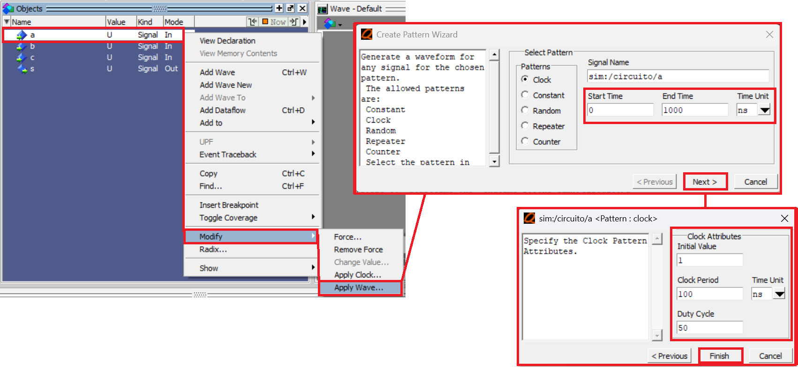  |
| Fonte: Autor                          |

| Figura 8: Execução das formas de onda |
|:-------------------------------------:|
| 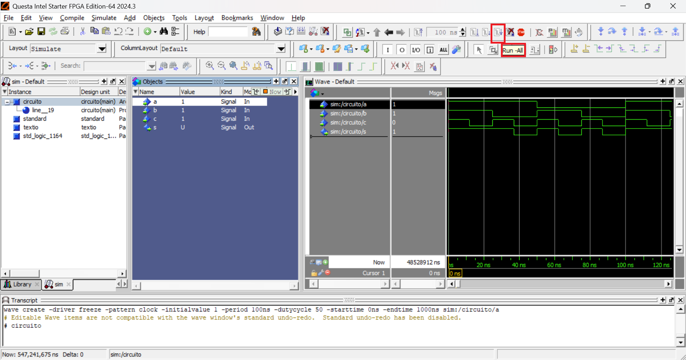  |
| Fonte: Autor                          |

| Figura 9: Salvando simulação          |
|:-------------------------------------:|
| 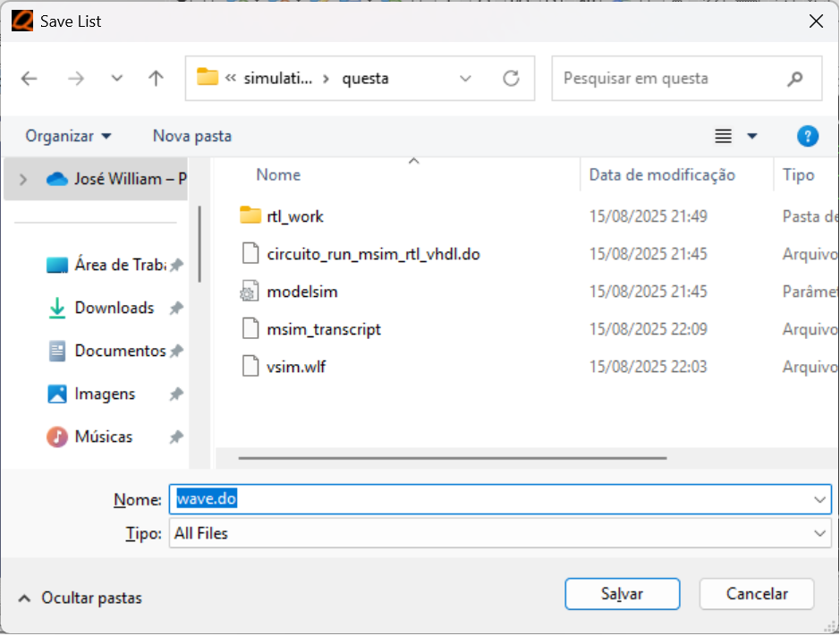  |
| Fonte: Autor                          |

| Figura 10: Abrindo a visualização do RTL |
|:-------------------------------------:|
| 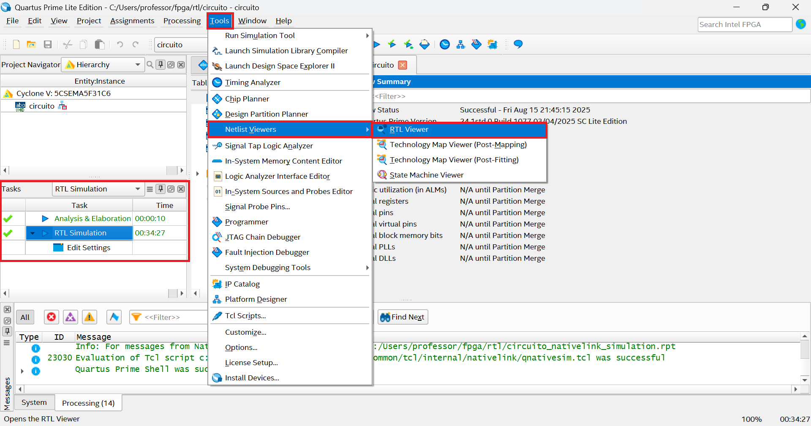  |
| Fonte: Autor                          |

| Figura 11: Visualização do RTL        |
|:-------------------------------------:|
| 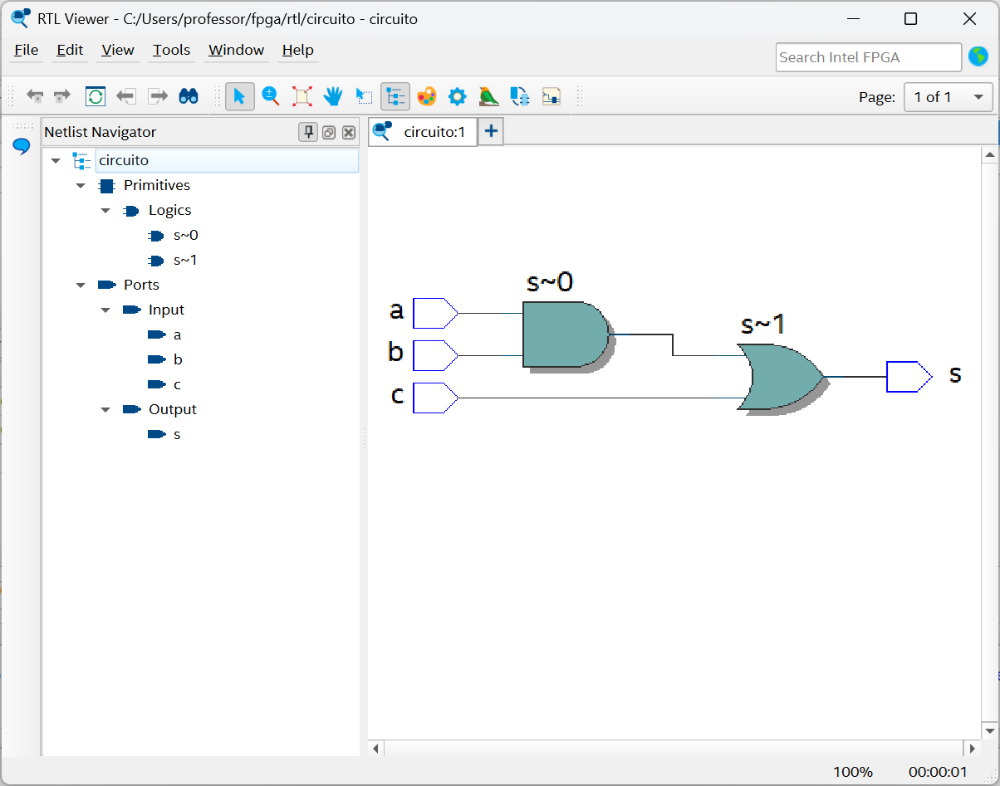  |
| Fonte: Autor                          |

---

---
