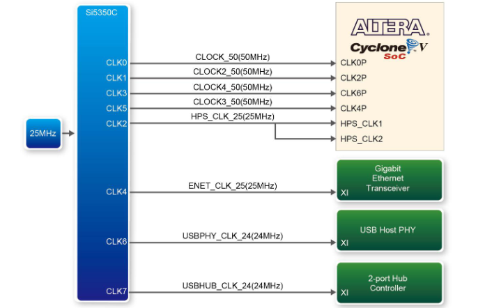
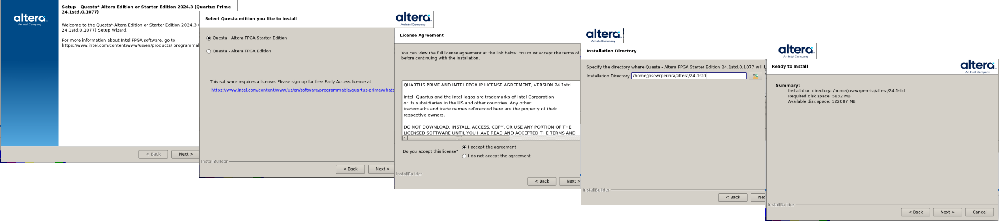
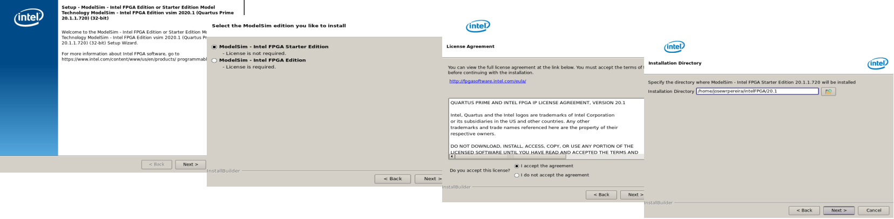
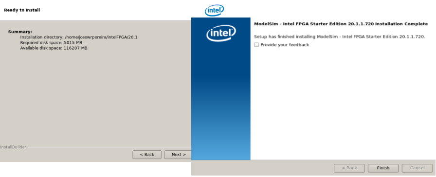
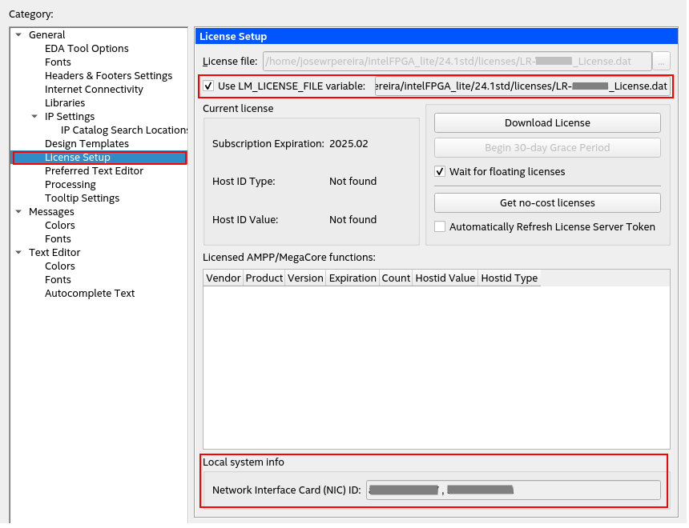
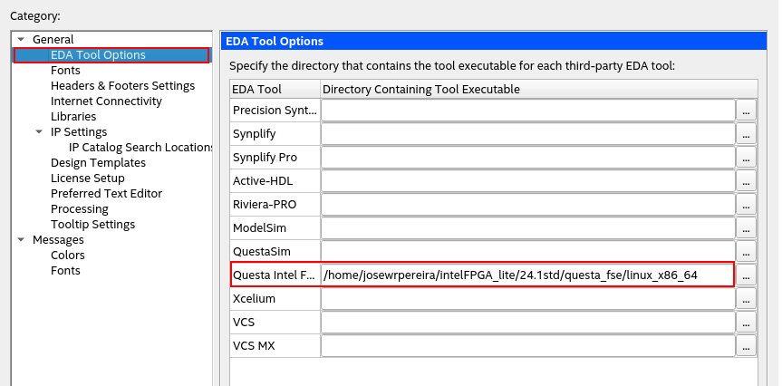
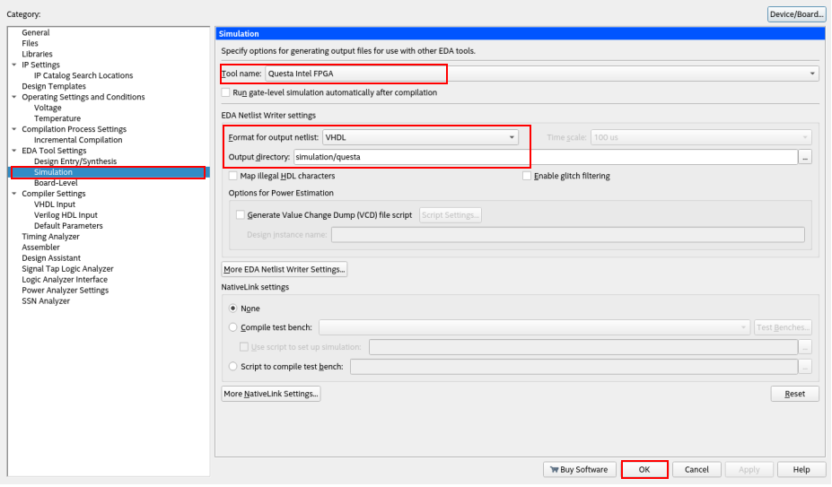

---

**Distribuição de Clock no DE1-SoC**

| Figura : Diagrama de blocos da distribuição de clock no DE1-SoC |
|:---------------------------------------------------------------:|
|  |
| Fonte: Manual do usuário DE1-SoC - rev. F/G - pág. 22           |

**Tabela 1: Atribuição de pinos de clock**

|  Signal Name  |  FPGA Pin No.   |  Description        | I/O Standard  |
|:-------------:|:---------------:|:-------------------:|:-------------:|
| CLOCK_50      | PIN_AF14        | 50 MHz clock input  | 3.3V          |
| CLOCK2_50     | PIN_AA16        | 50 MHz clock input  | 3.3V          |
| CLOCK3_50     | PIN_Y26         | 50 MHz clock input  | 3.3V          |
| CLOCK4_50     | PIN_K14         | 50 MHz clock input  | 3.3V          |
| HPS_CLOCK1_25 | PIN_D25         | 25 MHz clock input  | 3.3V          |
| HPS_CLOCK2_25 | PIN_F25         | 25 MHz clock input  | 3.3V          |

---


Driver no linux (Debian)
- [USB Blaster](https://www.rocketboards.org/foswiki/Documentation/UsingUSBBlasterUnderLinux)


Quartus® II software does not need any specific usb drivers on Linux to access the USB-BlasterTM and USB-Blaster II download cable. By default, root is the only user allowed to use these devices.You must change the permissions on the device files before you can use the USB-Blaster or USB-Blaster IIdownload cable to program devices with Quartus II software.

You must have system administration (root) privileges to add udev rules to correctly configure the access rights.

Driver Setup for recent udev

Add a new file /etc/udev/rules.d/92-usbblaster.rules file. Note that the 92 is important for e.g. Debian Wheezy as there is a default rule for "usbfs-like" devices /lib/udev/rules.d/91-permissions.rules specifying a MODE of 664. Because udev assigns priority to rules by the sort order of the file names theyappear in the USB Blaster rules have to be placed in an appropriate file.

# USB-Blaster
SUBSYSTEM=="usb", ATTRS{idVendor}=="09fb", ATTRS{idProduct}=="6001", MODE="0666"
SUBSYSTEM=="usb", ATTRS{idVendor}=="09fb", ATTRS{idProduct}=="6002", MODE="0666"

SUBSYSTEM=="usb", ATTRS{idVendor}=="09fb", ATTRS{idProduct}=="6003", MODE="0666"

# USB-Blaster II
SUBSYSTEM=="usb", ATTRS{idVendor}=="09fb", ATTRS{idProduct}=="6010", MODE="0666"
SUBSYSTEM=="usb", ATTRS{idVendor}=="09fb", ATTRS{idProduct}=="6810", MODE="0666"

Driver Setup for Ubuntu

For Ubuntu 12.04/14.04/16.04 create the file /etc/udev/rules.d/51-usbblaster.rules with the following contents:

# USB Blaster
SUBSYSTEM=="usb", ENV{DEVTYPE}=="usb_device", ATTR{idVendor}=="09fb", ATTR{idProduct}=="6001", MODE="0666", NAME="bus/usb/$env{BUSNUM}/$env{DEVNUM}", RUN+="/bin/chmod 0666 %c"
SUBSYSTEM=="usb", ENV{DEVTYPE}=="usb_device", ATTR{idVendor}=="09fb", ATTR{idProduct}=="6002", MODE="0666", NAME="bus/usb/$env{BUSNUM}/$env{DEVNUM}", RUN+="/bin/chmod 0666 %c"
SUBSYSTEM=="usb", ENV{DEVTYPE}=="usb_device", ATTR{idVendor}=="09fb", ATTR{idProduct}=="6003", MODE="0666", NAME="bus/usb/$env{BUSNUM}/$env{DEVNUM}", RUN+="/bin/chmod 0666 %c"

# USB Blaster II
SUBSYSTEM=="usb", ENV{DEVTYPE}=="usb_device", ATTR{idVendor}=="09fb", ATTR{idProduct}=="6010", MODE="0666", NAME="bus/usb/$env{BUSNUM}/$env{DEVNUM}", RUN+="/bin/chmod 0666 %c"
SUBSYSTEM=="usb", ENV{DEVTYPE}=="usb_device", ATTR{idVendor}=="09fb", ATTR{idProduct}=="6810", MODE="0666", NAME="bus/usb/$env{BUSNUM}/$env{DEVNUM}", RUN+="/bin/chmod 0666 %c"

then insert, or reinsert the USB cable.

See also https://www.intel.com/content/www/us/en/programmable/support/support-resources/download/drivers/dri-usb_b-lnx.html


---

[My First FPGA Tutorial](https://www.terasic.com.tw/cgi-bin/page/archive.pl?Language=English&CategoryNo=&No=658#contents)


# Referências

1.

| Figura : Questa Install                                 |
|:-------------------------------------------------------:|
|                |
| Fonte: Autor                                            |

| Figura : Questa Install                                 |
|:-------------------------------------------------------:|
|              |
| Fonte: Autor                                            |

| Figura : Modelsim Install                               |
|:-------------------------------------------------------:|
|              |
| Fonte: Autor                                            |

| Figura : Modelsim Install                               |
|:-------------------------------------------------------:|
|            |
| Fonte: Autor                                            |


| Figura : EDA licenseSetup_sim                           |
|:-------------------------------------------------------:|
|           |
| Fonte: Autor                                            |

| Figura : EDA tool Option_sim                            |
|:-------------------------------------------------------:|
|             |
| Fonte: Autor                                            |

| Figura : EDA tool Setting_sim                           |
|:-------------------------------------------------------:|
|            |
| Fonte: Autor                                            |


```bash title=".bashrc"
export LM_LICENSE_FILE="$HOME/intelFPGA_lite/24.1std/licenses/LR-NNNNNN_License.dat"
```


QuestaSim: /home/josewrpereira/intelFPGA_lite/24.1std/questa_fse/bin
Qesta Intel F?: /home/josewrpereira/intelFPGA_lite/24.1std/questa_fse/linux_x86_64
ModelSim: /home/josewrpereira/intelFPGA/20.1/modelsim_ase/bin
