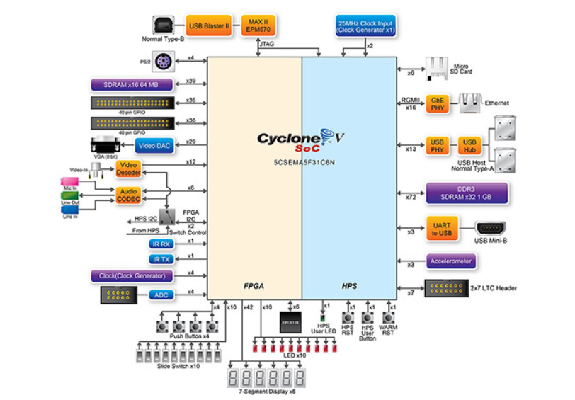
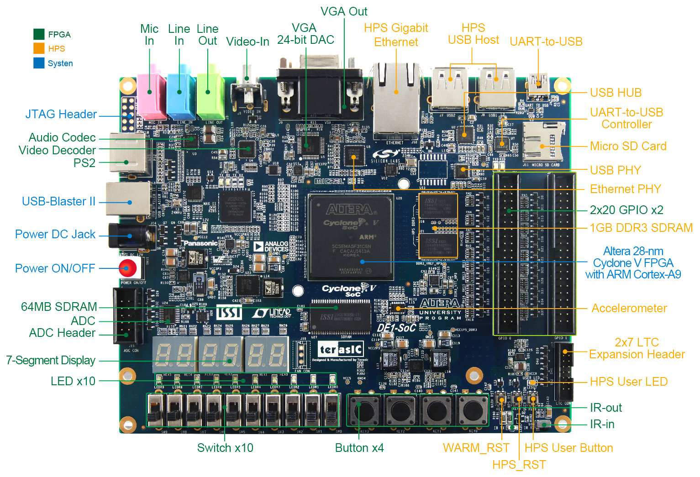
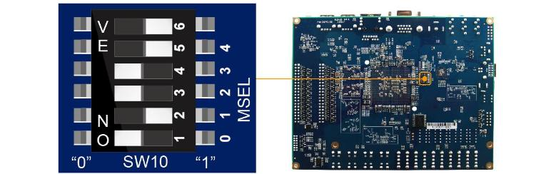
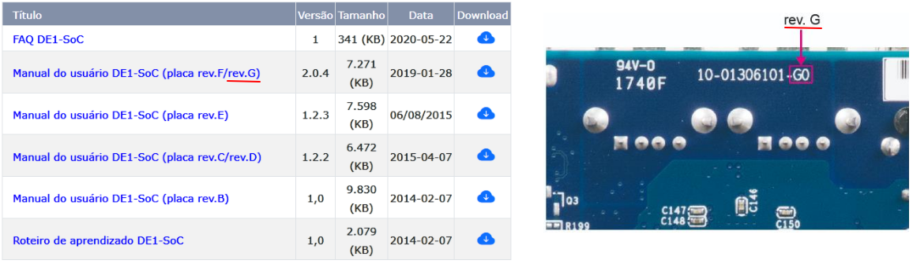
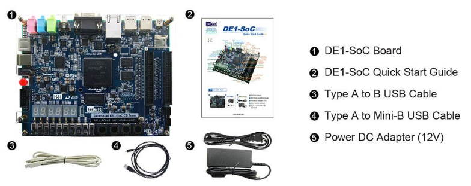
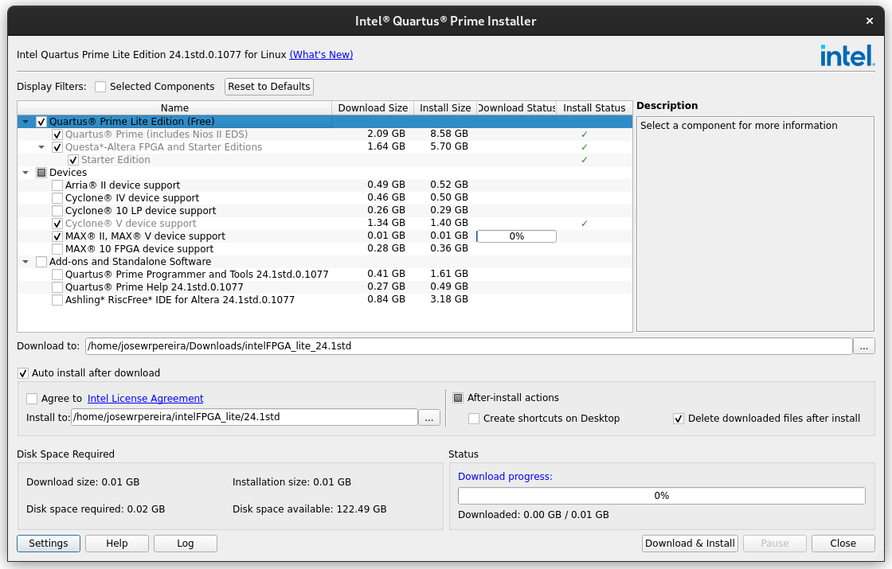
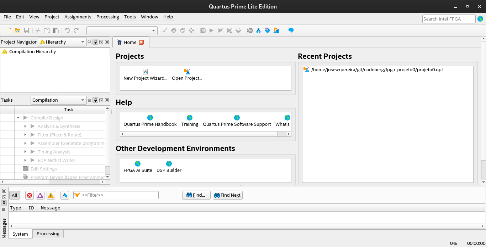

# [TerasIC DE1-SoC](https://www.terasic.com.tw/cgi-bin/page/archive.pl?Language=English&No=836) for Intel FPGA University Program

O Kit de Desenvolvimento (*Development Kit*) **DE1-SoC** apresenta uma plataforma robusta de **design de hardware** construída em torno do **FPGA System-on-Chip (SoC)** da Altera, que **combina núcleos embarcados Cortex-A9 dual-core com lógica programável** para **máxima flexibilidade de design**, aproveitando poder da **reconfigurabilidade** aliada a um sistema de **processador de alto desempenho e baixo consumo de energia**.

O SoC da Altera integra, como mostrado na Figura 1, um **sistema de processador rígido** ( **HPS** - *Hard Processor System*) baseado em **ARM**, composto por processador, periféricos e interfaces de memória, perfeitamente integrados à estrutura **FPGA** por meio de um ***backbone*** de interconexão de alta largura de banda.


| Figura 1: Diagrama de blocos - DE1-Soc DevKit         |
|:-----------------------------------------------------:|
|   |
| Fonte: [DE1-SoC Development and Education Kit](https://www.terasic.com.tw/cgi-bin/page/archive.pl?Language=English&CategoryNo=205&No=836&PartNo=2#heading) |

---

**Especificações**

1. FPGA Device
    - Cyclone V SoC 5CSEMA5F31C6 Device
    - Dual-core ARM Cortex-A9 (HPS)
    - 85K Programmable Logic Elements
    - 4,450 Kbits embedded memory
    - 6 Fractional PLLs
    - 2 Hard Memory Controllers
2. Configuration and Debug
    - Serial Configuration device – EPCS128 on FPGA
    - On-Board USB Blaster II (Normal type B USB connector)
3. Memory Device
    - 64MB (32Mx16) SDRAM on FPGA
    - 1GB (2x256Mx16) DDR3 SDRAM on HPS
    - Micro SD Card Socket on HPS
4. Communication
    - Two USB 2.0 Host Ports (ULPI interface with USB type A connector) on HPS
    - UART to USB (USB Mini B connector)
    - 10/100/1000 Ethernet
    - PS/2 mouse/keyboard
    - IR Emitter/Receiver
5. Connectors
    - Two 40-pin Expansion Headers (voltage levels: 3.3V)
    - One 10-pin ADC Input Header
    - One LTC connector (One Serial Peripheral Interface (SPI) Master ,one I2C and one GPIO interface )
6. ADC
    - Sample rate: 500 KSPS
    - Channel number: 8
    - Resolution: 12 bits
    - Analog input range : 0 ~ 4.096 V
7. Switches, Buttons and Indicators
    - 4 User Keys (FPGA x4)
    - 10 User switches (FPGA x10)
    - 11 User LEDs (FPGA x10 ; HPS x 1)
    - 2 HPS Reset Buttons (HPS_RST_n and HPS_WARM_RST_n)
    - Six 7-segment displays
8. Sensors
    - G-Sensor on HPS
9. Power
    - 12V DC input


---

**Layout**

A Figura 2 ilustra a distribuição na parte superior da placa de desenvolvimento dos dispositivos associados ao FPGA e ao HPS.
Os diversos dispositivos da placa e os conectores podem ser vistos na distribuição apresentada na Figura 2.

| Figura 2: Layout superior da placa DE1-SoC                 |
|:-------------------------------------------------:|
|  |
| Fonte: [DE1-SoC Development and Education Kit](https://www.terasic.com.tw/cgi-bin/page/archive.pl?Language=English&CategoryNo=205&No=836&PartNo=3#heading) |

Na parte inferior da placa de desenvolvimento é possível configurar o FPGA para operar em modo EPCS ([Erasable Programmable Configurable Serial](http://notes-application.abcelectronique.com/038/38-21611.pdf)) ou HPS ([Hard Processor System](https://www.intel.com/content/www/us/en/docs/programmable/683458/current/hard-processor-system-hps.html)) através das chaves de seleção `MSEL[4:0]` implementadas na chave `SW10`, como ilustrado na Figura 3.


| Figura 3: Layout inferior da placa DE1-SoC                 |
|:-------------------------------------------------:|
|  |
| Fonte: [DE1-SoC Development and Education Kit](https://www.terasic.com.tw/cgi-bin/page/archive.pl?Language=English&CategoryNo=205&No=836&PartNo=3#heading) |

Obs: Note que a chave na posiçõa `ON` corresponde ao valor lógico `0`.

| MSEL[4:0] |  Configure Scheme | Description |
|:---------:|:-----------------:|:-----------:|
| 10010     | AS                | FPGA configured from EPCS (default) |
| 01010     | FPPx32            | FPGA configured from HPS software: Linux
| 00000     | FPPx16            | FPGA configured from HPS software: U-Boot, <br> with image stored on the SD card, like LXDE Desktop or <br> console Linux with frame buffer edition.|

---

**Versões do kit didático**

Existem algumas revisões no projeto e documentação da placa de desenvolvimento. Para identificar a versão que estamos utilizando, basta identificar, na parte inferior da placa, o número de série, conforme ilustrado na Figura 4.


| Figura 4: Identificando a versão da placa         |
|:-------------------------------------------------:|
|  |
| Fonte: [DE1-SoC Development and Education Kit](https://www.terasic.com.tw/cgi-bin/page/archive.pl?Language=English&CategoryNo=205&No=836&PartNo=4#heading) |

**Conteúdo do kit**

A Figura 5 ilustra o conteúdo do kit didático DE1-SoC, que será utilizado durante o desenvolvimento das atividades deste componente curricular.

| Figura 5: Conteúdo do kit         |
|:-------------------------------------------------:|
|  |
| Fonte: [DE1-SoC Development and Education Kit](https://www.terasic.com.tw/cgi-bin/page/archive.pl?Language=English&CategoryNo=205&No=836&PartNo=4#heading) |

---

# Software

O software de desenvolvimento utilizado para projetos com a placa DE1-SoC é o [Intel® Quartus® Prime Lite Edition Design Software](https://www.intel.com/content/www/us/en/software-kit/849770/intel-quartus-prime-lite-edition-design-software-version-24-1-for-windows.html), aqui em sua versão 24.1.

Ao baixar o instalador recomendado, execute o arquivo `qinst-lite-windows-24.1std-1077.exe` no Windows ou `qinst-lite-linux-24.1std-1077.run` no Linux.

Ao abrir a janela do instalador, conforme Figura 6, selecione os pacotes pertinentes à sua aplicação. Aqui são selecionados pacotes para os dispositivos `Cyclone® V` e `MAX® II`.

| Figura 6: Instalação do Quartus Prime Lite Edition |
|:--------------------------------------------------:|
|  |
| Fonte: [Intel® Quartus® Prime Lite Edition Design Software](https://www.intel.com/content/www/us/en/software-kit/849770/intel-quartus-prime-lite-edition-design-software-version-24-1-for-windows.html) |

Após a instalação a ferramenta está pronta para o uso.


| Figura 7: Quartus Prime Lite Edition  |
|:-------------------------------------:|
|      |
| Fonte: Autor                          |


## Comunicação com a placa de desenvolvimento

1) Verifique a fonte de alimentação e conecte-a entre a placa e a tomada;

2) Conecte o cabo USB entre a placa e o computador;

3) Pressione o botão vermelho para ligar a placa;

4) No Windows, abra o `Gerenciador de dispositivos` e verifique se o seguinte dispositivo foi reconhecido:

- JTAG cables
    - Altera USB-Blaster II (JTAG interface)
    - Altera USB-Blaster II (System console interface)
- Caso apareça `Dispositivo desconhecido`
    - Verifique se o driver está na pasta do quartus: `C:\intelFPGA_lite\XX.X\quartus\drivers\usb-blaster-ii`, onde o `XX.X` é a versão instalada.
    - Se não houver o arquivo do driver na pasta de instalação do Quartus, baixe o [driver](https://www.intel.com/content/www/us/en/support/programmable/articles/000074502.html?wapkw=USB-Blaster%20II) direto do site e instale-o.

4) No Linux, não há necessidade de instalar driver para realizar download via USB-BlasterTM e USB-BlasterII, mas necessita de permissão de administrador.

- Com privilégio de administrador, via `sudo` por exemplo, crie o novo arquivo `/etc/udev/rules.d/92-usbblaster.rules`, contendo:

```bash title='92-usbblaster.rules'
# USB-Blaster
SUBSYSTEM=="usb", ATTRS{idVendor}=="09fb", ATTRS{idProduct}=="6001", MODE="0666"
SUBSYSTEM=="usb", ATTRS{idVendor}=="09fb", ATTRS{idProduct}=="6002", MODE="0666"

SUBSYSTEM=="usb", ATTRS{idVendor}=="09fb", ATTRS{idProduct}=="6003", MODE="0666"

# USB-Blaster II
SUBSYSTEM=="usb", ATTRS{idVendor}=="09fb", ATTRS{idProduct}=="6010", MODE="0666"
SUBSYSTEM=="usb", ATTRS{idVendor}=="09fb", ATTRS{idProduct}=="6810", MODE="0666"
```

- Caso tenha problemas, consulte [Intel® FPGA Download Cable (formerly USB-Blaster) Driver for Linux](https://www.intel.com/content/www/us/en/programmable/support/support-resources/download/drivers/dri-usb_b-lnx.html).

Obs: A distribuição de GNU/Linux aqui utilizada é `Debian 12`.

---
# Referências

1. [Manual do usuário DE1-SoC - rev.F/G](https://www.terasic.com.tw/cgi-bin/page/archive_download.pl?Language=English&No=836&FID=3a3708b0790bb9c721f94909c5ac96d6)
2. [DE1-SoC Development and Education Kit | terasIC](https://www.terasic.com.tw/cgi-bin/page/archive.pl?Language=English&CategoryNo=205&No=836&PartNo=1#contents)
3. [Digital System Design (DSD) | kevinwlu github](https://github.com/kevinwlu/dsd)
4. [Quartus com Questa:Escolhendo o hardware | Nets&Nuts](https://nets-nuts.com.br/quartus-com-questa-modelsim-instalacao-e-configuracao-1/)
