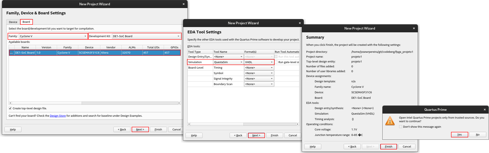
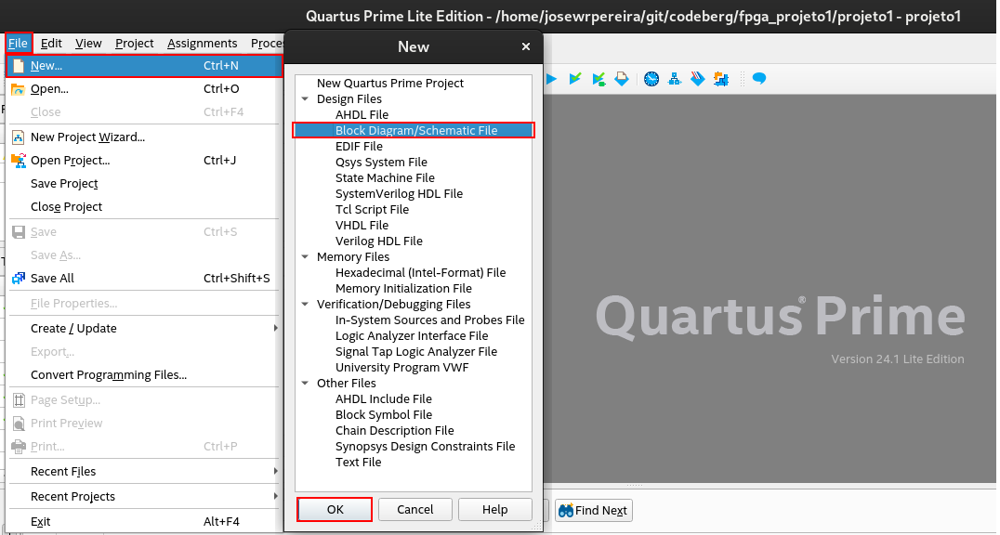

O processo de criação de um projeto para o kit DE1-SoC é complexo e possui um série razoavelmente extensa de passos, assim, realize-os com atenção.

Para ilustrar o processo, **o objetivo é criar um projeto que sintetize uma operação lógica básica, porta E**, recebendo sinais de **duas entradas físicas** da placa `SW9` e `SW8` e o resultado seja apresentado na **saída** ligada ao `LEDR9`, de modo que se possa fazer a gravação e o teste empirico da síntese do circuito.

---

**1) Criando um novo projeto, utilizando o assistente do software Quartus**

> *File* > *New Project Wizard*

Após ler as instruções da tela *New Project Wizard*, clique em *Next*, conforme indicado na Figura 1.

| Figura 1: Novo Projeto                             |
|:--------------------------------------------------:|
| |
| Fonte: Autor                                       |

**2) Identificação do projeto**

> 2.1) Defina um **local** e um **nome** para o projeto, depois clique em *Next*;

>> 2.2) Em seguida, é possivel escolher se será utilizado um modelo (*template*) existente ou não. Geralmente usaremos *Empty project*. Clique em *Next*.

>>> 2.3) Na tela *Add Files* apenas clique em *Next* sem incluir qualquer arquivo no momento.

| Figura 2: Identificação do projeto        |
|:-----------------------------------------:|
|  |
| Fonte: Autor                              |

**3) Seleção de placa**

> 3.1) Na tela *Family, Device & Board Settings* selecione a aba ***Board***, *Family* : `Cyclone V` e *Development kit* : `DE1 SoC Board`, então clique em *Next*.

>> 3.2) Em *EDA Tool Settings*, selecione para o campus *Simulation*: `QuestaSim` `VHDL`, em seguida *Next*.

>>> 3.3) Por fim aparece o *Summary* com o resumo dos parâmetros do projeto. Verifique as informações e clique em *Finish*.

>>>> 3.4) Ao final, aparece uma mensagem solicitando confirmação de fonte segura. Se concorda, clique em *Yes*.

| Figura 3: Seleção de placa e simulação    |
|:-----------------------------------------:|
|      |
| Fonte: Autor                              |

---

Após a criação do projeto, vamos criar o programa utilizando um **diagrama de blocos**.

**4) Criação do arquivo de programa/diagrama**

> 4.1) *File* > *New...**

>> 4.2) Na janela *New*, escolha a opção `Block Diagram/Schematic File`. Clique em *Ok*.

| Figura 4: Novo arquivo - Diagrama de Blocos             |
|:-------------------------------------------------------:|
|   |
| Fonte: Autor                                            |

Foi criado um arquivo com o nome *Block1.bdf*.

**5) Importação de atribuição de pinos**

A importação dos pinos da placa de desenvolvimento é um procedimento que poupa um grande tempo em mapear em quais pinos do FPGA cada componente de entrada e saída está conectado.

É comum que sejam disponibilizadas essas atribuições, pelos fabricantes dos kits de desenvolvimento, e tais atribuições podem ser encontradas em [Intel® Quartus® Prime Design Software Setting File with Pin Assignments](https://www.intel.com/content/www/us/en/developer/articles/technical/fpga-academic-boards.html). Para facilitar segue o arquivo de atribuição de pinos da placa [DE1-SoC.qsf](qsf/DE1_SoC.qsf).

Após realizar o *Download* do arquivo `DE1_SoC.qsf`:

> 5.1) *Assignments* > *Import Assignments*

>> 5.2) Na tela *Import Assignments*, clique em `...` conforme indicado na Figura 5.

>>> 5.3) Em *Select File*, selecione o arquivo `DE1_SoC.qsf` no local em que fez o *download*, e confirme, *Ok*.

| Figura 5: Importação de atribuição de pinos             |
|:-------------------------------------------------------:|
|       |
| Fonte: Autor                                            |

---

*6) Montando circuito*

> Conforme a Figura 6 indica, clique em *Symbol Tool*.

| Figura 6: Inserindo portas lógicas básicas              |
|:-------------------------------------------------------:|
|                  |
| Fonte: Autor                                            |

> Selecione em *Libraries*, o diretório *primitives* e *logic* ou digite no campo *Name* o nome da porta que se quer usar: `and2`, em seguida, clique em *Ok*.

| Figura 7: Inserindo elementos primitivos                |
|:-------------------------------------------------------:|
|      |
| Fonte: Autor                                            |

A Figura 8 ilustar a ferramenta para inserir pinos de entrada (`Input`), saída (`Output`) e bidirecionais (`Bidir`).

| Figura 8: Inserindo conectores                          |
|:-------------------------------------------------------:|
|                |
| Fonte: Autor                                            |

Para alocar os pinos, ainda sem nomes ou conexões com os dispositivos físicos, clique em *Pin Planner*, conforme Figura 9.

> No campo *Named*, digite `LED*` para que sejam listadas todos os pinos associados às saídas com este prefixo. Da mesma forma, busque por `SW*` para identificar as entradas com este prefixo.

>> Troque os nomes genéricos dos pinos `pin_name1`, por exemplo, pelo nome associado ao pino de entrada `SW[8]`, bem como a outra entrada e a saída, conforme Figura 9.

| Figura 9: Alocando os pinos                             |
|:-------------------------------------------------------:|
|                  |
| Fonte: Autor                                            |

Conforme Figura 10, clique no destaque `Compile Design`.

Ao final, não devem haver erros no circuito.

| Figura 10: Compilando o circuito                        |
|:-------------------------------------------------------:|
|            |
| Fonte: Autor                                            |

Em seguida, com a placa conectada ao computador via USB, clique em *Program Device*.

Selecione *Hardware Setup*, conforme Figura 11.

| Figura 11: Abrindo o Program Device                     |
|:-------------------------------------------------------:|
|           |
| Fonte: Autor                                            |

Em seguida, clique em *Auto Detect*, conforme indicado em Figura 12.

Selecione o dispositivo: `5CSEMA5`.

| Figura 12: Auto Detect                                  |
|:-------------------------------------------------------:|
|                  |
| Fonte: Autor                                            |

Conforme Figura 13, clique em `<none>` do campo *File*, para abrir a janela de carregamento do arquivo compilado.

Abra o diretório `output_files` e selecione o seu projeto com extensão `.sof`. Clique em *Open*.

| Figura 13: Output_files                                 |
|:-------------------------------------------------------:|
|              |
| Fonte: Autor                                            |

Na mesa linha ainda, marque a caixa de seleção do campo *Program/Configure* e clique em *Start*.

| Figura 14: Gravar dispositivo                           |
|:-------------------------------------------------------:|
|              |
| Fonte: Autor                                            |

Ao final da barra de progresso com 100%, o programa está gravado.

| Figura 15: Operação de lógica E                         |
|:-------------------------------------------------------:|
|                      |
| Fonte: Autor                                            |

Realize o teste da **lógica E** utilizando as chaves `SW9` e `SW8` como entradas e a saída `LEDR9`.

---

# Referências

1. Notas de aula/Slides de SDP Prof. Ary (2024)
2. [My First FPGA Tutorial](https://www.terasic.com.tw/cgi-bin/page/archive.pl?Language=English&CategoryNo=&No=658#contents)
