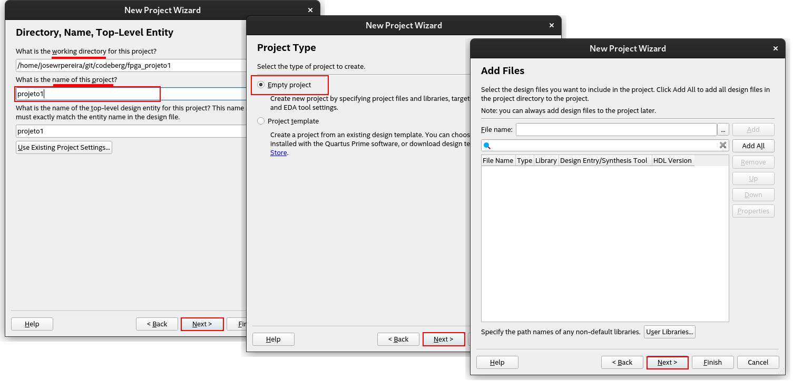
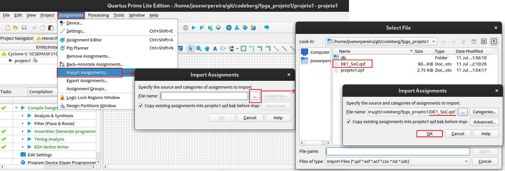

| Figura 1: Novo Projeto                             |
|:--------------------------------------------------:|
| |
| Fonte: Autor                                       |

| Figura 2: Identificação do projeto        |
|:-----------------------------------------:|
|  |
| Fonte: Autor                              |

| Figura 3: Seleção de placa e simulação    |
|:-----------------------------------------:|
|      |
| Fonte: Autor                              |

| Figura 4: Novo arquivo - Diagrama de Blocos             |
|:-------------------------------------------------------:|
|   |
| Fonte: Autor                                            |

| Figura 5: Importação de atribuição de pinos             |
|:-------------------------------------------------------:|
|       |
| Fonte: Autor                                            |

[Intel® Quartus® Prime Design Software Setting File with Pin Assignments](https://www.intel.com/content/www/us/en/developer/articles/technical/fpga-academic-boards.html)
[DE1-SoC.qsf](qsf/DE1_SoC.qsf)
