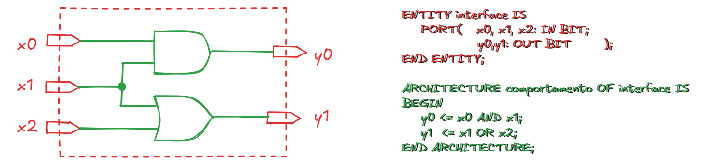

---

**I. Introdução e Contexto Histórico do VHDL**

O VHDL (VHSIC Hardware Description Language) é uma Linguagem de Descrição de Hardware (HDL) desenvolvida para descrever o comportamento de circuitos ou sistemas eletrônicos, permitindo que o circuito físico seja implementado a partir dessa descrição. A origem da linguagem remonta ao projeto VHSIC (Very High Speed Integrated Circuits), financiado pelo Departamento de Defesa dos EUA (DARPA) na década de 1980, com o objetivo de criar uma ferramenta padrão para projeto e documentação de circuitos.

O VHDL foi a primeira HDL a ser padronizada pelo IEEE (Institute of Electrical and Electronic Engineers). As principais versões e padrões incluem:

- **IEEE 1076 (1987 e 1993):** O padrão fundamental da linguagem. As alterações de 1993, embora significativas para arquivos, não trouxeram mudanças cruciais para a síntese de circuitos.
- **IEEE 1164:** Introduziu o pacote `std_logic_1164`, que define tipos de dados (como `STD_LOGIC`) capazes de modelar condições reais de circuitos, como alta impedância (`Z`), níveis de força fraca (`L` e `H`), e estados desconhecidos (`U`, `X`, `W`).
- **IEEE 1076.3:** Define tipos numéricos em formato de vetor (`signed` e `unsigned`) e funções aritméticas para síntese, preenchendo a lacuna deixada pela limitação das operações aritméticas em tipos `INTEGER` e `REAL`.

Uma motivação chave para o uso do VHDL é sua natureza como um padrão independente de tecnologia e fabricante, assegurando a portabilidade e a reusabilidade do código.

---

**II. Aspectos Gerais e Estrutura da Linguagem**

**Concorrência vs. Sequencialidade**

A característica fundamental do VHDL é ser uma **linguagem concorrente**. Com exceção de regiões específicas do código, os comandos são executados simultaneamente, refletindo o funcionamento paralelo de um sistema digital real, onde a ordem de apresentação dos comandos é irrelevante para o comportamento final.

- **Simulação e Atraso Delta ($\Delta$):** Para coordenar a avaliação de eventos que ocorrem no mesmo instante em um código concorrente, o simulador utiliza um atraso interno nulo, denominado $\Delta$. Um sinal recebe um novo valor após um intervalo de $1\Delta$, garantindo a ordenação lógica dos eventos.

No entanto, o VHDL permite delimitar regiões de **código sequencial** usando comandos específicos, onde a execução dos comandos segue a ordem de sua apresentação. Essas regiões são tipicamente encontradas em subprogramas (funções e procedimentos) e processos (`PROCESS`).

**Elementos Estruturais Fundamentais**

Uma descrição VHDL básica é composta por:

1. **Entidade (`ENTITY`):** A abstração primária de um circuito. Define a interface externa do projeto, listando as portas (`PORTs`) e, opcionalmente, os genéricos (`GENERIC`).
2. **Arquitetura (`ARCHITECTURE`):** Descreve o comportamento ou a estrutura interna da entidade, especificando as relações entre as entradas e saídas. Uma entidade pode ter múltiplas arquiteturas, cada par (Entidade-Arquitetura) representando uma entidade distinta com a mesma interface.

**Portas e Modos**

As portas definem a direção e a natureza da transferência de informação na interface da entidade:

- **IN:** Exclusivamente entrada.
- **OUT:** Saída. O valor não pode ser lido internamente pela arquitetura.
- **BUFFER:** Saída, cujo valor pode ser lido internamente. É útil quando o valor de saída precisa ser usado como entrada dentro da própria arquitetura.
- **INOUT:** Porta bidirecional, usada para modelar barramentos de dados.

---

**Classes de Objetos**

Existem quatro classes de objetos em VHDL:

- **Sinal (`SIGNAL`):** Utilizado em regiões concorrentes e sequenciais; o valor é atualizado após um $\Delta$ (na suspensão do processo, se em região sequencial).
- **Variável (`VARIABLE`):** Utilizada em regiões sequenciais; o valor é assumido imediatamente após a execução do comando.
- **Constante (`CONSTANT`):** Valor estático, não alterável durante a execução.
- **Arquivo (`FILE`):** Associado à manipulação de arquivos no sistema hospedeiro (usado principalmente em testes).

---

**III. Aplicações do VHDL e Fluxo de Projeto**

O VHDL não foi concebido originalmente para a síntese de circuitos, mas sim para a descrição e simulação. Contudo, sua aplicação principal no desenvolvimento de hardware digital (ASICs, FPGAs) é a **síntese**.

**Fluxo de Síntese**

O processo de projeto com VHDL, do início ao fim, envolve tipicamente as seguintes etapas:

1. **Elaboração da Descrição VHDL (RTL):** Criação do código com o nível de abstração adequado. Isso pode ser um processo iterativo, com simulações e detalhamento até que a descrição seja sintetizável.
2. **Verificação (Simulação):** O código é validado via simulação, geralmente com estímulos de teste, para garantir que ele corresponda à especificação do projeto.
3. **Síntese:** Uma ferramenta de síntese interpreta o código e infere as estruturas de hardware necessárias (registradores, portas lógicas) no nível RTL (Register Transfer Level).
4. **Transposição para a Tecnologia Alvo:** O circuito RTL (que é genérico) é mapeado para elementos disponíveis na tecnologia de fabricação específica (nível de portas lógicas), otimizando o circuito (velocidade vs. área).
5. **Posicionamento e Interligação (_Place and Route_):** Definição do layout físico dos componentes e roteamento das interconexões no dispositivo alvo.
6. **Verificação Pós-Layout:** O circuito físico com os atrasos de interconexão (obtidos via arquivos SDF - Standard Delay Format) é submetido novamente à simulação para verificar temporização e restrições.

**Abstração e Hierarquia Top-Down**

O VHDL suporta múltiplos níveis de abstração e organização hierárquica. O _top-down design_ (do todo para as partes mais simples) é facilitado pela capacidade de usar diferentes estilos de descrição (estrutural e comportamental) e pela modularização.

A hierarquia é construída no VHDL principalmente pela declaração e solicitação de **componentes**. Um componente representa uma entidade (módulo) menor que é interligada em uma arquitetura maior (estilo estrutural), permitindo o reuso e modularidade do código.

---

**IV. Comandos e Construções Essenciais**

**Comandos Concorrentes**

- **Atribuição de Sinal (`<=`):** A forma básica de atribuir valor a um sinal, sempre com um atraso de $1\Delta$ em relação à sua avaliação.
- **`WHEN ELSE` (Atribuição Condicional):** Permite a transferência condicional de um sinal com prioridade: a primeira condição verdadeira na lista define o valor do sinal.
- **`WITH SELECT` (Atribuição Selecionada):** Transfere um valor a um sinal com base em uma expressão de escolha. As condições devem ser mutuamente exclusivas e todas as possibilidades devem ser cobertas.

**Comandos Sequenciais**

Estes comandos são usados dentro de processos ou subprogramas:

- **Atribuição de Variável (`:=`):** O valor é assumido imediatamente.
- **`IF ELSE`:** Permite a execução condicional de comandos com prioridade definida pela ordem das cláusulas (`IF`, `ELSIF`, `ELSE`).
- **`CASE WHEN`:** Permite a execução condicional de comandos baseada no valor de uma expressão de escolha. As condições devem ser mutuamente exclusivas e todas as condições devem ser cobertas, sendo ideal para máquinas de estados.
- **`WAIT`:** Suspende a execução de um processo ou procedimento, podendo ser condicionado por eventos em sinais (`WAIT ON`), expressões booleanas (`WAIT UNTIL`), ou tempo (`WAIT FOR`).
- **`NULL`:** Não realiza nenhuma operação; útil em construções `CASE WHEN` para cobrir condições sem ação necessária, ou para manter o valor anterior em registradores.

**Outras Estruturas de Controle**

- **`GENERATE`:** Repete comandos concorrentes (`FOR` ou `IF`), crucial para a criação automática de circuitos regulares (como somadores celulares).
- **`LOOP`:** Repete comandos sequenciais (`FOR` ou `WHILE`), usado em rotinas de conversão e geração de vetores de teste. Pode ser controlado por comandos `NEXT` e `EXIT`.

---

**V. Conceitos Avançados**

**Tipos Complexos e Padrões IEEE**

- **Declaração de Tipos:** O VHDL permite a criação de novos tipos (escalares, enumerados, físicos e compostos), sendo o tipo `RECORD` (registro) e `ARRAY` (vetor, incluindo multidimensional) particularmente úteis.
- **Vetor com Limites em Aberto (_Unconstrained Array_):** Permite criar tipos de vetores cuja dimensão é definida apenas na declaração do objeto ou na chamada de um subprograma.
- **Memórias:** Memórias ROM e RAM são implementadas usando vetores compostos por elementos do tipo vetor, o que permite que a ferramenta de síntese infira e utilize blocos de memória dedicados, se disponíveis na tecnologia alvo.

**Funções de Resolução**

Para que um sinal seja acionado por múltiplos controladores (como em um barramento), ele deve ser declarado com um tipo que inclua uma **função de resolução**. Esta função é responsável por determinar o valor lógico final do sinal em caso de conflito, com base no nível de força e no valor lógico de cada controlador (vide tipos `STD_LOGIC` do pacote IEEE 1164).

**Teste e Verificação**

O VHDL fornece comandos e estruturas para criar entidades de teste completas:

- **`ASSERT`:** Comando usado para notificar condições ilegais durante a simulação. Se a condição (o requisito correto) for falsa, uma mensagem é exibida, com um nível de gravidade (`FAILURE`, `ERROR`, `WARNING`, `NOTE`).
- **`REPORT`:** Usado para relatar mensagens durante a simulação (disponível a partir do VHDL-1993).
- **Comandos Pospostos (`POSTPONED`):** Permitem que a execução de comandos concorrentes (como `ASSERT` ou procedimentos) seja atrasada até que todas as iterações de $\Delta$ no instante atual da simulação tenham terminado, garantindo que a avaliação ocorra apenas com valores estáveis.

**Configurações**

As configurações gerenciam a hierarquia de um projeto, definindo os elos entre um componente solicitado em uma arquitetura e uma entidade de projeto específica.

- **Especificação de Configuração:** Inserida na declaração da arquitetura.
- **Declaração de Configuração:** Uma unidade de projeto separada, permitindo que a configuração seja alterada sem recompilar as entidades que utilizam os componentes.

**Bibliotecas e Pacotes**

- **Bibliotecas (`LIBRARY`):** Locais de armazenamento das unidades de projeto compiladas. `WORK` e `STD` são padrão.
- **Pacotes (`PACKAGE`):** Usados para agrupar constantes, tipos, subprogramas e declarações de componentes, facilitando o reuso do código. O acesso aos itens é feito via cláusula `USE`.

A reusabilidade e modularidade são pilares do VHDL, permitindo a gestão de projetos complexos através da hierarquia (_top-down design_) e do particionamento lógico do código em pacotes e entidades.

---

**Referências**

1. D'AMORE, Roberto. VHDL: descrição e síntese de circuitos digitais. 2. ed. Rio
de Janeiro: LTC, 2012.
2. [Curso VHDL - O Código da Eletrônica](https://youtube.com/playlist?list=PLYE3wKnWQbHDdnb3FsDkNx2tj8xoQAPtN&si=7aHA5SoGaX29JoGp)
