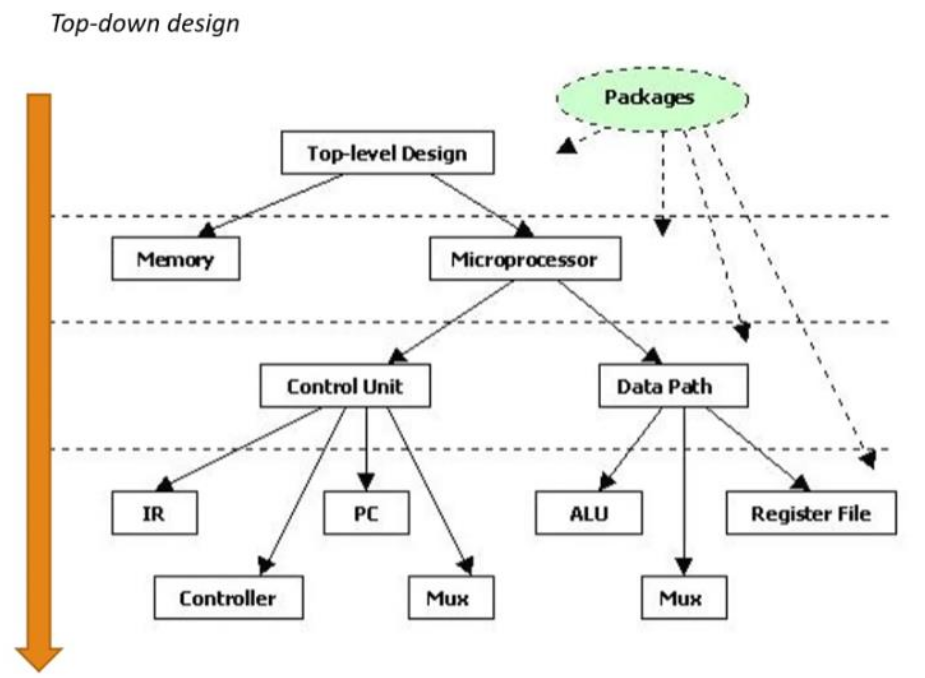
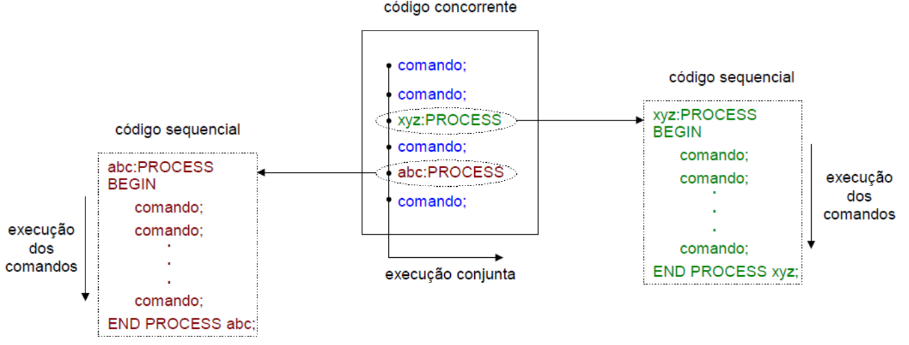

---

Uma linguagem de descrição de hardware (Hardware Description Language - HDL) é uma linguagem de computador especializada usada para descrever a estrutura e o comportamento de circuitos eletrônicos e, mais comumente, circuitos lógicos digitais.

Uma linguagem de descrição de hardware descreve o que um hardware faz e como:

- Modelar
- Representar
- Simular

Existem várias linguagens de descrição de hardware. As duas principais são:

- VHDL
- SystemVerilog


**VHDL**

O nome VHDL é um acrônimo de VHSIC Hardware Description Language. Já o termo VHSIC é o acrônimo de Very High Speed Integrated Circuit. Assim podemos traduzir livremente o nome VHDL como **"linguagem de descrição de hardware para circuitos integrados de velocidade muito alta"**.


A linguagem VHDL foi originalmente desenvolvida por empresas contratadas pelo governo americano e agora é um padrão requerido por todos os ASICs projetados para o exército americano.

1981: DoD (*Department of Defense*) patrocina o 1º encontro de especialistas com o objetivo de discutir métodos para a descrição de circuitos.

1983: DoD define os requisitos de uma linguagem padrão e firma contrato com IBM, Texas e Intermetrics com objetivo de desenvolvimento da linguagem e programas.

1985: Apresentação da versão 7.2 com direitos autorais do manual transferidos para o IEEE – Institute of Electrical and Electronic Engineer
- Incumbências do IEEE:
    - Definir um padrão para a linguagem
    - Manter futuros desenvolvimentos (novas versões etc.)

1987: Após revisões propostas por acadêmicos, representantes de indústrias e o governo dos Estados Unidos, foi definido o padrão IEEE 1076-1987.

As versões mais utilizadas são as definidas em 1993 e 2008, junto com seus pacotes.

Os pacotes tem o objetivo de adicionar facilidades à linguagem, como:

- IEEE 1164: Pacote std_logic_1164
- IEEE 1076.3: Pacotes numeric_bit e numeric_std


Todo arquivo VHDL requer ao menos duas estruturas:

- Entidade (*entity*)
    - Define os aspectos externos da função VHDL, isto é, os nomes das entradas e saídas e o nome da função.
- Arquitetura (*architecture*)
    - Define aspectos internos, funcionamento e relação entre os sinais internos e declarados na entidade.

---

**Exemplo**

Circuito combinacional simples:


```vhdl title='VHDL'
library IEEE;
use IEEE.std_logic_1164.all;

entity circuito is
    PORT( a,b,c: IN std_logic; s: OUT std_logic );
end circuito;

architecture main of circuito is
begin
    s <= (a and b) or c;
end main;

```

**Vantagem do VHDL em relação ao Esquemático**

- Projeto independente da tecnologia;
- Pode-se utilizar a descrição do projeto em vários tipos de plataforma, de um simulador para outro;
- Pode-se utilizar um projeto em VHDL em diferentes projetos;
- Permite, através de simulação, verificar o comportamento do sistema digital;
- Facilidade na atualização dos projetos;
- Reduz tempo de projeto e custo;
- O objetivo do projeto fica mais claro do que na representação por esquemáticos;
- O volume de documentação diminui, já que um código bem comentado em VHDL substitui com vantagens o esquemático e a descrição funcional do sistema;

---

**Aspectos da linguagem**

1. Suporta diversos níveis de hierarquia: uma descrição pode ser um conjunto de descrições interligadas.
2. Estilo de descrição:
   1. Diversas maneiras de descrever um circuito
   2. Níveis de abstração: comportamental, expressões lógicas, redes de ligação;
3. Linguagem concorrente
   1. Ordem dos comandos não importa;
   2. Mudança de valor em um sinal acarreta a execução de todos os comandos envolvidos.
4. Comandos sequenciais:
   1. Somente em regiões delimitadas no código, subprogramas e processos.


---

**Aspectos gerais da linguagem**

**Hierarquia**

Suporta diversos níveis de hierarquia, sendo que a descrição pode ser a interligação de um conjunto de descrições.




**Estilo de descrição**

Um circuito pode ser descrito de diversas maneiras, com diferentes níveis de abstração, entre eles comportamental, por expressões lógicas e por redes de ligação.

```vhdl title="comportamental"
if a = b then
    equals <= '1';
else
    equals <= '0';
end if;
```

```vhdl title="expressões lógicas"
equals <= '1' when (a = b) else '0';
```

```vhdl title="redes de ligação (estrutural)"
U0: xnor port map (a(0), b(0), x(0));
U1: xnor port map (a(1), b(1), x(1));
U2: xnor port map (a(2), b(2), x(2));
U3: xnor port map (a(3), b(3), x(3));
U4: and4 port map (x(0), x(1), x(2), x(3), equals);
```

No estilo misto, os estilos mostrados acima são usados em um mesmo código.


**Concorrência**

Na concorrência, a ordem dos comandos não importa, pois descrevem partes de um circuito, e uma mudança de valor em um sinal, acarreta a execução de todos os comandos envolvidos.

```vhdl
x <= a and b;
y <= c or x;
```

```vhdl
y <= c or x;
x <= a and b;
```

Assim, o resultado para os dois códigos acima é o mesmo, pois no circuito sintetizado, tudo acontece ao mesmo tempo.

**Comandos sequenciais**

Comandos sequenciais, como acontece em linguagens de programação mais convencionais, podem ser declaradas somente em uma região específica, subprogramas e processos, e delimitada do código. Cada região é executada de forma concorrente às demais.



---

**Síntese de circuitos**

A linguagem VHDL está voltada para o projeto e documentação de circuitos
digitais, então não necessariamente a linguagem foi criada para síntese de circuitos. Assim, nem todo código e nem toda construção em HDL pode ser sintetizada
em circuitos lógicos.

Nos circuitos digitais isso se deve a uma falta de correspondência da descrição com o circuito digital real, a impossibilidade da síntese com precisão, ou uma falta de detalhamento para uma síntese direta.

Motivos da limitação:

- Falta de correspondência entre: construção x circuito real. A construção do código pode ser simulada, porém não pode ser montado por não haver o correspondende componente real.
- Impossibilidade de síntese direta. Uma multiplicação de dois números reais, por exemplo, pode ser simulada, porém a complexidade do circuito é alta o suficiente para não poder ser montado, sintetizado.


**Síntese da descrição**


1. Elaboração da descrição e compilação.

2. A mesma descrição é interpretada por uma ferramenta de síntese que infere as estruturas necessárias para um circuito que corresponda à descrição.

3. Verificação de erros de sintaxe;

4. Circuito nível RTL (Register Transfer Level): não é associado a nenhuma tecnologia,apenas à lógica digital;

5. Nível de portas: portas lógicas, somadores, comparadores etc. São componentes que existem no seu dispositivo de destino, por exemplo na sua FPGA ou no seu ASIC.

6. Otimização: a depender do seu dispositivo final você pode escolher se quer uma velocidade maior ou uma área menor.


**Rede de Ligações**

O resultado dessa etapa é um arquivo contendo uma rede de ligações de elementos básicos disponíveis na tecnologia do dispositivo empregado. Esse arquivo contendo a rede de ligações é a base de dados para a ferramenta que realiza o posicionamento e a interligação dos componentes, place and route.

Uma nova simulação pode ser feita, agora com uma precisão maior, envolvendo os tempos de atraso.


---

**Referências**

1. D'AMORE, Roberto. VHDL: descrição e síntese de circuitos digitais. 2. ed. Rio
de Janeiro: LTC, 2012.
2. [Curso VHDL - O Código da Eletrônica](https://youtube.com/playlist?list=PLYE3wKnWQbHDdnb3FsDkNx2tj8xoQAPtN&si=7aHA5SoGaX29JoGp)
