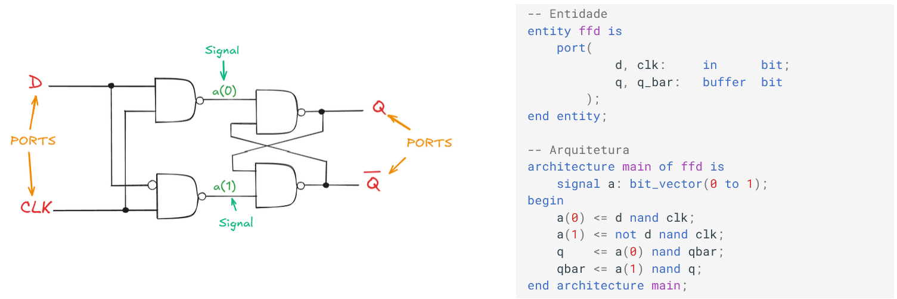

Aqui são apresentadas as bases da linguagem VHDL, essenciais para a descrição, simulação e síntese de circuitos digitais com os seus conceitos primários que permitem aos projetistas e programadores começar a interagir com as ferramentas de desenvolvimento de circuitos.

---

**1. Entidade de Projeto (Design Entity)**

A abstração fundamental de um circuito em VHDL é a Entidade de Projeto (Design Entity). Uma entidade de projeto pode representar desde uma porta lógica simples até um sistema completo, e é estruturada em duas partes principais: a Declaração da Entidade e o Corpo da Arquitetura.

**1.1 Declaração da Entidade**

A Declaração da Entidade define a interface do circuito com o ambiente externo. Ela começa com a palavra reservada `ENTITY`, seguida pelo nome que a identifica. Dentro da declaração, a cláusula `PORT` é utilizada para definir as portas de entrada e saída, incluindo seu modo e tipo.

**Modos de Porta:** Quatro modos são definidos para determinar a direção e o comportamento de uma porta:

- **`IN`**: Opera exclusivamente como entrada.
- **`OUT`**: Opera como saída. Uma característica crucial é que o valor apresentado na porta _não pode ser lido_ (referenciado internamente) pela arquitetura.
- **`BUFFER`**: Opera como saída, mas, ao contrário de `OUT`, permite que o valor apresentado seja referenciado internamente pela arquitetura.
- **`INOUT`**: Caracteriza uma porta bidirecional, ideal para modelar barramentos de dados.

**Genéricos (`GENERIC`)**: A cláusula `GENERIC` permite a passagem de informações estáticas (como parâmetros ou dimensões) para a unidade de projeto. Internamente, esses parâmetros são tratados como constantes.

**1.2 Corpo da Arquitetura**

O Corpo da Arquitetura especifica a lógica interna e as relações entre as entradas e saídas da entidade. Inicia-se com a palavra reservada `ARCHITECTURE`, seguida por um nome identificador e o nome da entidade associada. O identificador permite que uma mesma declaração de entidade tenha múltiplas arquiteturas, cada par (declaração-arquitetura) representando uma entidade distinta com a mesma interface.

A região anterior ao `BEGIN` da arquitetura é reservada para declarações de sinais, constantes, subprogramas e a identificação de componentes externos. Os comandos concorrentes que descrevem o comportamento do circuito são posicionados entre as palavras reservadas `BEGIN` e `END`.

---

**2. Classes de Objetos**

Objetos são elementos da linguagem utilizados para armazenar valores. O VHDL define quatro classes principais de objetos:

1. **`CONSTANT` (Constante):** Possui um valor estático e imutável.
2. **`VARIABLE` (Variável):** Seu valor pode ser alterado apenas em regiões de código sequencial. A atribuição de valor é feita com o delimitador `:=`.
3. **`SIGNAL` (Sinal):** Seu valor pode ser alterado em regiões de código concorrente ou sequencial. A atribuição de valor é feita com o delimitador `<=`. No VHDL, a atribuição de valor a um sinal ocorre após um pequeno intervalo de tempo (delta delay, $\Delta$) na iteração dos comandos concorrentes.
4. **`FILE` (Arquivo):** Objeto associado à criação e manipulação de arquivos (abordado com mais profundidade no Capítulo 13).

A sintaxe de declaração para `CONSTANT`, `VARIABLE` e `SIGNAL` é similar, exigindo a palavra reservada da classe, o nome do objeto, o tipo, e, opcionalmente, um valor inicial.

---

**3. Tipos**

Um tipo define o conjunto de valores que um objeto pode assumir e o conjunto de operações permitidas. É fundamental que todo objeto seja declarado com um tipo definido. A transferência direta de valores entre objetos de tipos diferentes não é permitida sem uma operação de conversão explícita.

**3.1 Tipos Escaladores Predefinidos**

Tipos escalares são ordenados e representam um único valor, sendo essenciais para operações de comparação. Os principais tipos predefinidos no pacote padrão incluem:

- **`BIT`**: Pode assumir apenas '0' ou '1'.
- **`BOOLEAN`**: Assume `FALSE` ou `TRUE`.
- **`CHARACTER`**: Caracteres ASCII (ou IS08859-1 na versão VHDL-1993).
- **`INTEGER`**: Representa números inteiros. Por padrão, pode abranger uma ampla faixa de valores, mas é recomendado especificar limites (`RANGE`) para garantir um uso eficiente dos recursos na síntese de circuitos. Os subtipos `NATURAL` (inteiros não negativos) e `POSITIVE` (inteiros positivos) são derivados de `INTEGER`.
- **`REAL`**: Números de ponto flutuante. Geralmente não é suportado por ferramentas de síntese devido à complexidade da implementação.
- **`TIME`**: Tipo físico usado para representar unidades de tempo (ex.: `ns`, `ms`, `sec`). É ignorado pelas ferramentas de síntese.

As atribuição de valores a sinais dos tipos `INTEGER` e `REAL`, incluindo diferentes bases numéricas e faixas de valores.

```vhdl
ENTITY int_real IS
PORT (
		c11, c12      : OUT INTEGER RANGE    0 TO 31;
		c13, c14      : OUT INTEGER RANGE   31 DOWNTO 0;
		c15, c16, c17 : OUT INTEGER RANGE  -15 TO 15;
		cr1, cr2      : OUT REAL    RANGE  0.0 TO 31.0;
		cr3, cr4      : OUT REAL    RANGE 31.0 DOWNTO 0.0
	 );
END int_real;

ARCHITECTURE teste OF int_real IS
	CONSTANT i1 : INTEGER := 11;
	CONSTANT i2 : INTEGER := 10#11#;
	CONSTANT i3 : INTEGER := 2#1011#;
	CONSTANT i4 : INTEGER := 2#01_01_1#;
	CONSTANT i5 : INTEGER := 5#21#;
	CONSTANT i6 : NATURAL := 8#13#;
	CONSTANT i7 : POSITIVE := 16#B#;
	CONSTANT r1 : REAL := 11.0;
	CONSTANT r2 : REAL := 1.1E01;
	CONSTANT r3 : REAL := 2#1011.0#;
	CONSTANT r4 : REAL := 8#13.0#E0;
	CONSTANT r5 : REAL := 16#B.0#;
BEGIN
	c11 <= i1; c12 <= i2; c13 <= i3; c14 <= i4; c15 <= i5; c16 <= i6; c17 <= i7;
	cr1 <= r1; cr2 <= r2; cr3 <= r3; cr4 <= r4; cr5 <= r5;
END teste;
```

Este exemplo demonstra a importância da rigorosa definição de faixas de valores (`RANGE`). Em descrições voltadas para síntese, essas restrições são vitais, pois comunicam à ferramenta o número mínimo de bits necessários para representar todos os valores que o objeto pode assumir, otimizando o uso de recursos de hardware.

A inclusão de constantes do tipo `REAL` inviabiliza a síntese direta da descrição, uma vez que exigiria estruturas complexas de ponto flutuante. Por outro lado, a notação para bases numéricas diferentes da base 10, como `2#1011#` ou `16#B#`, é bem ilustrada, sendo a notação `base#valor#` a forma padronizada.


**3.2 Tipos Compostos (`ARRAY`)**

O tipo composto fundamental introduzido é o vetor (`ARRAY`). O VHDL predefine:

- **`BIT_VECTOR`**: Um vetor cujos elementos são do tipo `BIT`.
- **`STRING`**: Um vetor cujos elementos são do tipo `CHARACTER`.

A ordem dos índices em um vetor é definida usando `TO` (ascendente) ou `DOWNTO` (descendente).

**Agregados (Aggregates)**: Permitem atribuir valores a vetores por posição ou por nome (usando a notação `=>`), sendo a palavra reservada `OTHERS` válida para cobrir elementos não especificados.


Este código demonstra a atribuição de valores a vetores de bits, a concatenação e a utilização de literais em diferentes bases, como hexadecimal.

```vhdl
ENTITY std_a IS
	PORT( s1, s2, s3, s4, s5 : OUT BIT_VECTOR (4 DOWNTO 0) );
END std_a;

ARCHITECTURE teste OF std_a IS
	CONSTANT c1 : BIT_VECTOR(4 DOWNTO 0) := "01011"; -- constante
	CONSTANT zero : BIT := '0';
	CONSTANT um : BIT := '1';
BEGIN
	s1 <= c1;
	s2 <= "01011";
	s3 <= B"010_11";
	s4 <= zero & x"B";                               -- x"B" : notação hexadecimal
	s5(4 DOWNTO 3) <= "01";                          -- "01xxx"
	s5(2 DOWNTO 0) <= zero & um & zero;              -- "01010"
END teste;
```

---


 O código seguinte, ilustra o emprego do tipo `STRING` e a concatenação de sinais desse tipo, demonstrando a manipulação de dados de texto na arquitetura.

```vhdl
ENTITY hs_ta1 IS
	PORT( c, d : OUT STRING(1 TO 9) );
END hs_ta1;

ARCHITECTURE teste OF hs_ta1 IS
	SIGNAL x : STRING(1 TO 3) := "Alo";   -- sinais que poderiam ser CONSTANT
	SIGNAL y : STRING(1 TO 5) := "mundo"; -- no entanto, foram declarados como SIGNAL
BEGIN
	c <= x & " " & y;         -- concatena x, um espaço e y: "Alo mundo"
	d <= x(1 TO 2) & ' ' & y; -- concatena parte de x, um espaço e y: "Al mundo"
END teste;
```

 O tipo `STRING` é um vetor (`ARRAY`) predefinido de elementos do tipo `CHARACTER`. A concatenação (`&`) é utilizada para unir vetores e elementos de forma sequencial, resultando em uma string maior.

Enquanto `SIGNAL` é um objeto cujo valor pode ser alterado e é empregado em regiões concorrentes, `CONSTANT` possui um valor estático. Neste caso, como os valores de `x` e `y` não são alterados, a declaração como `CONSTANT` seria semanticamente mais apropriada e poderia auxiliar na otimização da descrição pelo compilador/sintetizador, embora o código ainda funcione corretamente com `SIGNAL`.


---

Este código exemplifica o uso de **agregados** (`aggregate`) para atribuir valores a vetores (`BIT_VECTOR`), empregando tanto a notação posicional quanto a nomeada, e ilustrando a cláusula `OTHERS`.

```vhdl
ENTITY std_a1 IS
	PORT( s2, s3, s4, s5 : OUT BIT_VECTOR(4 DOWNTO 0) );
END std_a1;

ARCHITECTURE teste OF std_a1 IS
	CONSTANT zero : BIT := '0';
	CONSTANT um   : BIT := '1';
BEGIN
	s2 <= ('0', '0', '0', '1', '0');                  -- "00010"
	s3 <= (1=>'1', 0=>'1', OTHERS=>'0');              -- "00011"
	s4 <= (zero, '0', um OR '0', '0', '0');           -- "00100"
	s5 <= (4 DOWNTO 3 =>'0', 1=>'0', OTHERS=>'1');    -- "00101"
END teste;
```

O uso de agregados, como visto nas atribuições de `s3` e `s5`, é uma técnica poderosa em VHDL para inicializar ou atribuir valores a tipos compostos, garantindo que todos os elementos sejam cobertos. Por exemplo, em `s5`, os bits nas posições 4 e 3 recebem '0' (notação de faixa discreta), a posição 1 recebe '0', e todas as outras posições (`OTHERS`) recebem '1'.


**3.3 Definição de Novos Tipos e Subtipos**

É possível criar novos tipos (enumerados, físicos ou compostos) e subtipos. Um **Subtipo** restringe a faixa de valores de um tipo existente, mantendo a compatibilidade para troca de valores entre objetos do tipo base e do subtipo.

---

**4. Operadores**

Os operadores são essenciais para construir expressões e definir a lógica do circuito. Eles são agrupados em classes que determinam sua ordem de precedência. Em geral, os operandos em uma operação devem ser do mesmo tipo.

As classes de operadores, listadas por ordem crescente de precedência, são:

|Precedência|Classe|Operadores|
|:--|:--|:--|
|Menor|Lógicos|`and`, `or`, `nand`, `nor`, `xor`, `xnor`|
||Relacionais|`=`, `/=`, `<`, `<=`, `>`, `>=`|
||Deslocamento|`sll`, `srl`, `sla`, `sra`, `rol`, `ror` (Adicionados na VHDL-1993)|
||Adição|`+`, `-`, `&` (Concatenação)|
||Sinal|`+`, `-` (Identidade e Negação)|
||Multiplicação|`*`, `/`, `mod`, `rem`|
|Maior|Diversos|`**` (Exponenciação), `abs` (Valor Absoluto), `not`|

**Operadores Lógicos**: Aplicáveis a tipos `BIT`, `BOOLEAN` e vetores desses tipos (como `BIT_VECTOR`). O `not` possui a maior precedência.

**Operadores Relacionais**: Testam igualdade (`=`), desigualdade (`/=`) e ordenação (`<`, `<=`, `>`, `>=`). O resultado é sempre um valor `BOOLEAN`.

**Operador de Concatenação (`&`)**: Permite unir vetores ou elementos do mesmo tipo, resultando em um novo vetor cujo tamanho é a soma dos operandos.


---

O código que segue exemplifica a necessidade de parênteses em expressões lógicas para evitar ambiguidade ou erros de compilação, uma vez que `AND`, `OR`, `NAND`, `NOR`, `XOR` e `XNOR` têm a mesma precedência, sendo apenas o `NOT` de precedência mais elevada.

```vhdl
ENTITY std_xa1 IS
	PORT( a, b, c, d :         IN    BIT;
		  x1, x2, x3, x4, x5 : OUT   BIT   );
END std_xa1;

ARCHITECTURE exemplo OF std_xa1 IS
BEGIN
	x1 <= a OR NOT b;                -- Certo: operador NOT tem precedência mais elevada
	x2 <= a AND b AND c;             -- Certo: operadores iguais
	-- x3 <= a AND b OR c;           -- Errado: expressão ambígua x3=(a.b)+c ou x3=a.(b+c) ?
	x3 <= (a AND b) OR c;            -- Certo: empregando parêntesis
	-- x4 <= a AND b OR c AND d;     -- Errado: expressão ambígua, operadores com mesma precedência
	x4 <= (a AND b) OR (c AND d);    -- Certo: x4 = a.b + c.d
	-- x5 <= a NAND b NAND c;        -- Errado: operadores com negação necessitam parêntesis
	x5 <= (a NAND b) NAND c;         -- Certo: operador com negação entre parêntesis
END exemplo;
```

---

Este próximo exemplo demonstra o uso do operador de concatenação (`&`) e o operador de soma (`+`), que, no pacote padrão, são definidos unicamente para tipos numéricos, com o tipo `BIT_VECTOR` utilizando concatenação para combinar vetores.

```vhdl
ENTITY std_xc IS
	PORT( bv_a, bv_b   : IN  BIT_VECTOR(1 DOWNTO 0);
		  int_a, int_b : IN  INTEGER RANGE -32 TO 31;
		  bv_c, bv_d   : OUT BIT_VECTOR(3 DOWNTO 0);
		  int_c        : OUT INTEGER RANGE -64 TO 63 );
END std_xc;

ARCHITECTURE teste OF std_xc IS
BEGIN
	bv_c  <=  bv_a  & bv_b;
	bv_d  <=  bv_a  & '1' & '0';
	int_c <= -int_a + int_b;
END teste;
```

---

Este código ilustra a utilização dos operadores de multiplicação, divisão (`*`, `/`), e os operadores de resto (`REM`, `MOD`), definidos para tipos inteiros e reais. Destaca-se a diferença no sinal do resultado entre `REM` (sinal do operando esquerdo, $L$) e `MOD` (sinal do operando direito, $R$).

```vhdl
ENTITY std_xd IS
	PORT( l, r             : IN  INTEGER RANGE -32 TO 31;
		  l_mul_r, l_div_r : OUT INTEGER RANGE -32 TO 31;
		  l_rem_r, l_mod_r : OUT INTEGER RANGE -32 TO 31  );
END std_xd;

ARCHITECTURE teste OF std_xd IS
BEGIN
	l_mul_r <= l * r;
	l_div_r <= l / r;
	l_rem_r <= l REM r; -- l = (l/r) * r + (l rem r)
	l_mod_r <= l MOD r; -- l = r * n + (l mod r) sendo n um valor inteiro
END teste;
```


---

A Figura 1 ilustra o uso de alguns dos elementos apresentados, como a estrutura da entidade e da arquitetura, a declaração dos pinos de acesso ao circuito, declaração de sinal e operadores lógicos. 

| Figura 1: Exemplo de circuito e descrição em VHDL |
|:-------------------------------------------------:|
|            |
| Fonte: Autor                                      |

---

**Referências**

1. D'AMORE, Roberto. VHDL: descrição e síntese de circuitos digitais. 2. ed. Rio
de Janeiro: LTC, 2012.
