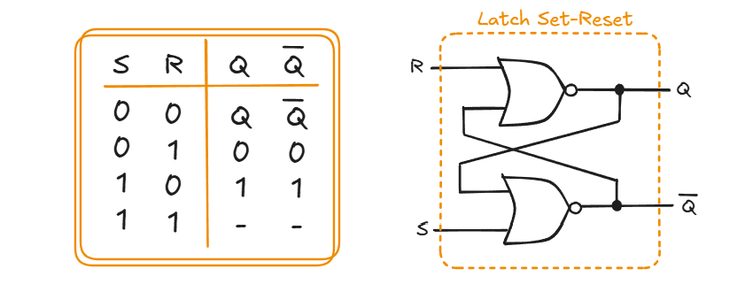
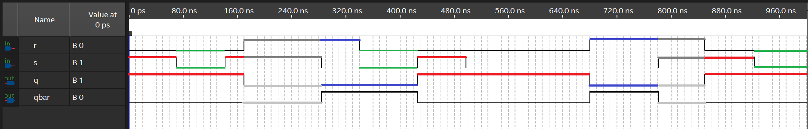
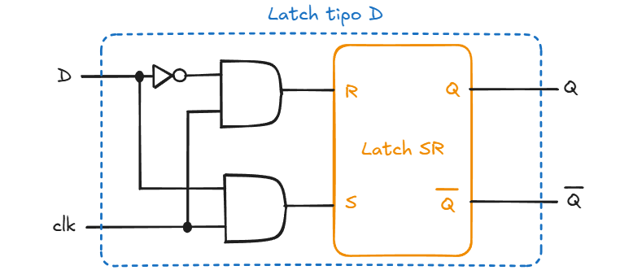
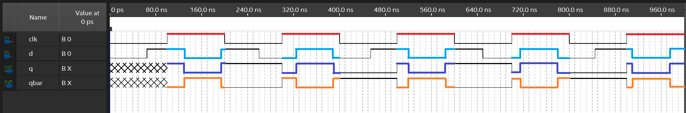
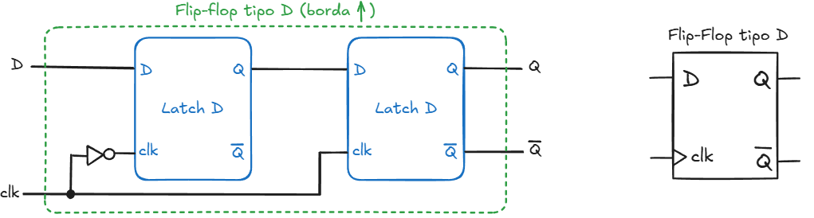
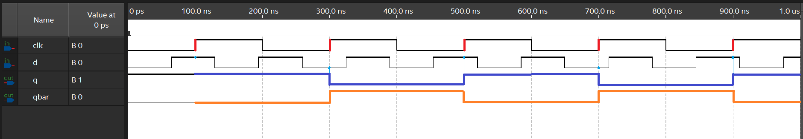
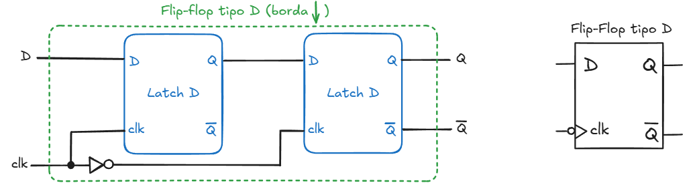

---

Os circuitos digitais são divididos em dois tipos, sendo eles os circuitos combinacionais e os circuitos sequencias.

Os circuitos combinacionais produzem suas saídas da combinação dos valores de suas entradas e da lógica de construção do circuito, de forma praticamente imediata. 

Já o circuitos sequanciais tem como característica a capacidade de armazenar um valor. 

Destre os circuitos sequenciais, que realizam a função de elemento de memória ou de estado, podemos destacar:

- Latches: Set-Reset e D;
- Flip-flops: D e T;
- Registradores: Deslocamento e contadores;
- Memórias e Registradores.

Talvez o principal elemento para armazenar um dado seja o flip-flop tipo D, que está sendo construído nesta sequencia utilizando circuitos menos complexos, até o nosso ponto de partida que é o circuito do `latch SR`, um circuito que está representado na Figura 1, juntamente com sua tabela verdade.

O Latch Set-Reset é o mais simples e não possui sinal de clock como os demais.

| Figura 1: Latch Set-Reset       |
|:-------------------------------:|
|  |
| Fonte: Autor                    |


```vhdl title='latch_sr.vhdl'
entity latch_sr is
	port(   r,s:    in      bit; 
            q,qbar: buffer  bit);
end entity;

architecture main of latch_sr is
begin
	q <= r nor qbar;
	qbar <= s nor q;
end architecture;
```




---

O sinal de clock é um sinal periódico, de onda quadrada, sendo metade do ciclo em nível alto e a outra metade em nível baixo. O clock é o que determina quando os eventos dos circuitos devem acontecer, seja por nível ou por transição (borda), como são chamados os modos de temporização.

- *Level-triggered*: as mudanças de estado ou atualização do circuito ocorre em um dos níveis do clock, alto ou baixo.
- *Edge-triggered*: a mudança de estado ou atualização do circuito ocorre na transição do clock, borda de subida ou descida.

O Latch tipo D possui uma entrada de clock, que habilita a escrita do circuito, e a Figura 2 mostra o circuito equivalente.

A saída do latch tipo D é atualizado com o valor da entrada D quando a entrada de clock está em nível alto (1). Quando a entrada de clock está em nível baixo (0), o sinal de saída é o valor armazenado no último instante em que o clock estava em nível alto. 

| Figura 2: Latch tipo D          |
|:-------------------------------:|
|    |
| Fonte: Autor                    |


```vhdl title="latch_d.vhdl"
entity latch_d is
	port(d,clk: in bit; q,qbar: out bit);
end entity;

architecture main of latch_d is
	signal r,s: bit;
begin
	r <= not d and clk;
	s <= d and clk;

	RS: 	entity work.latch_sr(main) 
			port map(r=>r,s=>s,q=>q,qbar=>qbar);
	
end architecture;
```



---

Os flip-flops são elementos construídos com latches e armazenam o valor de 1 bit mediante uma transição do sinal de sincronismo, o clock. 

Diferente do Latch tipo D, a atualização da saída somente ocorre no instante da transição, borda de subida, no sinal de clock (clk). 

A Figura 3 apresenta o diagrama de um flip-flop tipo D com atualização pela borda de subida no sinal de clock. 

| Figura 3: Flip-flop tipo D com clock em borda de subida |
|:-------------------------------:|
|  |
| Fonte: Autor                    |


```vhdl title="d_ff.vhdl"
entity d_ff is 
	port(d,clk: in bit; q,qbar: out bit);
end entity;

architecture rising of d_ff is
	signal qd,clkbar: bit;
begin
	clkbar <= not clk;

	LATCH_D_IN:	entity work.latch_d(main) 
					port map(d=>d,clk=>clkbar,q=>qd,qbar=>open);

	LATCH_D_OUT:entity work.latch_d(main) 
					port map(d=>qd,clk=>clk,q=>q,qbar=>qbar);
	
end architecture;
```



A Figura 4 apresenta o diagrama de um flip-flop tipo D com atualização pela borda de descida no sinal de clock. 

| Figura 4: Flip-flop tipo D com clock em borda de descida |
|:-------------------------------:|
|  |
| Fonte: Autor                    |


```vhdl title="d_ff.vhdl"
entity d_ff is 
	port(d,clk: in bit; q,qbar: out bit);
end entity;

architecture falling of d_ff is
	signal qd,clkbar: bit;
begin
	clkbar <= not clk;

	LATCH_D_IN:	entity work.latch_d(main) 
					port map(d=>d,clk=>clk,q=>qd,qbar=>open);

	LATCH_D_OUT:entity work.latch_d(main) 
					port map(d=>qd,clk=>clkbar,q=>q,qbar=>qbar);
	
end architecture;
```

---

---

**Referências**

1. D'AMORE, Roberto. VHDL: descrição e síntese de circuitos digitais. 2. ed. Rio
de Janeiro: LTC, 2012.
1. [Curso VHDL - O Código da Eletrônica](https://youtube.com/playlist?list=PLYE3wKnWQbHDdnb3FsDkNx2tj8xoQAPtN&si=7aHA5SoGaX29JoGp)
