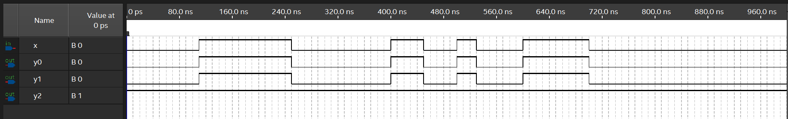
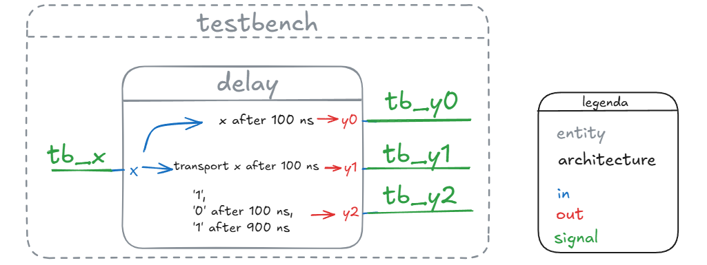
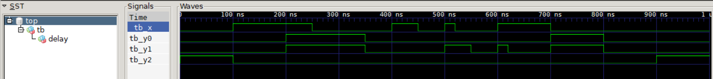
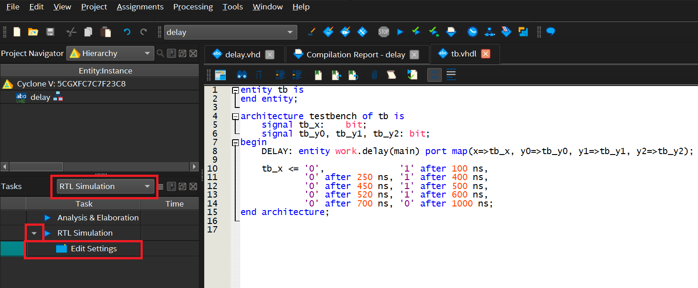
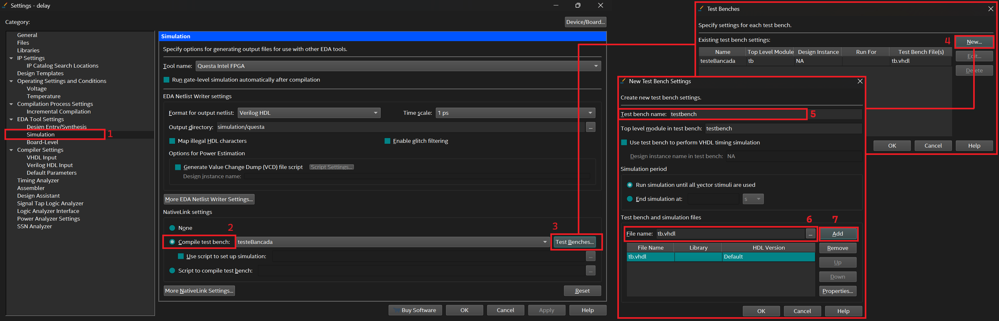
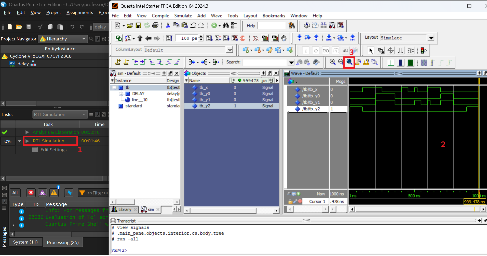
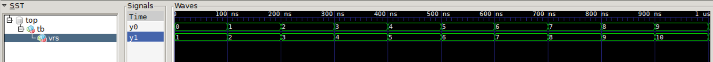

Atraso, variável e atributos

Aprofunda conceitos fundamentais da linguagem VHDL, essenciais para a modelagem temporal e a manipulação detalhada de objetos. O objetivo é refinar o conhecimento sobre estes tópicos, introduzindo conceitos como atrasos de propagação e a distinção comportamental entre sinais e variáveis, além de explorar a funcionalidade dos atributos.

---

**1. Atraso (Delay)**

O atraso em VHDL é utilizado para a modelagem do comportamento dinâmico de um circuito ou para a geração de formas de onda em testes de descrições,. É crucial notar que os comandos que modelam o atraso são, via de regra, **ignorados pelas ferramentas de síntese**,.

A modelagem temporal pode ser realizada em dois modelos principais, definidos pela cláusula `AFTER`:

1. **Modelo com Inércia (Inertial Delay):** Este é o modelo assumido quando a opção `TRANSPORT` é omitida. É indicado para representar a propagação de informações através de circuitos lógicos, onde pulsos com duração inferior ao atraso de propagação do circuito não são transferidos para a saída,.
2. **Modelo com Transporte (Transport Delay):** É especificado pela cláusula `TRANSPORT`. Neste modelo, a informação é sempre transmitida, independentemente da duração do pulso,.


A cláusula `AFTER` encontra utilidade primária na geração de estímulos e formas de onda para auxiliar no teste e simulação de uma descrição, embora não seja sintetizável.

Segue código de exemplo de teste. 

```vhdl title='Teste da cláusula AFTER'
entity delay is 
	port(x: in bit; y0, y1, y2: out bit);
end entity;

architecture main of delay is 
begin
	y0 <= x after 100 ns;
	y1 <= transport x after 100 ns;
	y2 <= '1', '0' after 100 ns, '1' after 900 ns;
end architecture;
```

Ao produzir um teste utilizando o `University VWF`, obtem-se um resultado insatisfatório, sendo esta forma de visualização inadequada para este nível de simulação.



Uma forma adequada de realizar o teste é também usar a cláusula `after` em sua aplicação primária, produzindo uma forma de onda de teste e aplicando à entrada que se quer testar o comportamento. 

Uma entidade de teste, basicamente implementa a(s) entidade(s) testada(s), e conecta sinais(`signal`) aos quais é possível produzir estímulos e visualizar os resultados.  

A entidade `delay` produz três saídas, sendo:

- `y0`: copia o sinal de `x` se este permanecer ligado por pelo menos `100 ns`;
- `y1`: copia o sinal de `x` com um atraso de `100 ns`, independente do período em que o sinal ficou ativado;
- `y2`: produz um perfil de saída independente do sinal de entrada `x`, iniciando em `1`, indo a `0` entre o período de 100 ns até 900 ns, e voltando para `1` até o final da simulação. Este perfil é comum em testes de sinais de `clear`, `preset` ou `reset`.


A entidade `testbench` ou simplesmente `tb`, é ilustrada na Figura 1, implementa a entidade `delay`, e produz através do sinal (`signal`) `tb_x` o estímulo de teste desejado. 


| Figura 1: Diagrama da entidade de teste de bancada (*testbench*) | 
|:---:|
|  |
| Fonte: Autor |


Para exemplificar, um sinal com perfil análogo ao produzido no teste utilizando o `University VWF` foi gerado em `tb_x`.


```vhdl title='testbench'
entity tb is
end entity;

architecture testbench of tb is
    signal tb_x:    bit;
    signal tb_y0, tb_y1, tb_y2: bit;
begin
    DELAY: 	entity work.delay(main) port map(x=>tb_x, y0=>tb_y0, y1=>tb_y1, y2=>tb_y2);

    tb_x <= '0',              
			'1' after 100 ns, '0' after 250 ns, 
			'1' after 400 ns, '0' after 450 ns, 
			'1' after 500 ns, '0' after 520 ns, 
			'1' after 600 ns, '0' after 700 ns, '0' after 1000 ns;
end architecture;
```

Assim como ilustrado na Figura 1 e no código `testbench`, a entidade `tb` produz e conecta os sinais `tb_x`, `tb_y0`, `tb_y1` e `tb_y2` respectivamente em `x`, `y0`, `y1`, e `y2` da entidade `delay`. 
Na arquitetura `testbench`, a entidade `delay` é instanciada e os sinais, entradas e saídas mapeados. Ao produzir estímulo em `tb_x`, estamos produzindo o sinal equivalente na entrada `x` da entidade `delay`, já que estão conectados. 

Na visualização, Figura 2, selecionamos os sinais `tb_y0`, `tb_y1` e `tb_y2` para ver o resultado produzido pela entidade `delay`, além do sinal de estímulo produzido em `tb_x`.

| Figura 2: Visualização dos sinais do `tb` no software GTKWave | 
|:-------------------------------------------------------------:|
|  |
| Fonte: Autor                    |


Para a simulação do código `delay.vhdl` usando o teste de bancada (*testbench*) `tb.vhdl`, é necessário seguir as seguintes instruções:

- No Quartus, na janela **Tasks**, selecione ***RTL Simulation***;
- Conforme ilustrado na Figura 3, clique em **Edit Settings**;

| Figura 3: Simulação RTL e código do teste de bancada |
|:----------------------------------------------------:|
|     |
| Fonte: Autor                                         |

- Siga a sequencia de passos da Figura 4 para incluir o arquivo `tb.vhdl` no simulador;

| Figura 4: Inclusão de teste de bancada no simulador QuestaSim |
|:-------------------------------------------------------------:|
|                |
| Fonte: Autor                                                  |

- Ao executar a função ***RTL Simulation***, o simulador configurado será aberto. Neste caso o Questa Intel Starter FPGA Edition, como mostrado na Figura 5.

| Figura 5: Forma de onda no simulador QuestaSim    |
|:-------------------------------------------------:|
|  |
| Fonte: Autor                                      |

O carregamento e execução do *testbench* ocorre de forma automática, porém o ajuste das ondas não. Clique sobre a tela de exibição das formas de onda e em seguida clique em `Zoom Full` para ajustar e visualizar toda a simulação.

---

**2. Sinal e Variável (Signal and Variable)**

Sinal (`SIGNAL`) e Variável (`VARIABLE`) são classes de objetos que armazenam valores, mas se diferenciam fundamentalmente na região de declaração e no mecanismo de atribuição e atualização de valor.

| Característica    | Sinal (`SIGNAL`) | Variável (`VARIABLE`) |
| :---------------- | :--------------- | :-------------------- |
| **Região de Uso** | Concorrente e Sequencial.| Exclusivamente Sequencial |
| **Declaração**    | Geralmente fora de `PROCESS` (exceto para sinais locais em `BLOCK`) | Dentro de `PROCESS` ou subprogramas |
| **Atribuição**    | Usa o delimitador `<=` O valor é agendado e assume-o após um intervalo de tempo $\Delta$ (delta delay), na iteração dos comandos concorrentes. | Usa o delimitador `:=`  O valor é assumido **imediatamente** após a execução do comando |
| **Visibilidade**  | Pode ser visível em regiões concorrentes.  | Visível apenas no _processo_ em que foi declarada. |

O tempo de atualização da variável é imediato, o que geralmente resulta em menor consumo de memória e melhor desempenho durante a simulação, se comparado ao agendamento de eventos e à construção de tabelas de sinais requerida para as atribuições de sinais.

A distinção no tempo de atribuição é vital para a inferência correta de hardware. Em regiões sequenciais (processos), se uma variável recebe um novo valor **antes** de ser referenciada, a ferramenta de síntese não infere um elemento de memória; se a variável é referenciada (utilizada) **antes** de receber um novo valor, um registrador pode ser inferido para armazenar o valor anterior.

```vhdl title='Diferença no uso de signal e variable'
entity vars is
    port( y0, y1: out integer );
end entity;

architecture main of vars is
    signal z0 : integer := 0;
begin
    sig: process
    begin
        z0 <= z0 + 1;
        y0 <= z0;
        wait for 100 ns;
    end process;

    var: process
    variable z1 : integer := 0;
    begin
        z1 := z1 + 1;
        y1 <= z1;
        wait for 100 ns;
    end process;
end architecture;
```

```vhdl title='testbench'
entity tb is
end entity;

architecture testbench of tb is
    signal tb_y0: integer;
    signal tb_y1: integer;
begin
    VRS: entity work.vars(main) port map(y0=>tb_y0,y1=>tb_y1);
end architecture;
```

| Figura 6: Diferença entre `signal` e `variable` |
|:-----------------------------------------------:|
|            |
| Fonte: Autor                                    |


---

**3. Atributos (Attributes)**

Atributos fornecem informações adicionais associadas a tipos, objetos, subprogramas e unidades de projeto.

**3.1 Conceitos Fundamentais de Sinais para Atributos**

Três termos descrevem a condição de um sinal durante um ciclo de simulação:

- **Active:** É atribuído um novo valor a um sinal, mesmo que esse valor seja idêntico ao anterior (atribuição ativa).
- **Quiet:** O sinal não é ativo no ciclo atual da simulação.
- **Event:** Representa uma mudança no valor que o sinal irá assumir.

**3.2 Atributos Predefinidos**

A. Atributos Relativos a Sinais que Resultam em Novos Sinais:

- `s'DELAYED (t)`: Novo sinal equivalente a $s$, mas atrasado em $t$ unidades de tempo.
- `s'STABLE (t)`: Novo sinal do tipo `BOOLEAN`; é `TRUE` se não houve troca de valor por um período $t$. Utilizado na síntese de circuitos sequenciais.
- `s'QUIET (t)`: Novo sinal do tipo `BOOLEAN`; é `TRUE` se nenhum valor foi atribuído por um período $t$ (não ativo).
- `s'TRANSACTION`: Novo sinal do tipo `BIT`; seu valor é complementado a cada atribuição (ativa).

B. Atributos Relativos a Sinais que Não Resultam em Novos Sinais:

- `s'EVENT`: Retorna `TRUE` se ocorreu uma troca de valor no ciclo corrente de simulação.
- `s'ACTIVE`: Retorna `TRUE` se foi atribuído um valor durante o ciclo corrente de simulação.
- `s'LAST_VALUE`: Retorna o valor do sinal antes do último evento.
- `s'LAST_EVENT`: Retorna o tempo decorrido desde a última troca de valor do sinal.

**Relevância para a Síntese:** As ferramentas de síntese geralmente suportam apenas o atributo `s'EVENT` em conjunto com os comandos `IF` ou `WAIT`, sendo fundamental para a detecção de bordas de subida ou descida.

C. Atributos Relativos a Vetores:

Permitem determinar características dimensionais do vetor, sendo comumente suportados pelas ferramentas de síntese:

- `a'HIGH(n)` / `a'LOW(n)`: Limites superior e inferior da dimensão $n$.
- `a'LEFT(n)` / `a'RIGHT(n)`: Limites esquerdo e direito da dimensão $n$.
- `a'LENGTH(n)`: Número de elementos na dimensão $n$.
- `a'RANGE(n)`: Faixa do vetor (ex: `x TO y` ou `y DOWNTO x`).
- `a'REVERSE_RANGE(n)`: Faixa oposta a `a'RANGE(n)`.

D. Atributos Predefinidos Relativos a Tipos e Subtipos:

Identificam elementos de tipos escalares (discretos ou físicos). Exemplos incluem `t'HIGH`, `t'LOW`, `t'SUCC(e)`, `t'PRED(e)`, `t'POS(e)` (posição), e `t'VAL(p)` (valor). Estes atributos são, na maioria dos casos, **não suportados pelas ferramentas de síntese**.

**3.3 Atributos Definidos pelo Usuário**

Permitem associar informações adicionais definidas pelo projetista a itens específicos (tipos, sinais, funções, componentes, etc.).

A definição ocorre em duas etapas obrigatórias:

1. **Declaração:** Define o nome do atributo e o tipo que ele retorna,.
2. **Especificação:** Associa o atributo declarado a um ou mais itens e define o seu valor. Permite a referência a classes de itens como `CONSTANT`, `VARIABLE`, `SIGNAL`, `TYPE`, `SUBTYPE`, `COMPONENT`, `FUNCTION`, `PROCEDURE` ou `UNITS`.

Um uso prático de atributos definidos pelo usuário é na modelagem de tempos de propagação para simulação.

---

**4. Cuidados na Descrição (Ordem de Atribuição)**

Um ponto crítico é a ordem de atribuição de valores em regiões sequenciais, especialmente quando variáveis são empregadas para descrever lógica combinacional (como um circuito de seleção).

Se a atribuição a um sinal de saída (que armazena o resultado da lógica) for avaliada antes que as variáveis de controle (que contêm os valores das entradas) tenham sido atualizadas, o sinal de saída será avaliado com base em valores **antigos** das variáveis. Isso pode levar a um comportamento sequencial indesejado (mantendo o valor anterior), o que não corresponde à lógica combinacional especificada. Além disso, se a descrição não for formulada corretamente, a ferramenta de síntese pode falhar em inferir elementos de memória para manter os valores internos, resultando em um circuito físico incorreto.

---


---

**Referências**

1. D'AMORE, Roberto. **VHDL**: descrição e síntese de circuitos digitais. 2. ed. Rio
de Janeiro: LTC, 2012.

