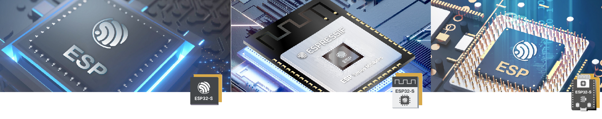
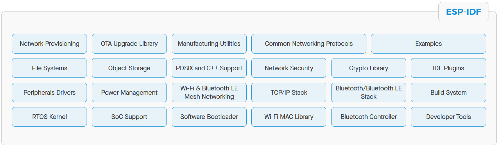
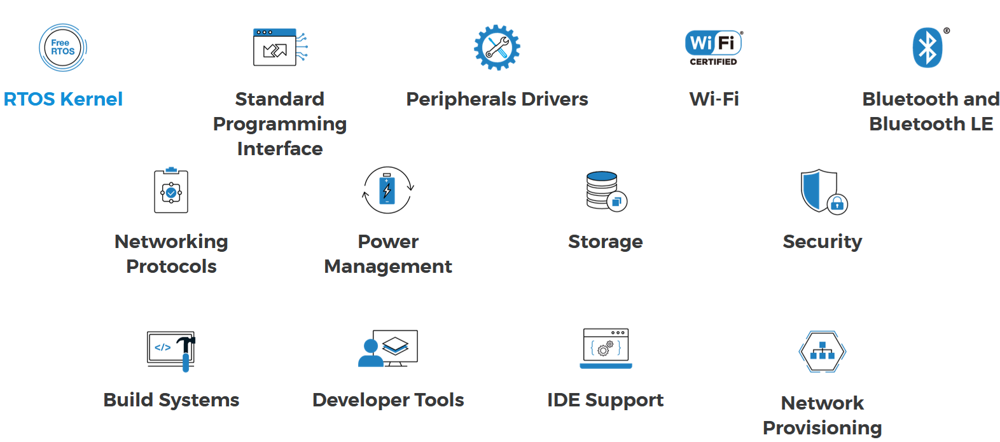

# ESP32

O [ESP32](https://www.espressif.com/en/products/socs/esp32) é um microcontrolador com conexão Wi-Fi e Bluetooth integrados, desenvolvido pela empresa Espressif, robusto para aplicações industriais, com baixíssimo consumo de energia para aplicações *mobile*, *wearables* (vestíveis) ou IoT (*Internet of Things* - Internet das coisas).

Possui alto grau de integração, podendo atuar sozinho como controlador ou como ponte de comunicação com um microcontrolador principal, reduzindo a sua carga de processamento de comunicação, tornando-se um "periférico".
Possui vários meios de interface com outros dispositivos, entre eles SPI, SDIO, I2C e UART.

O ESP32 pode ser adquirido em vários formatos, sendo eles:

- [SoCs](https://www.espressif.com/en/support/download/documents/chips);
- [Módulos](https://www.espressif.com/en/support/download/documents/modules);
- [Kits de Desenvolvimento](https://www.espressif.com/en/support/download/documents/development-board).

Em todos os casos a documentação é muito completa, desde os passos para instalação das ferramentas de desenvolvimento, até um conjunto amplo de bibliotecas disponíveis para uso nas mais diversas aplicações. 

---

# Espressif IoT Development Framework (ESP-IDF)

O [ESP-IDF](https://www.espressif.com/en/products/sdks/esp-idf) é o *framework* oficial da Espressif para a linha de controladores ESP32. Oferece recursos necessários para desenvolver aplicações de uso geral, em linguagem C e C++. 

É um projeto *open-source* e pode ser baixado do [GitHub](https://github.com/espressif/esp-idf). 

Disponibiliza os seguintes **Componentes de software**:

---

**Características**

---

# Links úteis

**ESP-IDF Projetos de exemplo**

- [ESP-IDF Programming Guide](https://docs.espressif.com/projects/esp-idf/en/latest/esp32/)
- [API reference](https://docs.espressif.com/projects/esp-idf/en/latest/esp32/api-reference/index.html)
- [esp-idf examples Github](https://github.com/espressif/esp-idf/tree/master/examples)

**ESP-IDF FreeRTOS**

FreeRTOS é um núcleo do Sistema Operacional de Tempo Real para sistemas embarcados.

- [What is an RTOS?](https://www.freertos.org/about-RTOS.html)
- [FreeRTOS Books](https://www.freertos.org/Documentation/RTOS_book.html)
- [RTOS Fundamentals](https://www.freertos.org/implementation/a00002.html)
- [ESP-IDF FreeRTOS](https://docs.espressif.com/projects/esp-idf/en/latest/esp32/api-reference/system/freertos.html)

**ESP-IDF Tratamento de erros**

- [Espressif Documentation](https://docs.espressif.com/projects/esp-idf/en/latest/esp32/api-guides/error-handling.html)

**ESP-IDF Componentes & Bibliotecas de Sensores**

- [Component Library](https://github.com/UncleRus/esp-idf-lib)
- [Documentation](https://esp-idf-lib.readthedocs.io/en/latest/)
- [Examples](https://github.com/UncleRus/esp-idf-lib/tree/master/examples)

