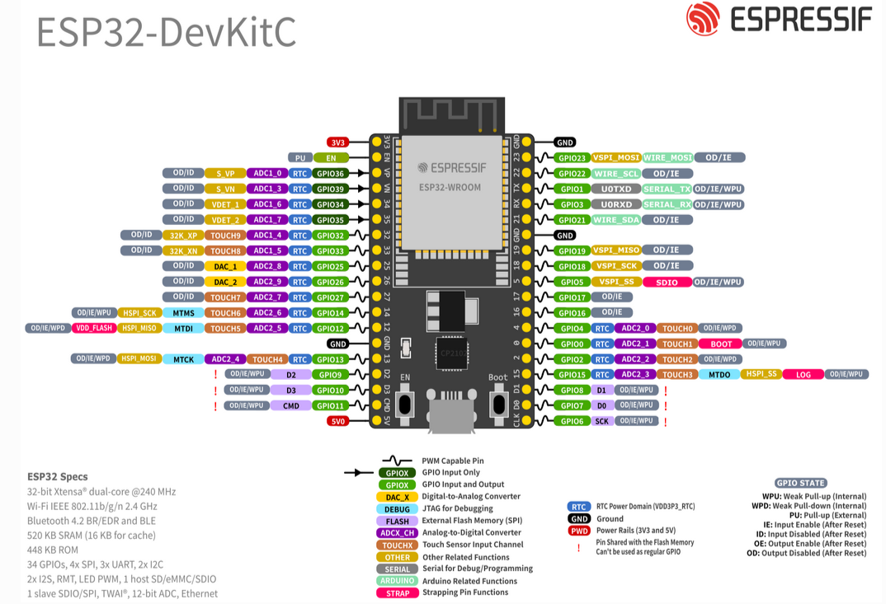

---

# MQTT

Pesquisar:
App smartphone: MQTT dash

**Referências**

- [88 - Broker MQTT no ESP32: Sim, isso é real! | Embarcados TV](https://www.youtube.com/live/mcwnPy5U98c?si=bi1t4HJgX_GjdEdu)
- [Protocolo MQTT: O Que é, Como Funciona e Projeto Prático | INETEC](https://youtu.be/iCpXDAKlZUM?si=YVGMRXUlzakjKJkb)
-
