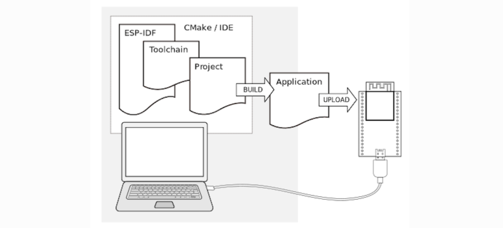

---

# ESP32

O [ESP32](https://docs.espressif.com/projects/esp-idf/en/latest/esp32/get-started/index.html) é um sistema em chip único que integra as seguintes características:

- Wi-Fi (2.4 GHz band);
- Bluetooth;
- CPU Dual core Xtensa® 32-bit LX6; 
- Co-processador de ultra baixa energia;
- Multiplos periféricos.

Placas de desenvolvimento oficiais:

- ESP32-DevKitC
- ESP32-DevKitM-1
- ESP-WROVER-KIT
- ESP32-PICO-KIT
- ESP32-Ethernet-Kit
- ESP32-PICO-KIT-1
- ESP32-PICO-DevKitM-2

**Ambiente e ferramentas de desenvolvimento**


Para utilizar os ESP-IDF no ESP32, instale os seguintes softwares:

- *Toolchain* para compilar código para ESP32;
- CMake e Ninja para construção completa da aplicação para ESP32
- ESP-IDF contém essencialmente API (bibliotecas de software e código-fonte) para ESP32 e scripts para operar o *Toolchain*.




**Instalação em IDE**

- [Eclipse Plugin](https://github.com/espressif/idf-eclipse-plugin/blob/master/README.md)
- [VSCode Extension](https://github.com/espressif/vscode-esp-idf-extension/blob/master/README.md)


**Instalação Manual**

- [Windows installer](https://docs.espressif.com/projects/esp-idf/en/latest/esp32/get-started/windows-setup.html)
- [Linux e MacOS](https://docs.espressif.com/projects/esp-idf/en/latest/esp32/get-started/linux-macos-setup.html)


**Criando um primeiro projeto**

- [Iniciando um projeto no Windows](https://docs.espressif.com/projects/esp-idf/en/latest/esp32/get-started/windows-setup.html#get-started-windows-first-steps)
- [Iniciando um projeto no Linux/MacOS](https://docs.espressif.com/projects/esp-idf/en/latest/esp32/get-started/linux-macos-setup.html#get-started-linux-macos-first-steps)

**Resumo dos comandos para criação de um projeto**

``` bash
idf.py create-project -p . <nome do projeto>

# Definindo o dispositivo alvo
idf.py set-target esp32

# Acessando o menu de configuração
idf.py menuconfig

```

``` bash
# Compilando o projeto
idf.py build

# Gravando o projeto
idf.py -p <port> flash


# Monitorando o projeto
idf.py -p <port> monitor

# Sair do monitoramento
# Ctrl+[ ou Ctrl+]

# Limpeza da compilação
idf.py fullclean
```


---

