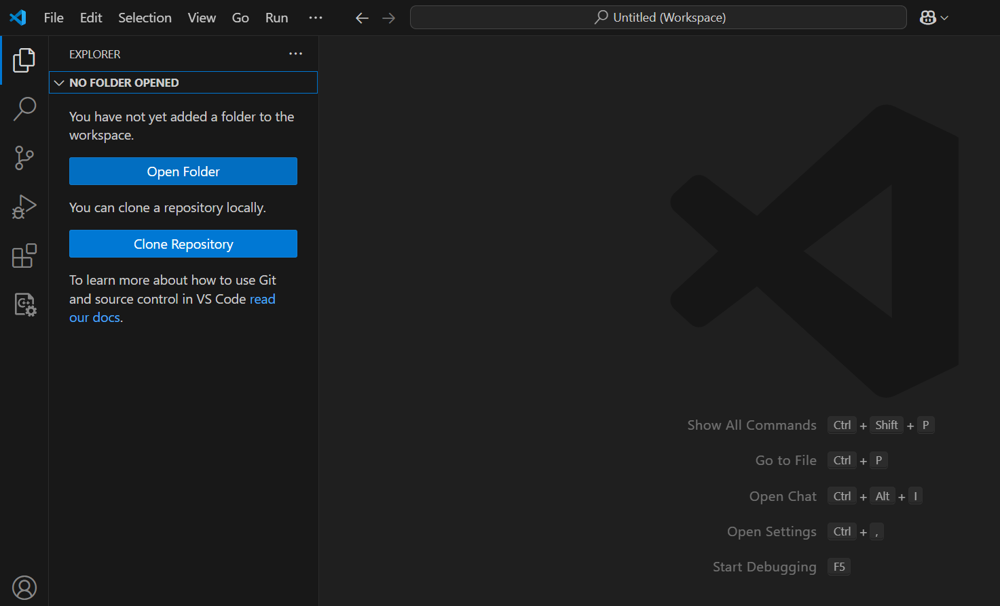
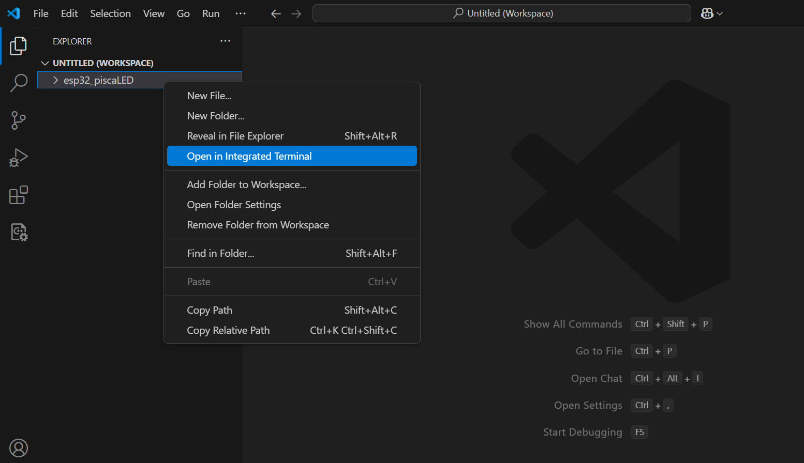
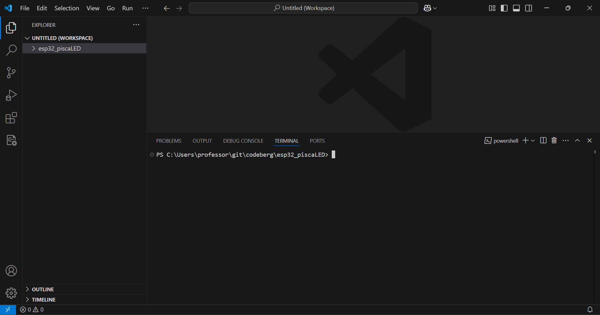
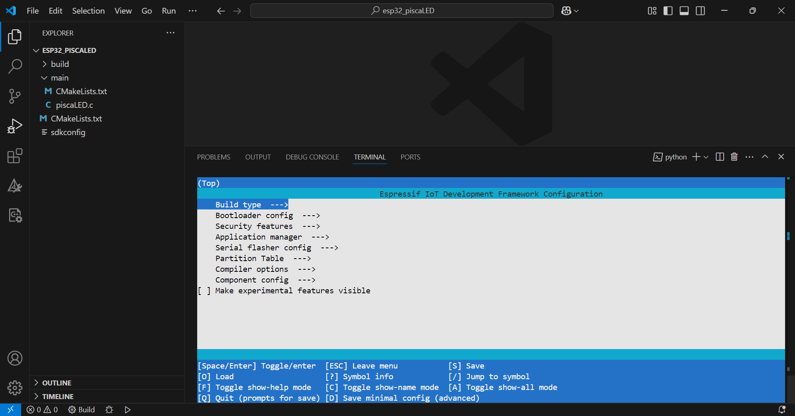

---

# Criando o primeiro projeto: Pisca LED (blink)

O kit de desenvolvimento ESP32-DevKitC apresenta um LED conectado ao pino 2, de modo que se pode usá-lo para o famoso `Hello World` dos sistemas embarcados, o `blink` ou `PiscaLED`. 

Seguem os passos para criar um projeto de pisca LED para o ESP32. 

**1) Abra o VSCode e clique em `View` >> `Explorer` ou tecle `Ctrl+Shift+E`:**

---

**2) Clique em `Open Folder` e selecione um diretório para incluí-lo ao `Explorer`.** 

Caso ao menos um diretório já esteja no `Explorer`, clique com o botão direito do mouse sobre a área vazia do `Explorer` e selecione `Add Folder to Workspace`, selecione e inclua o diretório desejado. 

| Figura 1: Adicionando um diretório (ESP32) ao explorador de arquivos |
|:--------------------------------------------------------------------:|
|                       |
| Fonte: Autor                                                         |

Para este exemplo, estou utilizando o diretório denominado `esp32_piscaLED`, conforme ilustrado na Figura 2, como área de trabalho para o desenvolvimento deste projeto.

---

**3) Abra um terminal integrado no diretório de trabalho**, conforme ilustrado na Figura 2 ou teclando `Ctrl+Shift+'`.

| Figura 2: Abrir o diretório de trabalho em um terminal integrado     |
|:--------------------------------------------------------------------:|
|                              |
| Fonte: Autor                                                         |

Deve aparecer um prompt de comandos com um endereço deste tipo:

| Figura 3: Terminal integrado aberto no diretório de trabalho         |
|:--------------------------------------------------------------------:|
|                      |
| Fonte: Autor                                                         |


---

**4) Crie um ambiente de desenvolvimento para o ESP-IDF** com o seguinte comando:

```PS1
. C:\Espressif\frameworks\esp-idf-v5.2.1\export.ps1
```

> Obs1: Verifique a versão do esp-idf instalado em seu computador, e caso precise, altere o endereço do arquivo `export.ps1` de forma adequada. Provavelmente a única alteração será na versão do esp-idf instalado, necessitando alterar apenas o `...\esp-idf-v5.2.1\...` do caminho citado. 


> Obs2: Note que o comando é iniciado com um `.`, indicando a execução do `export.ps1` no diretório atual. 

O resultado da criação do ambiente deve ser algo assim:

```PS1
PS C:\Users\professor\git\codeberg\esp32_piscaLED> . C:\Espressif\frameworks\esp-idf-v5.2.1\export.ps1
Setting IDF_PATH: C:\Espressif\frameworks\esp-idf-v5.2.1
Checking Python compatibility
Adding ESP-IDF tools to PATH...

Name                           Value
----                           -----
OPENOCD_SCRIPTS                C:\Espressif\tools\openocd-esp32\v0.12.0-esp32-20230921\openocd-esp32\share\openocd\scripts    
IDF_CCACHE_ENABLE              1
ESP_ROM_ELF_DIR                C:\Espressif\tools\esp-rom-elfs\20230320\
IDF_PYTHON_ENV_PATH            C:\Espressif\python_env\idf5.2_py3.13_env
ESP_IDF_VERSION                5.2
IDF_DEACTIVATE_FILE_PATH       C:\Users\PROFES~1\AppData\Local\Temp\tmpk4zf824kidf_19264

Added to PATH
-------------
C:\Espressif\tools\xtensa-esp-elf-gdb\12.1_20231023\xtensa-esp-elf-gdb\bin
C:\Espressif\tools\riscv32-esp-elf-gdb\12.1_20231023\riscv32-esp-elf-gdb\bin
C:\Espressif\tools\xtensa-esp-elf\esp-13.2.0_20230928\xtensa-esp-elf\bin
C:\Espressif\tools\riscv32-esp-elf\esp-13.2.0_20230928\riscv32-esp-elf\bin
C:\Espressif\tools\esp32ulp-elf\2.35_20220830\esp32ulp-elf\bin
C:\Espressif\tools\cmake\3.24.0\bin
C:\Espressif\tools\openocd-esp32\v0.12.0-esp32-20230921\openocd-esp32\bin
C:\Espressif\tools\ninja\1.11.1\
C:\Espressif\tools\idf-exe\1.0.3\
C:\Espressif\tools\ccache\4.8\ccache-4.8-windows-x86_64
C:\Espressif\tools\dfu-util\0.11\dfu-util-0.11-win64
C:\Espressif\python_env\idf5.2_py3.13_env\Scripts
C:\Espressif\frameworks\esp-idf-v5.2.1\tools
Checking if Python packages are up to date...
Constraint file: C:\Espressif\espidf.constraints.v5.2.txt
Requirement files:
 - C:\Espressif\frameworks\esp-idf-v5.2.1\tools\requirements\requirements.core.txt
Python being checked: C:\Espressif\python_env\idf5.2_py3.13_env\Scripts\python.exe
Python requirements are satisfied.

Done! You can now compile ESP-IDF projects.
Go to the project directory and run:
    idf.py build

PS C:\Users\professor\git\codeberg\esp32_piscaLED> 
```

> Mensagem de erro: 
> 
> Durante a criação do ambiente de desenvolvimento, pode ser que ocorra um erro com a seguinte descrição:
> 
> ```ps1
> Checking if Python packages are up to date...
> ERROR: C:\Espressif\python_env\idf5.2_py3.13_env\Scripts\python.exe doesn't exist! Please run the install script or "idf_tools.py install-python-env" in order to create it
> ```
> Uma possível solução é executar o seguinte comando, conforme indicação na própria mensagem de erro:
>
> ```ps1
> PS C:\Espressif\frameworks\esp-idf-v5.2.1\tools> idf_tools.py install-python-env
> ```

---

**5) Criando um novo projeto**

```ps1
idf.py create-project -p . piscaLED  
```

A arvore do projeto criado fica da seguinte forma:
```
ESP32_PISCALED
 |`--- main
 |       |`--- CMakeList.txt 
 |        `--- piscaLED.c
  `--- CMakeList.txt 
```

---

**ESP32_PISCALED &rarr; main &rarr;  CMakeList.txt**
``` c
idf_component_register( SRCS "piscaLED.c"
                        INCLUDE_DIRS ".")
```
---

**ESP32_PISCALED &rarr; main &rarr; piscaLED.c**
``` c
#include <stdio.h>

void app_main(void)
{

}
```
---
**ESP32_PISCALED &rarr; CMakeList.txt**
``` Python
# For more information about build system see
# https://docs.espressif.com/projects/esp-idf/en/latest/api-guides/build-system.html
# The following five lines of boilerplate have to be in your project's
# CMakeLists in this exact order for cmake to work correctly
cmake_minimum_required(VERSION 3.16)

include($ENV{IDF_PATH}/tools/cmake/project.cmake)
project(piscaLED)

```

---


**6) Definindo o dispositivo alvo**

```ps1
idf.py set-target esp32
```
À arvore do projeto são incluidos o diretório `build` e o arquivo de configuração `sdkconfig`.

```
ESP32_PISCALED
 |`--- build
 |`--- main
 |       |`--- CMakeList.txt 
 |        `--- piscaLED.c
 |`--- CMakeList.txt 
  `--- sdkconfig
```

---

**7) Acessando o menu de configuração (se necessário)**

``` ps1
idf.py menuconfig
```

| Figura 4: Tela do `menuconfig`                                       |
|:--------------------------------------------------------------------:|
|                       |
| Fonte: Autor                                                         |

---

**8) Construa o projeto (*build*)**

``` bash
idf.py build
```

---

**9) Edite o código fonte**

Altere o arquivo `piscaLED.c` conforme o seguinte código:
```c
#include "freertos/FreeRTOS.h"
#include "driver/gpio.h"

#define BLINK_GPIO  2
#define BLINK_DELAY 500

void app_main(void)
{
    gpio_reset_pin(BLINK_GPIO);
    gpio_set_direction(BLINK_GPIO, GPIO_MODE_OUTPUT);
    while( 1 )
    {
        gpio_set_level(BLINK_GPIO, 0);
        vTaskDelay(BLINK_DELAY / portTICK_PERIOD_MS);
        gpio_set_level(BLINK_GPIO, 1);
        vTaskDelay(BLINK_DELAY / portTICK_PERIOD_MS);
    }
}
```

---

**10) Reconstrua o projeto**

O processo de construção do projeto (*build*) quando realizado a primeira vez, é bem demorado devido à quantidade de componentes que são compilados. A partir segunda chamada de *build*, o processo é bem mais rápido pois a compilação ocorre apenas nos componentes modificados. 

``` bash
idf.py build
```

---


**11) Gravando o projeto**

``` bash
idf.py -p <port> flash
```

> Pode ser necessário pressionar o botão `BOOT` na placa do ESP32 para realizar a conexão no processo de gravação. O botão deve ser solto apenas quando se iniciar a gravação dos blocos de memória. 


| Figura 5: Gravação do programa no ESP32                              |
|:--------------------------------------------------------------------:|
|                             |
| Fonte: Autor                                                         |


---

**12) Monitorando o projeto**

O monitoramento do projeto é interessante quando o código produz mensagens de log, que podem ser visualizadas no terminal. 

``` bash
idf.py -p <port> monitor

# Sair do monitoramento
# Ctrl+[ ou Ctrl+]
```

> Obs: Pode ser necessário mudar o teclado para o padrão US para conseguir utilizar o comando `Ctrl+[`.

---

**13) Limpeza do processo de construção**

Exclui todos arquivos produzidos no processo de *build*. 

``` bash
idf.py fullclean
```

---

