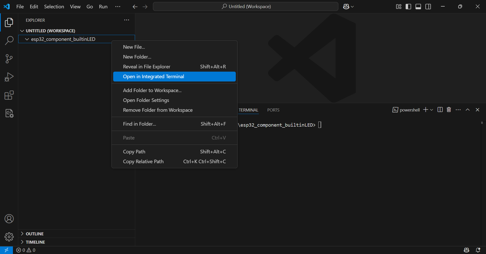

---

# Componentes

**1. Crie um novo projeto**

1. Crie um novo diretório para o projeto;
2. Abra-o no VSCode (ou no seu editor favorito);
3. Abra o terminal integrado

| Figura 1: Novo projeto e Terminal Integrado |
|:-------------------------------------------:|
|  |
| Fonte: Autor                                |


Para abrir o terminal integrado:

4. Pressione `Ctrl+Shift+'`, ou
5. No menu suspenso, clique em `Terminal` > `New Terminal`, ou
6. Clique sob o nome do diretório com o botão direito do mouse, e depois `Open in integrated Terminal`, como ilustrado na Figura 1.

---

**2. Habilite o ambiente de desenvolvimento no diretório local**

```ps1
C:\Espressif\frameworks\esp-idf-v5.2.1\export.ps1 .
```

Obs: O caminho do `export.ps1` vai mudar em função do local escolhido durante a instalação do framework esp-idf. 

---

**3. Criando um novo projeto**

```ps1
idf.py create-project -p . component_builtinLED
```

---

**4. Definindo dispositivo alvo**

```ps1
idf.py set-target esp32
```

---

**5. Construindo o projeto**

```ps1
idf.py build
```

---

**6. Criando um componente (pela primeira vez)**

```bash
idf.py -C ./components create-component builtinLED
```

---

**7. Criando código do componente**

- Arquivo: `esp32_component_builtinLED/components/builtinLED/builtinLED.c`
```C
#include <stdio.h>
#include "driver/gpio.h"
#include "builtinLED.h"


/**********************************************************
 * @brief Inicializa pino conectado ao LED embarcado no módulo
 * @param -
**********************************************************/
void builtinLED_init( void )
{
    gpio_reset_pin(BUILTINLED_GPIO);
    gpio_set_direction(BUILTINLED_GPIO, GPIO_MODE_OUTPUT);
}


/**********************************************************
 * @brief Liga/Desliga LED embarcado no módulo
 * @param b  1 LED ON, 0 LED OFF
**********************************************************/
void builtinLED(char b)
{
    gpio_set_level(BUILTINLED_GPIO, b);
}
```


- Arquivo: `esp32_component_builtinLED/components/builtinLED/include/builtinLED.h`
```C
#ifndef BUILTINLED_H
#define BUILTINLED_H

#define BUILTINLED_GPIO         2


void builtinLED_init( void );
void builtinLED(char b);


#endif
```

- Arquivo: `esp32_component_builtinLED/components/builtinLED/CMakeLists.txt`
```C
idf_component_register( SRCS            "builtinLED.c"
                        REQUIRES        driver
                        INCLUDE_DIRS    "include")
```

---


**8. Criando código principal**

- Arquivo: `esp32_component_builtinLED/main/component_builtinLED.c`
```C
#include <stdio.h>
#include "freertos/FreeRTOS.h"
#include "builtinLED.h"

void app_main(void)
{
    builtinLED_init();
    while( 1 )
    {
        builtinLED( 1 );
        vTaskDelay(500 / portTICK_PERIOD_MS);
        builtinLED( 0 );
        vTaskDelay(500 / portTICK_PERIOD_MS);
    }
}
```

- Arquivo: `esp32_component_builtinLED/main/CMakeLists.txt`
```py
idf_component_register( SRCS            "component_builtinLED.c"
                        REQUIRES        builtinLED
                        INCLUDE_DIRS    ".")


```

---


**9. CMakeLists inicial**

- Arquivo: `esp32_component_builtinLED/CMakeLists.txt`
```py
# For more information about build system see
# https://docs.espressif.com/projects/esp-idf/en/latest/api-guides/build-system.html
# The following five lines of boilerplate have to be in your project's
# CMakeLists in this exact order for cmake to work correctly
cmake_minimum_required(VERSION 3.16)

include($ENV{IDF_PATH}/tools/cmake/project.cmake)
project(component_builtinLED)
```

---

**10. Compilando o projeto**

```ps1
idf.py build
```

**11. Gravando o programa no dispositivo alvo**

```ps1
idf.py -p COM3 flash 
```

