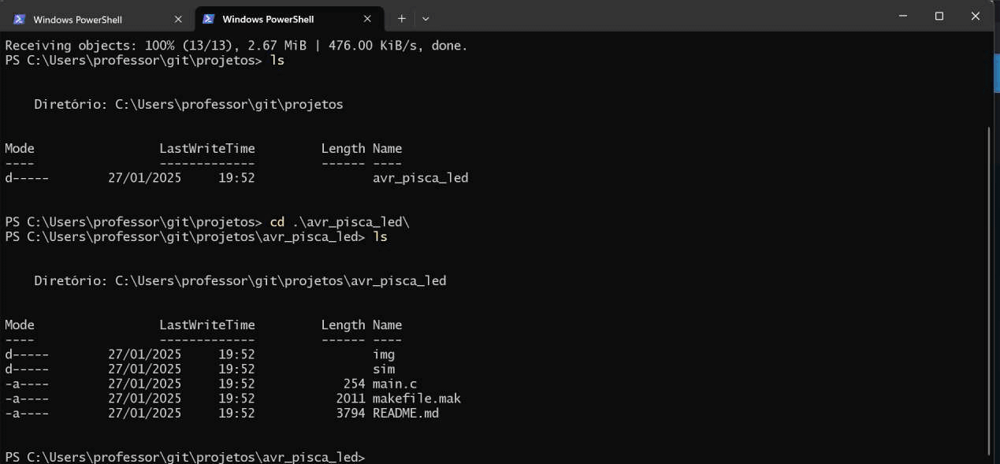
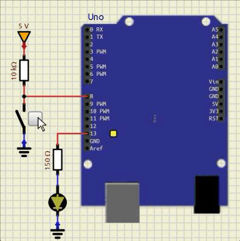

# 


## Ferramentas de Desenvolvimento


| Componente | Modelo | Descrição |      
| :--------- |:------ | :-------- |
| Microcontrolador | [AVR - ATMega328P](https://ww1.microchip.com/downloads/en/DeviceDoc/Atmel-7810-Automotive-Microcontrollers-ATmega328P_Datasheet.pdf) | Plataforma Arduino Uno como interface |
| IDE        | [MPLabX](https://www.microchip.com/en-us/tools-resources/develop/mplab-x-ide) | Ambiente de Desenvolvimento Integrado - [Instalação](https://developerhelp.microchip.com/xwiki/bin/view/software-tools/ides/x/install-guide/) |
| Compilador | [XC8](https://www.microchip.com/en-us/tools-resources/develop/mplab-xc-compilers/xc8) | [Instalação](https://developerhelp.microchip.com/xwiki/bin/view/software-tools/xc8/install/) |
| Editor de código | [Notepad++](https://notepad-plus-plus.org/downloads/) | [v8.7.7](https://github.com/notepad-plus-plus/notepad-plus-plus/releases/download/v8.7.7/npp.8.7.7.Installer.x64.exe) |
| Construtor de projeto | [Makefile](https://stackoverflow.com/questions/32127524/how-to-install-and-use-make-in-windows) | Power Shell<br>`winget install Chocolatey.Chocolatey`<br> PS adm: `choco install make` |
| Gravador do AVR       | [AVRDudess](https://github.com/ZakKemble/AVRDUDESS/releases/tag/v2.18)  | [ZakKemble/AVRDUDESS/v2.18](https://github.com/ZakKemble/AVRDUDESS/releases/download/v2.18/AVRDUDESS-2.18-setup.exe) |
| Simulador eletrônico  | [SimulIDE](https://simulide.com/p/downloads/) | Power Shell<br>`winget install SimulIDE.SimulIDE` |
| Versionamento         | [git](https://git-scm.com/downloads) | Power Shell<br>`winget install --id Git.Git -e --source winget` |

## Fluxo de trabalho com git e GitHub
| Fluxo simples de trabalho com git e GitHub |
| :----------------------------------------: |
|  |
|            Fonte: Autor                    |


## Metodologia de trabalho baseada em Projetos

**0. Objetivo: Nome significativo para o projeto**

Descrever o que deve ser feito, de forma objetiva e clara.


**1. Requisitos da solução**

- Descrever características fundamentais para operação. 
- Descrever comportamentos do sistema. 

**2. Planejamento da solução**

Definir como será feita a entrega: simulador, montagem em protótipo, montagem em painel ou placa de circuito impresso (PCI), etc, listar os materiais e ferramentas em função do tipo de entrega e explicitar como, utilizando os materiais listados e manipulando as ferramentas, chega-se ao produto final, com um encadeamento lógico das tarefas que integram o processo.

- 2.1 - Planejamento do produto final
- 2.2 - Planejamento das ferramentas e materiais
- 2.3 - Planejamento do processo

**3. Solução**

Produto ou processo que atinge o objetivo proposto, através da execução do seu planejamento e satisfação dos seus requisitos.


## Lab. 0 - AVR Pisca LED


O primeiro programa para dispositivos embarcados, costuma ser um programa para piscar um LED, que serve para testar as ferramentas de compilação e gravação, verificando sua integridade e capacidade de execução.

Este projeto contém um programa mínimo para piscar um LED na plataforma Arduino Uno, porém o seu desenvolvimento se dá com a utilização e programação do microcontrolador de forma direta, sem a utilização do que chamamos *framework* Arduino.

Para testar a integridade das ferramentas de desenvolvimento aqui utilizadas, no seu computador, siga os passos: 


**1. Baixar o projeto do servidor git (Codeberg ou Github);**

1.1 No terminal (Windows Power Shell), crie um diretório para armazenar os projetos:

```barra
mkdir projetos
```

1.2 Acesso o diretório criado: 

```bash
cd projetos
```

1.3 Clone o projeto de teste:

```bash
git clone https://github.com/JoseWRPereira/avr_pisca_led.git

ou

git clone https://codeberg.org/JoseWRPereira/avr_pisca_led.git
```

1.4 Acesse o diretório do projeto baixado: 

```bash
cd avr_pisca_led
```
1.5 Resumo


**2. Abrindo arquivos de edição:**

2.1 É possível abrir o **notepad++** com os arquivos *.c* e *.h* que houverem no diretório corrente, executando o seguinte comando: 
```bash
make notepad
```

2.2 Vá em `Arquivo`, `Abrir...` e abra o arquivo `makefile.mak`. 

2.3 Verifique o local e a versão do compilador conforme ilustração.


2.4 Resumo



**3. Verificando porta de comunicação para gravação:**

3.1 Conecte o Arduino ao conector USB e verifique qual foi a porta alocada para ele: `Gerenciador de Dispositivos` e a aba `Portas(COM e LPT)` 


3.2 Se necessário ajuste na linha 1 do `makefile.mak` com a porta de conexão com o seu Arduino.


**4. Compilando e gravando o projeto:**	

4.1 Se todos os programas estiverem instalados e nos locais apontados no `makefile.mak`, então:

4.1.1 Para compilar o projeto execute:  
	
```bash
make
```

4.1.2 Para fazer o a gravação do binário no microcontrolador(ATmega328P) do Arduino.

```bash
make flash
```

4.2 Resumo


**5. Criando um circuito no SimulIDE**


5.1 Para criar um projeto no SimulIDE, basta abrir o software, e inserir os componentes.

5.2 Para inserir um componente basta clicar sobre ele, na barra de ferramentas, e arrastá-lo até a área de trabalho, soltando-o na posição desejada.

5.3 Inserir:

- Componentes > Microcontroladores > Arduino > Uno
- Componentes > Passivos > Resistors > Resistor
- Componentes > Saídas > Leds > LED
- Componentes > Fontes > Terra (0 V)

5.4 Após inserir todos os componentes na área de trabalho, posicione-os de forma que o circuito fique legível e bem organizado. 

- Girar: Para girar um componente, basta clicar com o botão direito sobre o elemento, e escolher uma das opções de girar ou inverter.

5.5 A ferramenta de linha é acionada ao posicionar o cursor sobre um terminal de componente, clicando sobre ele, é iniciada uma linha de conexão, que pode ser estendida, seguindo a orientação vertical ou horizontal até o ponto de conexão de destino. 

5.6 Resumo 


**6.0 Simulação de Pisca LED**


---


## Lab. 1 - Projeto: Sinalizador de garagem


**1. Objetivo: Sinalizador de garagem**

Desenvolver uma aplicação, projeto eletrônico e programa, para um dispositivo de sinalização de segurança para saída de veículos em garagem.


**2. Requisitos da solução**

  1. Intervalo de alternância entre luzes: 1s;
  2. Luzes piscando enquanto o portão estiver aberto.


**3. Planejamento da solução**

  1. Planejamento do produto final
    1. Arquivo de simulação;
    2. Imagem de circuito de simulação como ilustração;
    3. Montagem de protótipo funcional em matriz de contatos.
  2. Planejamento das ferramentas e materiais
	- Ferramentas:
		- Simulador: [SimulIDE](https://www.simulide.com/p/downloads.html) (v1.1.0 Stable Version)
		- Compilador: [XC8](https://www.microchip.com/en-us/tools-resources/develop/mplab-xc-compilers)
		- Gravador: [AVRDUDESS](https://github.com/ZakKemble/AVRDUDESS)
		- Editor de código: [Notepad++](https://notepad-plus-plus.org/downloads/)
		- Construtor do projeto: [Makefile](https://stackoverflow.com/questions/32127524/how-to-install-and-use-make-in-windows)
		- Versionamento: [git](https://git-scm.com/downloads)
	- Materiais:
		- 01 - Arduino Uno + Cabo de conexão;
		- 01 - Matriz de contatos (Protoboard);
		- 02 - LEDs (Vermelho e Amarelo);
		- 02 - Resistores para os LEDs;
		- 01 - Botão ou chave de seleção;
		- 01 - Resistor de pull-up.

  3. Planejamento do processo
    1. Criar o projeto na plataforma de versionamento;
    2. Definir mapa de entradas e saídas;
    3. Construir o circuito no simulador;
    4. Criar projeto de validação do circuito no simulador;
    5. Criar programa(firmware) da aplicação;
    6. Montar circuito em matriz de contatos;
    7. Testar programa(firmware) na montagem do protótipo;
    8. Registrar resultado da atividade.


**4. [Solução](https://codeberg.org/JoseWRPereira/avr_sinalizador_garagem)**

Produto ou processo que atinge o objetivo proposto, 
através da execução do seu planejamento e satisfação dos seus requisitos.


Na etapa inicial da solução, crie um projeto em uma plataforma de versionamento, 
seja ela [codeberg](https://codeberg.org/), 
[gitlab](https://about.gitlab.com/), 
[github](https://github.com/) ou qualquer outra plataforma de sua preferência. 


**1. Criando um projeto de versionamento no codeberg**


Após criar o projeto, faça o download para um repositório local, 
que servirá para alocar e armazenar a simulação e o firmware durante o desenvolvimento. 

**2. Download do projeto criado em repositório local**


Crie um projeto no simulIDE, e salve-o em um diretório `sim` dentro do diretório do projeto.

Em seguida, adicione-o ao `stage` e realize o `commit` da nova mudança, seguindo com o 
`push` para o repositório remoto. 


**3. Criando simulação e incluindo no repositório**


**4. Definindo mapa de entradas e saídas**

| Função | Dispositivo | Descrição | Pino <br> (Arduino Uno) | Pino <br> (ATmega328P) | PORT |
|:------:|:-----------:|:---------------------------------------:|:---:|:---:|:---:|
| Entrada| Fim-de-curso| Acionado quando o portão estiver aberto |  8 | 14 | PB0 |
| Saída  | LED         | Sinaleiro Amarelo                       | 12 | 18 | PB4 |
| Saída  | LED         | Sinaleiro Vermelho                      | 13 | 19 | PB5 |


**5. Construindo o circuito no simulador**


Copie os arquivos `main.c` e `makefile.mak` de um projeto já existente (avr_pisca_led). 
Isso facilita a construção do projeto, editando apenas no nome do projeto no 
arquivo de construção e alterando o conteúdo de main.c, 
bem como incluindo códigos ou outros arquivos de acordo com o desenvolvimento do projeto. 


**6. Criando arquivos de código fonte**


**Código fonte**

```c
#define F_CPU 16000000L
#include <avr/io.h>
#include <util/delay.h>
int main(void) 
{   
    DDRB = 0b00110000;
    PORTB = 0;
    while (1)
    {
        if( PINB & (1<<PINB0))
        {
            PORTB |= (1<<PORTB4);
            PORTB &= ~(1<<PORTB5);
            _delay_ms(500);
            PORTB ^= (1<<PORTB4 | 1<<PORTB5);
            _delay_ms(500);
        }
        else
        {
            PORTB &= ~(1<<PORTB4);
            PORTB &= ~(1<<PORTB5);
        }
    }
}

```


**7. Carregando arquivo executável na simulação**


**8. Incluindo mudanças na plataforma de versionamento**


--- 


### Entradas e Saídas Digitais

**Saídas Digitais**

O dispositivo responsável por acionar o LED é o microcontrolador(uC), através de um pino configurado como saída. Este pino pode estar fornecendo corrente como fonte (source) ao ramo ou drenando (sink) corrente dele.

| Ligação do pino como fonte (Source) | Ligação do pino como dreno (Sink) |
|:-----------------------------------:|:---------------------------------:|
|  |   |

O pino do uC possui limitação de corrente, que pode variar a depender do modelo ou fabricante.

A corrente máxima por pino é de `40 mA`, de acordo com o Datasheet (AVR ATmega328P, capítulo *28.1 Absolute maximum ratings*, pág. 258). 

A vantagem de utilizar o pino como fonte é trabalhar com uma lógica direta, em que o estado lógico 1(verdadeiro, +5V) produz o acionamento do LED, enquanto que na configuração do pino como dreno a lógica de acionamento é invertida, pois o pino em estado lógico 0(falso, 0V) produz o acionamento do LED.


**Entradas Digitais**

A entrada deve possuir um estado lógico bem definido, mas um botão pulsador não garante esse estado lógico, pois possui apenas dois contatos, podendo sua configuração ser normalmente aberto (NA) ou normalmente fechado(NF). Na figura abaixo é utilizado um botão pulsador NA, que é a configuração mais comum.

Para garantir o tal estado lógico bem definido, é montado um ramo com o botão e um resistor, geralmente com 10kΩ, ligados em série, entre o Vcc e o GND. No ponto de conexão entre esses dois componentes temos, em relação ao terra (GND), uma tensão que é a tensão do componente conectado ao terra. Este ponto é conectado ao pino do uC, assim a tensão no pino é a mesma tensão sobre o componente ligado ao terra.

As duas configurações possíves são mostradas na ilustração abaixo, em que o botão está conectado ao Vcc e a outra em que o botão está conectado ao terra.


| Ligação do resistor de *pull-down*      | Ligação do resistor de *pull-up*     |
|:---------------------------------------:|:------------------------------------:|
| |  |

Na configuração pull-down o resistor está conectado ao terra, o que garante, quando o botão estiver aberto, o nível lógico 0 (terra/GND) chegando no pino do uC.

Ao pressionar o botão, ele fecha e conecta o ponto de conexão com o pino ao Vcc, aplicando o nível lógico 1 a ele.

Na configuração pull-up o resistor está conectado ao positivo da fonte, Vcc. O botão na condição de não acionado está com contato aberto, assim a tensão sobre ele é a tensão da fonte, nesse caso 5V, conforme a 2ª lei de Kirchhoff, garantindo o nível lógico 1.

Ao pressionar o botão, ele fecha, ligando o ponto de conexão com o pino do uC ao GND, aplicando o nível lógico 0 a ele.

A configuração com o resistor de pull-down é a que proporciona uma lógica direta a entrada do dado: botão pressionado.

<br>
**Registradores de configuração dos pinos do PORTB**


<br>
**Circuito geral dos pinos de entrada e saída**


<br>
**Acionamento do circuito de entrada e saída em função do comando**


<br>
**Resumo da configuração dos pinos no ATmega328P**

```
///////////////////////////////////////////////////////////////////////////////
//  Registradores de configuração e manipulação de dados nos pinos
//
//        DDRxn   :   Data Direction Register
//        PORTxn  :   Data Register
//        PINxn   :   Input Pin Address
//
//        ===================
//        x |        n
//        ===================
//        B | 7 6 5 4 3 2 1 0
//        C |   6 5 4 3 2 1 0
//        D | 7 6 5 4 3 2 1 0
//        E |         3 2 1 0
//        ===================
//
//  Configuração e Manipulação de dados nos pinos
//
//        DDRxn = 1;          // Output
//            {
//                PORTxn = 1; //          High
//                PORTxn = 0; //          Low
//            }
//
//        DDRxn = 0;          // Input
//            {
//                PORTxn = 0; //          Pull-Up Resistor OFF
//                PORTxn = 1; //          Pull-Up Resistor ON
//                {
//                    (PINxn == 1)    //  ON
//                    (PINxn == 0)    //  OFF
//                }
//            }
//        
////////////////////////////////////////////////////////////////////////////////
```


<br>

**Código fonte em etapas**

1) Estrutura básica de um código em linguagem C.

  ```c
  int main(void) 
  {   
    while (1)
    {

    }
  }
  ```
<br>

2) Configuração de entradas e saídas
```c

#include <avr/io.h>

int main(void) 
{   
    DDRB = 0b00110000;
    PORTB = 0;
    while (1)
    {

    }
}
```

3) Acionamento do LED conectado ao pino de saída (13 - PB5)

```c

#include <avr/io.h>

int main(void) 
{   
    DDRB = 0b00110000;
    PORTB = 0;
    while (1)
    {
        PORTB &= ~(1<<PORTB5);  // Desliga LED

        PORTB ^= (1<<PORTB5);   // Liga LED

    }
}
```

4) Inclusão de atraso entre os acionamentos do LED

```c
#define F_CPU 16000000L
#include <avr/io.h>
#include <util/delay.h>
int main(void) 
{   
    DDRB = 0b00110000;
    PORTB = 0;
    while (1)
    {
        PORTB &= ~(1<<PORTB5);  // Desliga LED
        _delay_ms(500);         // Atraso de 500ms
        PORTB ^= (1<<PORTB5);   // Liga LED
        _delay_ms(500);         // Atraso de 500ms
    }
}
```

<br>

5) Leitura da entrada: fim-de-curso (botão/sensor)

```c
#define F_CPU 16000000L
#include <avr/io.h>
#include <util/delay.h>
int main(void) 
{   
    DDRB = 0b00110000;
    PORTB = 0;
    while (1)
    {
        if( PINB & (1<<PINB0) )     // Leitura do fim-de-curso
        {
            PORTB &= ~(1<<PORTB5);  // Desliga LED
            _delay_ms(500);         // Atraso de 500ms
            PORTB ^= (1<<PORTB5);   // Liga LED
            _delay_ms(500);         // Atraso de 500ms
        }
        else
        {
            PORTB &= ~(1<<PORTB5);  // Desliga LED
        }
    }
}
```
<br>


6) Inclusão da segunda saída (LED)

```c
#define F_CPU 16000000L
#include <avr/io.h>
#include <util/delay.h>
int main(void) 
{   
    DDRB = 0b00110000;
    PORTB = 0;
    while (1)
    {
        if( PINB & (1<<PINB0))
        {
            PORTB |= (1<<PORTB4);
            PORTB &= ~(1<<PORTB5);
            _delay_ms(500);
            PORTB ^= (1<<PORTB4 | 1<<PORTB5);
            _delay_ms(500);
        }
        else
        {
            PORTB &= ~(1<<PORTB4);
            PORTB &= ~(1<<PORTB5);
        }
    }
}
```
