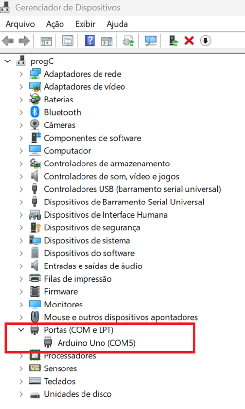
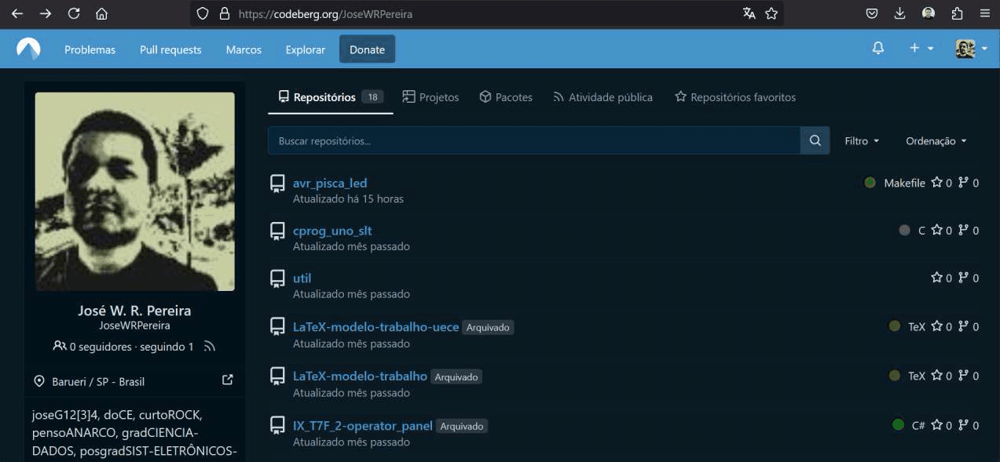
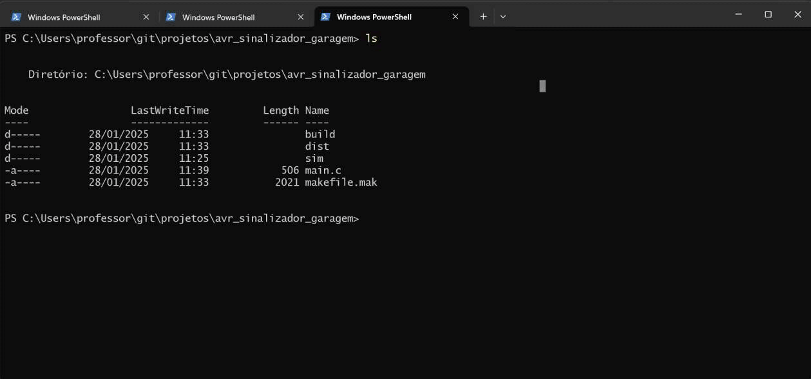

# 


## Lab. 0 - AVR Pisca LED


O primeiro programa para dispositivos embarcados, costuma ser um programa para piscar um LED, que server para testar as ferramentas de compilação e gravação, verificando sua integridade e capacidade de execução.

Este projeto contém um programa mínimo para piscar um LED na plataforma Arduino Uno, porém o seu desenvolvimento se dá com a utilização e programação do microcontrolador de forma direta, sem a utilização do que chamamos *framework* Arduino.

|      Componente       |                                                                Modelo                                                                |                                                                   Descrição                                                                   |
| :-------------------: | :----------------------------------------------------------------------------------------------------------------------------------: | :-------------------------------------------------------------------------------------------------------------------------------------------: |
|   Microcontrolador    | [AVR - ATMega328P](https://ww1.microchip.com/downloads/en/DeviceDoc/Atmel-7810-Automotive-Microcontrollers-ATmega328P_Datasheet.pdf) |                                                     Plataforma Arduino Uno como interface                                                     |
|      Compilador       |                        [XC8](https://www.microchip.com/en-us/tools-resources/develop/mplab-xc-compilers/xc8)                         |                         [Instalação](https://developerhelp.microchip.com/xwiki/bin/view/software-tools/xc8/install/)                          |
|   Editor de código    |                                        [Notepad++](https://notepad-plus-plus.org/downloads/)                                         |                                                                                                                                               |
| Construtor de projeto |                   [Makefile](https://stackoverflow.com/questions/32127524/how-to-install-and-use-make-in-windows)                    |                                                                                                                                               |
|    Gravador do AVR    |                                         [AVRDudess](https://github.com/ZakKemble/AVRDUDESS)                                          |                                                                                                                                               |
| Simulador eletrônico  |                                            [SimulIDE](https://simulide.com/p/downloads/)                                             |                                                                                                                                               |
|     Versionamento     |                                                 [git](https://git-scm.com/downloads)                                                 |                                                                                                                                               |


Para testar a integridade das ferramentas de desenvolvimento aqui utilizadas, no seu computador, siga os passos: 


| Figura 1: Baixar o projeto do servidor git (Codeberg ou Github); |
|:----------------------------------------------------------------:|
|                                |
| Fonte: Autor  										           |

No terminal (Windows Power Shell), crie um diretório para armazenar os projetos:
```barra
mkdir projetos
```
Acesso o diretório criado: 
```bash
cd projetos
```
Clone o projeto de teste:
```bash
git clone https://codeberg.org/JoseWRPereira/avr_pisca_led.git
```

Acesse o diretório do projeto baixado: 
```bash
cd avr_pisca_led
```

Executando o comando: 
```bash
make notepad
```
é possível abrir o **notepad++** com os arquivos *.c* e *.h* que houverem no diretório corrente.
Vá em `Arquivo`, `Abrir...` e abra o arquivo `makefile.mak`. 
Verifique o local e a versão do compilador conforme ilustrado na Figura 2.

| Figura 2: Verificar o local de instalação e a versão do compilador (XC8); |
|:-------------------------------------------------------------------------:|
|                                           |
|                                                                           |
|                                           |
| Fonte: Autor  		        								            |


Conecte o Arduino ao conector USB e verifique qual foi a porta alocada para ele. 
Se necessário ajuste na linha 1 do `makefile.mak`.


| 3. Conectar e verificar a porta de comunicação com o Arduino Uno (Com5 no meu caso de exemplo); |
|:-------------------------------------------------------------------------:|
|                                           |
| Fonte: Autor  		        								            |


Se todos os programas estiverem instalados e nos locais apontados no `makefile.mak`, 
basta executar:
```bash
make
```
para compilar o projeto e:

```bash
make flash
```
para fazer o a gravação do binário no microcontrolador(ATmega328P) do Arduino. 


| 4. Testar a compilação e a gravação do projeto;                           |
|:-------------------------------------------------------------------------:|
|                                |
| Fonte: Autor  		        								            |


**5. Criando um circuito no SimulIDE**

Para criar um projeto no SimulIDE, basta abrir o software, e inserir os componentes.

Para inserir um componente basta clicar sobre ele, na barra de ferramentas, e arrastá-lo até a área de trabalho, soltando-o na posição desejada.

Inserir:

1. Componentes > Microcontroladores > Arduino > Uno

2. Componentes > Passivos > Resistors > Resistor

3. Componentes > Saídas > Leds > LED

4. Componentes > Fontes > Terra (0 V)

Após inserir todos os componentes na área de trabalho, posicione-os de forma que o circuito fique legível e bem organizado. 

Girar: Para girar um componente, basta clicar com o botão direito sobre o elemento, e escolher uma das opções de girar ou inverter.

A ferramenta de linha é acionada ao posicionar o cursor sobre um terminal de componente, clicando sobre ele, é iniciada uma linha de conexão, que pode ser estendida, seguindo a orientação vertical ou horizontal até o ponto de conexão de destino. 

| 6. Testar a simulação utilizando o software SimulIDE; |
|:-----------------------------------------------------:|
|          |
| Fonte: Autor  		        						|


| 7. Simulação de Pisca LED                             |
|:-----------------------------------------------------:|
|                     |
| Fonte: Autor  		        						|


---


## Metodologia de trabalho baseada em Projetos

**1. Objetivo: Nome significativo para o projeto**

Descrever o que deve ser feito, de forma objetiva e clara.


**2. Requisitos da solução**

- Descrever características fundamentais para operação. 
- Descrever comportamentos do sistema. 

**3. Planejamento da solução**

Definir como será feita a entrega: simulador, montagem em protótipo, montagem em painel ou placa de circuito impresso (PCI), etc, listar os materiais e ferramentas em função do tipo de entrega e explicitar como, utilizando os materiais listados e manipulando as ferramentas, chega-se ao produto final, com um encadeamento lógico das tarefas que integram o processo.

- 3.1 - Planejamento do produto final
- 3.2 - Planejamento das ferramentas e materiais
- 3.3 - Planejamento do processo

**4. Solução**

Produto ou processo que atinge o objetivo proposto, através da execução do seu planejamento e satisfação dos seus requisitos.


## Lab. 1 - Projeto: Sinalizador de garagem


**1. Objetivo: Sinalizador de garagem**

Desenvolver uma aplicação, projeto eletrônico e programa, para um dispositivo de sinalização de segurança para saída de veículos em garagem.


**2. Requisitos da solução**

- Intervalo de alternância entre luzes: 1s;
- Luzes piscando enquanto o portão estiver aberto.


**3. Planejamento da solução**

- 3.1 - Planejamento do produto final
	- Arquivo de simulação;
	- Imagem de circuito de simulação como ilustração;
	- Montagem de protótipo funcional em matriz de contatos.
- 3.2 - Planejamento das ferramentas e materiais
	- Ferramentas:
		- Simulador: [SimulIDE](https://www.simulide.com/p/downloads.html) (v1.1.0 Stable Version)
		- Compilador: [XC8](https://www.microchip.com/en-us/tools-resources/develop/mplab-xc-compilers)
		- Gravador: [AVRDUDESS](https://github.com/ZakKemble/AVRDUDESS)
		- Editor de código: [Notepad++](https://notepad-plus-plus.org/downloads/)
		- Construtor do projeto: [Makefile](https://stackoverflow.com/questions/32127524/how-to-install-and-use-make-in-windows)
		- Versionamento: [git](https://git-scm.com/downloads)
	- Materiais:
		- 01 - Arduino Uno + Cabo de conexão;
		- 01 - Matriz de contatos (Protoboard);
		- 02 - LEDs (Vermelho e Amarelo);
		- 02 - Resistores para os LEDs;
		- 01 - Botão ou chave de seleção;
		- 01 - Resistor de pull-up.
- 3.3 - Planejamento do processo
	- Criar o projeto na plataforma de versionamento;
	- Construir o circuito no simulador;
	- Criar projeto de validação do circuito no simulador;
	- Criar programa(firmware) da aplicação;
	- Montar circuito em matriz de contatos;
	- Testar programa(firmware) na montagem do protótipo;
	- Registrar resultado da atividade.


**4. [Solução](https://codeberg.org/JoseWRPereira/avr_sinalizador_garagem)**

Produto ou processo que atinge o objetivo proposto, 
através da execução do seu planejamento e satisfação dos seus requisitos.


Na etapa inicial da solução, crie um projeto em uma plataforma de versionamento, 
seja ela [codeberg](https://codeberg.org/), 
[gitlab](https://about.gitlab.com/), 
[github](https://github.com/) ou qualquer outra plataforma de sua preferência. 

|Figura 4.1: Criando um projeto de versionamento no codeberg |
|:----------------------------------------------------------:|
|          |
| Fonte: Autor                                               |

Após criar o projeto, faça o download para um repositório local, 
que servirá para alocar e armazenar a simulação e o firmware durante o desenvolvimento. 

|Figura 4.2: Download do projeto criado em repositório local |
|:----------------------------------------------------------:|
|                |
| Fonte: Autor                                               |

Crie um projeto no simulIDE, e salve-o em um diretório `sim` dentro do diretório do projeto.
Em seguida, adicione-o ao `stage` e realize o `commit` da nova mudança, seguindo com o 
`push` para o repositório remoto. 


|Figura 4.3: Criando simulação e incluindo no repositório    |
|:----------------------------------------------------------:|
|                     |
| Fonte: Autor                                               |


|Figura 4.4: Construindo o circuito no simulador             |
|:----------------------------------------------------------:|
|                |
| Fonte: Autor                                               |


Copie os arquivos `main.c` e `makefile.mak` de um projeto já existente (avr_pisca_led). 
Isso facilita a construção do projeto, editando apenas no nome do projeto no 
arquivo de construção e alterando o conteúdo de main.c, bem como incluindo códigos ou 
outros arquivos de acordo com o desenvolvimento do projeto. 

|Figura 4.5: Criando arquivos de código fonte                |
|:----------------------------------------------------------:|
|                  |
| Fonte: Autor                                               |


|Figura 4.6: Carregando arquivo executável na simulação      |
|:----------------------------------------------------------:|
|                 |
| Fonte: Autor                                               |


|Figura 4.7: Incluindo mudanças na plataforma de versionamento|
|:----------------------------------------------------------:|
|                  |
| Fonte: Autor                                               |

--- 

### Código fonte

```c
#define F_CPU 16000000L
#include <avr/io.h>
#include <util/delay.h>
int main(void) 
{   
    DDRB = 0b00110000;
    PORTB = 0;
    while (1)
    {
        if( PINB & (1<<PINB0))
        {
            PORTB |= (1<<PORTB4);
            PORTB &= ~(1<<PORTB5);
            _delay_ms(500);
            PORTB ^= (1<<PORTB4 | 1<<PORTB5);
            _delay_ms(500);
        }
        else
        {
            PORTB &= ~(1<<PORTB4);
            PORTB &= ~(1<<PORTB5);
        }
    }
}

```

### Configuração de I/Os
```
///////////////////////////////////////////////////////////////////////////////
//  Registradores de configuração e manipulação de dados nos pinos
//
//        DDRxn   :   Data Direction Register
//        PORTxn  :   Data Register
//        PINxn   :   Input Pin Address
//
//        ===================
//        x |        n
//        ===================
//        B | 7 6 5 4 3 2 1 0
//        C |   6 5 4 3 2 1 0
//        D | 7 6 5 4 3 2 1 0
//        E |         3 2 1 0
//        ===================
//
//  Configuração e Manipulação de dados nos pinos
//
//        DDRxn = 1;          // Output
//            {
//                PORTxn = 1; //          High
//                PORTxn = 0; //          Low
//            }
//
//        DDRxn = 0;          // Input
//            {
//                PORTxn = 0; //          Pull-Up Resistor OFF
//                PORTxn = 1; //          Pull-Up Resistor ON
//                {
//                    (PINxn == 1)    //  ON
//                    (PINxn == 0)    //  OFF
//                }
//            }
//        
////////////////////////////////////////////////////////////////////////////////
```