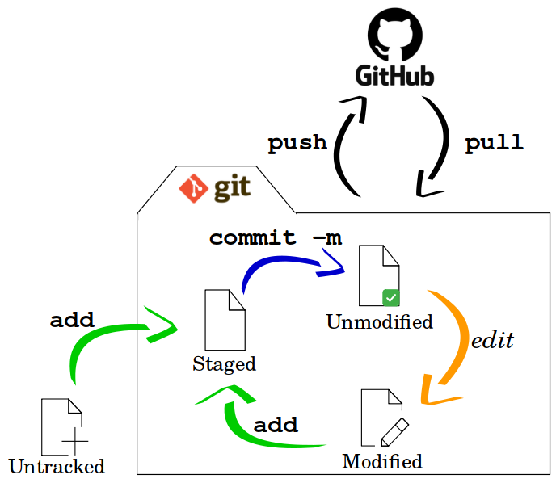
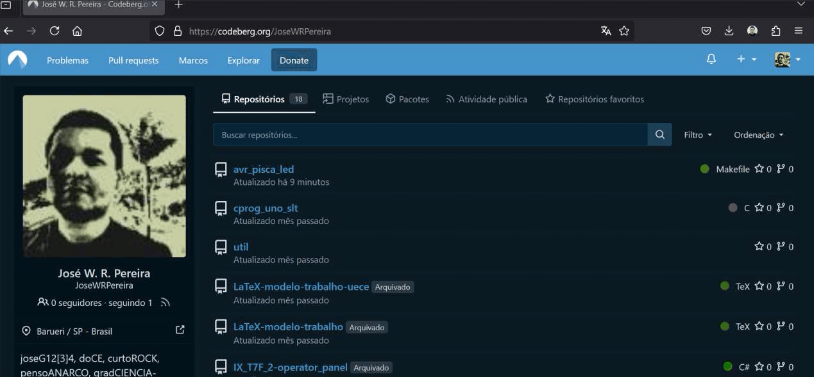
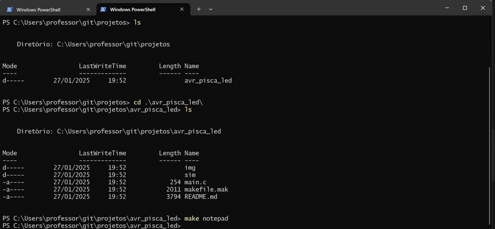

# Ambientação


---

## Ferramentas de Desenvolvimento


| Componente | Modelo | Descrição |      
| :--------- |:------ | :-------- |
| Microcontrolador | [AVR - ATMega328P](https://ww1.microchip.com/downloads/en/DeviceDoc/Atmel-7810-Automotive-Microcontrollers-ATmega328P_Datasheet.pdf) | Plataforma Arduino Uno como interface |
| IDE        | [MPLabX](https://www.microchip.com/en-us/tools-resources/develop/mplab-x-ide) | Ambiente de Desenvolvimento Integrado - [Instalação](https://developerhelp.microchip.com/xwiki/bin/view/software-tools/ides/x/install-guide/) |
| Compilador | [XC8](https://www.microchip.com/en-us/tools-resources/develop/mplab-xc-compilers/xc8) | [Instalação](https://developerhelp.microchip.com/xwiki/bin/view/software-tools/xc8/install/) |
| Editor de código | [Notepad++](https://notepad-plus-plus.org/downloads/) | [v8.7.7](https://github.com/notepad-plus-plus/notepad-plus-plus/releases/download/v8.7.7/npp.8.7.7.Installer.x64.exe) |
| Construtor de projeto | [Makefile](https://stackoverflow.com/questions/32127524/how-to-install-and-use-make-in-windows) | Power Shell<br>`winget install Chocolatey.Chocolatey` <br><br> Power Shell Admin: <br> `choco install make` |
| Gravador do AVR       | [AVRDudess](https://github.com/ZakKemble/AVRDUDESS/releases/tag/v2.18)  | [ZakKemble/AVRDUDESS/v2.18](https://github.com/ZakKemble/AVRDUDESS/releases/download/v2.18/AVRDUDESS-2.18-setup.exe) |
| Simulador eletrônico  | [SimulIDE](https://simulide.com/p/downloads/) | Power Shell<br>`winget install SimulIDE.SimulIDE` |
| Versionamento         | [git](https://git-scm.com/downloads) | Power Shell<br>`winget install --id Git.Git -e --source winget` |

---

## Fluxo de trabalho com git e GitHub
| Fluxo simples de trabalho com git e GitHub |
| :----------------------------------------: |
|  |
|            Fonte: Autor                    |


---

## Metodologia de trabalho baseada em Projetos

**0. Objetivo: Nome significativo para o projeto**

Descrever o que deve ser feito, de forma objetiva e clara.


**1. Requisitos da solução**

- Descrever características fundamentais para operação. 
- Descrever comportamentos do sistema. 

**2. Planejamento da solução**

Definir como será feita a entrega: simulador, montagem em protótipo, montagem em painel ou placa de circuito impresso (PCI), etc, listar os materiais e ferramentas em função do tipo de entrega e explicitar como, utilizando os materiais listados e manipulando as ferramentas, chega-se ao produto final, com um encadeamento lógico das tarefas que integram o processo.

- 2.1 - Planejamento do produto final
- 2.2 - Planejamento das ferramentas e materiais
- 2.3 - Planejamento do processo

**3. Solução**

Produto ou processo que atinge o objetivo proposto, através da execução do seu planejamento e satisfação dos seus requisitos.


---

## AVR Pisca LED


O primeiro programa para dispositivos embarcados, costuma ser um programa para piscar um LED, que serve para testar as ferramentas de compilação e gravação, verificando sua integridade e capacidade de execução.

Este projeto contém um programa mínimo para piscar um LED na plataforma Arduino Uno, porém o seu desenvolvimento se dá com a utilização e programação do microcontrolador de forma direta, sem a utilização do que chamamos *framework* Arduino.

Para testar a integridade das ferramentas de desenvolvimento aqui utilizadas, no seu computador, siga os passos: 


**1. Baixar o projeto do servidor git (Codeberg ou Github);**

1.1 No terminal (Windows Power Shell), crie um diretório para armazenar os projetos:

```barra
mkdir projetos
```

1.2 Acesso o diretório criado: 

```bash
cd projetos
```

1.3 Clone o projeto de teste:

Github:
```bash
git clone https://github.com/JoseWRPereira/avr_pisca_led.git
```

ou

Codeberg:
```bash
git clone https://codeberg.org/JoseWRPereira/avr_pisca_led.git
```

1.4 Acesse o diretório do projeto baixado: 

```bash
cd avr_pisca_led
```
1.5 Resumo



**2. Abrindo arquivos de edição:**

2.1 É possível abrir o **notepad++** com os arquivos *.c* e *.h* que houverem no diretório corrente, executando o seguinte comando: 
```bash
make notepad
```

2.2 Vá em `Arquivo`, `Abrir...` e abra o arquivo `makefile.mak`. 

2.3 Verifique o local e a versão do compilador conforme ilustração.


2.4 Resumo


**3. Verificando porta de comunicação para gravação:**

3.1 Conecte o Arduino ao conector USB e verifique qual foi a porta alocada para ele: `Gerenciador de Dispositivos` e a aba `Portas(COM e LPT)` 


3.2 Se necessário ajuste na linha 1 do `makefile.mak` com a porta de conexão com o seu Arduino.


**4. Compilando e gravando o projeto:**	

4.1 Se todos os programas estiverem instalados e nos locais apontados no `makefile.mak`, então:

4.1.1 Para compilar o projeto execute:  
	
```bash
make
```

4.1.2 Para fazer o a gravação do binário no microcontrolador(ATmega328P) do Arduino.

```bash
make flash
```

4.2 Resumo



**5. Criando um circuito no SimulIDE**


5.1 Para criar um projeto no SimulIDE, basta abrir o software, e inserir os componentes.

5.2 Para inserir um componente basta clicar sobre ele, na barra de ferramentas, e arrastá-lo até a área de trabalho, soltando-o na posição desejada.

5.3 Inserir:

- Componentes > Microcontroladores > Arduino > Uno
- Componentes > Passivos > Resistors > Resistor
- Componentes > Saídas > Leds > LED
- Componentes > Fontes > Terra (0 V)

5.4 Após inserir todos os componentes na área de trabalho, posicione-os de forma que o circuito fique legível e bem organizado. 

- Girar: Para girar um componente, basta clicar com o botão direito sobre o elemento, e escolher uma das opções de girar ou inverter.

5.5 A ferramenta de linha é acionada ao posicionar o cursor sobre um terminal de componente, clicando sobre ele, é iniciada uma linha de conexão, que pode ser estendida, seguindo a orientação vertical ou horizontal até o ponto de conexão de destino. 

5.6 Resumo 


**6.0 Simulação de Pisca LED**


---


## [Template para um novo projeto](https://github.com/JoseWRPereira/avr_atmega328p_template)

