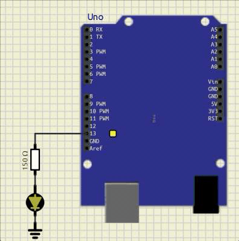
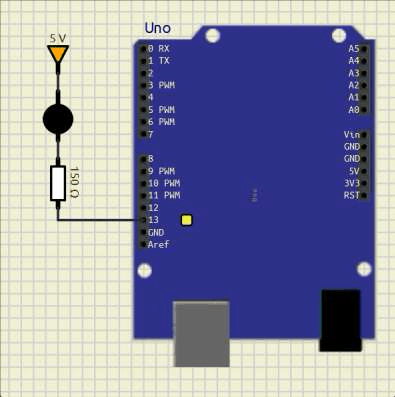
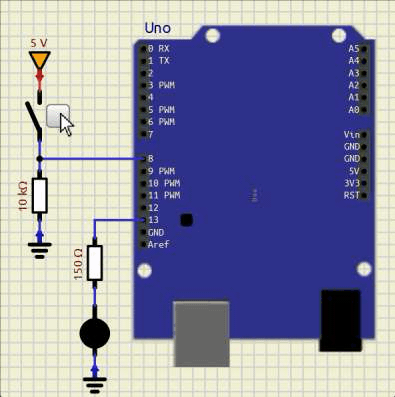
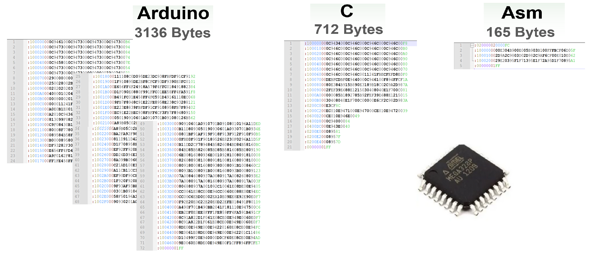

#


---

## Situação de Aprendizagem


**1. Objetivo: Sinalizador de garagem**

Desenvolver uma aplicação, projeto eletrônico e programa, para um dispositivo de sinalização de segurança para saída de veículos em garagem.


**2. Requisitos da solução**

  1. Intervalo de alternância entre luzes: 1s;
  2. Luzes piscando enquanto o portão estiver aberto.


**3. Planejamento da solução**

  1. Planejamento do produto final
    1. Arquivo de simulação;
    2. Imagem de circuito de simulação como ilustração;
    3. Montagem de protótipo funcional em matriz de contatos.
  2. Planejamento das ferramentas e materiais
	- Ferramentas:
		- Simulador: [SimulIDE](https://www.simulide.com/p/downloads.html) (v1.1.0 Stable Version)
		- Compilador: [XC8](https://www.microchip.com/en-us/tools-resources/develop/mplab-xc-compilers)
		- Gravador: [AVRDUDESS](https://github.com/ZakKemble/AVRDUDESS)
		- Editor de código: [Notepad++](https://notepad-plus-plus.org/downloads/)
		- Construtor do projeto: [Makefile](https://stackoverflow.com/questions/32127524/how-to-install-and-use-make-in-windows)
		- Versionamento: [git](https://git-scm.com/downloads)
	- Materiais:
		- 01 - Arduino Uno + Cabo de conexão;
		- 01 - Matriz de contatos (Protoboard);
		- 02 - LEDs (Vermelho e Amarelo);
		- 02 - Resistores para os LEDs;
		- 01 - Botão ou chave de seleção;
		- 01 - Resistor de pull-up.

  3. Planejamento do processo
    1. Criar o projeto na plataforma de versionamento;
    2. Definir mapa de entradas e saídas;
    3. Construir o circuito no simulador;
    4. Criar projeto de validação do circuito no simulador;
    5. Criar programa(firmware) da aplicação;
    6. Montar circuito em matriz de contatos;
    7. Testar programa(firmware) na montagem do protótipo;
    8. Registrar resultado da atividade.


**4. [Solução](https://codeberg.org/JoseWRPereira/avr_sinalizador_garagem)**

Produto ou processo que atinge o objetivo proposto,
através da execução do seu planejamento e satisfação dos seus requisitos.


Na etapa inicial da solução, crie um projeto em uma plataforma de versionamento,
seja ela [codeberg](https://codeberg.org/),
[gitlab](https://about.gitlab.com/),
[github](https://github.com/) ou qualquer outra plataforma de sua preferência.


**4.1. Criando um projeto de versionamento no codeberg**


Após criar o projeto, faça o download para um repositório local,
que servirá para alocar e armazenar a simulação e o firmware durante o desenvolvimento.

**4.2. Download do projeto criado em repositório local**


Crie um projeto no simulIDE, e salve-o em um diretório `sim` dentro do diretório do projeto.

Em seguida, adicione-o ao `stage` e realize o `commit` da nova mudança, seguindo com o
`push` para o repositório remoto.


**4.3. Criando simulação e incluindo no repositório**


**4.4. Definindo mapa de entradas e saídas**

| Função | Dispositivo | Descrição | Pino <br> (Arduino Uno) | Pino <br> (ATmega328P) | PORT |
|:------:|:-----------:|:---------------------------------------:|:---:|:---:|:---:|
| Entrada| Fim-de-curso| Acionado quando o portão estiver aberto |  8 | 14 | PB0 |
| Saída  | LED         | Sinaleiro Amarelo                       | 12 | 18 | PB4 |
| Saída  | LED         | Sinaleiro Vermelho                      | 13 | 19 | PB5 |


**4.5. Construindo o circuito no simulador**


Copie os arquivos `main.c` e `makefile.mak` de um projeto já existente (avr_pisca_led).
Isso facilita a construção do projeto, editando apenas no nome do projeto no
arquivo de construção e alterando o conteúdo de main.c,
bem como incluindo códigos ou outros arquivos de acordo com o desenvolvimento do projeto.


**4.6. Criando arquivos de código fonte**


**Código fonte**

```c
#define F_CPU 16000000L
#include <avr/io.h>
#include <util/delay.h>
int main(void)
{   
    DDRB = 0b00110000;
    PORTB = 0;
    while (1)
    {
        if( PINB & (1<<PINB0))
        {
            PORTB |= (1<<PORTB4);
            PORTB &= ~(1<<PORTB5);
            _delay_ms(500);
            PORTB ^= (1<<PORTB4 | 1<<PORTB5);
            _delay_ms(500);
        }
        else
        {
            PORTB &= ~(1<<PORTB4);
            PORTB &= ~(1<<PORTB5);
        }
    }
}

```


**4.7. Carregando arquivo executável na simulação**


**4.8. Incluindo mudanças na plataforma de versionamento**


---


## Entradas e Saídas Digitais

**Saídas Digitais**

O dispositivo responsável por acionar o LED é o microcontrolador(uC), através de um pino configurado como saída. Este pino pode estar fornecendo corrente como fonte (source) ao ramo ou drenando (sink) corrente dele.

| Ligação do pino como fonte (Source) | Ligação do pino como dreno (Sink) |
|:-----------------------------------:|:---------------------------------:|
|  |   |

O pino do uC possui limitação de corrente, que pode variar a depender do modelo ou fabricante.

A corrente máxima por pino é de `40 mA`, de acordo com o Datasheet (AVR ATmega328P, capítulo *28.1 Absolute maximum ratings*, pág. 258).

A vantagem de utilizar o pino como fonte é trabalhar com uma lógica direta, em que o estado lógico 1(verdadeiro, +5V) produz o acionamento do LED, enquanto que na configuração do pino como dreno a lógica de acionamento é invertida, pois o pino em estado lógico 0(falso, 0V) produz o acionamento do LED.


**Entradas Digitais**

A entrada deve possuir um estado lógico bem definido, mas um botão pulsador não garante esse estado lógico, pois possui apenas dois contatos, podendo sua configuração ser normalmente aberto (NA) ou normalmente fechado(NF). Na figura abaixo é utilizado um botão pulsador NA, que é a configuração mais comum.

Para garantir o tal estado lógico bem definido, é montado um ramo com o botão e um resistor, geralmente com 10kΩ, ligados em série, entre o Vcc e o GND. No ponto de conexão entre esses dois componentes temos, em relação ao terra (GND), uma tensão que é a tensão do componente conectado ao terra. Este ponto é conectado ao pino do uC, assim a tensão no pino é a mesma tensão sobre o componente ligado ao terra.

As duas configurações possíves são mostradas na ilustração abaixo, em que o botão está conectado ao Vcc e a outra em que o botão está conectado ao terra.


| Ligação do resistor de *pull-down*      | Ligação do resistor de *pull-up*     |
|:---------------------------------------:|:------------------------------------:|
| |  |

Na configuração pull-down o resistor está conectado ao terra, o que garante, quando o botão estiver aberto, o nível lógico 0 (terra/GND) chegando no pino do uC.

Ao pressionar o botão, ele fecha e conecta o ponto de conexão com o pino ao Vcc, aplicando o nível lógico 1 a ele.

Na configuração pull-up o resistor está conectado ao positivo da fonte, Vcc. O botão na condição de não acionado está com contato aberto, assim a tensão sobre ele é a tensão da fonte, nesse caso 5V, conforme a 2ª lei de Kirchhoff, garantindo o nível lógico 1.

Ao pressionar o botão, ele fecha, ligando o ponto de conexão com o pino do uC ao GND, aplicando o nível lógico 0 a ele.

A configuração com o resistor de pull-down é a que proporciona uma lógica direta a entrada do dado: botão pressionado.

<br>

**Registradores de configuração dos pinos do PORTB**


<br>

**Circuito geral dos pinos de entrada e saída**


<br>

**Acionamento do circuito de entrada e saída em função do comando**


<br>

---

**Configurando Entradas e Saídas**

Para a configuração das entradas e saídas, é necessário que sejam definidos os pinos para cada função da interface na aplicação. Como exemplo, é usado o mesmo mapa de entradas e saídas da situação de aprendizagem do sinalizador de garagem.

**Mapa de entradas e saídas**

| Função | Dispositivo | Descrição | Pino <br> (Arduino Uno) | Pino <br> (ATmega328P) | PORT |
|:------:|:-----------:|:---------------------------------------:|:---:|:---:|:---:|
| Entrada| Fim-de-curso| Acionado quando o portão estiver aberto |  8  |  14 | PB0 |
| Saída  | LED         | Sinaleiro Amarelo                       | 12  |  18 | PB4 |
| Saída  | LED         | Sinaleiro Vermelho                      | 13  |  19 | PB5 |


As colunas de pinagem, tanto da placa de desenvolvimento (Pino (Arduino Uno)) quanto do microcontrolador (Pino (ATmega328P)), facilitam a identificação dos pontos de conexão nas situações em que é realizada a montagem de circuito em matriz de contatos, para execução de protótipos ou o roteamento de trilhas em placa de circuito impresso, respectivamente.

A coluna PORT nos evidencia o registrador e o bit que deve ser  configurado no programa para implementação da funcionalidade da aplicação.

Sendo assim, para a configuração no programa (firmware), as colunas mais importantes inicialmente são as colunas de Função e PORT.

A configuração dos pinos pode ser realizada de forma unitária ou através de uma escrita única em cada registrador, configurando todos os pinos representados por ele de uma só vez.

Para a configuração individual de pinos, é necessário usar o seguinte padrão de ligar um bit ou zerá-lo:

Para ligar (setar) um bit dentro de um registrador:
```C
  registrador |= (1<<numero_do_bit);
```

Para zerar (resetar) um bit dentro de um registrador:
```C
  registrador &= ~(1<<numero_do_bit);
```
Sendo o `numero_do_bit` um valor de `0` a `7`, ou ainda, podem-ser utilizados os `defines` declarados na biblioteca, como: `PINB0` que corresponde ao `0`, `PINB1` correpondente ao `1` e assim por diante. Da mesma forma para os PORT e o DDR: `PORTB0`, `PORTB1`,..., e `DDRB0`, `DDRB1`, ... 

Para configurar um pino como entrada, é necessário zerar o respectivo bit do registrador `DDRx` e ligar ou desligar o Resistor de Pull-up interno pelo registrador `PORTx`.

No exemplo, temos que configurar o `PB0` como entrada. Assim, são utilizados os registradores `DDRB` para a direção de entrada e o `PORTB` para desabilitar o Resistor de Pull-Up interno, pois no exemplo, é utilizado um resistor de Pull-Up externo.
```C
    // Configuração das Entradas
  DDRB &= ~(1<<0);      // PB0 <- 0
  PORTB &= ~(1<<0);     // PB0 Pull-up OFF
```

Ainda no exemplo, temos que configurar e inicializar os pinos de saída: PB4 e PB5. Da mesma forma, são utilizados os registradores `DDRB` para configuração de saída e `PORTB` para acionar um nível lógico no pino do microcontrolador.

```C
    // Configuração das Saídas
  DDRB |= (1<<4);       // PB4 <- 1
  DDRB |= (1<<5);       // PB4 <- 1
    // Inicialização do estado lógico dos pinos
  PORTB &= ~(1<<4);      // PB4 <- 0
  PORTB &= ~(1<<5);      // PB5 <- 0
```

Note que a função do registrador `PORTx` depende da configuração do registrador `DDRx`.

No nosso exemplo, todos os pinos utilizados pertencem ao mesmo PORT, assim, é possível realizar a configuração dos três elementos todos de uma única vez:

O bit 0 (PB0) deve ser configurado como entrada (E) e os bits 4 e 5 (PB4 e PB5) devem ser configurados como saídas (S).

```C
  // Configuração do registrador de direção de dados (Entrada / Saída)

  // DDRx = 0b--SS---E;

  // Onde:
  //      0b: Notação que indica número com notação binária.
  //      E: Entradas (0)
  //      S: Saída (1)
  //      -: Bit não utilizado.

  // Reescrevendo com os valores adequados no Registrador dos pinos PB0, PB4 e PB5:

  // DDRB = 0b--11---0;

  // Os pinos não utilizados (-) devem ser configurados como entradas (0):

  DDRB = 0b00110000;
```

Após a configuração do `DDRx` é a vez do `PORTx`.

```C
  // Configuração de resistor de pull-up para entradas e estado lógico para as saídas.

  // PORTB = 0b--SS---E;
  // Onde:
  //      E: Entradas (0)
  //      S: Saída (1)
  //      -: Bit não utilizado.

  // Como os bits não utilizados são entradas:

  // PORTB = 0bEESSEEEE;

  // Desligando os resistores de pull-up internos:

  // PORTB = 0b00SS0000;

  // Desligando o estado lógico das saídas PB4 e PB5:

  PORTB = 0b00000000;
```

Os valores carregados nos registradores são costumeiramente notados com valores em hexadecimal:

```C
  DDRB  = 0x30;
  PORTB = 0x00;
```

Qualquer forma de configuração pode ser utilizada, tanto um bit por vez quanto a escrita integral dos registradores, anotados com valores em binário, decimal ou hexadecimal.

---

**Resumo da configuração dos pinos no ATmega328P**

```
///////////////////////////////////////////////////////////////////////////////
//  Registradores de configuração e manipulação de dados nos pinos
//
//        DDRxn   :   Data Direction Register
//        PORTxn  :   Data Register
//        PINxn   :   Input Pin Address
//
//        ===================
//        x |        n
//        ===================
//        B | 7 6 5 4 3 2 1 0
//        C |   6 5 4 3 2 1 0
//        D | 7 6 5 4 3 2 1 0
//        E |         3 2 1 0
//        ===================
//
//  Configuração e Manipulação de dados nos pinos
//
//        DDRxn = 1;          // Output
//            {
//                PORTxn = 1; //          High
//                PORTxn = 0; //          Low
//            }
//
//        DDRxn = 0;          // Input
//            {
//                PORTxn = 0; //          Pull-Up Resistor OFF
//                PORTxn = 1; //          Pull-Up Resistor ON
//                {
//                    (PINxn == 1)    //  ON
//                    (PINxn == 0)    //  OFF
//                }
//            }
//        
////////////////////////////////////////////////////////////////////////////////
```

---

---


## Código fonte em etapas

1) Estrutura básica de um código em linguagem C.

  ```c
  int main(void)
  {   
    while (1)
    {

    }
  }
  ```

<br>

2) Configuração de entradas e saídas


```c

#include <avr/io.h>

int main(void)
{   
    DDRB = 0b00110000;
    PORTB = 0;
    while (1)
    {

    }
}
```

3) Acionamento do LED conectado ao pino de saída (13 - PB5)

```c

#include <avr/io.h>

int main(void)
{   
    DDRB = 0b00110000;
    PORTB = 0;
    while (1)
    {
        PORTB &= ~(1<<5);       // Desliga LED

        PORTB ^=  (1<<5);       // Liga LED

    }
}
```

4) Inclusão de atraso entre os acionamentos do LED

```c
#define F_CPU 16000000L
#include <avr/io.h>
#include <util/delay.h>
int main(void)
{   
    DDRB = 0b00110000;
    PORTB = 0;
    while (1)
    {
        PORTB &= ~(1<<5);       // Desliga LED
        _delay_ms(500);         // Atraso de 500ms
        PORTB ^=  (1<<5);       // Liga LED
        _delay_ms(500);         // Atraso de 500ms
    }
}
```

<br>

5) Leitura da entrada: fim-de-curso (botão/sensor)

```c
#define F_CPU 16000000L
#include <avr/io.h>
#include <util/delay.h>
int main(void)
{   
    DDRB = 0b00110000;
    PORTB = 0;
    while (1)
    {
        if( PINB & (1<<0) )         // Leitura do fim-de-curso
        {
            PORTB &= ~(1<<5);       // Desliga LED
            _delay_ms(500);         // Atraso de 500ms
            PORTB ^=  (1<<5);       // Liga LED
            _delay_ms(500);         // Atraso de 500ms
        }
        else
        {
            PORTB &= ~(1<<5);       // Desliga LED
        }
    }
}
```

<br>


6) Inclusão da segunda saída (LED)

```c
#define F_CPU 16000000L
#include <avr/io.h>
#include <util/delay.h>
int main(void)
{   
    DDRB = 0b00110000;
    PORTB = 0;
    while (1)
    {
        if( PINB & (1<<0))
        {
            PORTB |= (1<<4);
            PORTB &= ~(1<<5);
            _delay_ms(500);
            PORTB ^= (1<<4 | 1<<5);
            _delay_ms(500);
        }
        else
        {
            PORTB &= ~(1<<4);
            PORTB &= ~(1<<5);
        }
    }
}
```

---

# Comparação entre códigos fonte: Qual é o melhor?


> Código utilizando o *framework* Arduino.


``` Arduino

// Código .ino

void setup()
{
  pinMode(13, OUTPUT);
  pinMode(12, OUTPUT);
  pinMode( 8, INPUT);
}

void loop()
{
  if( digitalRead(8) == 1 )
  {
    digitalWrite(12, HIGH);
    digitalWrite(13, LOW);
    delay(500);
    digitalWrite(12, LOW);
    digitalWrite(13, HIGH);
    delay(500);
  }
  else
  {
    digitalWrite(12, LOW);
    digitalWrite(13, LOW);
  }
}

```

---

> Código fonte em linguagem C para AVR.

``` c

// Código .c

#define F_CPU 16000000L
#include <avr/io.h>
#include <util/delay.h>
int main(void)
{   
    DDRB = 0b00110000;
    PORTB = 0;
    while (1)
    {
        if( PINB & (1<<0))
        {
            PORTB |= (1<<4);
            PORTB &= ~(1<<5);
            _delay_ms(500);
            PORTB ^= (1<<4 | 1<<5);
            _delay_ms(500);
        }
        else
        {
            PORTB &= ~(1<<4);
            PORTB &= ~(1<<5);
        }
    }
}
```


---

> Código fonte em linguagem Assembly para AVR.

``` Asm

; Código .asm

			; Inclusão das definições de pinos fornecidas pelo fabricante
.include "m328pdef.inc"

				; Programa alocado no enderaço 0 da memória de código.
.ORG 0X0000

				; PB5, PB4: out;    PB0: in;	0b00110000 = 0x30
	LDI	    R16,0x30
	OUT 	DDRB,R16

DESLIGA_LEDS:
	LDI	    R16,0x00
	OUT	    PORTB,R16

INICIO:
	IN	    R16,PINB
	SBRS	R16,0
	RJMP	DESLIGA_LEDS

	RCALL	DELAY
	SBI	    PORTB,PB5
	CBI	    PORTB,PB4
	RCALL	DELAY
	CBI	    PORTB,PB5
	SBI	    PORTB,PB4
	RJMP	INICIO

DELAY:
	LDI	    R16,0
	LDI	    R17,0
	LDI	    R18,41
DELAY_LOOP:
	INC	    R16
	BRNE	DELAY_LOOP
	INC	    R17
	BRNE	DELAY_LOOP
	DEC	    R18
	BRNE	DELAY_LOOP
	RET

```

> O arquivo de inclusão do projeto em Assembly [`m328pdef.inc`](https://codeberg.org/JoseWRPereira/sitap-cp/src/branch/main/11-cp-avr-atmega328p/01_5-asm-sinalizador_de_garagem/m328pdef.inc) contém a definição dos registradores e seus respectivos endereços. Este arquivo é fornecido pelo fabricante.


---

Após a compilação dos códigos, são gerados arquivos .hex equivalentes em comportamento, porém com uma diferença absurda em termos de ocupação de memória.



---
