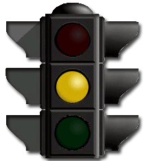

---

# Situação de Aprendizagem

**1. Objetivo: Semáforo**

Desenvolver uma aplicação, projeto eletrônico e programa, para um dispositivo de controle de tráfego (semáforo), a ser instalado em um cruzamento de pedestre. 

|Figura 1a: Exemplo de cruzamento de pedestres| Figura 1b: Semáforo para veículos|
|:-------------------------------------------:|:--------------------------------:|
| ||
| Fonte: [freepik](https://br.freepik.com/vetores-premium/pedestre-atravessar-a-rua-com-pessoas-da-equipe-e-semaforo-e-cidade_5589436.htm)  | |

**2. Requisitos da solução**

1. Interface
      1. Semáforo de veículos (Vm, Am, Vd);
      2. Semáforo de pedestres (Vd, Vm);
      3. Botão pulsador para pedestres.
2. Comportamento
    * Intervalo de tempo para o Semáforo de Veículos(sv):
        * Verde: 42s
        * Amarelo: 3s
        * Vermelho: 15s
    * Semáforo de Pedestre(sp) sincronizado com o de veículos:
        * Verde (sv) : Vermelho (sp)
        * Amarelo (sv) : Vermelho (sp)
        * Vermelho (sv) : Verde (sp)
        * Piscar Vermelho (sp) 3x antes de mudar em definitivo.
    * Botão pulsador para antecipar liberação de passagem dos pedestres:
        * Se faltar mais do que 10s para o acionamento da cor amarela, reduzir para 10s.
        * Se faltar menos do que 10s para o acionamento da cor amarela, manter o tempo restante.
3. Estrutra (*Hardware*): Circuito eletrônico
    * Potência por sinaleiro: 7W
    * Tensão de operação: 24V

**3. Planejamento da solução**

1. Planejamento do produto final
      1. Projeto em plataforma de versionamento;
      2. Código fonte;
      3. Simulação;
      4. Protótipo (opcional);
      5. Circuito eletrônico (opcional).
   
2. Planejamento das ferramentas e materiais

3. Planejamento do processo
    1. Criar o projeto na plataforma de versionamento;
    2. Definir mapa de entradas e saídas;
    3. Construir o circuito no simulador;
    4. Criar projeto de validação do circuito no simulador;
    5. Criar programa(firmware) da aplicação;
    6. Montar circuito em matriz de contatos;
    7. Testar programa(firmware) na montagem do protótipo;
    8. Registrar resultado da atividade.

**4. Solução**

Bom trabalho!
