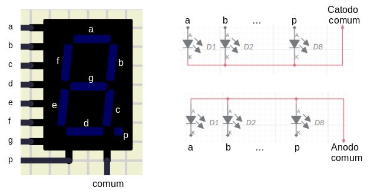
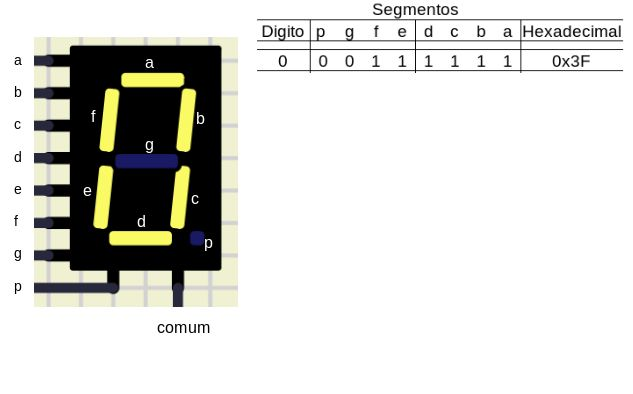
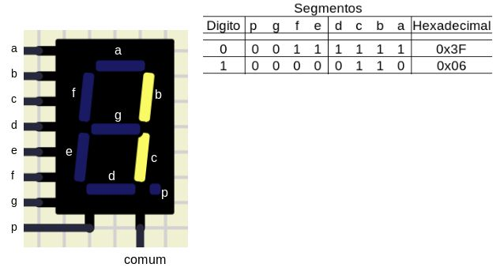
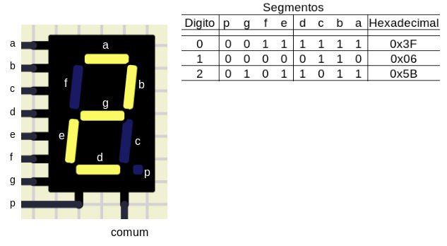
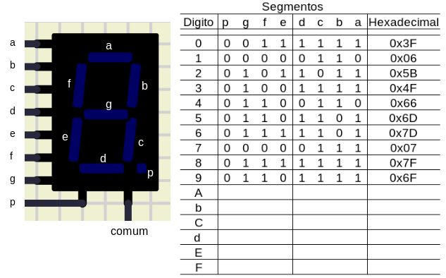

<!--  -->

---

# Display 7-segmentos

**Objetivo**

Acionar um display de 7 segmentos para exibir os 16 dígitos hexadecimais: `0,1,2,3,4,5,6,7,8,9,A,B,C,D,E e F`.

**O display**

O display de 7 segmentos basicamente é um conjunto de LEDs dispostos de forma a cada um deles iluminar um segmento no encapsulamento. Existem vários modelos para diferentes necessidades, mas aqui usamos o mais comum.

O display possui, além dos sete segmentos, um ponto, que pode ser utilizado para sinalizar um ponto decimal (vírgula) ao associar vários displays. Nesse projeto o ponto não será utilzado.

Existem dois modelos de display, **Anodo comum** e **Catodo comum**, que se referem aos terminais dos LEDs conectados em comum, conforme exemplo da Figura 1.

| Figura 1: Segmentos do display          |
|:--------------------------------------:|
|  |
| Fonte: Autor                           |

Cada segmento recebe uma identificação em letra minúscula de `a` a `g` e o `p`. O display possui um terminal para cada segmento do display.

Note que cada segmento, composto por um LED, necessita de um resistor para limitar a corrente que percorre ele. Como cada pino do uC fornece uma tensão de 5V para acionar o segmento. A queda de tensão no LED é de 2V, aproximadamente. Pode-se assim calcular o valor do resistor limitador de corrente:

\[ R = \frac{V_{pino} - V_{LED}}{I_{LED}} = \frac{5-2}{0,02} = 150\Omega \]

O display aqui utilizado é do tipo catodo comum, assim basta acionar os pinos que correspondam aos segmentos a serem acionados para formar o dígito que se deseja exibir.

Para mostrar o dígito 0(zero), aciona-se os segmento a, b, c, d, e, f conforme mostrado na Figura 2.

| Figura 2: Código de formação do digito 0 (Zero) |
|:-----------------------------------------------:|
|       |
| Fonte: Autor                                    |

É importante notar a sequência de pinos do display e do PORT utilizado, pois uma alteração de ordem muda o que é exibido no display.

Para o dígito 1(um), Figura 3, é necessário ligar apenas os segmentos b e c, mantendo os demais desligados.

| Figura 3: Código de formação do digito 1 (Um)   |
|:-----------------------------------------------:|
|       |
| Fonte: Autor                                    |

Para o dígito 2(dois), Figura 4, é mais fácil perceber os dígitos desligados, pois estão em menor quantidade, sendo o `c` e o `f` desligados e os demais ligados (exceto o ponto como já foi citado).

| Figura 4: Código de formação do digito 2 (Dois) |
|:-----------------------------------------------:|
|       |
| Fonte: Autor                                    |

A Figura 6 mostra uma tabela com todas as combinações para os dígitos decimais e seus valores correspondentes em hexadecimal. Ao atribuir ao PORT um dos valores em hexadecimal da tabela, o digito correspondente deve ser mostrado no display.

| Figura 5: Código de formação do dígitos `0` a `9` |
|:-------------------------------------------------:|
|         |
| Fonte: Autor                                      |

Estão faltando os dados dos dígitos que completam o conjunto hexadecimal, que podem te servir como exercícios. 

Bom trabalho!