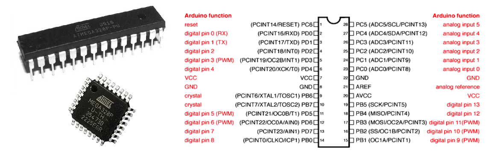
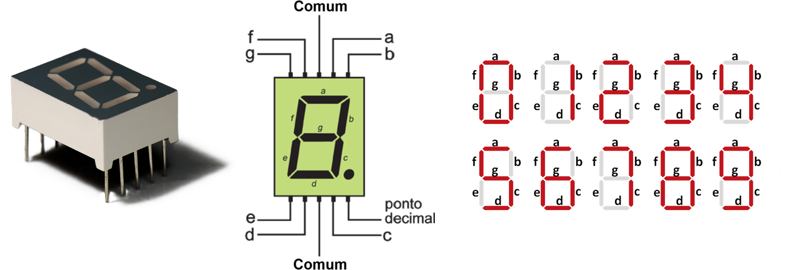
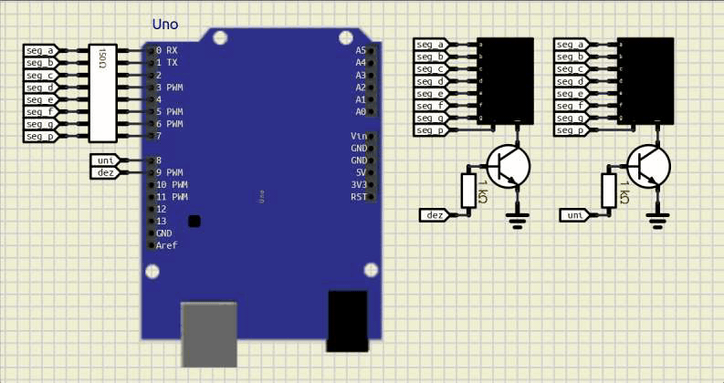

<!--  -->

---

# 2 Displays 7-segmentos

A leitura simples de um botão implica em alguns comportamentos não desejados como um incremento maior do que a quantidade de vezes que um botão é pressionado. Para solucionar esse problema pode-se utilizar não o estado lógico do botão, mas sim o evendo associado a mudança de estado, evento único dentro de um ciclo de operação.

**Objetivo**

Detectar as bordas de subida e descida em botão pulsador, gerando um incremento e decremento de uma variável de contagem.

| Figura 1: Contagem com 2 dígitos            |
|:-------------------------------------------:|
|   |
| Fonte: Autor                                |

**Mapa de entradas e saídas**

| Função | Dispositivo | Descrição | Pino   (Arduino Uno) | Pino   (ATmega328P) | PORT |
|:------:|:-----------:|:---------:|:-----------------------:|:----------------------:|:----:|
| Saída  | Diplay 7 segmentos | Segmento a   |  0 |  2 | PD0 |
| Saída  | Diplay 7 segmentos | Segmento b   |  1 |  3 | PD1 |
| Saída  | Diplay 7 segmentos | Segmento c   |  2 |  4 | PD2 |
| Saída  | Diplay 7 segmentos | Segmento d   |  3 |  5 | PD3 |
| Saída  | Diplay 7 segmentos | Segmento e   |  4 |  6 | PD4 |
| Saída  | Diplay 7 segmentos | Segmento f   |  5 | 11 | PD5 |
| Saída  | Diplay 7 segmentos | Segmento g   |  6 | 12 | PD6 |
| Saída  | Diplay 7 segmentos | Segmento p   |  7 | 13 | PD7 |
| Saída  | Diplay 7 segmentos | Sel. Unidade |  8 | 14 | PB0 |
| Saída  | Diplay 7 segmentos | Sel. Dezena  |  9 | 15 | PB1 |

---

---
