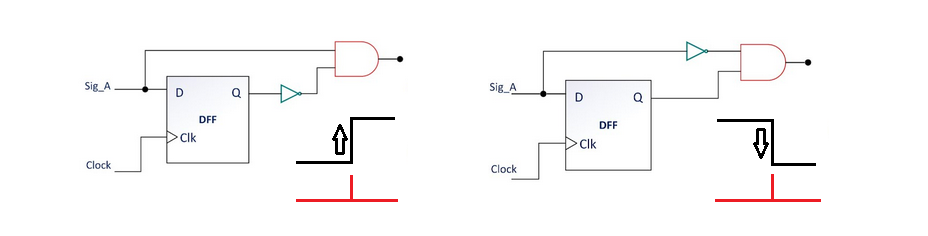
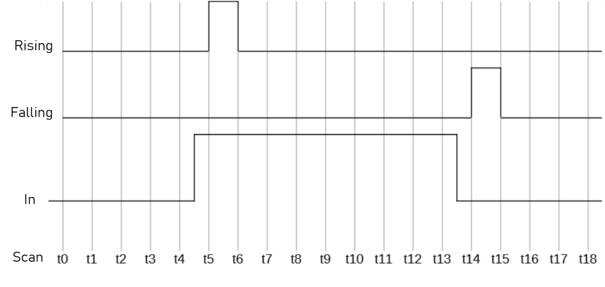
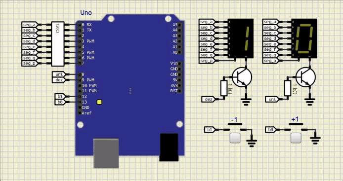

<!--  -->

---

# Detecção de bordas

A leitura simples de um botão implica em alguns comportamentos não desejados como um incremento maior do que a quantidade de vezes que um botão é pressionado. Para solucionar esse problema pode-se utilizar não o estado lógico do botão, mas sim o evendo associado a mudança de estado, evento único dentro de um ciclo de operação, que é a borda de subida ou a borda de descida.

A Figura 1 ilustra os sinais para a detecção de bordas de subida e descida em função de um sinal de entrada e intervalos discretos (t0, t1, ..., tn) representando o tempo de execução de cada ciclo de execução do programa principal. 

| Figura 1: Detecção de bordas de subida (*rising*) e descida (*falling*)|
|:--------------------------------------------------------:|
|                               |
| Fonte: Autor                                             |

A detecção de uma borda, consiste em fazer a leitura do sinal de entrada no momento atual e comparar este valor com o valor da mesma entrada no ciclo anterior. 

Para a detecção da borda de subida, note que no instante de tempo t5, o sinal de entrada é alto e no instante anterior, t4, o sinal era baixo, denotando uma transição ascendente do sinal de entrada, ou seja, houve uma borda de subida. Assim, o sinal *`rising`*, que representa que houve tal transição é levada ao nível alto. No instante seguinte, t6 o nível se mantém em nível alto e no instante anterior, t5, também era nível alto, não havendo mudança, e assim, deixando o sinal *`rising`* em nível baixo. 

Na detecção de borda de descida,*`falling`*, ocorre o mesmo, porém com a transição do sinal de entrada do nível alto para o nível baixo, nos instantes t13 para o t14. 

**Objetivo**

Detectar as bordas de subida e descida em botão pulsador, gerando um incremento e decremento de uma variável de contagem.

| Figura 2: Detecção de borda para incremento e decremento |
|:--------------------------------------------------------:|
|           |
| Fonte: Autor                                             |

**Mapa de entradas e saídas**

| Função  | Dispositivo | Descrição | Pino   (Arduino Uno) | Pino   (ATmega328P) | PORT |
|:-------:|:-----------:|:---------:|:-----------------------:|:----------------------:|:----:|
| Saída   | Diplay 7 segmentos | Segmento a   |  0 |  2 | PD0 |
| Saída   | Diplay 7 segmentos | Segmento b   |  1 |  3 | PD1 |
| Saída   | Diplay 7 segmentos | Segmento c   |  2 |  4 | PD2 |
| Saída   | Diplay 7 segmentos | Segmento d   |  3 |  5 | PD3 |
| Saída   | Diplay 7 segmentos | Segmento e   |  4 |  6 | PD4 |
| Saída   | Diplay 7 segmentos | Segmento f   |  5 | 11 | PD5 |
| Saída   | Diplay 7 segmentos | Segmento g   |  6 | 12 | PD6 |
| Saída   | Diplay 7 segmentos | Segmento p   |  7 | 13 | PD7 |
| Saída   | Diplay 7 segmentos | Sel. Unidade |  8 | 14 | PB0 |
| Saída   | Diplay 7 segmentos | Sel. Dezena  |  9 | 15 | PB1 |
| Entrada | Botão pulsador NA  | B0 : incrementa contagem | 13 | 19 | PB5 |
| Entrada | Botão pulsador NA  | B1 : decrementa contagem | 12 | 18 | PB4 |

---

---
