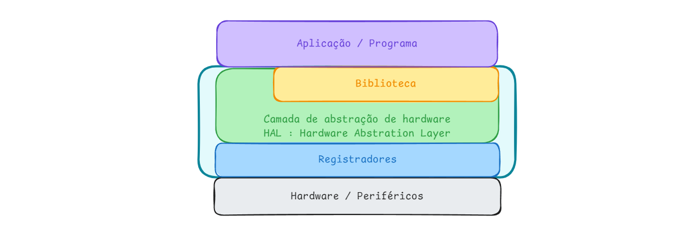
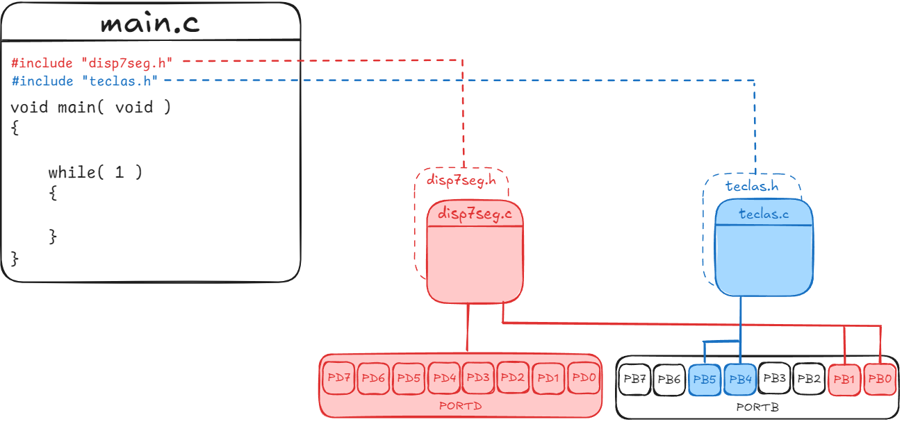

---


# Bibliotecas

Quando um programa começa a ganhar volume, ou seja, o número de funções começa a aumentar, o código começa a ficar difícil de manipular, com todas as funções em um único arquivo, a solução é separar as funções em arquivos distintos, fazendo agrupamento de funções por tipo de acionamento ou periférico. 

Esta organização facilita a manipulação do código e a sua reutilização em outros projetos.

Usando como exemplo o [Lab 6 - Detecção de Borda](../lab06-deteccao_bordas/), além da função principal `main`, existem funções de manipulação dos displays de 7 segmentos, e das teclas de incremento e decremento. Podemos assim, separar todas as funções em três arquivos, conforme ilustrado na Figura 1: 


| Figura 1: Diagrama de bibliotecas e declaração em programa principal |
|:--------------------------------------------------------------------:|
|                             |
| Fonte: Autor                                                         |

- main.c: para a função principal e ponto de entrada da aplicação ou programa;
- disp7seg.c: para funções de inicialização e de manipulação dos pinos responsáveis por acionar corretamente o conjunto de displays de 7 segmentos;
- teclas.c: funções para inicializar e manipular os pinos reponsáveis pela leitura das teclas utilizados neste projeto. 

As variáveis globais que forem utilzadas por um determinado periférico devem ser declaradas no respectivo arquivo.

Neste caso, as funções do display 7 segmentos e das teclas, formam uma camada que abstrai todo acesso aos periféricos, pinos de entrada e saída e funcionalidades de exibição dos dígitos e detecção de bordas nas teclas de uma única vez, mas em muitos casos, estas camadas são separadas. 

Para cada arquivo `.c` deve haver um arquivo `.h` de mesmo nome, contendo os protótipos das funções que podem ser acessadas/utilizadas.


**Objetivo**

Detectar as bordas de subida e descida em botão pulsador, gerando um incremento e decremento de uma variável de contagem.


| Figura 2: Detecção de borda para incremento e decremento |
|:--------------------------------------------------------:|
|           |
| Fonte: Autor                                             |


**Mapa de entradas e saídas**

| Função  | Dispositivo | Descrição | Pino <br> (Arduino Uno) | Pino <br> (ATmega328P) | PORT |
|:-------:|:-----------:|:---------:|:-----------------------:|:----------------------:|:----:|
| Saída   | Diplay 7 segmentos | Segmento a   |  0 |  2 | PD0 |
| Saída   | Diplay 7 segmentos | Segmento b   |  1 |  3 | PD1 |
| Saída   | Diplay 7 segmentos | Segmento c   |  2 |  4 | PD2 |
| Saída   | Diplay 7 segmentos | Segmento d   |  3 |  5 | PD3 |
| Saída   | Diplay 7 segmentos | Segmento e   |  4 |  6 | PD4 |
| Saída   | Diplay 7 segmentos | Segmento f   |  5 | 11 | PD5 |
| Saída   | Diplay 7 segmentos | Segmento g   |  6 | 12 | PD6 |
| Saída   | Diplay 7 segmentos | Segmento p   |  7 | 13 | PD7 |
| Saída   | Diplay 7 segmentos | Sel. Unidade |  8 | 14 | PB0 |
| Saída   | Diplay 7 segmentos | Sel. Dezena  |  9 | 15 | PB1 |
| Entrada | Botão pulsador NA  | B0 : incrementa contagem | 13 | 19 | PB5 |
| Entrada | Botão pulsador NA  | B1 : decrementa contagem | 12 | 18 | PB4 |


**Biblioteca**

```C title="Árvore do diretório"
--- avr_bordas
    |
    |`-----build|
    |`-----dist|
    |`-----bits.h
    |`-----disp7seg.c
    |`-----disp7seg.h
    |`-----main.c
    |`-----makefile.mak
    |`-----teclas.c
     `-----teclas.h
```


```c title="bits.h"
#ifndef BITS_H
#define BITS_H

#define BIT(reg,bit)		(reg & (1<<bit))
#define SETBIT(reg,bit) 	reg |=  (1<<bit)
#define CLRBIT(reg,bit)		reg &= ~(1<<bit)

#endif
```


```c title="disp7seg.c"

#include <avr/io.h>
#include "bits.h"

#define DISP7SEG_UNI_ON		SETBIT(PORTB,0)
#define DISP7SEG_UNI_OFF	CLRBIT(PORTB,0)
#define DISP7SEG_DEZ_ON		SETBIT(PORTB,1)
#define DISP7SEG_DEZ_OFF	CLRBIT(PORTB,1)

#define DIGITOS7SEG_SIZE	16

char digitos7seg[DIGITOS7SEG_SIZE] = {	0x3F, 0x06, 0x5B, 0x4F, 
										0x66, 0x6D, 0x7D, 0x07, 
										0x7F, 0x6F, 0x77, 0x7C, 
										0x39, 0x5E, 0x79, 0x71  };

void disp7seg_init( void )
{
	DDRD  = 0xFF;
	PORTD = 0x00;
	SETBIT(DDRB, 0);	// Seleção de Display das Unidades
	SETBIT(DDRB, 1);	// Seleção de Display das Dezenas
}
unsigned char disp7seg_scan = 0;
void disp7seg( unsigned char d )
{
	switch( disp7seg_scan )
	{
		case 0: // Unidade
					DISP7SEG_DEZ_OFF;
					PORTD = digitos7seg[d%10];
					DISP7SEG_UNI_ON;
					break;
		case 1: // Dezena
					DISP7SEG_UNI_OFF;
					PORTD = digitos7seg[(d/10)%10];
					DISP7SEG_DEZ_ON;
					break;
	}
	disp7seg_scan = ++disp7seg_scan % 2;
}

```

```c title="disp7seg.h"
#ifndef DISP7SEG_H
#define DISP7SEG_H

void disp7seg_init( void );
void disp7seg( unsigned char d );

#endif
```


```c title="teclas.c"
#include <avr/io.h>
#include "bits.h"

#define B0 		!BIT(PINB,5)
#define B1 		!BIT(PINB,4)

void teclas_init( void )
{
	CLRBIT(DDRB, 5); // PB5 Input (+1)
	CLRBIT(DDRB, 4); // PB4 Input (-1)
	SETBIT(PORTB,5); // PB5 Pull-up ON (+1)
	SETBIT(PORTB,4); // PB4 Pull-up ON (-1)
}

char b0( void )
{
	return( B0 );
}

char b0_prev = 0;
char b0_rising_edge( void )
{
	if( B0 && !b0_prev )
	{
		b0_prev = B0;
		return( 1 );
	}
	else
	{
		b0_prev = B0;
		return( 0 );
	}
}

char b0_falling_edge( void )
{
	if( !B0 && b0_prev )
	{
		b0_prev = B0;
		return( 1 );
	}
	else
	{
		b0_prev = B0;
		return( 0 );
	}
}


char b1( void )
{
	return( B1 );
}

char b1_prev = 0;
char b1_rising_edge( void )
{
	if( B1 && !b1_prev )
	{
		b1_prev = B1;
		return( 1 );
	}
	else
	{
		b1_prev = B1;
		return( 0 );
	}
}

char b1_falling_edge( void )
{
	if( !B1 && b1_prev )
	{
		b1_prev = B1;
		return( 1 );
	}
	else
	{
		b1_prev = B1;
		return( 0 );
	}
}

```

```c title="teclas.h"
#ifndef TECLAS_H
#define TECLAS_H

void teclas_init( void );

char b0( void );
char b0_rising_edge( void );
char b0_falling_edge( void );

char b1( void );
char b1_rising_edge( void );
char b1_falling_edge( void );

#endif
```

```c title="main.c"
#include "disp7seg.h"
#include "teclas.h"

void main(void) 
{
	char i = 0;
	disp7seg_init();
	teclas_init();
	while( 1 )
	{
		if( b0_rising_edge() )
		{
			i = i<99 ? i+1 : i;
		}
			
		if( b1_falling_edge() )
		{
			i = i>0 ? i-1 : i;
		}

		disp7seg( i );
	}
}
```


---


---
