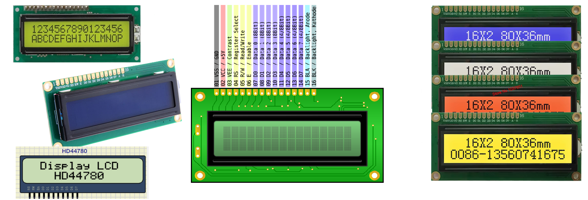
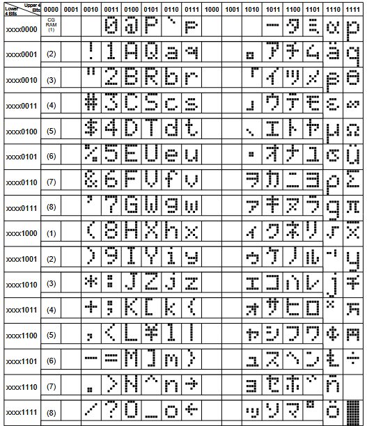
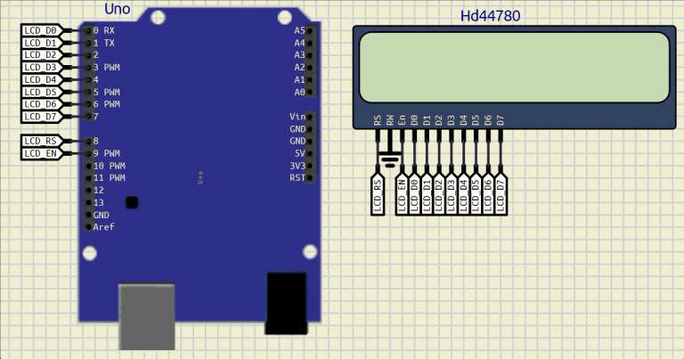

---

# Display de Cristal Líquido - [LCD HD44780](https://cdn.sparkfun.com/assets/9/5/f/7/b/HD44780.pdf)

| Figura 1: [Simulação](simulide/LCD_HD44780.sim1) de acionamento manual e inserção de caracteres |
|:-----------------------------------------------------:|
|             |
| Fonte: Autor (SimulIDE-1.1.0-SR1)                     |

| Figura 2: Mapa de caracteres                          |
|:-----------------------------------------------------:|
|     |
| Fonte: [Sparkfun - Hitachi](https://cdn.sparkfun.com/assets/9/5/f/7/b/HD44780.pdf) |

```c title='Definicao de Comandos ao LCD '
#define LCD_CLEAR_DISPLAY           0x01

#define LCD_RETURN_HOME             0x02

#define LCD_ENTRY_MODE_SET          0x04
#define LCD_EMS_CURSOR_RIGHT        0x02
#define LCD_EMS_CURSOR_LEFT         0x00
#define LCD_EMS_SHIFT_DISPLAY       0x01

#define LCD_DISPLAY_CONTROL         0x08
#define LCD_DC_DISPLAY_ON           0x04
#define LCD_DC_DISPLAY_OFF          0x00
#define LCD_DC_CURSOR_ON            0x02
#define LCD_DC_CURSOR_OFF           0x00
#define LCD_DC_BLINK_ON             0x01
#define LCD_DC_BLINK_OFF            0x00

#define LCD_CURSOR_SHIFT            0x10
#define LCD_CS_LEFT                 0x00
#define LCD_CS_RIGHT                0x04

#define LCD_DISPLAY_SHIFT           0x10
#define LCD_DS_LEFT                 0x08
#define LCD_DS_RIGHt                0x0C

#define LCD_FUNCTION_SET            0x20
#define LCD_FS_DATA_LENGTH_8        0x10
#define LCD_FS_DATA_LENGTH_4        0x00
#define LCD_FS_LINE_NUMBER_1        0x00
#define LCD_FS_LINE_NUMBER_2        0x08
#define LCD_FS_DOTS_FORMAT_5x8      0x00
#define LCD_FS_DOTS_FORMAT_5x11     0x04

#define LCD_SET_CGRAM_ADDRS( adrs ) (0x40+(adrs & 0x3F))

#define LCD_SET_DDRAM_ADDRS( adrs ) (0x80+(adrs & 0x7F))
#define LCD_ADDR_LINE_0             0x00
#define LCD_ADDR_LINE_1             0x40
```


**Atividade desafio**

Elabore funções em linguagem C de acordo com os protótipos listados abaixo, de modo a controlar o LCD conforme orientação do professor.

| Figura 3: [Simulação](simulide/LCD_arduino_uno.sim1) de LCD acionado pelo Arduino Uno|
|:-----------------------------------------------------:|
|             |
| Fonte: Autor                                          |


```C title="lcd.h"
#ifndef LCD_H
#define LCD_H

// Inicializa os pinos conectados ao display
void lcd_init( void );

// Escreve um comando no display (Instruction Register)
void lcd_instReg( unsigned char i );

// Escreve um dado no display (Data Register))
void lcd_dataReg( unsigned char d );

// Posicionar o cursor na coordenada: linha e coluna 
void lcd_lincol( unsigned char lin, unsigned char col);

// Apaga todos os caracteres no display
void lcd_clr( void );

// Escreve uma string no display
void lcd( unsigned char lin, unsigned char col, const char * str );

#endif
```

```C title="main.c"
#define F_CPU	16000000L
#include <util/delay.h>
#include "lcd.h"

void main(void) 
{
	long t = 0;
	lcd_init();
	while( 1 )
	{
		switch( t )
		{
			case 0: 		lcd_clr();						break;
			case 1000: 		lcd(0,0,"    HD44780    ");		break;
			case 3000: 		lcd(0,0," LCD 16x2 MMR  ");		break;
			case 6000:		lcd(0,0,"  IFSP Salto   ");		break;
			case 20000:		t = 0;							break;
		}
		_delay_ms(1);
		++t;
	}
}
```

