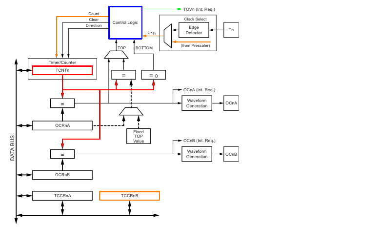
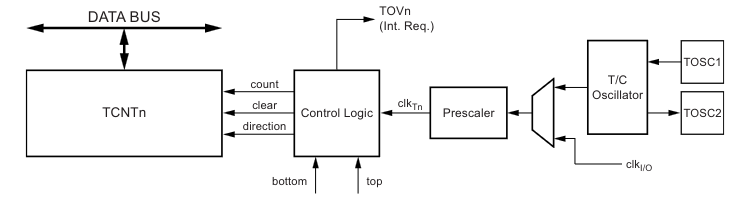
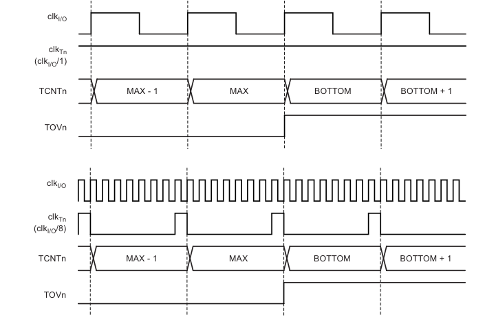
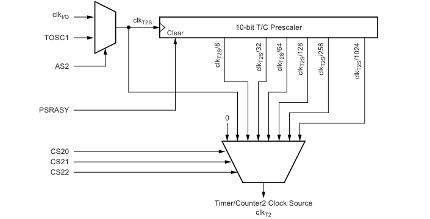
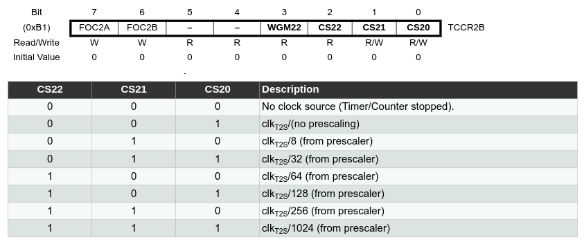
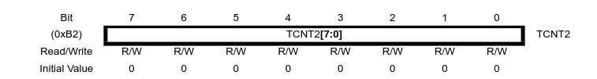
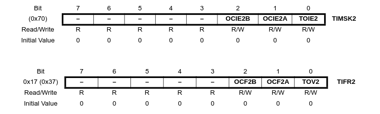
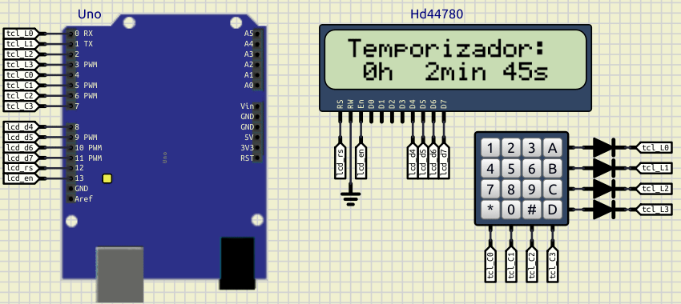

---

# Temporizador/Contador 2

O periférico *Timer/Counter2* é um temporizador ou contador de uso geral, com módulo de contagem de 8 bits.

Um diagrama simplificado pode ser visto na Figura 1.

| Figura 1: Diagrama de blocos simplificado do Timer/Counter 2 |
|:------------------------------------------------------------:|
|                   |
| Fonte: Adaptado pelo autor de [Datasheet](https://ww1.microchip.com/downloads/en/DeviceDoc/Atmel-7810-Automotive-Microcontrollers-ATmega328P_Datasheet.pdf) |

O *Timer/counter2* possui alguns registradores para configurar um comportamento de contagem específico, produzindo temporização ou contagem, inclusive podendo implementar saídas com o comportamento de modulação de largura de pulso (PWM - *Pulse Width Modulation*).

A interface com a contagem ou temporização, se dá por meio de sinais de requisição de interrupção(_**Int**errupt **Req**uest_)  (TOVn, OCnA e OCnB) e clock, ou através de pinos para entrada de pulsos (pino Tn) do contador ou saídas PWM (pinos OCnA e OCnB).

Dentre as várias possibilidades que esta interface possibilita, usaremos apenas a configuração de temporização, tendo na Figura 2 o principal segmento do circuito que implementa esta funcionalidade.

| Figura 2: Diagrama de blocos de contagem |
|:----------------------------------------:|
|                   |
| Fonte: [Datasheet](https://ww1.microchip.com/downloads/en/DeviceDoc/Atmel-7810-Automotive-Microcontrollers-ATmega328P_Datasheet.pdf) |

Os sinais internos apresentados no diagrama são:

- $count$: Incrementa ou decrementa o registrador de contagem TCNT2 em 1 unidade;
- $direction$: Seleção entre incremento e decremento;
- $clear$: Inicializa o registrador de contagem com o valor 0;
- $clk_{Tn}$: Sinal de clock utilizado no Timer/Counter2;
- $top$: Sinaliza que o registrador de contagem TCNT2 alcançou o seu valor máximo;
- $bottom$: Sinaliza que o registrador de contagem TCNT2 alcançou o seu valor mínimo, zero.


Dependendo do modo de operação, o registrador TCNT2 é zerado, incrementado ou decrementado em cada pulso no $clk_{Tn}$. Este sinal pode ter origem no sinal de fonte de clock do controlador ou de uma fonte externa através de um pino ($Tn$).

O modo mais simples de operação é denominado **modo normal** (*normal mode*), em que a direção de contagem é sempre incremental e não há um reset forçado do contador, simplesmente o contador ao chegar em seu valor máximo (*TOP*) e ser incrementado retorna ao valor zero (*BOTTON*), conforme ilustrado na Figura 3, sendo este evento chamado de *overflow*, acionando uma sinalização (***TOV2***).

| Figura 3: Diagrama de tempo da contagem (superior sem prescaler, inferior com prescaler de 8) |
|:----------------------------------------:|
| |
| Fonte: [Datasheet](https://ww1.microchip.com/downloads/en/DeviceDoc/Atmel-7810-Automotive-Microcontrollers-ATmega328P_Datasheet.pdf) |


A Figura 4 ilustra o diagrama de blocos do circuito do divisor de frequência, o prescaler, com os possíveis divisores 8, 32, 64, 128 e 256. Sendo ainda possível a utilização de sinal de clock obtido diretamente do cristal que pode estar instalado junto ao microcontrolador. O escopo aqui aborda apenas a funcionalidade em que o clock provém do sinal de clock principal do microcontrolador, identificado como $clk_{I/O}$.

| Figura 4: Prescaler do Timer 2 |
|:----------------------------------------:|
| |
| Fonte: [Datasheet](https://ww1.microchip.com/downloads/en/DeviceDoc/Atmel-7810-Automotive-Microcontrollers-ATmega328P_Datasheet.pdf) |


A configuração do comportamento é realizada através dos seguintes registradores:


| Figura 5: TCCR2B – Timer/Counter Control Register B |
|:----------------------------------------:|
| |
| Fonte: [Datasheet](https://ww1.microchip.com/downloads/en/DeviceDoc/Atmel-7810-Automotive-Microcontrollers-ATmega328P_Datasheet.pdf) |


| Figura 6: TCNT2 – Timer/Counter Register |
|:----------------------------------------:|
| |
| Fonte: [Datasheet](https://ww1.microchip.com/downloads/en/DeviceDoc/Atmel-7810-Automotive-Microcontrollers-ATmega328P_Datasheet.pdf) |


| Figura 7: TIMSK2 – Timer/Counter2 Interrupt Mask Register e  TIFR2 – Timer/Counter2 Interrupt Flag Register |
|:----------------------------------------:|
| |
| Fonte: [Datasheet](https://ww1.microchip.com/downloads/en/DeviceDoc/Atmel-7810-Automotive-Microcontrollers-ATmega328P_Datasheet.pdf) |


---
[**Exemplo de simulação de temporização**](simulide/ihm.sim1)



---

**Código de teste do Temporizador**

```C title='main.c'
#include "lcd.h"
#include "teclado.h"
#include "timer2.h"

int main(void)
{
    char tecla;
    unsigned long t = 0;

    timer2_init();
    teclado_init();
    lcd_init();

    lcd(0,0," Temporizador:  ");
    lcd(1,0,"   h   min   s  ");
    while( 1 )
    {
        tecla = teclado_scan();

        if( timer2_status() == 0 )
        {
            timer2_set( 1000 );
            t++;
            lcd_num(1, 0,t/(60*60),3);
            lcd_num(1, 5,t/(60),2);
            lcd_num(1,11,t%(60),2);
        }
    }
    return( 0 );
}
```

```C title='timer2.h'
#ifndef TIMER2_H
#define TIMER2_H

void timer2_init( void );
void timer2_set( unsigned long t );
unsigned long timer2_status( void );

#endif
```

```C title='timer2.c'
#include <avr/io.h>
#include <avr/interrupt.h>

#define T2INT_OVERFLOW_EN	0x01
#define T2COUNT_RELOAD		(256-250)
#define T2NO_CLK			0x00
#define T2CLK_DIV_8			0x01
#define T2CLK_DIV_16		0x02
#define T2CLK_DIV_32		0x03
#define T2CLK_DIV_64		0x04
#define T2CLK_DIV_128		0x05
#define T2CLK_DIV_256		0x06
#define T2CLK_DIV_1024		0x07

unsigned long t2_t = 0;

void timer2_init( void )
{
    cli();
	TCCR2B 	= T2CLK_DIV_64;
	TCNT2 	= T2COUNT_RELOAD;
	TIMSK2 	= T2INT_OVERFLOW_EN;
	t2_t = 0;
    sei();
}

ISR(TIMER2_OVF_vect) // 1ms
{
	TCNT2 = T2COUNT_RELOAD;
	if( t2_t )
	    --t2_t;
}

void timer2_set( unsigned long t )
{
    t2_t = t;
}

unsigned long timer2_status( void )
{
    return( t2_t );
}
```


---
