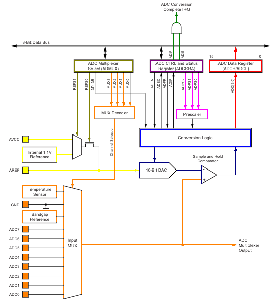
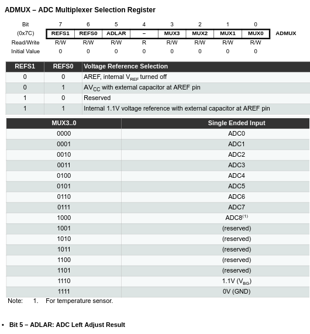
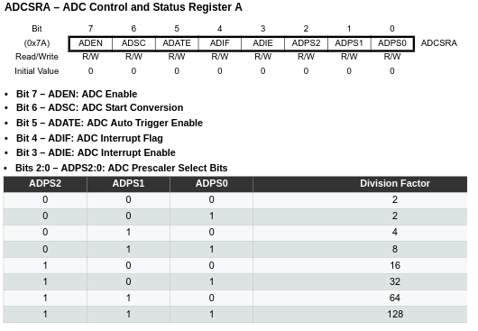
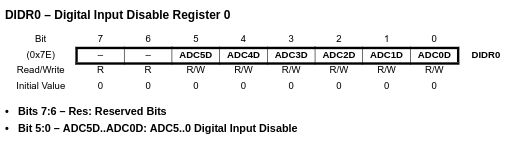

---

# Conversor Analógico Digital (ADC)

O conversor analógico digital realiza conversão por aproximação sucessiva utilizando uma resolução de 10 bits.

Possui 8 canais, associados ao PORTA, multiplexados ao conversor, com circuito que garante o valor da amostra durante o tempo de conversão.

A referência de tensão do conversor é o GND e a tensão de fundo de escala pode ser aplicada ao pino `AVcc` ou através de uma tensão de referência interna de `1.1V`.

Um diagrama simplificado pode ser visto na Figura 1.

| Figura 1: Diagrama de blocos simplificado do ADC |
|:------------------------------------------------------------:|
|                   |
| Fonte: Adaptado pelo autor de [Datasheet](https://ww1.microchip.com/downloads/en/DeviceDoc/Atmel-7810-Automotive-Microcontrollers-ATmega328P_Datasheet.pdf) |


**Os registradores de configuração do ADC são:**

| Figura 2: ADC Multiplexer Selection Register |
|:------------------------------------------------------------:|
|                   |
| Fonte: [Datasheet](https://ww1.microchip.com/downloads/en/DeviceDoc/Atmel-7810-Automotive-Microcontrollers-ATmega328P_Datasheet.pdf) |

| Figura 3: DC Control and Status Register A |
|:------------------------------------------------------------:|
|                 |
| Fonte: [Datasheet](https://ww1.microchip.com/downloads/en/DeviceDoc/Atmel-7810-Automotive-Microcontrollers-ATmega328P_Datasheet.pdf) |


| Figura 4: Digital Input Disable Register 0 |
|:------------------------------------------------------------:|
|                 |
| Fonte: [Datasheet](https://ww1.microchip.com/downloads/en/DeviceDoc/Atmel-7810-Automotive-Microcontrollers-ATmega328P_Datasheet.pdf) |

---

**Código fonte de exemplo**

```C title='main.c'
#include "lcd.h"
#include "adc.h"

int main(void)
{
    adc_init();
    lcd_init();

    lcd(0,0," x:      y:     ");

    while( 1 )
    {
        if( adc_available() )
        {
            lcd_num(0, 4,adc_ch0(),4);
            lcd_num(0,11,adc_ch1(),4);
            adc_start();
        }
    }
    return( 0 );
}

```


```C title='bits.h'
#ifndef BITS_H
#define BITS_H

#define BITVAL(bit)         (1<<bit)

#define SETBIT(var,bit)     (var |=  (1<<bit))
#define CLRBIT(var,bit)     (var &= ~(1<<bit))
#define TOGBIT(var,bit)     (var ^=  (1<<bit))
#define TSTBIT(var,bit)     (var &   (1<<bit))

#endif
```

```C title='adc.h'
#ifndef ADC_H
#define ADC_H

void adc_init();
void adc_start( void );
char adc_available( void );
int adc_ch0( void );
int adc_ch1( void );

#endif
```

```C title='adc.c'
#include <avr/io.h>
#include <avr/interrupt.h>
#include "adc.h"
#include "bits.h"


// -------------------------------------- Vars
unsigned int adc0_value = 0;
unsigned int adc1_value = 0;
unsigned int adc_value;
unsigned char adc_available_flag = 0;


// -------------------------------------- adc_init
    // Seleção de tensão de referência
#define ADC_AVCC    BITVAL(REFS0)
#define ADC_1V1     (BITVAL(REFS1)|BITVAL(REFS0))
#define ADC_AREF    0

// Seleção de canal para conversao
#define ADC_CH0     0
#define ADC_CH1     1
#define ADC_CH2     2
#define ADC_CH3     3
#define ADC_CH4     4
#define ADC_CH5     5


    // Ajuste de bits (Left Adjust Result)
#define ADC_LAR    BITVAL(ADLAR)

// --------------------------------------
    // Habilita conversor AD
#define ADC_EN      BITVAL(ADEN)
    // Inicia a conversao AD
#define ADC_START   BITVAL(ADSC)
    // Habilita Trigger Automatico
#define ADC_ATE     BITVAL(ADATE)
    // Habilita Interrupcao
#define ADC_IE      BITVAL(ADIE)
    // Fator de divisao - ADC Prescaler
#define ADC_FREQ_DIV_2      0x1
#define ADC_FREQ_DIV_4      0x2
#define ADC_FREQ_DIV_8      0x3
#define ADC_FREQ_DIV_16     0x4
#define ADC_FREQ_DIV_32     0x5
#define ADC_FREQ_DIV_64     0x6
#define ADC_FREQ_DIV_128    0x7


// -------------------------------------- adc_init
void adc_init( void )
{
    cli();
    ADMUX = (ADC_AVCC | ADC_CH1 );
    ADCSRA = (ADC_EN | ADC_IE | ADC_FREQ_DIV_128);
    sei();
    adc_start();
}


// -------------------------------------- adc_start
void adc_start( void )
{
    SETBIT(ADMUX, MUX0);        // CH1
    SETBIT(ADCSRA, ADSC);       // START
	adc_available_flag = 0;
}


// -------------------------------------- adc_interrupt
ISR( ADC_vect )
{
    adc_value = ADC;
    if( TSTBIT(ADMUX, MUX0) )   // CH1
    {
        adc1_value = adc_value;
        CLRBIT(ADMUX, MUX0);        // CH0
        SETBIT(ADCSRA, ADSC);       // START
    }
    else                        // CH0
    {
        adc0_value = adc_value;
		adc_available_flag = 1;
    }
}


// -------------------------------------- adc available
char adc_available( void )
{
	return( adc_available_flag );
}


// -------------------------------------- adc result
int adc_ch0( void )
{
    return( adc0_value );
}
int adc_ch1( void )
{
    return( adc1_value );
}
```


---
