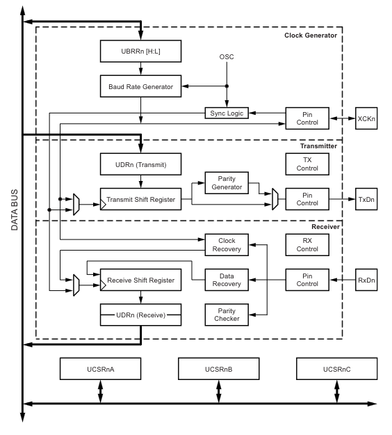
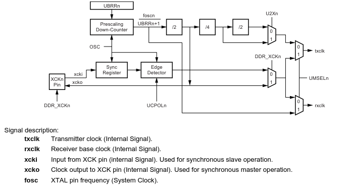
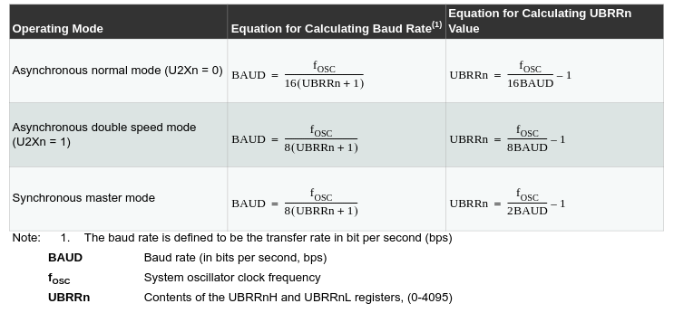
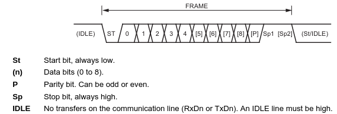
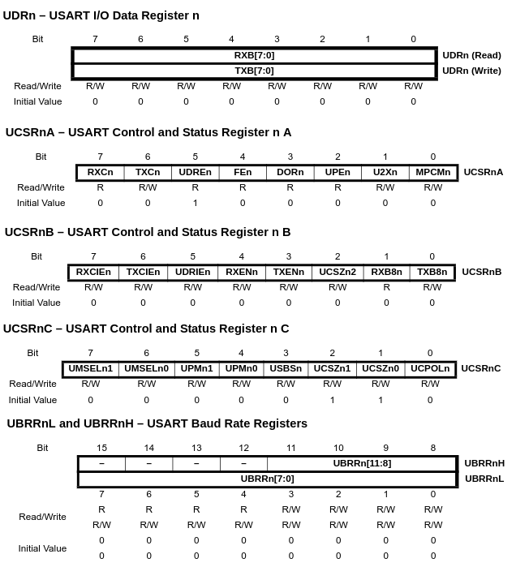

# USART: Universal Asynchronous Receiver/Transmitter

O receptor e transmissor serial síncrono e assíncrono universal (USART) é um dispositivo de comunicação serial altamente flexível.

Possui as seguintes características:

- Operação full duplex (registradores de recepção e transmissão seriais independentes);
- Operação assíncrona ou síncrona;
- Operação síncrona com clock mestre ou escravo;
- Gerador de taxa de transmissão de alta resolução;
- Suporta pacotes seriais com 5, 6, 7, 8 ou 9 bits de dados e 1 ou 2 bits de parada;
- Geração de paridade par ou ímpar e verificação de paridade suportadas por hardware;
- Detecção de estouro de dados;
- Detecção de erro de enquadramento;
- Filtragem de ruído inclui detecção de bit de início falso e filtro passa-baixo digital;
- Três interrupções separadas para TX completo, registro de dados TX vazio e RX completo;
- Modo de comunicação multiprocessador;
- Modo de comunicação assíncrona de dupla velocidade.

---

Um diagrama de blocos simplificado do transmissor USART é mostrado na Figura 1.

Os registradores de E/S acessíveis pela CPU são mostrados em negrito.

As caixas tracejadas no diagrama de blocos separam as três partes principais do USART (listadas de cima para baixo): gerador de clock, transmissor e receptor.

Os registradores de controle são compartilhados por todas as unidades.

A lógica de geração de clock consiste na lógica de sincronização para a entrada de clock externo usada pela operação escrava síncrona e no gerador de taxa de transmissão. O pino XCKn (clock de transferência) é usado apenas no modo de transferência síncrona.

O transmissor consiste em um único buffer de gravação, um registrador de deslocamento serial, um gerador de paridade e lógica de controle para lidar com diferentes formatos de pacotes seriais. O buffer de gravação permite uma transferência contínua de dados sem qualquer atraso entre os pacotes.

O receptor é a parte mais complexa do módulo USART devido às suas unidades de clock e recuperação de dados. As unidades de recuperação são usadas para recepção assíncrona de dados. Além das unidades de recuperação, o receptor
inclui um verificador de paridade, lógica de controle, um registrador de deslocamento e um buffer de recepção de dois níveis (UDRn). O receptor suporta os
mesmos formatos de pacote que o transmissor e pode detectar erros de pacote, estouro de dados e erros de paridade.


| Figura 1: Diagrama de Blocos - USART |
|:------------------------------------:|
|  |
| Fonte: [Datasheet](https://ww1.microchip.com/downloads/en/DeviceDoc/Atmel-7810-Automotive-Microcontrollers-ATmega328P_Datasheet.pdf) p. 144 |

---

**A Geração de Clock**

A lógica de geração de clock, Figura 2, ilustra a geração do clock base para o transmissor e o receptor.

O USART suporta quatro modos de operação de clock: modo assíncrono normal, modo assíncrono de velocidade dupla, modo síncrono mestre e modo síncrono escravo.

O bit UMSELn no registrador de controle e status C do USART (UCSRnC) seleciona entre operação assíncrona e síncrona.

A velocidade dupla (somente modo assíncrono) é controlada pelo U2Xn encontrado no registrador UCSRnA.

Ao usar o modo síncrono (UMSELn = 1), o registrador de direção de dados para o pino XCKn (DDR_XCKn) controla se a fonte de clock é interna (modo mestre) ou externa (modo escravo).

O pino XCKn só fica ativo ao usar o modo síncrono.

| Figura 2: Diagrama de Blocos - Lógica de geração de clock |
|:---------------------------------------------------------:|
|          |
| Fonte: [Datasheet](https://ww1.microchip.com/downloads/en/DeviceDoc/Atmel-7810-Automotive-Microcontrollers-ATmega328P_Datasheet.pdf) p. 145 |

O registrador de taxa de transmissão USART (UBRRn) e o contador regressivo conectado a ele funcionam como um pré-escalador programável ou gerador de taxa de transmissão. O contador regressivo, operando no clock do sistema ($f_{osc}$), é carregado com o valor `UBRRn` cada vez que o contador chega a zero ou quando o registrador `UBRRnL` é gravado. Um clock é gerado cada vez que o contador chega a zero.
Este clock é a saída de clock do gerador de taxa de transmissão: $\frac{f_{osc}}{UBRRn + 1}$.
O transmissor divide a saída de clock do gerador de taxa de transmissão por 2, 8 ou 16, dependendo do modo. A saída do gerador de taxa de transmissão é utilizada diretamente pelas unidades de relógio e recuperação de dados do receptor. No entanto, as unidades de recuperação utilizam uma máquina de estados que utiliza 2, 8 ou 16 estados, dependendo do modo definido pelo estado dos bits `UMSELn`, `U2Xn` e `DDR_XCKn`.

| Figura 3: Cálculo da taxa de transmissão (Baud Rate [bps]) |
|:----------------------------------------------------------:|
|          |
| Fonte: [Datasheet](https://ww1.microchip.com/downloads/en/DeviceDoc/Atmel-7810-Automotive-Microcontrollers-ATmega328P_Datasheet.pdf) p. 146 |


---

**Quadro ou Pacote de dados (*data frame*)**

Um *frame* serial é definido como um dcaractere de bits de dados com bits de sincronização (bits de início e parada) e, opcionalmente, um bit de paridade
para verificação de erros. O USART aceita todas as 30 combinações dos seguintes formatos de quadro válidos:

- 1 bit de início
- 5, 6, 7, 8 ou 9 bits de dados
- bit de paridade sem paridade, par ou ímpar
- 1 ou 2 bits de parada

Um *frame* começa com o bit de início seguido pelo bit de dados menos significativo. Em seguida, os próximos bits de dados, até um total de nove, são sucessivos, terminando com o bit mais significativo. Se habilitado, o bit de paridade é inserido após os bits de dados, antes dos bits de parada.

Quando um *frame* completo é transmitido, ele pode ser seguido diretamente por um novo quadro, ou a linha de comunicação pode ser definida para um estado ocioso (alto). A Figura 4 ilustra as combinações possíveis dos formatos de *frame*. Os bits entre colchetes são opcionais.


| Figura 4: Formatos de *frame* |
|:----------------------------------------------------------:|
|          |
| Fonte: [Datasheet](https://ww1.microchip.com/downloads/en/DeviceDoc/Atmel-7810-Automotive-Microcontrollers-ATmega328P_Datasheet.pdf) p. 147 |

---

**Registradores do USART**

| Figura 5: Registradores do USART |
|:----------------------------------------------------------:|
|          |
| Fonte: [Datasheet](https://ww1.microchip.com/downloads/en/DeviceDoc/Atmel-7810-Automotive-Microcontrollers-ATmega328P_Datasheet.pdf) p. 159-162 |


---

**Código fonte de exemplo**

```C title='main.c'
#include <avr/io.h>
#include "delay.h"
#include "usart.h"

int main(void)
{
    uart_init(9600, 8, 'n', 1);
    while( 1 )
    {
        uart_tx("IFSP Salto", 10);
        DELAY(1000);
    }
    return( 0 );
}
```

```C title='usart.c'
#include <xc.h>
#include <avr/io.h>
#include <avr/interrupt.h>
#include "usart.h"
#include "delay.h"

volatile unsigned char rx_var = 0;
unsigned char 	tx_count = 0;
unsigned char * tx_ptr;

void uart_tx( unsigned char * ptr, unsigned char n )
{
	tx_ptr = ptr;
	tx_count = n;
	if( n )
	{
		UDR0 = *tx_ptr;
		--tx_count;
	}
}

ISR(USART_TX_vect)
{
	if( tx_count )
	{
		UDR0 = *++tx_ptr;
		--tx_count;
	}
}

ISR(USART_RX_vect)
{
    rx_var = UDR0;
}

unsigned char uart_rx( void )
{
	return( rx_var );
}


//
// USART: Universal Synchronous Asynchronous Receiver/Transmitter
// Configuration
//
typedef struct
{
    unsigned char MPCMn:1;  // (R/W) Multi-processor Communication Mode
    unsigned char U2Xn:1;   // (R/W) Double the USART Transmission Speed
    unsigned char UPEn:1;   // (R  ) USART Parity Error
    unsigned char DORn:1;   // (R  ) Data OverRun
    unsigned char FEn:1;    // (R  ) Frame Error
    unsigned char UDREn:1;  // (R  ) USART Data Register Empty
    unsigned char TXCn:1;   // (R/W) USART Transmit Complete
    unsigned char RXCn:1;   // (R  ) USART Receive Complete
} UCSRnA_T;                 // 0x20  Initial Value

typedef struct
{
    unsigned char TXB8n:1;  // (R/W) Transmit Data Bit 8 n
    unsigned char RXB8n:1;  // (R  ) Receive Data Bit 8 n
    unsigned char UCSZn2:1; // (R/W) Character Size n
    unsigned char TXENn:1;  // (R/W) Transmitter Enable n
    unsigned char RXENn:1;  // (R/W) Receiver Enable n
    unsigned char UDRIEn:1; // (R/W) USART Data Register Empty Interrupt Enable n
    unsigned char TXCIEn:1; // (R/W) TX Complete Interrupt Enable n
    unsigned char RXCIEn:1; // (R/W) RX Complete Interrupt Enable n
} UCSRnB_T;                 // 0x00  Initial Value

typedef union
{
    struct
    {
        unsigned char UCPOLn:1; // (R/W) Clock Polarity
        unsigned char UCSZn:2;  // (R/W) Character Size
        unsigned char USBSn:1;  // (R/W) Stop Bit Select
        unsigned char UPMn: 2;  // (R/W) Parity Mode
        unsigned char UMSEL:2;  // (R/W) USART Mode Select
    } bits;                 // 0x06  Initial Value
    unsigned char byte;
} UCSRnC_U;

#define UART_INIT_ERROR_BAUDRATE        0x01
#define UART_INIT_ERROR_NBITS           0x02
#define UART_INIT_ERROR_PARITY          0x04
#define UART_INIT_ERROR_STOPBITS        0x08

unsigned char uart_init( unsigned long baudrate, char nbits, char parity, char stopbits )
{
    UCSRnC_U UCSRnC;
    unsigned char erro = 0;

    UCSRnC.bits.UMSEL = 0;  // 0: async;  1: sync;  2: Reserved;  3: Master SPI
    UCSRnC.bits.UCPOLn = 0; // Write this bit to zero when asynchronous mode is used. (pág. 162 datasheet)

    switch( nbits )
    {
        case 5:     UCSRnC.bits.UCSZn = 0;               break;
        case 6:     UCSRnC.bits.UCSZn = 1;               break;
        case 7:     UCSRnC.bits.UCSZn = 2;               break;
        case 8:     UCSRnC.bits.UCSZn = 3;               break;
        case 9:     UCSRnC.bits.UCSZn = 3;               break;
        default:    erro |= UART_INIT_ERROR_NBITS;       break;
    }
    switch( parity )
    {
        case 'N':
        case 'n':
                    UCSRnC.bits.UPMn = 0;                break;
        case 'E':
        case 'e':
                    UCSRnC.bits.UPMn = 2;                break;
        case 'O':
        case 'o':
                    UCSRnC.bits.UPMn = 3;                break;
        default:    erro |= UART_INIT_ERROR_PARITY;      break;
    }
    switch( stopbits )
    {
        case 1:     UCSRnC.bits.USBSn = 0;               break;
        case 2:     UCSRnC.bits.USBSn = 1;               break;
        default:    erro |= UART_INIT_ERROR_STOPBITS;    break;
    }

    cli();
    UBRR0 = ((F_CPU>>4)/(baudrate))-1;
    UCSR0B = (1<<RXCIE0)|(1<<TXCIE0)|(1<<RXEN0)|(1<<TXEN0);
    UCSR0C = UCSRnC.byte;
    sei();
}
```

```C title='usart.h'
#ifndef USART_H
#define USART_H

unsigned char uart_init( unsigned long baudrate, char nbits, char parity, char stopbits );
unsigned char uart_rx( void );
void uart_tx( unsigned char * ptr, unsigned char n );

#endif
```


```C title='delay.h'
#ifndef DELAY_H
#define DELAY_H

#define F_CPU   16000000
#include <util/delay.h>

#define DELAY( t )        _delay_ms( t )

#endif
```


---


---


---

**Referências**

1. [Datasheet](https://ww1.microchip.com/downloads/en/DeviceDoc/Atmel-7810-Automotive-Microcontrollers-ATmega328P_Datasheet.pdf)
