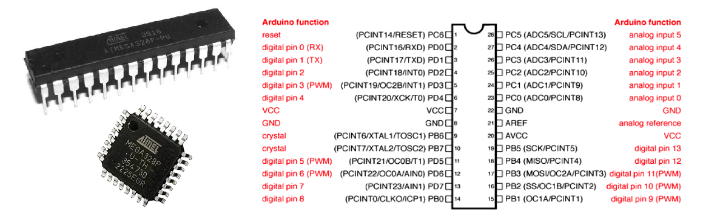

---

# Situação de Aprendizagem

**1. Objetivo: Partida Estrela-Triângulo**

Desenvolver uma aplicação, projeto eletrônico e programa, para um dispositivo de comando para partida Estrela-Triângulo. 

| Figura 1: Diagramas de comando e potência da partida Estrela-Triângulo          |
|:-------------------------------------------------------------------------------:|
|                 |
|Fonte: [Wikipedia](https://pt.wikipedia.org/wiki/Partida_estrela-tri%C3%A2ngulo) |

**2. - Requisitos da solução**

1. Interface
      1. Botão de partida: S1;
      2. Botão de parada: S0;
      3. Contatores de acionamento do motor: K1, K2 e K3.
2. Comportamento
    * Ao pressionar S1
	    * Ligar K1, K2 (fechamento estrela);
        * Temporizar 5 segundos
        * Desligar K2 e ligar K3 (fechamento triângulo).
	* Ao pressionar S0, em qualquer momento:
		* Desligar todos os contatores.
3. Estrutura (*Hardware*): Circuito eletrônico
    * Acionamento via Relé ou transistor;
    * Tensão operação: 24V, 12V ou 5V.

**3. Planejamento da solução**

1. Planejamento do produto final
      1. Projeto em plataforma de versionamento;
      2. Código fonte;
      3. Simulação;
      4. Protótipo (opcional);
      5. Circuito eletrônico (opcional).
   
2. Planejamento das ferramentas e materiais

3. Planejamento do processo
    1. Criar o projeto na plataforma de versionamento;
    2. Definir mapa de entradas e saídas;
    3. Construir o circuito no simulador;
    4. Criar projeto de validação do circuito no simulador;
    5. Criar programa(firmware) da aplicação;
    6. Montar circuito em matriz de contatos;
    7. Testar programa(firmware) na montagem do protótipo;
    8. Registrar resultado da atividade.

**4. Solução**

Bom trabalho!
