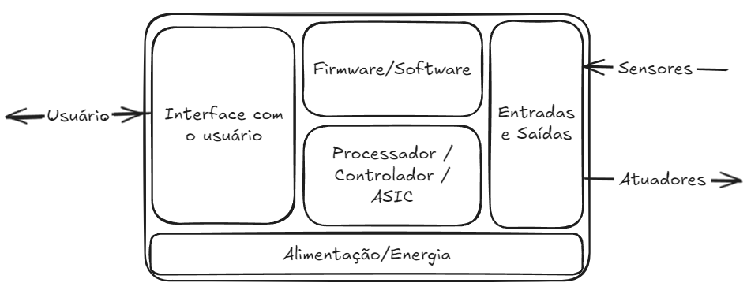

#

# [1. Sistemas embarcados](../slides/uC01-SistemasEmbarcados.pdf)

A terceira revolução industrial, que ocorreu após o fim da Segunda Guerra Mundial, produzida pelo desenvolvimento e utilização em larga escala da microeletrônica, possibilitou a construção dos primeiros computadores, ainda de grande porte, que evoluíram para os microcomputadores, que logo foram ligados em rede. Em seguida vieram os computadores portáteis, alcançando o que chamamos smartphones, mas que erroneamente ainda chamamos de celulares. 

Toda essa evolução produziu diversos novos conceitos ao longo do tempo, entre eles o conceito  de **Computação Ubíqua**, sendo este um novo paradigma proposto em 1991 por Mark Weiser (1952-1999), em que o computador está em toda parte, de forma imperceptível (ou invisível) aos usuários, embarcado (ou embutido) nos ambientes agindo e reagindo de forma inteligente a tudo o que acontece ao seu redor.

> **"As tecnologias mais profundas são aquelas desaparecem. Tecem-se no tecido da vida cotidiana até que são indistinguíveis dela.”**
> 
> Mark Weiser

| Figura: Mark Weiser - Xerox Palo Alto Research Center |
|:-----------------------------------------------------:|
|                |
| Fonte: [Design de Interação & Computação Pervasiva](http://ubicomp.feiramoderna.net/2011/08/mark-weiser/)|

Em seu artigo intitulado 
[“**The computer for the twenty-first century**"](https://www.lri.fr/~mbl/Stanford/CS477/papers/Weiser-SciAm.pdf) 
publicado pela *Scientific American* em Setembro de 1991, 
Weiser apresenta o que seriam os computadores no século XXI. 

Mas a computação ubíqua só é possível por conta do desenvolvimento derivado da computação convencional, em que sistemas eletrônicos dedicados realizam o trabalho de processar dados do mundo real. Em inglês são chamados sistemas ***embedded*** e são chamados em português de sistemas **embarcados** ou mesmo **embutidos**. 

Talvez a mais notória utilização de um sistema embarcado ocorreu em julho de 1969, com a chegada de [Armstrong, Aldrin e Collins](https://aventurasnahistoria.com.br/noticias/desventuras/armstrong-aldrin-e-collins-veja-o-que-aconteceu-com-tripulacao-da-apollo-11.phtml) à lua, sendo o “**Apollo Guidance Computer (AGC)**” o grande responsável pelo controle dos sistemas do Módulo Lunar.

| Figura: Apollo Guidance Computer (AGC) da missão espacial Apollo 11 e Neil Armstrong pisando na lua. | 
|:--------------------------------------------:|
|  |
| Fonte: [Wikipedia](https://en.wikipedia.org/wiki/Apollo_Guidance_Computer) |

O AGC foi desenvolvido pelo Massachusetts Institute of Technology (MIT) e é considerado o primeiro sistema embarcado, considerado na época um sistema de alto risco, devido aos circuitos integrados ainda serem uma novidade tecnológica, ainda pouco experimentados em condições extremas. O AGC operava em tempo real, possuía memórias RAM de 2kB e ROM de 32 kB, com a velocidade de clock de 1,024 MHz, display e teclado apenas numérico. 

Podemos notar que os sistemas embarcados evoluíram de forma a atender necessidades ou mesmo vontades de aplicações diversas, assim como na biologia, a evolução produz sistemas simples ou complexos a depender do ambiente, das necessidades, dos recursos e aplicações. 

Existem muitas definições, mas podemos considerar que  um sistema embarcado basicamente é um conjunto dedicado de circuitos, incluindo um controlador programável, de modo a atender uma aplicação específica. Como exemplos mais comuns, são citados os aparelhos de micro-ondas e máquinas de lavar, como sistemas simples, ou ainda subsistemas em equipamentos mais complexos como em veículos ou *smartphones*. Em todos os casos, um controlador está conectado aos seus periféricos de aplicação específica e é programado para realizar sua tarefa seguindo uma série de operações lógicas e de modo a atender o seu objetivo, seja aquecer um alimento, lavar roupas, monitorar o consumo de combustível ou controlar o foco e saturação da imagem capturada pela câmera em um *smartphone*. 

Note que em um smartphone, existem muitos circuito embarcados, dedicados as mais diversas funções presentes no aparelho, sendo este considerado em sua totalidade um sistema computacional de uso geral, e não um sistema embarcado, como as partes que o integram. 

Como principais e fundamentais características dos Sistemas Embarcados podemos destacar que são **destinado a uma única aplicação**, sendo assim possuem **poucas entradas e saídas**, apresentam uma **Interface simples** e alguma forma de **comunicação** para sua interação com outros dispositivos ou com o usuário. 

Sistemas embarcados possuem, geralmente, um conjunto de requisitos e restrições que fazem dessa área de estudo/trabalho uma das mais desafiadoras, pois envolvem múltiplas habilidades e conhecimento interdisciplinar. Alguns exemplos de requisitos e restrições estão associados à tamanho e peso do sistema ou dispositivo, consumo e custos reduzidos, segurança e confiabilidade, devendo se recuperar de forma automática após erros e falhas, robustez ao ambiente e aplicação em tempo real. 

Um sistema embarcado basicamente é composto por um processador, microcontrolador ou um circuito integrado de aplicação específica ([ASIC](https://pt.wikipedia.org/wiki/Circuito_integrado_de_aplica%C3%A7%C3%A3o_especifica)), para executar a lógica armazenada na memória. Esta lógica, quando em computadores de uso geral, é chamada de software, em sistemas embarcados é chamada de firmware. Possui ainda interfaces para entradas e saídas do sistema, para conexão com sensores e atuadores, específicos à aplicação do sistema, e interface de usuário, geralmente para realizar alguma parametrização no comportamento do sistema. Ainda é necessário um sistema de alimentação, seja diretamente da rede ou por bateria. A Figura ilustra um diagrama de blocos com a composição do sistema. 

| Figura: Arquitetura Básica de Sistemas Embarcados |
|:-------------------------------------------------:|
|  |
| Fonte: Próprio autor |

A área de sistemas embarcados apresentam grandes desafios relacionados à mão de obra, desenvolvimento de projetos e concorrência. Um projeto de sistema embarcado é composto de um *hardware* com seus aspectos de eletrônica, invólucro ou carcaça e a sua estética afetando a experiência do usuário, firmware com sua infraestrutura, características de aplicação e usabilidade e ainda a sua documentação com regulamentos e normas a serem seguidas. Com tudo isso, faz-se necessário que o profissional possua um conhecimento plural das tecnologias e do negócio envolvidos no projeto. 

Como é o mercado de trabalho para profissionais desta área? Para ilustrar tal questão o portal [Embarcados](https://embarcados.com.br/), que traz informações sobre esta área no Brasil, faz [pesquisas](https://embarcados.com.br/pesquisas/) de mercado com o seu público brasileiro. 

# 2. Perfil dos profissionais de Sistema Embarcados e IoT

Com base nos relatórios de **2021, 2023 e 2025**, da pesquisa de perfil profissinal em sistemas embarcados e iot, realizada pelo portal embarcados, é possível observar a evolução do mercado brasileiro de sistemas embarcados em diversas categorias. Abaixo, as tabelas detalham essa progressão:

## 2.1 Perfil Demográfico e Acadêmico

O perfil dos profissionais mostra uma **estabilidade no domínio masculino** e um aumento contínuo no **nível de escolaridade**, com destaque para a pós-graduação.

| Categoria | Pesquisa 2021 | Pesquisa 2023 | Pesquisa 2025 |
| :--- | :---: | :---: | :---: |
| **Gênero (Masculino)** | 95,84% | 95,79% | **94,9%** |
| **Pós-graduação (Concluída)** | 36,74% | 39,47% | **41,99%** |
| **Formação em Engenharia** (Elétrica/Comp.) | 67,24%  | 66,84% | **67,98%** |

## 2.2 Carreira e Modalidade de Trabalho

Nota-se um **declínio no interesse em trabalhar para empresas no exterior** e uma retomada gradual, porém constante, do **trabalho presencial** ao longo dos anos.

| Pergunta / Opção | Pesquisa 2021 | Pesquisa 2023 | Pesquisa 2025 |
| :--- | :---: | :---: | :---: |
| **Pretende trabalhar no exterior? (Sim)** | 45,06% | 38,60% | **32,0%** |
| **Modalidade Presencial** | 43,52% | 47,75% | **51,4%** |
| **Modalidade Híbrida** | 40,98% | 36,48% | **34,7%** |
| **Modalidade Remota** | 15,50% | 15,78% | **13,8%** |

## 2.3 Tecnologias e Ferramentas de Software
A **linguagem C** e a ferramenta **Visual Studio Code** consolidaram seu crescimento e liderança absoluta no setor de desenvolvimento.

| Tecnologia / Ferramenta | Pesquisa 2021 | Pesquisa 2023 | Pesquisa 2025 |
| :--- | :---: | :---: | :---: |
| **Linguagem C (Prioritária)** | 74,72% | 77,78% | **80,45%** |
| **Linguagem C++ (Padrão)** | 45,79% | 50,44% | **53,01%** |
| **Visual Studio Code (Codificação)** | 58,50% | 70,24% | **79,26%** |
| **Git (Controle de Versão)** | 73,02% | 73,74% | **76,30%** |

Outras linguagens e tecnologias de codificação citadas ao longo dos anos incluem:

- **C# e .NET**: Em 2025, o C# foi utilizado por 9,02% dos respondentes e o ecossistema .NET por 4,51%
- **JavaScript e Java**: Ambas mantêm uma fatia constante de usuários, com o JavaScript apresentando 7,52% e o Java 4,89% no levantamento de 2025
- **Assembly**: Esta linguagem de baixo nível apresentou uma queda gradual, saindo de 6,00% em 2023 para 3,01% em 2025
- **Rust**: Focada em segurança de memória, a linguagem Rust começou a aparecer nos relatórios, alcançando 3,38% de utilização em 2025
- Frameworks e Variantes: O uso de **Qt com C++** (6,77%), **MicroPython** (4,14%) e **Wiring** (**Arduino**) (3,76%) também é reportado como parte das ferramentas de programação atuais

Além dessas linguagens de alto nível, os projetos também envolvem linguagens de descrição de hardware, como **VHDL** e **Verilog**, embora em menor escala.

## 2.4 Tipos de Processadores Utilizados (Bits)

O mercado brasileiro apresenta uma migração contínua para dispositivos de maior capacidade de processamento, com os microcontroladores de **32 bits** atingindo seu maior patamar em 2025.

| Tipo de Processador | Pesquisa 2021 | Pesquisa 2023 | Pesquisa 2025 |
| :--- | :---: | :---: | :---: |
| **Microcontrolador 32 bits** | 65,57%* | 69,95% | **76,77%** |
| **Microcontrolador 8 bits** | 11,01% | 37,39% | **27,95%** |
| **Microprocessador 32 bits** | - | 30,05% | **26,77%** |
| **Microprocessador 64 bits** | 8,20% | 24,31% | **24,80%** |

*\*Em 2021, o dado de 32 bits englobava microcontroladores e microprocessadores na mesma categoria de destaque.*

## 2.5 Principais Fabricantes (Uso Atual)

A **STMicroelectronics** retomou a liderança absoluta em 2025, enquanto a **Espressif** manteve um crescimento constante desde 2021, consolidando-se como uma das favoritas devido ao foco em IoT.

| Fabricante | Pesquisa 2021 | Pesquisa 2023 | Pesquisa 2025 |
| :--- | :---: | :---: | :---: |
| **STMicroelectronics** | 47,78% | 46,33% | **58,27%** |
| **Espressif** | 41,45% | 47,94% | **50,79%** |
| **Microchip / Atmel** | **44,73%** | 41,74% | 29,53% |
| **NXP** | 26,00% | **26,61%** | 21,65% |
| **Texas Instruments** | 22,95% | **23,17%** | 20,08% |

## 2.6 Arquiteturas de Preferência para Projetos Futuros

A arquitetura **ARM** permanece dominante, mas o interesse por **RISC-V** apresentou um salto significativo, quase dobrando sua relevância entre 2023 e 2025.

| Arquitetura | Pesquisa 2023 | Pesquisa 2025 |
| :--- | :---: | :---: |
| **ARM** | 77,06% | **80,71%** |
| **RISC-V** | 27,29% | **38,98%** |
| **Xtensa** | - | **21,26%** |
| **Proprietária (AVR, PIC, etc)** | **31,88%** | 16,54% |

## 2.7 Fatores Decisivos na Escolha do Chip

O **custo** continua sendo o fator primordial para os engenheiros brasileiros, seguido de perto pela disponibilidade de ecossistema de software.

| Fator de Escolha | Pesquisa 2021 | Pesquisa 2023 | Pesquisa 2025 |
| :--- | :---: | :---: | :---: |
| **Custo do Chip** | 65,11% | 62,39% | **67,32%** |
| **Disp. Ferramentas Software** | **59,48%** | 56,42% | 54,33% |
| **Popularidade / Comunidade** | **50,59%** | **47,02%** | 45,28% |
| **Desempenho do Chip** | 43,56% | **44,04%** | 42,13% |

*   **Razão para Troca:** A principal motivação para mudar de microcontrolador em um projeto é a busca por **melhores recursos e novos periféricos** (58,66% em 2025), superando a pressão por preço.
*   **Migração para 64 bits:** Embora os 32 bits dominem, há uma tendência de migração para **64 bits** em projetos futuros, citada por 34,25% dos profissionais em 2025.
*   **Hardware Próprio:** O desenvolvimento de hardware nacional segue forte, com **78,52% das empresas** optando por desenvolver seus próprios projetos em vez de terceirizar, o que influencia diretamente na escolha técnica dos componentes.

## 2.8 Hardware e Internet das Coisas (IoT)
No desenvolvimento de hardware, a preferência por **projetos próprios** aumentou, enquanto o uso de plataformas de nuvem como a **Amazon AWS** apresentou oscilações, mas manteve a liderança.

| Categoria | Pesquisa 2021 | Pesquisa 2023 | Pesquisa 2025 |
| :--- | :---: | :---: | :---: |
| **Desenvolve Hardware Próprio** | 75,74% | 75,27% | **78,52%** |
| **Nuvem IoT: Amazon AWS** | 29,67% | **35,38%** | 29,84% |
| **Uso de RTOS (Nenhum)** | **46,92%** | 40,89% | 37,97% |
| **Principal Protocolo: MQTT** | 40,91% | 48,11% | **50,81%** |

## 2.9 Comparativo das Principais Faixas Salariais (R$)

| Faixa Salarial (Mensal) | Pesquisa 2021 | Pesquisa 2023 | Pesquisa 2025 |
| :--- | :---: | :---: | :---: |
| **Até R$ 3.000** | **12,53%** | 10,66% | 4,96% |
| **R$ 3.001 a R$ 6.000** | **22,29%** | 19,06% | 17,02% |
| **R$ 6.001 a R$ 9.000** | **20,81%** | 19,06% | 18,44% |
| **R$ 9.001 a R$ 12.000** | 15,07% | **20,29%** | 17,38% |
| **R$ 12.001 a R$ 15.000**| 9,98% | 8,61% | **11,35%** |
| **R$ 15.001 a R$ 18.000**| 3,82% | 4,71% | **7,80%** |

---

# Material Complementar

1. [Luiz Bitencourt - Projetos de sistemas embarcados: Uma rápida discussão](https://youtu.be/a4Dp11lupMk?si=-PxlMLHoaTTqyhnG)
2. [Código Fonte TV - Sistemas Embarcados (Embedded Systems) // Dicionário do Programador](https://youtu.be/XppU8kKpa6I?si=FD160Zz98GxOjtZF)
3. [Código Fonte TV - Conhecimentos necessários para trabalhar com sistemas embarcados](https://youtu.be/W0hzWoLHZ5k?si=VpPoSw16wqpc5bvA)
4. [UniVESP - Eletrônica Embarcada - Aula 01 - Introdução aos Sistemas Embarcados Eletrônica Embarcada em Veículos](https://youtu.be/ElIMxXcFkGQ?si=ESfqJPKiZ7ubXIrt)
5. [Dobra Espacial - Como o computador da Apollo funcionava?](https://youtu.be/ge6zfKaMfAQ?si=_n7vtLODE14b4XIC)
6. [Apollo Guidance Computer (AGC) Code - Github](https://github.com/chrislgarry/Apollo-11)
7. [Coding with Dee - This is the code that sent Apollo 11 to the moon (and it’s awesome)](https://youtu.be/XHN6LV_1dWk?si=zQDcLbEC47ON3oxW)
8. [Apollo Guidance And Navigation - A Problem in Man and Machine Integration - David G. Hoag - MIT](https://ntrs.nasa.gov/api/citations/19720063753/downloads/19720063753.pdf)
9. [Rodrigo Maximiano Antunes de Almeida - 01 - Sistemas embarcados e Linguagem C](https://www.youtube.com/live/azv20pt6fCM?si=u3_6EL-LUr1mEigd)

---

# Referências

1. **EMBARCADOS. Pesquisa sobre o Mercado Brasileiro de Sistemas Embarcados e IoT 2021.** [S. l.]: Embarcados, 2021. Disponível em: https://embarcados.com.br/relatorio-da-pesquisa-sobre-o-mercado-brasileiro-de-sistemas-embarcados-e-iot-2021/
2. **EMBARCADOS. Pesquisa sobre o Mercado Brasileiro de Sistemas Embarcados e IoT 2023.** [S. l.]: Embarcados, 2023. Disponível em: https://embarcados.com.br/relatorio-da-pesquisa-sobre-o-mercado-brasileiro-de-sistemas-embarcados-e-iot-2023/
3. **EMBARCADOS. Pesquisa sobre o Mercado Brasileiro de Sistemas Embarcados e IoT 2025.** [S. l.]: Embarcados, 2025. Disponível em: https://embarcados.com.br/relatorio-da-pesquisa-sobre-o-mercado-brasileiro-de-sistemas-embarcados-e-iot-2025/

---

---
