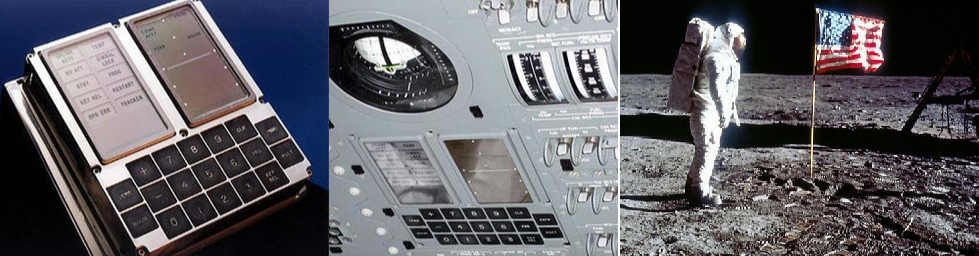

# [Aula 01 - Sistemas embarcados](slides/Aula01-SistemasEmbarcados.pdf)

A terceira revolução industrial, que ocorreu após o fim da Segunda Guerra Mundial, produzida pelo desenvolvimento e utilização em larga escala da microeletrônica, possibilitou a construção dos primeiros computadores, ainda de grande porte, que evoluíram para os microcomputadores, que logo foram ligados em rede. Em seguida vieram os computadores portáteis, alcançando o que chamamos smartphones, mas que erroneamente ainda chamamos de celulares. 

Toda essa evolução produziu diversos novos conceitos ao longo do tempo, entre eles o conceito  de **Computação Ubíqua**, sendo este um novo paradigma proposto em 1991 por Mark Weiser (1952-1999), em que o computador está em toda parte, de forma imperceptível (ou invisível) aos usuários, embarcado (ou embutido) nos ambientes agindo e reagindo de forma inteligente a tudo o que acontece ao seu redor.

> **"As tecnologias mais profundas são aquelas desaparecem. Tecem-se no tecido da vida cotidiana até que são indistinguíveis dela.”**
> 
> Mark Weiser

| Figura: Mark Weiser - Xerox Palo Alto Research Center |
|:-----------------------------------------------------:|
|                |
| Fonte: [Design de Interação & Computação Pervasiva](http://ubicomp.feiramoderna.net/2011/08/mark-weiser/)|

Em seu artigo intitulado 
[“**The computer for the twenty-first century**"](https://www.lri.fr/~mbl/Stanford/CS477/papers/Weiser-SciAm.pdf) 
publicado pela *Scientific American* em Setembro de 1991, 
Weiser apresenta o que seriam os computadores no século XXI. 

Mas a computação ubíqua só é possível por conta do desenvolvimento derivado da computação convencional, em que sistemas eletrônicos dedicados realizam o trabalho de processar dados do mundo real. Em inglês são chamados sistemas ***embedded*** e são chamados em português de sistemas **embarcados** ou mesmo **embutidos**. 

Talvez a mais notória utilização de um sistema embarcado ocorreu em julho de 1969, com a chegada de [Armstrong, Aldrin e Collins](https://aventurasnahistoria.com.br/noticias/desventuras/armstrong-aldrin-e-collins-veja-o-que-aconteceu-com-tripulacao-da-apollo-11.phtml) à lua, sendo o “**Apollo Guidance Computer (AGC)**” o grande responsável pelo controle dos sistemas do Módulo Lunar.

| Figura: Apollo Guidance Computer (AGC) da missão espacial Apollo 11 e Neil Armstrong pisando na lua. | 
|:--------------------------------------------:|
|  |
| Fonte: [Wikipedia](https://en.wikipedia.org/wiki/Apollo_Guidance_Computer) |

O AGC foi desenvolvido pelo Massachusetts Institute of Technology (MIT) e é considerado o primeiro sistema embarcado, considerado na época um sistema de alto risco, devido aos circuitos integrados ainda serem uma novidade tecnológica, ainda pouco experimentados em condições extremas. O AGC operava em tempo real, possuía memórias RAM de 2kB e ROM de 32 kB, com a velocidade de clock de 1,024 MHz, display e teclado apenas numérico. 

Podemos notar que os sistemas embarcados evoluíram de forma a atender necessidades ou mesmo vontades de aplicações diversas, assim como na biologia, a evolução produz sistemas simples ou complexos a depender do ambiente, das necessidades, dos recursos e aplicações. 

Existem muitas definições, mas podemos considerar que  um sistema embarcado basicamente é um conjunto dedicado de circuitos, incluindo um controlador programável, de modo a atender uma aplicação específica. Como exemplos mais comuns, são citados os aparelhos de micro-ondas e máquinas de lavar, como sistemas simples, ou ainda subsistemas em equipamentos mais complexos como em veículos ou *smartphones*. Em todos os casos, um controlador está conectado aos seus periféricos de aplicação específica e é programado para realizar sua tarefa seguindo uma série de operações lógicas e de modo a atender o seu objetivo, seja aquecer um alimento, lavar roupas, monitorar o consumo de combustível ou controlar o foco e saturação da imagem capturada pela câmera em um *smartphone*. 

Note que em um smartphone, existem muitos circuito embarcados, dedicados as mais diversas funções presentes no aparelho, sendo este considerado em sua totalidade um sistema computacional de uso geral, e não um sistema embarcado, como as partes que o integram. 

Como principais e fundamentais características dos Sistemas Embarcados podemos destacar que são **destinado a uma única aplicação**, sendo assim possuem **poucas entradas e saídas**, apresentam uma **Interface simples** e alguma forma de **comunicação** para sua interação com outros dispositivos ou com o usuário. 

Sistemas embarcados possuem, geralmente, um conjunto de requisitos e restrições que fazem dessa área de estudo/trabalho uma das mais desafiadoras, pois envolvem múltiplas habilidades e conhecimento interdisciplinar. Alguns exemplos de requisitos e restrições estão associados à tamanho e peso do sistema ou dispositivo, consumo e custos reduzidos, segurança e confiabilidade, devendo se recuperar de forma automática após erros e falhas, robustez ao ambiente e aplicação em tempo real. 

Um sistema embarcado basicamente é composto por um processador, microcontrolador ou um circuito integrado de aplicação específica ([ASIC](https://pt.wikipedia.org/wiki/Circuito_integrado_de_aplica%C3%A7%C3%A3o_especifica)), para executar a lógica armazenada na memória. Esta lógica, quando em computadores de uso geral, é chamada de software, em sistemas embarcados é chamada de firmware. Possui ainda interfaces para entradas e saídas do sistema, para conexão com sensores e atuadores, específicos à aplicação do sistema, e interface de usuário, geralmente para realizar alguma parametrização no comportamento do sistema. Ainda é necessário um sistema de alimentação, seja diretamente da rede ou por bateria. A Figura ilustra um diagrama de blocos com a composição do sistema. 

| Figura: Arquitetura Básica de Sistemas Embarcados |
|:-------------------------------------------------:|
|  |
| Fonte: Próprio autor |

A área de sistemas embarcados apresentam grandes desafios relacionados à mão de obra, desenvolvimento de projetos e concorrência. Um projeto de sistema embarcado é composto de um *hardware* com seus aspectos de eletrônica, invólucro ou carcaça e a sua estética afetando a experiência do usuário, firmware com sua infraestrutura, características de aplicação e usabilidade e ainda a sua documentação com regulamentos e normas a serem seguidas. Com tudo isso, faz-se necessário que o profissional possua um conhecimento plural das tecnologias e do negócio envolvidos no projeto. 

Como é o mercado de trabalho para profissionais desta área? Para ilustrar tal questão o portal [Embarcados](https://embarcados.com.br/), que traz informações sobre esta área no Brasil, faz pesquisas de mercado com o seu público brasileiro. Seguem os resumos da [Pesquisa sobre o mercado brasileiro de sistemas embarcados e IoT 2023](https://embarcados.com.br/relatorio-da-pesquisa-sobre-o-mercado-brasileiro-de-sistemas-embarcados-e-iot-2023/).

**Perfil dos profissionais de Sistema Embarcados e IoT**

- O Mercado permanece com domínio dos homens (95,79%).
- 66,84% são formados em Engenharia.
- 55,61% são desenvolvedores/engenheiros.
- Predominantemente, quem desenvolve na área frequentou a universidade. 81,57% dos desenvolvedores contam com Superior completo ou Pós-graduação completa/incompleta.
- 69,64% possuem 31 anos ou mais.
- 53,51% possuem 5 anos ou mais de experiência na área.

**Perfil dos profissionais de Sistema Embarcados e IoT**

- Um número menor de desenvolvedores brasileiros, se comparado a pesquisa de mercado de 2021, declarou seu interesse em trabalhar fora do Brasil, em uma empresa do exterior, nos próximos anos (Em 2023: 38,60% contra 45,06%, em 2021).
- A maioria está localizada hoje no Sudeste (57,99%), em São Paulo (46,52%), exerce a modalidade CLT (56,56%) e trabalha em empresa entre 11 e 99 colaboradores (26,84%).
- Mesmo após a pandemia de Covid-19, atualmente, em maio de 2023, 47,75% declararam trabalhar de forma presencial, 36,48% declararam trabalhar parte remoto, parte de forma presencial e 15,78% declararam trabalhar de forma remota.
- 41,18% dos que responderam à pesquisa afirmaram receber mais de R$ 9.001,00 de salário mensal.
- A pesquisa mostra que o profissional de Sistemas Embarcados e IoT exerce diversas atividades na empresa. Desenvolvimento e depuração de firmware/software para sistemas embarcados foram as duas atividades mais citadas.

**Ferramentas para Sistema Embarcados e IoT**

- IoT (46,95%) e Sistemas Industriais, incluindo automação e controle industrial (40,21%) são as principais áreas de aplicação que são desenvolvidas atualmente.
- Comunicação sem fio (76%), alimentação por bateria (57,26%) e Capacidade de Tempo Real (52,63%) são os recursos mais utilizados em projetos de sistemas embarcados.
- A principal comunicação sem fio utilizada atualmente é Wi-Fi (58,74%), seguido por Celular 3G/4G (40,84%), Bluetooth LE/Smart (39,16%) e Lora (33,26%).
- Observa-se que há um crescimento considerável em uso de tecnologias com Celular 3G/4G e as aplicações com 5G ainda são discretas (13,05%).
- A maioria dos projetos de hardware são desenvolvidos pela própria empresa que o profissional trabalha (75,27%).
-  Kits com ESP8266/ESP32 (55,58%) são as ferramentas de prototipação rápida preferida pelos profissionais, seguido de Kits de desenvolvimento fornecidos pelos fabricantes do processador ou módulo (48,58%), Arduino e suas variações (47,05%) e Raspberry Pi (39,17%). No entanto, a maioria não incorpora kits ou placas de prototipação em seus produtos (53,39%).
- O framework mais utilizado para prototipagem de hardware é o Arduino (47,92%).
-  Dentre as ferramentas mais importantes para o desenvolvimento de projetos, Osciloscópio (78,77%), IDE (76,81%), Compilador (66,30%) e Debugger (58,42%) foram as opções mais citadas.
-  Multisim (14,22%) surge empatado com Proteus (14,22%), além de Matlab/Simulink (13,79%) foram as ferramentas de simulação mais citadas para desenvolvimento de hardware.
- As três marcas de instrumentos da fonte de bancada dos profissionais foram: Minipa (60,61%), Hikari (56,67%) e Keysight (31,95%).

**Software em Sistema Embarcados e IoT**

- Visual Studio Code (70,24%) é a principal ferramenta de codificação e Git é o sistema de controle de versão preferido (73,74%) entre os profissionais brasileiros que responderam à pesquisa 2023.
- Os principais gerenciadores de projetos citados na pesquisa são: Microsoft Excel (37,20%), Jira (30,85%) e Microsoft Teams (28,01%).
- A linguagem C predomina sobre as outras linguagens, citada por 77,78% dos profissionais, seguida por C++ (50,44%) e Python (24,44%).
- O RTOS embarcado mais popular, embarcado nos projetos atuais, é o Amazon FreeRTOS (32,22%), seguido pelo Zephyr Project (7,56%) e Nuttx (5,78%). No entanto, muitos profissionais (40,89%) declararam não utilizar nenhum RTOS em seus sistemas embarcados atuais.

**Processadores em projetos de Sistemas Embarcados e IoT**

- Decisão via Departamento de Pesquisa e Desenvolvimento (54.33%) é a forma mais citada como sendo uma das maiores influências na escolha do microcontrolador/microprocessador de um projeto atual. A decisão vem principalmente por decisão em grupo entre engenheiros para 58,26% dos que responderam.
- As duas razões mais citadas para a troca do microcontrolador/microprocessador do projeto atual são: o novo dispositivo escolhido pela equipe possui recursos melhores ou novos periféricos (59,63%) e o preço do microcontrolador pesa na hora da decisão de realizar a troca (56,65%).
- Na hora da escolha de um microcontrolador/microprocessador, os fatores mais citados foram o custo do chip (62,39%) e a disponibilidade de ferramentas de desenvolvimento de software (56,42%).
- A maioria (69,95%) dos profissionais afirmaram que o microcontrolador/microprocessador de 32-bits são os mais utilizados nos projetos atuais. Em relação aos projetos futuros há uma pequena tendência a migração para microprocessador de 64-bits. (34,63% afirmaram que acreditam que utilizarão tecnologia 64-bits em seus próximos projetos). No entanto, 72,94% afirmam que não atualizaram o micro nos últimos 12 meses.

**Processadores, CPLDs, ASICs e FPGAs em projetos de Sistemas Embarcados e IoT**

- As empresas fabricantes de microcontroladores/microprocessadores mais citadas na pesquisa, pois seus chips estão sendo utilizados nos projetos de sistemas embarcados atuais, são: Espressif (47,94%), seguido por ST (46,33%) e Microchip/Atmel (41,74%). Para projetos futuros, os profissionais responderam que usarão: ST (48,17%), Espressif (45,41%) e Microchip (30,73%). Houve um grande crescimento da Espressif em ambas as respostas.
- 20,37% dos profissionais afirmaram que seus projetos utilizam FPGA, CLPD ou ASIC. Há uma tendência de baixa, já que para os próximos projetos há uma expectativa de 18,52% dos profissionais que haverá o uso de FPGA, CPLD ou ASIC. 
- Intel/Altera (14,12%) e XILINX (9,26%) são as empresa mais citadas quando perguntado a respeito de quais fornecedores de FPGA/CPLD/ASIC os profissionais estão considerando usar no próximo projeto. No entanto, muitos profissionais ainda não decidiram (15,05%). A participação da Intel cresceu, se comparada com a pesquisa de mercado de 2021.

**Como as empresas estão desenvolvendo seus produtos IoT**

- Conectividade, Segurança e Preço Final da solução, nesta ordem, foram as três principais preocupações relatadas pelos profissionais durante a pesquisa, em relação à implementação de IoT.
- A maioria (60,38%) não usa terceiros para projetos IoT e desenvolve dispositivos/sensores (54,25%).
- Os principais motivos pelos quais as empresas desenvolvem soluções IoT são para atender uma necessidade de mercado (55,66%) e para inovar (50,94%).
- Inteligência de Negócios e Análise de Dados foi citado por 52,12% dos profissionais, sobre o questionamento de onde as empresas obteriam maior valor com os dados em IoT.
- MQTT (48,11%), 3G/4G (37,97%), Bluetooth (35,38%), e Lora (31,13%) foram as principais respostas quando perguntado sobre como seria composta a Stack do dispositivo (ou Gateway) IoT.
- Amazon AWS se mantém como escolha #1 em Nuvem IoT utilizada em projetos IoT (Cresceu de 29,67% na pesquisa 2021 para 35,38% neste levantamento).

**Referências e complementos**

1. [Luiz Bitencourt - Projetos de sistemas embarcados: Uma rápida discussão](https://youtu.be/a4Dp11lupMk?si=-PxlMLHoaTTqyhnG)
2. [Código Fonte TV - Sistemas Embarcados (Embedded Systems) // Dicionário do Programador](https://youtu.be/XppU8kKpa6I?si=FD160Zz98GxOjtZF)
3. [Código Fonte TV - Conhecimentos necessários para trabalhar com sistemas embarcados](https://youtu.be/W0hzWoLHZ5k?si=VpPoSw16wqpc5bvA)
4. [UniVESP - Eletrônica Embarcada - Aula 01 - Introdução aos Sistemas Embarcados Eletrônica Embarcada em Veículos](https://youtu.be/ElIMxXcFkGQ?si=ESfqJPKiZ7ubXIrt)
5. [Dobra Espacial - Como o computador da Apollo funcionava?](https://youtu.be/ge6zfKaMfAQ?si=_n7vtLODE14b4XIC)
6. [Apollo Guidance Computer (AGC) Code - Github](https://github.com/chrislgarry/Apollo-11)
7. [Coding with Dee - This is the code that sent Apollo 11 to the moon (and it’s awesome)](https://youtu.be/XHN6LV_1dWk?si=zQDcLbEC47ON3oxW)
8. [Apollo Guidance And Navigation - A Problem in Man and Machine Integration - David G. Hoag - MIT](https://ntrs.nasa.gov/api/citations/19720063753/downloads/19720063753.pdf)
9. [Rodrigo Maximiano Antunes de Almeida - 01 - Sistemas embarcados e Linguagem C](https://www.youtube.com/live/azv20pt6fCM?si=u3_6EL-LUr1mEigd)

---

---