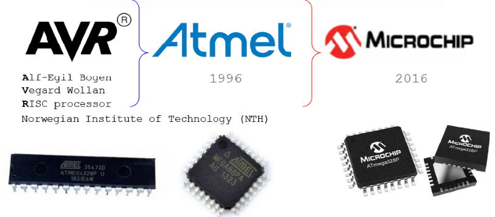

---

# [Aula 02 - Microcontroladores](slides/Aula02-Microcontroladores.pdf)

Os Microcontroladores são uma derivação dos Microprocessadores que surgiram para uso e 
aplicações específicas, principalmente em sistemas industriais e mais recentemente 
eletrodomésticos até os atuais dispositivos de Internet das coisas, ou IoT 
(*Internet of things*).

Basicamente, tanto os microprocessadores quanto os microcontroladores são circuitos lógicos digitais que processam dados, realizam cálculos e interagem com um conjunto de outros circuitos. Nos processadores, os demais circuitos estão em um corpo distinto, formando as placas mãe como nos computadores de uso geral. No caso dos microcontroladores, há uma série de circuitos periféricos montados no mesmo encapsulamento da unidade de processamento, ou seja, no mesmo corpo do circuito de controle também estão presentes memórias, circuitos contadores, conversores, de comunicação entre outros, a combinação é extremamente ampla. 

| Figura : Microcprocessador x Microcontrolador |
|:------------------:|
||
| Fonte: Próprio autor |

Em função principalmente do tipo de aplicação aos quais cada um desses dispositivos é 
empregado, algumas de suas características acabam sendo bem diferentes. 
A Tabela mostra algumas diferenças de características entre os microprocessadores e os 
microcontroladores.

Tabela: Comparação entre MPU e MCU

|                               | Microprocessador (MPU)                                                                                   | Microcontrolador (MCU)                                                                                                                                              |
| ----------------------------- | -------------------------------------------------------------------------------------------------------- | ------------------------------------------------------------------------------------------------------------------------------------------------------------------- |
| Memória                       | Requer memória externa e armazenamento de dados.                                                         | Módulos de memória no chip (ROM, RAM).                                                                                                                              |
| Periféricos                   | Precisa de peças adicionais.  Conecta-se ao barramento externo.                                       | Periféricos no chip (timers, portas de E/S, conversor de sinal).                                                                                                    |
| Capacidade computacional      | Capaz de realizar tarefas computacionais complexas.                                                      | Limitado à lógica específica da aplicação.                                                                                                                          |
| Velocidade do relógio (Clock) | Faixa de GHz.                                                                                            | Faixa de kHz a MHz.                                                                                                                                                 |
| Consumo de energia            | Alto consumo de energia.  Sem modo de economia de energia.                                            | Consome energia mínima.  Modos de economia de energia integrados.                                                                                                |
| Sistema operacional           | Requer sistemas operacionais.                                                                            | O sistema operacional é opcional para alguns microcontroladores.                                                                                                    |
| Conectividade                 | Lida com transferência de dados em alta velocidade.  Oferece suporte para USB 3.0 e Gigabit Ethernet. | Oferece suporte para comunicação de velocidade baixa a moderada.  Interface periférica serial (SPI) e I²C.  Receptor-transmissor assíncrono universal (UART). |
| Custo                         | Caro por causa dos componentes adicionais.                                                               | Mais barato porque um único circuito integrado oferece várias funcionalidades.                                                                                      |
| Caso de uso                   | Para computação genérica ou sistemas que exigem capacidade computacional robusta.                        | Para sistemas compactos, alimentados por bateria ou dispositivos de processamento lógico.                                                                           |

Fonte: [AWS - Qual é a diferença entre microprocessadores e microcontroladores?](https://aws.amazon.com/pt/compare/the-difference-between-microprocessors-microcontrollers/)

**Mas como surgiu a ideia do primeiro processador?**

No ano de 1971, Federico Faggin da Intel, respondeu a um pedido de 12 microchips 
personalizados para uma calculadora do fabricante de eletrônicos japonês Busicom com 
um único circuito de uso geral, que correspondia à solicitação, chamado de Intel 4004 
foi o precursor de uma significativa evolução da computação. Operava com frequência de 
clock de 740 kHz e operava fluxos de 4 bits, *nibbles* e realizada até 92 mil instruções 
por segundo. 

|                                    Figura: Intel 4004: protótipo, esquemático, chip em produção e Calculadora Busicom 141-PF                                    |
| :-------------------------------------------------------------------------------------------------------------------------------------------------------------: |
|                                                                |
| Fonte: [Intel Marks 50th Anniversary of the Intel 4004](https://www.intel.com/content/www/us/en/newsroom/news/intel-marks-50th-anniversary-4004.html#gs.jyxddl) |

Poucos meses após o lançamento do Intel 4004, foi a vez do segundo processador, 
desenvolvido de forma independente e com especificações distintas ao primeiro, 
foi a vez do 
[Intel 8008](https://www.intel.com/content/www/us/en/history/virtual-vault/articles/the-8008.html), 
primeiro processador de 8 bits, com 50 porcento mais transistores e um clock oito vezes maior, 
com capacidade de manipulação de dados ou caracteres, sendo o antecessor capaz apenas de 
manipulações aritméticas.

Com relatos de clientes do 8008, sobre o projeto do chip estar restringindo a 
escala e a complexidade do software que eles queriam criar, foi desenvolvido o 
[Intel 8080](https://www.intel.com.br/content/www/br/pt/newsroom/news/50-years-ago-the-influential-intel-8080.html)
que tornou real o que os seus antecessores criaram, segundo Federico Notebookgin, 
designer-chefe da Intel para o 8080 os antecessores 4004 e 8008.

> O novo chip de 8 bits resultante foi mais eficiente, mais poderoso e mais flexível, capaz de 290.000 operações por segundo (10 vezes a do 8008). E com uma configuração de 40 pinos, tornou a conexão a outros componentes mais fácil do que o projeto de 18 pinos do 8008. O 8080 também integrou as funções dos chips de suporte que os 4004 e 8008 precisavam, tornando-o um verdadeiro microprocessador de chip único.
> 
> [Há 50 anos: celebrando o influente Intel 8080](https://www.intel.com.br/content/www/br/pt/newsroom/news/50-years-ago-the-influential-intel-8080.html)

**Uma nova era**

O Intel 8080 abriu as portas de um novo mundo a ser explorado por programadores do 
mundo inteiro de tecnologias a explorar, o que possibilitou o seu uso não só em 
computadores ou calculadoras, mas permitiu o seu uso no famoso Altair 8800, 
o primeiro computador portátil e de baixo custo, tornando mais acessível a computação 
comercial e científica. Ainda substituindo toda uma lógica discreta, 
pela primeira vez para processar um jogo, o Gun Fight, da Midway Games, 
foi o primeiro jogo de arcade disponível comercialmente a utilizar este processador. 

|                                Figura : Uso do 8080 em caixa eletrônico, computador Altair 8800 e Gun Fight, da Midway Games.                                 |
| :-----------------------------------------------------------------------------------------------------------------------------------------------------------: |
|                                                               |
| Fonte: [Há 50 anos: celebrando o influente Intel 8080](https://www.intel.com.br/content/www/br/pt/newsroom/news/50-years-ago-the-influential-intel-8080.html) |

A evolução e o avanço tecnológico desde os primeiros passos com os processadores é 
notório e ultrapassa quaisquer limites até então pensados. 
A figura a seguir ilustra as principais características dos processadores depois de 50 anos, 
desde o icônico 8080. 

|                                                Figura : Comparação de 50 anos entre o 8080 e o Core Ultra 200S                                                |
| :-----------------------------------------------------------------------------------------------------------------------------------------------------------: |
|                                                               |
| Fonte: [Há 50 anos: celebrando o influente Intel 8080](https://www.intel.com.br/content/www/br/pt/newsroom/news/50-years-ago-the-influential-intel-8080.html) |

**O lendário 8051**

Ainda no começo dos anos 80, a Intel desenvolveu um controlador com tecnologia NMOS, 
o famoso **8051**, que logo evoluiu para tecnologia CMOS, 
reduzindo drasticamente o consumo de energia, possibilitando dispositivos com fontes 
reduzidas de energia, como baterias portáteis. Possui memória para o seu programa, 
temporizador, barramento de 8 bits, 32 entradas e saídas digitais, 
porta de comunicação serial, interrupções, entre outros. 

|                                                                 Figura : Intel P8051                                                                  |
| :---------------------------------------------------------------------------------------------------------------------------------------------------: |
|                                                                 |
| Por Konstantin Lanzet (with permission) - CPU collection Konstantin Lanzet, CC BY-SA 3.0, https://commons.wikimedia.org/w/index.php?curid=4774266  |

O [8051](https://pt.wikipedia.org/wiki/Intel_8051) como ficou popular, se mostrou muito adequado para aplicações industriais, e ganhou o título de mais usado no mundo com mais de dois mil fabricantes que o utilizam como base dos seus projetos, em milhares de aplicações embarcadas. 

A arquitetura do 8051 utiliza o trabalho proposto por [Burks, Goldstine e von Neumann - 1946](https://www.cs.princeton.edu/courses/archive/fall13/cos375/Burks.pdf), sendo este último o mais notório que acabou batizando o nome da arquitetura: **Von Neumann**, utilizando um conjunto de instruções denominadas, [CISC](https://pt.wikipedia.org/wiki/CISC). A ideia base é acessar as memórias de código e de trabalho por um mesmo barramento de dados. 
No computador com conjunto complexo de instruções é possível realizar praticamente todos os acessos e operações de forma direta, com uma única instrução, sendo sua complexidade associada ao circuito que permite a vasta possibilidade de instruções diretas. 

Em oposição ao modelo CISC, foi desenvolvido em Harvard uma arquitetura que utiliza uma arquitetura com dois barramentos de acesso distintos entre programa e dados, assim, praticamente todas as ações são executadas em pelo menos duas instruções, simplificando o circuito de acesso, reduzindo o número de possiblidades de instruções, [RISC](https://pt.wikipedia.org/wiki/RISC), mas ganhando em velocidade, principalmente quando utilizada a técnica de *pipeline*. Esta tecnologia se tornou muito predominante em diversas aplicações de controladores. 

Com o passar do tempo essas tecnologias forma se fundindo, características de uma foram incorporadas à outra e vice-versa. 

No início dos anos 90 surge um projeto de estudantes noruegueses ganhou muito espaço no mercado com seu controlador com arquitetura baseada em RISC, denominada AVR, que foi adquirida a licença pela Atmel, o maior fabricante de microcontroladores de 8 bits, na época, grande fornecedor de chips 8051, apesar de já ser um projeto aberto e fabricado por diversas outras empresas. 

A partir de 1996 a Atmel incorporou a linha proprietária ATMega com dispositivos AVR, competindo diretamente com os PICs da Microchip e outros fabricantes como Renesas, Texas Istruments, Motorolla, etc.

No ano de 2016, a líder do mercado de semicondutores de 8 bits foi adquirida pela sua principal concorrente, e desde então os PICs e AVRs fazem parte de uma mesma empresa fabricante. 

| Figura: Relação entre as marcas AVR, Atmel e Microchip  |
|:-------------------------------------------------------:|
| |
| Fonte: Próprio autor |

Em 2005 na Itália foi desenvolvida a plataforma de prototipagem Arduino, que ganhou a mente e os corações de estudantes, entusiastas e hobbistas no mundo todo, por sua facilidade de uso inclusive e principalmente para leigos, robustez e acesso à informações, simples, objetivas e claras. 

Dentre os diversos modelos de Arduino, o mais comum e popular é o Uno, que utiliza um controlador AVR ATMega328P, que alavancou suas vendas e lhe deu uma grande sobrevida. 

| Figura: Placas de desenvolvimento |
|:---------------------------------:|
| |
| Fonte: Próprio autor |

Outra grande evolução foi a adoção da arquitetura ARM, que apesar de ser dos anos 80, tornou-se popular tanto em processadores quanto em microcontroladores nos anos 2000. 

A quantidade de microcontroladores hoje é imensa, cada fabricante possui diversas famílias com dezenas ou centenas de modelos, cada um com alguma característica de periférico que pode ser o mais adequado para cada aplicação. O mercado é gigante bem como suas possibilidades, principalmente com a utilização de dispositivos de 32 bits a um preço menor do que os de 8 bits e a implementação de sistemas de comunicação sem fio. 

Assim como há diversos microcontroladores, os fabricantes também investiram no modelo de desenvolvimento amplamente aceito pelo mercado com o Arduino, e disponibiliza placas de desenvolvimento para os desenvolvedores se familiarizarem com os seus dispositivos e poderem utilizar com mais segurança em projetos próprios. 

**Principais etapas de processamento**

1. **Buscar:** o microprocessador busca instruções na memória do computador. Esse processo pode ser iniciado por entrada automática ou manual.
2. **Decodificar:** o microprocessador "decodifica" as instruções, interpretando a entrada ou comando em uma solicitação e iniciando um processo ou cálculo específico. 
3. **Executar:** o microprocessador realiza a operação necessária ou solicitada. 
4. **Armazenar:** o resultado da execução é armazenado na memória do computador.

| Figura: Arquiteturas Von Neumann x Harvard |
|:------------------------------------------:|
| |
| Fonte: Próprio autor |

**Arquitetura de microprocessadores**

A arquitetura de um microprocessador refere-se a diversas metodologias de design e organização dos vários componentes de CPU do processador. Estes são os principais elementos de arquitetura de um microprocessador:

- **Arquitetura de Conjunto de Instruções (ISA):** a ISA do microprocessador define o conjunto de instruções que o processador pode executar. As ISAs, como as arquiteturas RISC (Computador com Conjunto de Instruções Reduzido) e CISC (Computador com Conjunto de Instruções Complexo), oferecem vários métodos para processamento de dados, com diferentes níveis de desempenho, confiabilidade e velocidade, adequados para diversos tipos de aplicações.

- **Caminho de dados:** o caminho de dados de um microprocessador dita a ordem em que os dados se movem através de seus componentes (barramentos, ULA, registradores), influenciando o desempenho geral.

- **Caminho de controle:** Semelhante ao caminho de dados, o caminho de controle na arquitetura de um microprocessador instrui a sequência de operações e gerencia a transmissão de dados dentro da CPU.

- **Hierarquia de memória:** a hierarquia de memória é um componente crítico da arquitetura do processador, fornecendo uma estrutura para diferentes níveis de memória (cache, registros, [RAM](https://www.ibm.com/br-pt/history/dram)) para otimizar o acesso eficiente aos dados e a velocidade de recuperação.

**Tipos de microprocessadores**

Os microprocessadores variam em potência, desempenho, metodologias de arquitetura, tamanho, consumo de energia e muitas outras variáveis e são projetados para todos os tipos de aplicações. Microprocessadores de uso geral são comuns em computadores pessoais e dispositivos móveis, enquanto unidades especializadas de alto desempenho, como Processadores de Sinal Digital (DSPs), são projetadas para tarefas exigentes como processamento de áudio, fala, vídeo e imagem.  

A seguir estão alguns dos principais tipos de microprocessadores.

- **Microprocessadores de uso geral**: Esses microprocessadores versáteis são encontrados em uma ampla gama de aplicações e dispositivos comuns, como notebooks e servidores. 
- **Microcontroladores**: Embora seja mais correto dizer que os [microcontroladores](https://www.ibm.com/br-pt/think/topics/microcontroller) contêm microprocessadores, esses tipos de chips também apresentam todos os componentes adicionais necessários para um computador funcional, ou seja, memória interna. Microcontroladores funcionam como microcomputadores e são preferidos para controlar elementos específicos dentro de sistemas de computadores embarcados. Microcontroladores pequenos e de baixo consumo de energia não exigem sistemas operacionais complexos para funcionar e são comumente usados na indústria automotiva para otimizar Unidades de Controle do Motor (ECUs), Sistemas Avançados de Assistência ao Motorista (ADAS) e unidades de infoentretenimento, bem como em uma vasta gama de dispositivos eletrônicos de consumo e até mesmo em automação industrial.
- **Processadores de sinal digital (DSPs)**: Os DSPs são especializados em cálculos numéricos de alta velocidade e geralmente são usados para tarefas exigentes, como processamento de áudio, telecomunicações e processamento de imagens. Eles também podem ser encontrados em aplicações que requerem a interpretação de sinais analógicos para digitais, como sensores meteorológicos. Os DSPs são comumente usados em aplicações militares, como drones de vigilância e outras aeronaves autônomas.
- **Circuitos integrados específicos de aplicações (ASICs)**: Os microprocessadores ASIC são projetados para tarefas específicas e são personalizados para atender às demandas específicas de diversas aplicações. Alguns exemplos de microprocessadores ASIC incluem chips personalizados para consoles de jogos ou mineração de criptomoedas. DSPs, GPUs e outros tipos de microprocessadores especializados também são tecnicamente ASICs.  
- **Unidades de processamento gráfico (GPUs)**: Os microprocessadores de [GPU](https://www.ibm.com/br-pt/topics/gpu) são especialmente projetados para a exigente tarefa de renderizar vídeos e gráficos digitais que exigem desempenho de alta potência e processamento paralelo. Essencialmente importantes para jogos de última geração, os potentes microprocessadores de GPU também são comumente usados na mineração de criptomoedas e são conhecidos pelo alto consumo de energia. 
- **Processadores de rede**: Um tipo de microprocessador ASIC especificamente otimizado para o processamento de pacotes de dados de rede mais frequentemente utilizados em switches de telecomunicações, roteadores e dispositivos de segurança de rede. 
- **Coprocessadores**: Os coprocessadores, como as unidades de ponto flutuante (FPUs), são projetados para fornecer suporte auxiliar à CPU principal de um sistema para aumentar o desempenho durante certas tarefas exigentes, como a realização de cálculos científicos avançados ou fórmulas matemáticas complicadas.

**Referências e complementos**

1. [Como a AWS pode ajudar com suas necessidades de desenvolvimento de microprocessadores e microcontroladores? - AWS](https://aws.amazon.com/pt/compare/the-difference-between-microprocessors-microcontrollers/)
2. [O que é um microprocessador? - IBM](https://www.ibm.com/br-pt/think/topics/microprocessor)
3. [Microcontroladores vs. microprocessadores: qual é a diferença? - IBM](https://www.ibm.com/br-pt/think/topics/microcontroller-vs-microprocessor)
4. [Microprocessadores e Microcontroladores - Prof. José Wilson Lima Nerys - UFG](http://inf.ufes.br/~zegonc/material/Introducao_a_Computacao/Microprocessadores%20-%20Parte%201.pdf)
5. [Intel's First Microprocessor](https://www.intel.com.br/content/www/br/pt/history/museum-story-of-intel-4004.html)
6. [A história dos processadores - TecMundo](https://www.tecmundo.com.br/historia/2157-a-historia-dos-processadores.htm)
7. [Evolução Dos Processadores Da Intel - miso](https://youtu.be/MS3weNIvswA?si=7pEy__NShgaY_9p-)
8. [The story of AVR - avrtvtube](https://youtu.be/HrydNwAxbcY?si=HqoJjr9_3EDnhDOB)
9. [The Evolution Of CPU Processing Power Part 1: The Mechanics Of A CPU - New Mind](https://youtu.be/sK-49uz3lGg?si=RFxLWCPxjpoKNXbq)
10. [How Amateurs created the world’s most popular Processor (History of ARM Part 1) - LowSpecGamer](https://youtu.be/nIwdhPOVOUk?si=-_QEV4eiWaIqgFip)
11. [ARM's Secret Weapon (History of ARM Part 2) - LowSpecGamer](https://youtu.be/vx1-6yRAGk0?si=PRtjnqGqqbeysnj0)
12. [The potted history of ARM - Retro Bytes](https://youtu.be/t59EtDxpYmM?si=e6WpiiISbu4CHehz)
13. [Explaining RISC-V: An x86 & ARM Alternative - ExplainingComputers](https://youtu.be/Ps0JFsyX2fU?si=mpfbKea0VbzFJ5Ok)
14. [SAP-1](https://www.ic.unicamp.br/~ducatte/mc542/2012S2/sap-1.pdf)

---

---