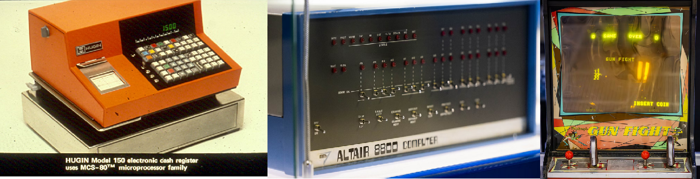
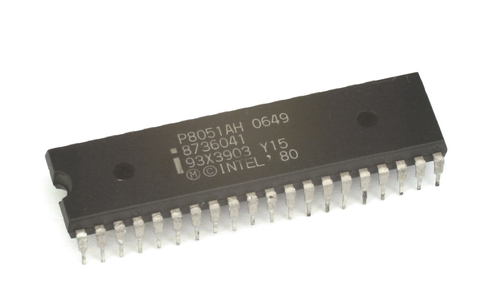

# 

## Aula 01 - Sistemas embarcados

A terceira revolução industrial, que ocorreu após o fim da Segunda Guerra Mundial, produzida pelo desenvolvimento e utilização em larga escala da microeletrônica, possibilitou a construção dos primeiros computadores, ainda de grande porte, que evoluíram para os microcomputadores, que logo foram ligados em rede. Em seguida vieram os computadores portáteis, alcançando o que chamamos smartphones, mas que erroneamente ainda chamamos de celulares. 

Toda essa evolução produziu diversos novos conceitos ao longo do tempo, entre eles o conceito  de **Computação Ubíqua**, sendo este um novo paradigma proposto em 1991 por Mark Weiser (1952-1999), em que o computador está em toda parte, de forma imperceptível (ou invisível) aos usuários, embarcado (ou embutido) nos ambientes agindo e reagindo de forma inteligente a tudo o que acontece ao seu redor.

> **"As tecnologias mais profundas são aquelas desaparecem. Tecem-se no tecido da vida cotidiana até que são indistinguíveis dela.”**
> 
> Mark Weiser

| Figura: Mark Weiser - Xerox Palo Alto Research Center |
|:-----------------------------------------------------:|
|                |
| Fonte: [Design de Interação & Computação Pervasiva](http://ubicomp.feiramoderna.net/2011/08/mark-weiser/)|

Em seu artigo intitulado 
[“**The computer for the twenty-first century**"](https://www.lri.fr/~mbl/Stanford/CS477/papers/Weiser-SciAm.pdf) 
publicado pela *Scientific American* em Setembro de 1991, 
Weiser apresenta o que seriam os computadores no século XXI. 

Mas a computação ubíqua só é possível por conta do desenvolvimento derivado da computação convencional, em que sistemas eletrônicos dedicados realizam o trabalho de processar dados do mundo real. Em inglês são chamados sistemas ***embedded*** e são chamados em português de sistemas **embarcados** ou mesmo **embutidos**. 

Talvez a mais notória utilização de um sistema embarcado ocorreu em julho de 1969, com a chegada de [Armstrong, Aldrin e Collins](https://aventurasnahistoria.com.br/noticias/desventuras/armstrong-aldrin-e-collins-veja-o-que-aconteceu-com-tripulacao-da-apollo-11.phtml) à lua, sendo o “**Apollo Guidance Computer (AGC)**” o grande responsável pelo controle dos sistemas do Módulo Lunar.

| Figura: Apollo Guidance Computer (AGC) da missão espacial Apollo 11 e Neil Armstrong pisando na lua. | 
|:--------------------------------------------:|
|  |
| Fonte: [Wikipedia](https://en.wikipedia.org/wiki/Apollo_Guidance_Computer) |

O AGC foi desenvolvido pelo Massachusetts Institute of Technology (MIT) e é considerado o primeiro sistema embarcado, considerado na época um sistema de alto risco, devido aos circuitos integrados ainda serem uma novidade tecnológica, ainda pouco experimentados em condições extremas. O AGC operava em tempo real, possuía memórias RAM de 2kB e ROM de 32 kB, com a velocidade de clock de 1,024 MHz, display e teclado apenas numérico. 

Podemos notar que os sistemas embarcados evoluíram de forma a atender necessidades ou mesmo vontades de aplicações diversas, assim como na biologia, a evolução produz sistemas simples ou complexos a depender do ambiente, das necessidades, dos recursos e aplicações. 

Existem muitas definições, mas podemos considerar que  um sistema embarcado basicamente é um conjunto dedicado de circuitos, incluindo um controlador programável, de modo a atender uma aplicação específica. Como exemplos mais comuns, são citados os aparelhos de micro-ondas e máquinas de lavar, como sistemas simples, ou ainda subsistemas em equipamentos mais complexos como em veículos ou *smartphones*. Em todos os casos, um controlador está conectado aos seus periféricos de aplicação específica e é programado para realizar sua tarefa seguindo uma série de operações lógicas e de modo a atender o seu objetivo, seja aquecer um alimento, lavar roupas, monitorar o consumo de combustível ou controlar o foco e saturação da imagem capturada pela câmera em um *smartphone*. 

Note que em um smartphone, existem muitos circuito embarcados, dedicados as mais diversas funções presentes no aparelho, sendo este considerado em sua totalidade um sistema computacional de uso geral, e não um sistema embarcado, como as partes que o integram. 

Como principais e fundamentais características dos Sistemas Embarcados podemos destacar que são **destinado a uma única aplicação**, sendo assim possuem **poucas entradas e saídas**, apresentam uma **Interface simples** e alguma forma de **comunicação** para sua interação com outros dispositivos ou com o usuário. 

Sistemas embarcados possuem, geralmente, um conjunto de requisitos e restrições que fazem dessa área de estudo/trabalho uma das mais desafiadoras, pois envolvem múltiplas habilidades e conhecimento interdisciplinar. Alguns exemplos de requisitos e restrições estão associados à tamanho e peso do sistema ou dispositivo, consumo e custos reduzidos, segurança e confiabilidade, devendo se recuperar de forma automática após erros e falhas, robustez ao ambiente e aplicação em tempo real. 

Um sistema embarcado basicamente é composto por um processador, microcontrolador ou um circuito integrado de aplicação específica ([ASIC](https://pt.wikipedia.org/wiki/Circuito_integrado_de_aplica%C3%A7%C3%A3o_especifica)), para executar a lógica armazenada na memória. Esta lógica, quando em computadores de uso geral, é chamada de software, em sistemas embarcados é chamada de firmware. Possui ainda interfaces para entradas e saídas do sistema, para conexão com sensores e atuadores, específicos à aplicação do sistema, e interface de usuário, geralmente para realizar alguma parametrização no comportamento do sistema. Ainda é necessário um sistema de alimentação, seja diretamente da rede ou por bateria. A Figura ilustra um diagrama de blocos com a composição do sistema. 

| Figura: Arquitetura Básica de Sistemas Embarcados |
|:-------------------------------------------------:|
|  |
| Fonte: Próprio autor |

A área de sistemas embarcados apresentam grandes desafios relacionados à mão de obra, desenvolvimento de projetos e concorrência. Um projeto de sistema embarcado é composto de um *hardware* com seus aspectos de eletrônica, invólucro ou carcaça e a sua estética afetando a experiência do usuário, firmware com sua infraestrutura, características de aplicação e usabilidade e ainda a sua documentação com regulamentos e normas a serem seguidas. Com tudo isso, faz-se necessário que o profissional possua um conhecimento plural das tecnologias e do negócio envolvidos no projeto. 

Como é o mercado de trabalho para profissionais desta área? Para ilustrar tal questão o portal [Embarcados](https://embarcados.com.br/), que traz informações sobre esta área no Brasil, faz pesquisas de mercado com o seu público brasileiro. Seguem os resumos da [Pesquisa sobre o mercado brasileiro de sistemas embarcados e IoT 2023](https://embarcados.com.br/relatorio-da-pesquisa-sobre-o-mercado-brasileiro-de-sistemas-embarcados-e-iot-2023/).

**Perfil dos profissionais de Sistema Embarcados e IoT**

- O Mercado permanece com domínio dos homens (95,79%).
- 66,84% são formados em Engenharia.
- 55,61% são desenvolvedores/engenheiros.
- Predominantemente, quem desenvolve na área frequentou a universidade. 81,57% dos desenvolvedores contam com Superior completo ou Pós-graduação completa/incompleta.
- 69,64% possuem 31 anos ou mais.
- 53,51% possuem 5 anos ou mais de experiência na área.

**Perfil dos profissionais de Sistema Embarcados e IoT**

- Um número menor de desenvolvedores brasileiros, se comparado a pesquisa de mercado de 2021, declarou seu interesse em trabalhar fora do Brasil, em uma empresa do exterior, nos próximos anos (Em 2023: 38,60% contra 45,06%, em 2021).
- A maioria está localizada hoje no Sudeste (57,99%), em São Paulo (46,52%), exerce a modalidade CLT (56,56%) e trabalha em empresa entre 11 e 99 colaboradores (26,84%).
- Mesmo após a pandemia de Covid-19, atualmente, em maio de 2023, 47,75% declararam trabalhar de forma presencial, 36,48% declararam trabalhar parte remoto, parte de forma presencial e 15,78% declararam trabalhar de forma remota.
- 41,18% dos que responderam à pesquisa afirmaram receber mais de R$ 9.001,00 de salário mensal.
- A pesquisa mostra que o profissional de Sistemas Embarcados e IoT exerce diversas atividades na empresa. Desenvolvimento e depuração de firmware/software para sistemas embarcados foram as duas atividades mais citadas.

**Ferramentas para Sistema Embarcados e IoT**

- IoT (46,95%) e Sistemas Industriais, incluindo automação e controle industrial (40,21%) são as principais áreas de aplicação que são desenvolvidas atualmente.
- Comunicação sem fio (76%), alimentação por bateria (57,26%) e Capacidade de Tempo Real (52,63%) são os recursos mais utilizados em projetos de sistemas embarcados.
- A principal comunicação sem fio utilizada atualmente é Wi-Fi (58,74%), seguido por Celular 3G/4G (40,84%), Bluetooth LE/Smart (39,16%) e Lora (33,26%).
- Observa-se que há um crescimento considerável em uso de tecnologias com Celular 3G/4G e as aplicações com 5G ainda são discretas (13,05%).
- A maioria dos projetos de hardware são desenvolvidos pela própria empresa que o profissional trabalha (75,27%).
-  Kits com ESP8266/ESP32 (55,58%) são as ferramentas de prototipação rápida preferida pelos profissionais, seguido de Kits de desenvolvimento fornecidos pelos fabricantes do processador ou módulo (48,58%), Arduino e suas variações (47,05%) e Raspberry Pi (39,17%). No entanto, a maioria não incorpora kits ou placas de prototipação em seus produtos (53,39%).
- O framework mais utilizado para prototipagem de hardware é o Arduino (47,92%).
-  Dentre as ferramentas mais importantes para o desenvolvimento de projetos, Osciloscópio (78,77%), IDE (76,81%), Compilador (66,30%) e Debugger (58,42%) foram as opções mais citadas.
-  Multisim (14,22%) surge empatado com Proteus (14,22%), além de Matlab/Simulink (13,79%) foram as ferramentas de simulação mais citadas para desenvolvimento de hardware.
- As três marcas de instrumentos da fonte de bancada dos profissionais foram: Minipa (60,61%), Hikari (56,67%) e Keysight (31,95%).

**Software em Sistema Embarcados e IoT**

- Visual Studio Code (70,24%) é a principal ferramenta de codificação e Git é o sistema de controle de versão preferido (73,74%) entre os profissionais brasileiros que responderam à pesquisa 2023.
- Os principais gerenciadores de projetos citados na pesquisa são: Microsoft Excel (37,20%), Jira (30,85%) e Microsoft Teams (28,01%).
- A linguagem C predomina sobre as outras linguagens, citada por 77,78% dos profissionais, seguida por C++ (50,44%) e Python (24,44%).
- O RTOS embarcado mais popular, embarcado nos projetos atuais, é o Amazon FreeRTOS (32,22%), seguido pelo Zephyr Project (7,56%) e Nuttx (5,78%). No entanto, muitos profissionais (40,89%) declararam não utilizar nenhum RTOS em seus sistemas embarcados atuais.

**Processadores em projetos de Sistemas Embarcados e IoT**

- Decisão via Departamento de Pesquisa e Desenvolvimento (54.33%) é a forma mais citada como sendo uma das maiores influências na escolha do microcontrolador/microprocessador de um projeto atual. A decisão vem principalmente por decisão em grupo entre engenheiros para 58,26% dos que responderam.
- As duas razões mais citadas para a troca do microcontrolador/microprocessador do projeto atual são: o novo dispositivo escolhido pela equipe possui recursos melhores ou novos periféricos (59,63%) e o preço do microcontrolador pesa na hora da decisão de realizar a troca (56,65%).
- Na hora da escolha de um microcontrolador/microprocessador, os fatores mais citados foram o custo do chip (62,39%) e a disponibilidade de ferramentas de desenvolvimento de software (56,42%).
- A maioria (69,95%) dos profissionais afirmaram que o microcontrolador/microprocessador de 32-bits são os mais utilizados nos projetos atuais. Em relação aos projetos futuros há uma pequena tendência a migração para microprocessador de 64-bits. (34,63% afirmaram que acreditam que utilizarão tecnologia 64-bits em seus próximos projetos). No entanto, 72,94% afirmam que não atualizaram o micro nos últimos 12 meses.

**Processadores, CPLDs, ASICs e FPGAs em projetos de Sistemas Embarcados e IoT**

- As empresas fabricantes de microcontroladores/microprocessadores mais citadas na pesquisa, pois seus chips estão sendo utilizados nos projetos de sistemas embarcados atuais, são: Espressif (47,94%), seguido por ST (46,33%) e Microchip/Atmel (41,74%). Para projetos futuros, os profissionais responderam que usarão: ST (48,17%), Espressif (45,41%) e Microchip (30,73%). Houve um grande crescimento da Espressif em ambas as respostas.
- 20,37% dos profissionais afirmaram que seus projetos utilizam FPGA, CLPD ou ASIC. Há uma tendência de baixa, já que para os próximos projetos há uma expectativa de 18,52% dos profissionais que haverá o uso de FPGA, CPLD ou ASIC. 
- Intel/Altera (14,12%) e XILINX (9,26%) são as empresa mais citadas quando perguntado a respeito de quais fornecedores de FPGA/CPLD/ASIC os profissionais estão considerando usar no próximo projeto. No entanto, muitos profissionais ainda não decidiram (15,05%). A participação da Intel cresceu, se comparada com a pesquisa de mercado de 2021.

**Como as empresas estão desenvolvendo seus produtos IoT**

- Conectividade, Segurança e Preço Final da solução, nesta ordem, foram as três principais preocupações relatadas pelos profissionais durante a pesquisa, em relação à implementação de IoT.
- A maioria (60,38%) não usa terceiros para projetos IoT e desenvolve dispositivos/sensores (54,25%).
- Os principais motivos pelos quais as empresas desenvolvem soluções IoT são para atender uma necessidade de mercado (55,66%) e para inovar (50,94%).
- Inteligência de Negócios e Análise de Dados foi citado por 52,12% dos profissionais, sobre o questionamento de onde as empresas obteriam maior valor com os dados em IoT.
- MQTT (48,11%), 3G/4G (37,97%), Bluetooth (35,38%), e Lora (31,13%) foram as principais respostas quando perguntado sobre como seria composta a Stack do dispositivo (ou Gateway) IoT.
- Amazon AWS se mantém como escolha #1 em Nuvem IoT utilizada em projetos IoT (Cresceu de 29,67% na pesquisa 2021 para 35,38% neste levantamento).

**Referências e complementos**

1. [Luiz Bitencourt - Projetos de sistemas embarcados: Uma rápida discussão](https://youtu.be/a4Dp11lupMk?si=-PxlMLHoaTTqyhnG)
2. [Código Fonte TV - Sistemas Embarcados (Embedded Systems) // Dicionário do Programador](https://youtu.be/XppU8kKpa6I?si=FD160Zz98GxOjtZF)
3. [Código Fonte TV - Conhecimentos necessários para trabalhar com sistemas embarcados](https://youtu.be/W0hzWoLHZ5k?si=VpPoSw16wqpc5bvA)
4. [UniVESP - Eletrônica Embarcada - Aula 01 - Introdução aos Sistemas Embarcados Eletrônica Embarcada em Veículos](https://youtu.be/ElIMxXcFkGQ?si=ESfqJPKiZ7ubXIrt)
5. [Dobra Espacial - Como o computador da Apollo funcionava?](https://youtu.be/ge6zfKaMfAQ?si=_n7vtLODE14b4XIC)
6. [Apollo Guidance Computer (AGC) Code - Github](https://github.com/chrislgarry/Apollo-11)
7. [Coding with Dee - This is the code that sent Apollo 11 to the moon (and it’s awesome)](https://youtu.be/XHN6LV_1dWk?si=zQDcLbEC47ON3oxW)
8. [Apollo Guidance And Navigation - A Problem in Man and Machine Integration - David G. Hoag - MIT](https://ntrs.nasa.gov/api/citations/19720063753/downloads/19720063753.pdf)
9. [Rodrigo Maximiano Antunes de Almeida - 01 - Sistemas embarcados e Linguagem C](https://www.youtube.com/live/azv20pt6fCM?si=u3_6EL-LUr1mEigd)

---

## Aula 02 - Microcontroladores

Os Microcontroladores são uma derivação dos Microprocessadores que surgiram para uso e aplicações específicas, principalmente em sistemas industriais e mais recentemente eletrodomésticos até os atuais dispositivos de Internet das coisas, ou IoT (*Internet of things*).

Basicamente, tanto os microprocessadores quanto os microcontroladores são circuitos lógicos digitais que processam dados, realizam cálculos e interagem com um conjunto de outros circuitos. Nos processadores, os demais circuitos estão em um corpo distinto, formando as placas mãe como nos computadores de uso geral. No caso dos microcontroladores, há uma série de circuitos periféricos montados no mesmo encapsulamento da unidade de processamento, ou seja, no mesmo corpo do circuito de controle também estão presentes memórias, circuitos contadores, conversores, de comunicação entre outros, a combinação é extremamente ampla. 

| Figura : Microcprocessador x Microcontrolador |
|:------------------:|
||
| Fonte: Próprio autor |

Em função principalmente do tipo de aplicação aos quais cada um desses dispositivos é empregado, algumas de suas características acabam sendo bem diferentes. A Tabela mostra algumas diferenças de características entre os microprocessadores e os microcontroladores.

Tabela: Comparação entre MPU e MCU

|                               | Microprocessador (MPU)                                                                                   | Microcontrolador (MCU)                                                                                                                                              |
| ----------------------------- | -------------------------------------------------------------------------------------------------------- | ------------------------------------------------------------------------------------------------------------------------------------------------------------------- |
| Memória                       | Requer memória externa e armazenamento de dados.                                                         | Módulos de memória no chip (ROM, RAM).                                                                                                                              |
| Periféricos                   | Precisa de peças adicionais.  Conecta-se ao barramento externo.                                       | Periféricos no chip (timers, portas de E/S, conversor de sinal).                                                                                                    |
| Capacidade computacional      | Capaz de realizar tarefas computacionais complexas.                                                      | Limitado à lógica específica da aplicação.                                                                                                                          |
| Velocidade do relógio (Clock) | Faixa de GHz.                                                                                            | Faixa de kHz a MHz.                                                                                                                                                 |
| Consumo de energia            | Alto consumo de energia.  Sem modo de economia de energia.                                            | Consome energia mínima.  Modos de economia de energia integrados.                                                                                                |
| Sistema operacional           | Requer sistemas operacionais.                                                                            | O sistema operacional é opcional para alguns microcontroladores.                                                                                                    |
| Conectividade                 | Lida com transferência de dados em alta velocidade.  Oferece suporte para USB 3.0 e Gigabit Ethernet. | Oferece suporte para comunicação de velocidade baixa a moderada.  Interface periférica serial (SPI) e I²C.  Receptor-transmissor assíncrono universal (UART). |
| Custo                         | Caro por causa dos componentes adicionais.                                                               | Mais barato porque um único circuito integrado oferece várias funcionalidades.                                                                                      |
| Caso de uso                   | Para computação genérica ou sistemas que exigem capacidade computacional robusta.                        | Para sistemas compactos, alimentados por bateria ou dispositivos de processamento lógico.                                                                           |

Fonte: [AWS - Qual é a diferença entre microprocessadores e microcontroladores?](https://aws.amazon.com/pt/compare/the-difference-between-microprocessors-microcontrollers/)

**Mas como surgiu a ideia do primeiro processador?**

No ano de 1971, Federico Faggin da Intel, respondeu a um pedido de 12 microchips personalizados para uma calculadora do fabricante de eletrônicos japonês Busicom com um único circuito de uso geral, que correspondia à solicitação, chamado de Intel 4004 foi o precursor de uma significativa evolução da computação. Operava com frequência de clock de 740 kHz e operava fluxos de 4 bits, *nibbles* e realizada até 92 mil instruções por segundo. 

|                                    Figura: Intel 4004: protótipo, esquemático, chip em produção e Calculadora Busicom 141-PF                                    |
| :-------------------------------------------------------------------------------------------------------------------------------------------------------------: |
|                                                                |
| Fonte: [Intel Marks 50th Anniversary of the Intel 4004](https://www.intel.com/content/www/us/en/newsroom/news/intel-marks-50th-anniversary-4004.html#gs.jyxddl) |

Poucos meses após o lançamento do Intel 4004, foi a vez do segundo processador, desenvolvido de forma independente e com especificações distintas ao primeiro, foi a vez do [Intel 8008](https://www.intel.com/content/www/us/en/history/virtual-vault/articles/the-8008.html), primeiro processador de 8 bits, com 50 porcento mais transistores e um clock oito vezes maior, com capacidade de manipulação de dados ou caracteres, sendo o antecessor capaz apenas de manipulações aritméticas.

Com relatos de clientes do 8008, sobre o projeto do chip estar restringindo a escala e a complexidade do software que eles queriam criar, foi desenvolvido o [Intel 8080](https://www.intel.com.br/content/www/br/pt/newsroom/news/50-years-ago-the-influential-intel-8080.html)que tornou real o que os seus antecessores criaram, segundo Federico Notebookgin, designer-chefe da Intel para o 8080 os antecessores 4004 e 8008.

> O novo chip de 8 bits resultante foi mais eficiente, mais poderoso e mais flexível, capaz de 290.000 operações por segundo (10 vezes a do 8008). E com uma configuração de 40 pinos, tornou a conexão a outros componentes mais fácil do que o projeto de 18 pinos do 8008. O 8080 também integrou as funções dos chips de suporte que os 4004 e 8008 precisavam, tornando-o um verdadeiro microprocessador de chip único.
> 
> [Há 50 anos: celebrando o influente Intel 8080](https://www.intel.com.br/content/www/br/pt/newsroom/news/50-years-ago-the-influential-intel-8080.html)

**Uma nova era**

O Intel 8080 abriu as portas de um novo mundo a ser explorado por programadores do mundo inteiro de tecnologias a explorar, o que possibilitou o seu uso não só em computadores ou calculadoras, mas permitiu o seu uso no famoso Altair 8800, o primeiro computador portátil e de baixo custo, tornando mais acessível a computação comercial e científica. Ainda substituindo toda uma lógica discreta, pela primeira vez para processar um jogo, o Gun Fight, da Midway Games, foi o primeiro jogo de arcade disponível comercialmente a utilizar este processador. 

|                                Figura : Uso do 8080 em caixa eletrônico, computador Altair 8800 e Gun Fight, da Midway Games.                                 |
| :-----------------------------------------------------------------------------------------------------------------------------------------------------------: |
|                                                               |
| Fonte: [Há 50 anos: celebrando o influente Intel 8080](https://www.intel.com.br/content/www/br/pt/newsroom/news/50-years-ago-the-influential-intel-8080.html) |

A evolução e o avanço tecnológico desde os primeiros passos com os processadores é notório e ultrapassa quaisquer limites até então pensados. A figura a seguir ilustra as principais características dos processadores depois de 50 anos, desde o icônico 8080. 

|                                                Figura : Comparação de 50 anos entre o 8080 e o Core Ultra 200S                                                |
| :-----------------------------------------------------------------------------------------------------------------------------------------------------------: |
|                                                               |
| Fonte: [Há 50 anos: celebrando o influente Intel 8080](https://www.intel.com.br/content/www/br/pt/newsroom/news/50-years-ago-the-influential-intel-8080.html) |

**O Pai de todos**

Ainda no começo dos anos 80, a Intel desenvolveu um controlador com tecnologia NMOS que logo evoluiu pela CMOS, reduzindo drasticamente o consumo de energia, possibilitando dispositivos com fontes reduzidas de energia, como baterias portáteis. Possui memória para o seu programa, temporizador, barramento de 8 bits, 32 entradas e saídas digitais, porta de comunicação serial, interrupções, entre outros. 

|                                                                 Figura : Intel P8051                                                                  |
| :---------------------------------------------------------------------------------------------------------------------------------------------------: |
|                                                                 |
| Por Konstantin Lanzet (with permission) - CPU collection Konstantin Lanzet, CC BY-SA 3.0, https://commons.wikimedia.org/w/index.php?curid=4774266  |

O [8051](https://pt.wikipedia.org/wiki/Intel_8051) como ficou popular, se mostrou muito adequado para aplicações industriais, e ganhou o título de mais usado no mundo com mais de dois mil fabricantes que o utilizam como base dos seus projetos, em milhares de aplicações embarcadas. 

A arquitetura do 8051 utiliza o trabalho proposto por [Burks, Goldstine e von Neumann - 1946](https://www.cs.princeton.edu/courses/archive/fall13/cos375/Burks.pdf), sendo este último o mais notório que acabou batizando o nome da arquitetura: **Von Neumann**, utilizando um conjunto de instruções denominadas, [CISC](https://pt.wikipedia.org/wiki/CISC). A ideia base é acessar as memórias de código e de trabalho por um mesmo barramento de dados. 
No computador com conjunto complexo de instruções é possível realizar praticamente todos os acessos e operações de forma direta, com uma única instrução, sendo sua complexidade associada ao circuito que permite a vasta possibilidade de instruções diretas. 

Em oposição ao modelo CISC, foi desenvolvido em Harvard uma arquitetura que utiliza uma arquitetura com dois barramentos de acesso distintos entre programa e dados, assim, praticamente todas as ações são executadas em pelo menos duas instruções, simplificando o circuito de acesso, reduzindo o número de possiblidades de instruções, [RISC](https://pt.wikipedia.org/wiki/RISC), mas ganhando em velocidade, principalmente quando utilizada a técnica de *pipeline*. Esta tecnologia se tornou muito predominante em diversas aplicações de controladores. 

Com o passar do tempo essas tecnologias forma se fundindo, características de uma foram incorporadas à outra e vice-versa. 

No início dos anos 90 surge um projeto de estudantes noruegueses ganhou muito espaço no mercado com seu controlador com arquitetura baseada em RISC, denominada AVR, que foi adquirida a licença pela Atmel, o maior fabricante de microcontroladores de 8 bits, na época, grande fornecedor de chips 8051, apesar de já ser um projeto aberto e fabricado por diversas outras empresas. 

A partir de 1996 a Atmel incorporou a linha proprietária ATMega com dispositivos AVR, competindo diretamente com os PICs da Microchip e outros fabricantes como Renesas, Texas Istruments, Motorolla, etc.

No ano de 2016, a líder do mercado de semicondutores de 8 bits foi adquirida pela sua principal concorrente, e desde então os PICs e AVRs fazem parte de uma mesma empresa fabricante. 

| Figura: Relação entre as marcas AVR, Atmel e Microchip  |
|:-------------------------------------------------------:|
| |
| Fonte: Próprio autor |

Em 2005 na Itália foi desenvolvida a plataforma de prototipagem Arduino, que ganhou a mente e os corações de estudantes, entusiastas e hobbistas no mundo todo, por sua facilidade de uso inclusive e principalmente para leigos, robustez e acesso à informações, simples, objetivas e claras. 

Dentre os diversos modelos de Arduino, o mais comum e popular é o Uno, que utiliza um controlador AVR ATMega328P, que alavancou suas vendas e lhe deu uma grande sobrevida. 

| Figura: Placas de desenvolvimento |
|:---------------------------------:|
| |
| Fonte: Próprio autor |

Outra grande evolução foi a adoção da arquitetura ARM, que apesar de ser dos anos 80, tornou-se popular tanto em processadores quanto em microcontroladores nos anos 2000. 

A quantidade de microcontroladores hoje é imensa, cada fabricante possui diversas famílias com dezenas ou centenas de modelos, cada um com alguma característica de periférico que pode ser o mais adequado para cada aplicação. O mercado é gigante bem como suas possibilidades, principalmente com a utilização de dispositivos de 32 bits a um preço menor do que os de 8 bits e a implementação de sistemas de comunicação sem fio. 

Assim como há diversos microcontroladores, os fabricantes também investiram no modelo de desenvolvimento amplamente aceito pelo mercado com o Arduino, e disponibiliza placas de desenvolvimento para os desenvolvedores se familiarizarem com os seus dispositivos e poderem utilizar com mais segurança em projetos próprios. 

**Principais etapas de processamento**

1. **Buscar:** o microprocessador busca instruções na memória do computador. Esse processo pode ser iniciado por entrada automática ou manual.
2. **Decodificar:** o microprocessador "decodifica" as instruções, interpretando a entrada ou comando em uma solicitação e iniciando um processo ou cálculo específico. 
3. **Executar:** o microprocessador realiza a operação necessária ou solicitada. 
4. **Armazenar:** o resultado da execução é armazenado na memória do computador.

| Figura: Arquiteturas Von Neumann x Harvard |
|:------------------------------------------:|
| |
| Fonte: Próprio autor |

**Arquitetura de microprocessadores**

A arquitetura de um microprocessador refere-se a diversas metodologias de design e organização dos vários componentes de CPU do processador. Estes são os principais elementos de arquitetura de um microprocessador:

- **Arquitetura de Conjunto de Instruções (ISA):** a ISA do microprocessador define o conjunto de instruções que o processador pode executar. As ISAs, como as arquiteturas RISC (Computador com Conjunto de Instruções Reduzido) e CISC (Computador com Conjunto de Instruções Complexo), oferecem vários métodos para processamento de dados, com diferentes níveis de desempenho, confiabilidade e velocidade, adequados para diversos tipos de aplicações.

- **Caminho de dados:** o caminho de dados de um microprocessador dita a ordem em que os dados se movem através de seus componentes (barramentos, ULA, registradores), influenciando o desempenho geral.

- **Caminho de controle:** Semelhante ao caminho de dados, o caminho de controle na arquitetura de um microprocessador instrui a sequência de operações e gerencia a transmissão de dados dentro da CPU.

- **Hierarquia de memória:** a hierarquia de memória é um componente crítico da arquitetura do processador, fornecendo uma estrutura para diferentes níveis de memória (cache, registros, [RAM](https://www.ibm.com/br-pt/history/dram)) para otimizar o acesso eficiente aos dados e a velocidade de recuperação.

**Tipos de microprocessadores**

Os microprocessadores variam em potência, desempenho, metodologias de arquitetura, tamanho, consumo de energia e muitas outras variáveis e são projetados para todos os tipos de aplicações. Microprocessadores de uso geral são comuns em computadores pessoais e dispositivos móveis, enquanto unidades especializadas de alto desempenho, como Processadores de Sinal Digital (DSPs), são projetadas para tarefas exigentes como processamento de áudio, fala, vídeo e imagem.  

A seguir estão alguns dos principais tipos de microprocessadores.

- **Microprocessadores de uso geral**: Esses microprocessadores versáteis são encontrados em uma ampla gama de aplicações e dispositivos comuns, como notebooks e servidores. 
- **Microcontroladores**: Embora seja mais correto dizer que os [microcontroladores](https://www.ibm.com/br-pt/think/topics/microcontroller) contêm microprocessadores, esses tipos de chips também apresentam todos os componentes adicionais necessários para um computador funcional, ou seja, memória interna. Microcontroladores funcionam como microcomputadores e são preferidos para controlar elementos específicos dentro de sistemas de computadores embarcados. Microcontroladores pequenos e de baixo consumo de energia não exigem sistemas operacionais complexos para funcionar e são comumente usados na indústria automotiva para otimizar Unidades de Controle do Motor (ECUs), Sistemas Avançados de Assistência ao Motorista (ADAS) e unidades de infoentretenimento, bem como em uma vasta gama de dispositivos eletrônicos de consumo e até mesmo em automação industrial.
- **Processadores de sinal digital (DSPs)**: Os DSPs são especializados em cálculos numéricos de alta velocidade e geralmente são usados para tarefas exigentes, como processamento de áudio, telecomunicações e processamento de imagens. Eles também podem ser encontrados em aplicações que requerem a interpretação de sinais analógicos para digitais, como sensores meteorológicos. Os DSPs são comumente usados em aplicações militares, como drones de vigilância e outras aeronaves autônomas.
- **Circuitos integrados específicos de aplicações (ASICs)**: Os microprocessadores ASIC são projetados para tarefas específicas e são personalizados para atender às demandas específicas de diversas aplicações. Alguns exemplos de microprocessadores ASIC incluem chips personalizados para consoles de jogos ou mineração de criptomoedas. DSPs, GPUs e outros tipos de microprocessadores especializados também são tecnicamente ASICs.  
- **Unidades de processamento gráfico (GPUs)**: Os microprocessadores de [GPU](https://www.ibm.com/br-pt/topics/gpu) são especialmente projetados para a exigente tarefa de renderizar vídeos e gráficos digitais que exigem desempenho de alta potência e processamento paralelo. Essencialmente importantes para jogos de última geração, os potentes microprocessadores de GPU também são comumente usados na mineração de criptomoedas e são conhecidos pelo alto consumo de energia. 
- **Processadores de rede**: Um tipo de microprocessador ASIC especificamente otimizado para o processamento de pacotes de dados de rede mais frequentemente utilizados em switches de telecomunicações, roteadores e dispositivos de segurança de rede. 
- **Coprocessadores**: Os coprocessadores, como as unidades de ponto flutuante (FPUs), são projetados para fornecer suporte auxiliar à CPU principal de um sistema para aumentar o desempenho durante certas tarefas exigentes, como a realização de cálculos científicos avançados ou fórmulas matemáticas complicadas.

**Referências e complementos**

1. [Como a AWS pode ajudar com suas necessidades de desenvolvimento de microprocessadores e microcontroladores? - AWS](https://aws.amazon.com/pt/compare/the-difference-between-microprocessors-microcontrollers/)
2. [O que é um microprocessador? - IBM](https://www.ibm.com/br-pt/think/topics/microprocessor)
3. [Microcontroladores vs. microprocessadores: qual é a diferença? - IBM](https://www.ibm.com/br-pt/think/topics/microcontroller-vs-microprocessor)
4. [Microprocessadores e Microcontroladores - Prof. José Wilson Lima Nerys - UFG](http://inf.ufes.br/~zegonc/material/Introducao_a_Computacao/Microprocessadores%20-%20Parte%201.pdf)
5. [Intel's First Microprocessor](https://www.intel.com.br/content/www/br/pt/history/museum-story-of-intel-4004.html)
6. [A história dos processadores - TecMundo](https://www.tecmundo.com.br/historia/2157-a-historia-dos-processadores.htm)
7. [Evolução Dos Processadores Da Intel - miso](https://youtu.be/MS3weNIvswA?si=7pEy__NShgaY_9p-)
8. [The story of AVR - avrtvtube](https://youtu.be/HrydNwAxbcY?si=HqoJjr9_3EDnhDOB)
9. [The Evolution Of CPU Processing Power Part 1: The Mechanics Of A CPU - New Mind](https://youtu.be/sK-49uz3lGg?si=RFxLWCPxjpoKNXbq)
10. [How Amateurs created the world’s most popular Processor (History of ARM Part 1) - LowSpecGamer](https://youtu.be/nIwdhPOVOUk?si=-_QEV4eiWaIqgFip)
11. [ARM's Secret Weapon (History of ARM Part 2) - LowSpecGamer](https://youtu.be/vx1-6yRAGk0?si=PRtjnqGqqbeysnj0)
12. [The potted history of ARM - Retro Bytes](https://youtu.be/t59EtDxpYmM?si=e6WpiiISbu4CHehz)
13. [Explaining RISC-V: An x86 & ARM Alternative - ExplainingComputers](https://youtu.be/Ps0JFsyX2fU?si=mpfbKea0VbzFJ5Ok)

---

---