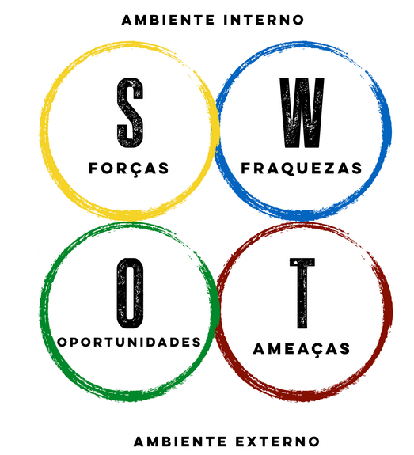
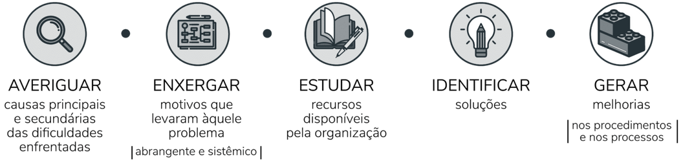
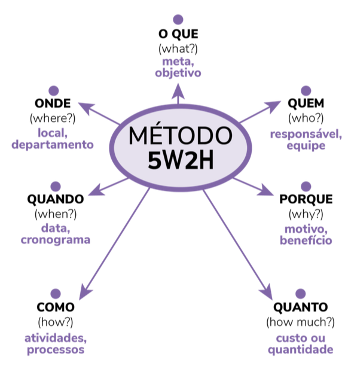
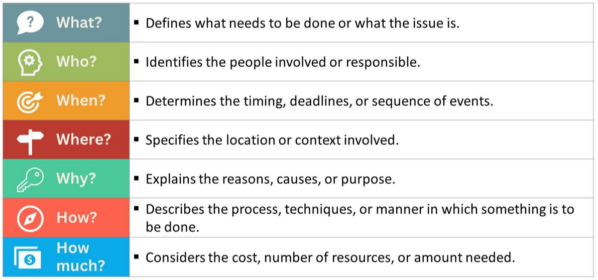

# Gestão de Projetos

Diretório com [template para TCCs](https://github.com/JoseWRPereira/tcc_template) está em desenvolvimento no GitHub.

---

**Fluxo de processos do PMBOK® GUIDE 6ª Edição** com [Ricardo Vargas](https://ricardo-vargas.com/pt/pmbok6-processes-flow/) 

- [Versão Simplificada](https://rvdownloads.s3.amazonaws.com/uploads/downloads/pmbok-6ed/pt/ricardo_vargas_simplified_pmbok_flow_6ed_color_PT-A3.pdf);
- [Versão Completa](https://rvdownloads.s3.amazonaws.com/uploads/downloads/pmbok-6ed/pt/ricardo_vargas_pmbok_flow_6ed_color_PT-A0.pdf)

| PMBOK® Guide 6a Edição Explicado com Ricardo Vargas! |
|:----------------------------------------------------:|
|<iframe width="560" height="315" src="https://www.youtube.com/embed/rvDnS_wWwJs?si=_wFBAxjzjzOuSSJo" title="YouTube video player" frameborder="0" allow="accelerometer; autoplay; clipboard-write; encrypted-media; gyroscope; picture-in-picture; web-share" referrerpolicy="strict-origin-when-cross-origin" allowfullscreen></iframe> |

# Material complementar 

- [Project Management Principles](https://www.4pmti.com/learn/pmbok-guide-7th-ed/)
- [PMBOK ou PRINCE2: concorrentes ou complementares?](https://www.gerenciandoriscosemprojetos.com/2017/07/21/pmbokouprince2-concorrentes-ou-complementares/)
- [Como fazer uma EAP? | Estrutura Analítica do Projeto - Siteware](https://www.youtube.com/watch?v=9KSpvxoCJW4)
- [COMO ELABORAR UMA EAP - ESTRUTURA ANALÍTICA DO PROJETO - CINCO REGRAS BÁSICAS](https://youtu.be/WcNE8p4R0-g?si=rK_GMDAqSqwoAyBq)
- [COMO FAZER UMA EAP - ESTRUTURA ANALÍTICA DE PROJETO EM POWER POINT](https://youtu.be/laN-FG4nrVQ?si=nYOof4ExChaaisDY)
 
---

# Scrum

# Ferramentas da Qualidade
---

| Análise SWOT (FOFA)                           |
|:---------------------------------------------:|
|                |
| Fonte: [AbriMinhaEmpresa](https://abriminhaempresa.com/swot-exemplo-e-dicas-incriveis-de-como-fazer/) |

**Complemento**

1. [Matriz SWOT: conceito e aplicação em planejamentos estratégicos - Runrun.it Blog](https://blog.runrun.it/matriz-swot/)

2. [The SWOT analysis, explained - BiteSize Learning](https://www.bitesizelearning.co.uk/resources/swot-analysis-explained-examples-templates)

---

| Ciclo PDCA                          |
|:-----------------------------------:|
|       |
| Fonte: [RHEIS Consulting](https://www.rheis.com.br/post/o-que-%C3%A9-pdca) |

---

| Diagrama de Ishikawa                      |
|:-----------------------------------------:|
|  |
| Fonte: [Keeps](https://keeps.com.br/diagrama-de-ishikawa-o-que-e-e-como-desenvolver/) |

| Utilização do diagrama de Ishikawa            |
|:---------------------------------------------:|
|  |
| Fonte: [Keeps](https://keeps.com.br/diagrama-de-ishikawa-o-que-e-e-como-desenvolver/) |

---

| 5W2H                                          |
|:---------------------------------------------:|
|                       |
| Fonte: [Keeps](https://keeps.com.br/5w2h-o-que-e-como-aplicar-e-por-que-usar/) |

| 5W2H                                          |
|:---------------------------------------------:|
|                |
| Fonte: [StrategyPunk](https://www.strategypunk.com/the-5w2h-method-a-simple-framework-for-asking-the-right-questions-free-ppt/) |

---

