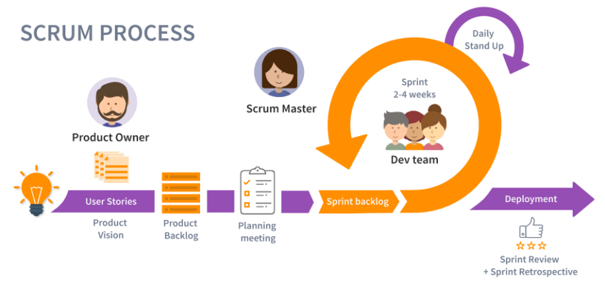

# Gestão de Projetos

Diretório com [template para TCCs](https://github.com/JoseWRPereira/tcc_template) está em desenvolvimento no GitHub.

---

**Fluxo de processos do PMBOK® GUIDE 6ª Edição** com [Ricardo Vargas](https://ricardo-vargas.com/pt/pmbok6-processes-flow/) 

- [Versão Simplificada](https://rvdownloads.s3.amazonaws.com/uploads/downloads/pmbok-6ed/pt/ricardo_vargas_simplified_pmbok_flow_6ed_color_PT-A3.pdf);
- [Versão Completa](https://rvdownloads.s3.amazonaws.com/uploads/downloads/pmbok-6ed/pt/ricardo_vargas_pmbok_flow_6ed_color_PT-A0.pdf)

| PMBOK® Guide 6a Edição Explicado com Ricardo Vargas! |
|:----------------------------------------------------:|
|<iframe width="560" height="315" src="https://www.youtube.com/embed/rvDnS_wWwJs?si=_wFBAxjzjzOuSSJo" title="YouTube video player" frameborder="0" allow="accelerometer; autoplay; clipboard-write; encrypted-media; gyroscope; picture-in-picture; web-share" referrerpolicy="strict-origin-when-cross-origin" allowfullscreen></iframe> |

# Material complementar 

- [Project Management Principles](https://www.4pmti.com/learn/pmbok-guide-7th-ed/)
- [PMBOK ou PRINCE2: concorrentes ou complementares?](https://www.gerenciandoriscosemprojetos.com/2017/07/21/pmbokouprince2-concorrentes-ou-complementares/)
- [Como fazer uma EAP? | Estrutura Analítica do Projeto - Siteware](https://www.youtube.com/watch?v=9KSpvxoCJW4)
- [COMO ELABORAR UMA EAP - ESTRUTURA ANALÍTICA DO PROJETO - CINCO REGRAS BÁSICAS](https://youtu.be/WcNE8p4R0-g?si=rK_GMDAqSqwoAyBq)
- [COMO FAZER UMA EAP - ESTRUTURA ANALÍTICA DE PROJETO EM POWER POINT](https://youtu.be/laN-FG4nrVQ?si=nYOof4ExChaaisDY)
 
---

# Scrum

## Referências
1. [Scrum Essentials in Under 10 Minutes - Scrum Alliance](https://youtu.be/RtQ3tpq-RuE?si=CNq0DVJIIwwUYhcO)
2. [Scrum.org](https://www.scrum.org/)
3. [Scrum // Dicionário do Programador - Código Fonte TV](https://youtu.be/3aCww_1RnL0?si=LNLqSJSmEiJ5MbP0)
4. [Scrum - Aprenda Scrum em 9 minutos - MindMaster](https://youtu.be/XfvQWnRgxG0?si=JGu0gHxJvkSv1Cv1)
5. [SCRUM O QUE É (de um Jeito BEM Prático) - Blog Abri Minha Empresa](https://youtu.be/HlmiVz0SqNQ?si=Us6Djd2c4tUsis0G)
6. [Metodologia Ágil para Engenheiros: Como Aplicar o Scrum na Prática - IBEE](https://youtu.be/4ap_8MnZzcs?si=cvV1T2Uv1-bbfZoc)
7. [ENTENDA SCRUM EM 5 MINUTOS - Agile School](https://youtu.be/yMxvfTVbOVM?si=ujfeNk8YkP15wax3)

---